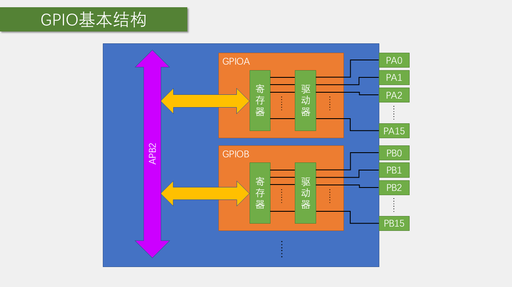
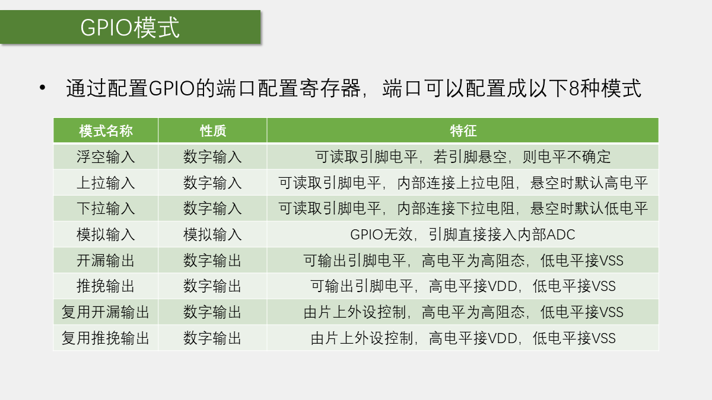
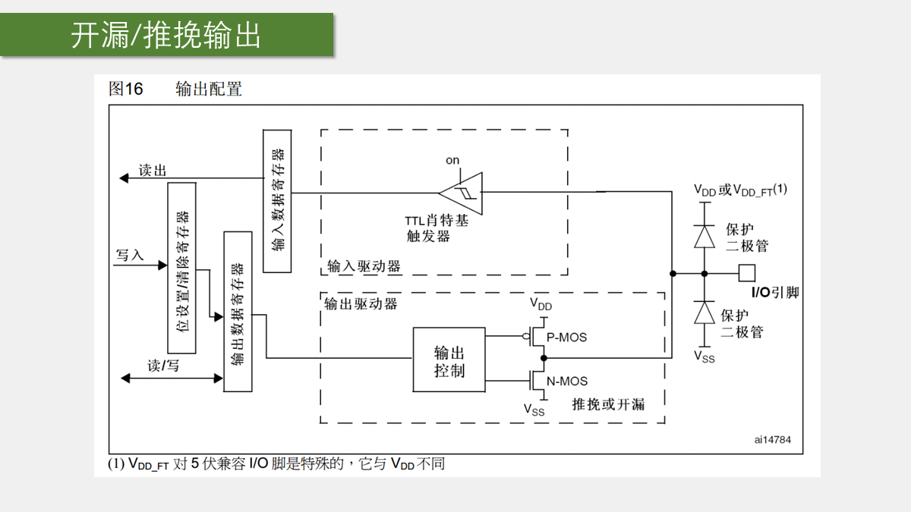
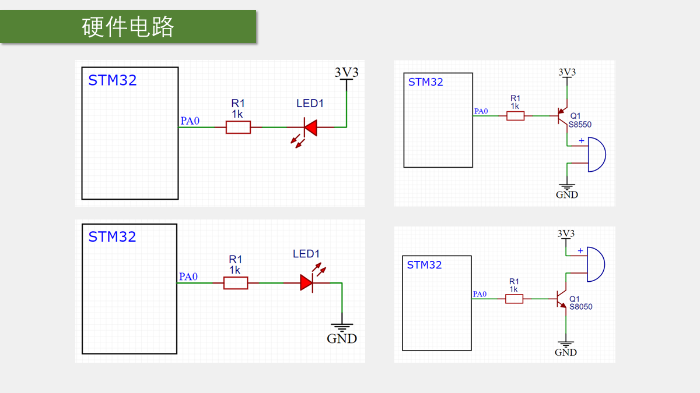
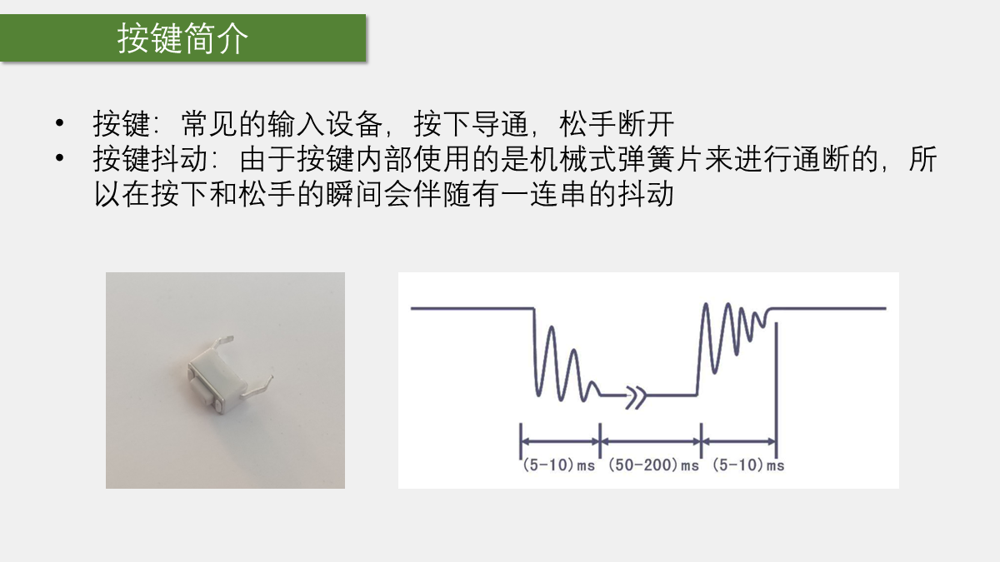

# 第 3 章 GPIO 输入与输出

## 本章闭环

GPIO（General Purpose Input Output，通用输入输出口）是 STM32 与外部电路最直接的接口。本章严格按课程的四个小节组织：

1. GPIO 输出原理，以及 LED、蜂鸣器的电路；
2. LED 闪烁、LED 流水灯、蜂鸣器三个输出程序；
3. 按键、传感器模块和 GPIO 输入原理，并补齐理解标准库所需的 C 语言基础；
4. 按键控制 LED、光敏传感器控制蜂鸣器两个输入程序。

学习目标不是记住几个函数名，而是能从接线图推出：引脚应配置成什么模式、触发时会读到什么电平、输出函数应该写高还是写低。

## 1. GPIO 输出原理

### 1.1 GPIO 是什么

GPIO 可由程序输出高、低电平，也可读取外部电平：

- 输出：驱动 LED、控制有源蜂鸣器，或模拟 I2C、SPI 等通信时序；
- 输入：读取按键、传感器模块的数字输出，或接收串口等片上外设的输入；
- 模拟输入：引脚连接 ADC，采样连续电压。

STM32F103 的普通逻辑电平通常是低电平约 <code>0 V</code>、高电平约 <code>3.3 V</code>。部分标有 <code>FT</code> 的引脚能够容忍 <code>5 V</code> 输入，但这不表示 GPIO 能输出 <code>5 V</code>；高电平输出上限仍由 <code>VDD</code> 决定，通常为 <code>3.3 V</code>。能否接入 <code>5 V</code> 必须查具体芯片封装的引脚定义。

### 1.2 端口、总线和寄存器

GPIOA、GPIOB、GPIOC 等都是独立外设，挂在 APB2 总线上。每个端口有 16 根引脚：

- GPIOA 的第 0 根写作 <code>PA0</code>；
- GPIOB 的第 11 根写作 <code>PB11</code>；
- 端口寄存器的低 16 位一一对应 <code>Px0~Px15</code>。

使用 GPIO 前必须开启对应外设时钟。时钟没开时，配置寄存器和读写寄存器不会按预期工作。

与本章最相关的寄存器是：

- <code>IDR</code>：输入数据寄存器，反映当前采样到的引脚电平；
- <code>ODR</code>：输出数据寄存器，保存软件设定的 16 位输出状态；
- <code>BSRR</code>、<code>BRR</code>：按位设置、清除输出，不必把整个 <code>ODR</code> 读出再写回。

标准库已经将寄存器操作封装为函数。本章应建立的概念是：一个端口有 16 位，一位对应一根引脚。

### 1.3 单个 GPIO 的内部路径

一根 GPIO 的内部可分成输入路径与输出路径。

输入路径依次经过：

1. **保护电路**：引脚两端的保护二极管限制异常电压对内部电路的影响。它不是让任意电压或大电流长期灌入引脚的许可，电压范围和注入电流仍要遵守数据手册。
2. **弱上拉、弱下拉电阻**：程序可选择把悬空引脚默认拉高、拉低，或都断开。
3. **施密特触发器**：将带缓慢边沿、小波动的外部电压整形成稳定数字电平。它有不同的上、下翻转阈值，可减少阈值附近来回抖动导致的误判。
4. **输入数据寄存器 <code>IDR</code>**：软件读取它来获得引脚电平。

模拟输入时，数字输入缓冲和施密特触发器关闭，引脚直接连到 ADC，避免数字电路影响模拟采样。

普通 GPIO 输出由 <code>ODR</code> 控制；复用输出则把控制权交给定时器、串口、SPI 等片上外设。输出级包含上侧 PMOS 和下侧 NMOS：

- 两个管都参与工作，是推挽输出；
- 只允许 NMOS 工作，是开漏输出；
- 输入模式下两个输出管关闭，电平由外部电路决定。

一个引脚只能有一路输出控制，但可以被多个内部单元读取。因此，除模拟输入外，GPIO 配为输出时数字输入路径通常仍有效；这不等于应把它当作外部输入使用。

### 1.4 八种工作模式

| 模式 | 标准库枚举 | 电气特征 | 常见用途 |
| --- | --- | --- | --- |
| 模拟输入 | <code>GPIO_Mode_AIN</code> | 数字输入缓冲关闭，直连 ADC | ADC 采样 |
| 浮空输入 | <code>GPIO_Mode_IN_FLOATING</code> | 内部不拉高也不拉低 | 外部已有稳定驱动源的数字输入 |
| 下拉输入 | <code>GPIO_Mode_IPD</code> | 悬空时内部弱下拉，默认低 | 按下接 <code>3.3 V</code> 的按键 |
| 上拉输入 | <code>GPIO_Mode_IPU</code> | 悬空时内部弱上拉，默认高 | 按下接 GND 的按键 |
| 推挽输出 | <code>GPIO_Mode_Out_PP</code> | 高、低电平都主动驱动 | LED、普通控制输出 |
| 开漏输出 | <code>GPIO_Mode_Out_OD</code> | 只能主动拉低，写高时高阻 | 共享总线、外接上拉 |
| 复用推挽输出 | <code>GPIO_Mode_AF_PP</code> | 推挽，但由片上外设控制 | USART 发送、定时器 PWM |
| 复用开漏输出 | <code>GPIO_Mode_AF_OD</code> | 开漏，但由片上外设控制 | 硬件 I2C |

浮空输入并非“默认不用管”。悬空引脚容易受到噪声、手指触碰和邻线耦合影响，读数会随机变化。外部没有上拉或下拉时，应选内部上拉/下拉，或在电路中增加外部电阻。

### 1.5 推挽与开漏

推挽输出中，写 <code>1</code> 时 PMOS 导通，引脚被主动接到 <code>VDD</code>；写 <code>0</code> 时 NMOS 导通，引脚被主动接到 GND。因此高、低电平均有驱动能力，普通 LED、蜂鸣器和数字控制信号一般选推挽。

开漏输出只有下拉 NMOS：

- 写 <code>0</code>：NMOS 导通，引脚被主动拉低；
- 写 <code>1</code>：NMOS 关闭，引脚高阻，**不是芯片主动输出高电平**。

开漏线路需要外部或其他设备提供上拉。多个开漏设备接到同一根线上时，任何设备都只能拉低，不会出现一个强推高、另一个强拉低的硬件对抗，这正是 I2C 采用开漏结构的原因。开漏引脚经外部上拉电阻接到 <code>5 V</code> 时，可形成 <code>5 V</code> 高电平；芯片本身仍只负责拉低。

### 1.6 输出速度不是程序运行速度

<code>GPIO_Speed_10MHz</code>、<code>GPIO_Speed_2MHz</code>、<code>GPIO_Speed_50MHz</code> 描述的是输出级允许的最大翻转速度，即边沿快慢；它不是 CPU 主频，也不表示输出电流大小。边沿越快，信号完整性和电磁干扰风险也越高。

课程入门例程统一填写 <code>GPIO_Speed_50MHz</code>，实际硬件应在满足时序的前提下选较低速度。

## 2. GPIO 输出：LED、流水灯与蜂鸣器

### 2.1 LED 的两种接法

LED 是发光二极管，正向导通才会点亮。长脚通常是正极，短脚通常是负极。LED 必须串联限流电阻，否则可能损坏 LED 或 GPIO；增大电阻会降低电流和亮度。

| 接法 | 电流路径 | 点亮条件 | 逻辑 |
| --- | --- | --- | --- |
| LED 正极接 <code>3.3 V</code>，负极经电阻接 GPIO | <code>3.3 V -> LED -> 电阻 -> GPIO -> GND</code> | GPIO 低电平 | 低电平点亮、灌电流 |
| LED 正极经电阻接 GPIO，负极接 GND | <code>GPIO -> 电阻 -> LED -> GND</code> | GPIO 高电平 | 高电平点亮、拉电流 |

课程的单灯、流水灯和后续模块化 LED 都采用第一种接法：低电平点亮。因此 <code>GPIO_ResetBits()</code> 是点亮，<code>GPIO_SetBits()</code> 是熄灭。若自己的接线不同，函数逻辑必须反过来，不能照搬名称。

课程为简化面包板演示省略过限流电阻；实际搭建电路时必须加。

### 2.2 有源蜂鸣器与驱动

课程使用有源蜂鸣器，内部自带振荡器，接合适的直流电压即可发出固定频率的声音。无源蜂鸣器需要 MCU 连续输出方波，频率改变才会改变音调，本章暂不使用。

蜂鸣器电流通常大于单个 LED，不能想当然由 GPIO 直接供电。课程模块使用三极管开关驱动，GPIO 只控制三极管，蜂鸣器电流由供电端和三极管承担。课程蜂鸣器模块的控制脚低电平有效：

- <code>PB12</code> 输出低电平：蜂鸣器响；
- <code>PB12</code> 输出高电平：蜂鸣器停。

PNP 三极管通常放在负载高端，NPN 三极管通常放在负载低端；模块是否低电平触发，应以原理图或实测为准。

### 2.3 GPIO 标准库配置链

课程配置 GPIO 的顺序固定为：

1. 开启 GPIO 外设时钟；
2. 定义并填写 <code>GPIO_InitTypeDef</code> 初始化结构体；
3. 调用 <code>GPIO_Init()</code> 写入配置；
4. 用读写函数操作引脚。

下面将 <code>PA0</code> 配为推挽输出。LED 正极接 <code>3.3 V</code>、负极接 <code>PA0</code>，故低电平点亮。

~~~c
#include "stm32f10x.h"

int main(void)
{
    GPIO_InitTypeDef GPIO_InitStructure;

    RCC_APB2PeriphClockCmd(RCC_APB2Periph_GPIOA, ENABLE);

    GPIO_InitStructure.GPIO_Mode = GPIO_Mode_Out_PP;
    GPIO_InitStructure.GPIO_Pin = GPIO_Pin_0;
    GPIO_InitStructure.GPIO_Speed = GPIO_Speed_50MHz;
    GPIO_Init(GPIOA, &GPIO_InitStructure);

    GPIO_ResetBits(GPIOA, GPIO_Pin_0);    // PA0 = 0，LED 点亮

    while (1)
    {
    }
}
~~~

<code>RCC_APB2PeriphClockCmd()</code> 的第一个参数选择 APB2 上的外设，第二个参数为 <code>ENABLE</code> 或 <code>DISABLE</code>。GPIOA、GPIOB 等都在 APB2 上，不能误用 APB1 时钟函数。

### 2.4 常用读写函数

| 函数 | 作用 | 适用场景 |
| --- | --- | --- |
| <code>GPIO_SetBits(GPIOx, GPIO_Pin_x)</code> | 将指定输出位置 1 | 置高；低电平有效 LED 时为熄灭 |
| <code>GPIO_ResetBits(GPIOx, GPIO_Pin_x)</code> | 将指定输出位置 0 | 置低；低电平有效 LED 时为点亮 |
| <code>GPIO_WriteBit(GPIOx, GPIO_Pin_x, BitVal)</code> | 按 <code>Bit_SET</code> 或 <code>Bit_RESET</code> 写一位 | 条件决定单个引脚电平 |
| <code>GPIO_Write(GPIOx, PortVal)</code> | 覆写整个 16 位 <code>ODR</code> | 专用端口上的流水灯等批量输出 |
| <code>GPIO_ReadInputDataBit(GPIOx, GPIO_Pin_x)</code> | 读 <code>IDR</code> 的一位 | 按键、传感器等外部输入 |
| <code>GPIO_ReadInputData(GPIOx)</code> | 读整个 <code>IDR</code> | 并行读取 16 位输入 |
| <code>GPIO_ReadOutputDataBit(GPIOx, GPIO_Pin_x)</code> | 读 <code>ODR</code> 的一位 | 查询输出状态、实现翻转 |
| <code>GPIO_ReadOutputData(GPIOx)</code> | 读整个 <code>ODR</code> | 查询整个端口的锁存值 |

<code>GPIO_SetBits()</code>、<code>GPIO_ResetBits()</code> 只影响选中的位，适合与同端口其他功能共存。<code>GPIO_Write()</code> 会覆盖整个端口，端口上若还有其他模块，会连带改变其输出。

多个引脚可用按位或同时选择：

~~~c
GPIO_InitStructure.GPIO_Pin = GPIO_Pin_0 | GPIO_Pin_1 | GPIO_Pin_2;
GPIO_SetBits(GPIOA, GPIO_Pin_0 | GPIO_Pin_1 | GPIO_Pin_2);
~~~

<code>GPIO_Pin_0</code>、<code>GPIO_Pin_1</code> 等本质是不同位为 1 的掩码，按位或后便得到“同时选中多位”的掩码。

### 2.5 实验一：PC13 板载 LED 闪烁

参考资料中的 C8T6 核心板自带 LED 通常接在 `PC13`；下面的 PA0/PA1 等引脚是外接 LED 的教学接线。若直接使用板载 LED，请把示例中的端口和引脚替换为 `GPIOC`、`GPIO_Pin_13`，并按板载 LED 的有效电平调整 `SetBits/ResetBits`。

课程接线：

- 直接使用 C8T6 核心板的板载 LED（通常连接 `PC13`）；
- ST-Link、最小系统板和面包板必须共地。

主循环按“点亮 -> 延时 -> 熄灭 -> 延时”执行。延时直接使用课程资料提供的 <code>Delay_ms()</code>，需要将资料中的 <code>Delay.c</code>、<code>Delay.h</code> 加入工程。

~~~c
#include "stm32f10x.h"
#include "Delay.h"

int main(void)
{
    GPIO_InitTypeDef GPIO_InitStructure;

    RCC_APB2PeriphClockCmd(RCC_APB2Periph_GPIOC, ENABLE);
    GPIO_InitStructure.GPIO_Mode = GPIO_Mode_Out_PP;
    GPIO_InitStructure.GPIO_Pin = GPIO_Pin_13;
    GPIO_InitStructure.GPIO_Speed = GPIO_Speed_50MHz;
    GPIO_Init(GPIOC, &GPIO_InitStructure);

    while (1)
    {
        GPIO_ResetBits(GPIOC, GPIO_Pin_13);  // 低电平，亮
        Delay_ms(500);
        GPIO_SetBits(GPIOC, GPIO_Pin_13);    // 高电平，灭
        Delay_ms(500);
    }
}
~~~

两段延时都为 <code>500 ms</code> 时，一个完整亮灭周期约为 <code>1 s</code>。同样的逻辑可用 <code>GPIO_WriteBit()</code> 完成。

课程还用该电路验证开漏特性：把模式改成 <code>GPIO_Mode_Out_OD</code> 后，低电平仍能点亮低电平有效 LED；写高时引脚高阻，不能主动把 LED 阴极拉到 <code>3.3 V</code>。这就是开漏“只能强拉低”的直接现象。

### 2.6 实验二：PA0~PA7 LED 流水灯

课程接线为 8 个低电平有效 LED：

- 8 个 LED 正极均接 <code>3.3 V</code>；
- 负极依次接 <code>PA0~PA7</code>；
- 每一路都应串联限流电阻。

初始化时可明确选择 <code>GPIO_Pin_0</code> 到 <code>GPIO_Pin_7</code>，也可如课程示例使用 <code>GPIO_Pin_All</code> 配置整个 GPIOA。只有 GPIOA 的其他引脚没有任何用途时，才适合后者。

<code>GPIO_Write(GPIOA, (uint16_t)~0x0001)</code> 先构造“第 0 位为 1、其余位为 0”的掩码，再按位取反。写入低 16 位后，<code>PA0 = 0</code>，其余引脚为 1；由于 LED 低电平有效，第一个 LED 点亮。

~~~c
#include "stm32f10x.h"
#include "Delay.h"

static void LED_Run(void)
{
    GPIO_Write(GPIOA, (uint16_t)~0x0001);  // PA0 低，LED1 亮
    Delay_ms(100);
    GPIO_Write(GPIOA, (uint16_t)~0x0002);  // PA1 低，LED2 亮
    Delay_ms(100);
    GPIO_Write(GPIOA, (uint16_t)~0x0004);  // PA2 低，LED3 亮
    Delay_ms(100);
    GPIO_Write(GPIOA, (uint16_t)~0x0008);  // PA3 低，LED4 亮
    Delay_ms(100);

    GPIO_Write(GPIOA, (uint16_t)~0x0010);  // PA4 低，LED5 亮
    Delay_ms(100);
    GPIO_Write(GPIOA, (uint16_t)~0x0020);  // PA5 低，LED6 亮
    Delay_ms(100);
    GPIO_Write(GPIOA, (uint16_t)~0x0040);  // PA6 低，LED7 亮
    Delay_ms(100);
    GPIO_Write(GPIOA, (uint16_t)~0x0080);  // PA7 低，LED8 亮
    Delay_ms(100);
}

int main(void)
{
    GPIO_InitTypeDef GPIO_InitStructure;

    RCC_APB2PeriphClockCmd(RCC_APB2Periph_GPIOA, ENABLE);
    GPIO_InitStructure.GPIO_Mode = GPIO_Mode_Out_PP;
    GPIO_InitStructure.GPIO_Pin = GPIO_Pin_0 | GPIO_Pin_1 | GPIO_Pin_2 | GPIO_Pin_3 |
                                  GPIO_Pin_4 | GPIO_Pin_5 | GPIO_Pin_6 | GPIO_Pin_7;
    GPIO_InitStructure.GPIO_Speed = GPIO_Speed_50MHz;
    GPIO_Init(GPIOA, &GPIO_InitStructure);
    GPIO_SetBits(GPIOA, GPIO_Pin_0 | GPIO_Pin_1 | GPIO_Pin_2 | GPIO_Pin_3 |
                       GPIO_Pin_4 | GPIO_Pin_5 | GPIO_Pin_6 | GPIO_Pin_7);

    while (1)
    {
        LED_Run();
    }
}
~~~

想做不同花样时，可将各帧端口数据放进数组后逐项写入。先画出“哪一位为 0 时哪个 LED 亮”，比直接试错修改十六进制数可靠。

### 2.7 实验三：PB12 有源蜂鸣器

课程模块接线：

- <code>VCC</code> 接 <code>3.3 V</code>；
- <code>GND</code> 接 GND；
- 控制脚接 <code>PB12</code>；
- 模块低电平触发。

配置方法与 LED 相同，只是端口改为 GPIOB、引脚改为 <code>GPIO_Pin_12</code>：

~~~c
#include "stm32f10x.h"
#include "Delay.h"

int main(void)
{
    GPIO_InitTypeDef GPIO_InitStructure;

    RCC_APB2PeriphClockCmd(RCC_APB2Periph_GPIOB, ENABLE);

    GPIO_InitStructure.GPIO_Mode = GPIO_Mode_Out_PP;
    GPIO_InitStructure.GPIO_Pin = GPIO_Pin_12;
    GPIO_InitStructure.GPIO_Speed = GPIO_Speed_50MHz;
    GPIO_Init(GPIOB, &GPIO_InitStructure);

    while (1)
    {
        GPIO_ResetBits(GPIOB, GPIO_Pin_12);  // 低电平，蜂鸣器响
        Delay_ms(100);
        GPIO_SetBits(GPIOB, GPIO_Pin_12);    // 高电平，蜂鸣器停
        Delay_ms(100);
        GPIO_ResetBits(GPIOB, GPIO_Pin_12);
        Delay_ms(100);
        GPIO_SetBits(GPIOB, GPIO_Pin_12);
        Delay_ms(700);
    }
}
~~~

<code>PA15</code>、<code>PB3</code>、<code>PB4</code> 默认承担 JTAG 调试功能。未重新配置调试端口前，它们不能像普通 GPIO 那样直接使用；课程实验因此选择 <code>PB12</code>。

## 3. GPIO 输入：按键与传感器

### 3.1 按键为什么需要上拉或下拉

按键松开后，若引脚既没有接 <code>3.3 V</code> 也没有接 GND，便处于浮空状态，电平没有确定值。按键电路必须保证松开时也存在默认电平。

| 接法 | 松开时 | 按下时 | GPIO 建议模式 |
| --- | --- | --- | --- |
| 按键一端接 GPIO，另一端接 GND；无外部电阻 | 内部上拉为高 | 直接拉低 | 上拉输入 |
| 同上，另加外部上拉电阻 | 外部上拉为高 | 直接拉低 | 浮空或上拉输入 |
| 按键一端接 GPIO，另一端接 <code>3.3 V</code>；无外部电阻 | 内部下拉为低 | 直接拉高 | 下拉输入 |
| 同上，另加外部下拉电阻 | 外部下拉为低 | 直接拉高 | 浮空或下拉输入 |

课程采用第一种：**按键接地、GPIO 配上拉输入、按下读 0、松手读 1**。它使用内部弱上拉，接线最少。

### 3.2 机械抖动与消抖

机械触点刚按下、刚松开时不会立刻稳定，数毫秒内可能多次高低跳变。若主循环检测到一次低电平就执行动作，会出现“按一下触发多次”。

课程采用阻塞式消抖：

1. 检测到低电平；
2. 延时约 <code>20 ms</code>，等待按下抖动结束；
3. 一直等待按键松开；
4. 再延时约 <code>20 ms</code>，等待松手抖动结束；
5. 返回一次键值。

该方法适合入门实验，但按住按键时 CPU 会停在等待松手的循环中。后续若要同时处理通信、显示或电机，应使用定时扫描和状态机消抖。

### 3.3 光敏传感器模块的数字输出

课程使用带比较器的光敏传感器模块：

- <code>AO</code>：光敏电阻分压得到的连续模拟电压，后续 ADC 章节使用；
- <code>DO</code>：比较器将 <code>AO</code> 与电位器阈值比较后的高低电平，可直接由 GPIO 读取。

模块的 <code>VCC</code> 接 <code>3.3 V</code>、<code>GND</code> 接地、<code>DO</code> 接 GPIO 输入。课程把 <code>DO</code> 接到 <code>PB13</code>。课程模块遮光后 <code>DO</code> 为高电平，见光后为低电平；电位器用于调整触发阈值。

换模块后不能默认沿用这个极性。应先观察 <code>DO</code> 指示灯或读取一次电平，再决定程序分支。

## 4. 理解标准库所需的 C 语言基础

### 4.1 固定宽度整数类型

标准库常用 <code>stdint.h</code> 中的固定宽度类型：

| 类型 | 位宽 | 无符号范围 | 本章用途 |
| --- | --- | --- | --- |
| <code>uint8_t</code> | 8 位 | 0~255 | 键值、单个 GPIO 返回值 |
| <code>uint16_t</code> | 16 位 | 0~65535 | 一个 GPIO 端口的 16 位数据 |
| <code>uint32_t</code> | 32 位 | 0~4294967295 | 寄存器、时钟和较大计数 |

STM32 的编译环境中，<code>int</code> 通常为 32 位。不要沿用某些 51 单片机环境里“int 为 16 位”的经验。旧版 ST 库中 <code>u8</code>、<code>u16</code> 多为兼容别名，新代码优先使用 <code>uint8_t</code>、<code>uint16_t</code>。

### 4.2 宏定义、typedef 和枚举

<code>#define</code> 在预处理阶段替换文本。<code>GPIO_Pin_12</code> 本质是第 12 位为 1 的位掩码 <code>0x1000</code>，但名称直接表达“选择第 12 根引脚”。<code>RCC_APB2Periph_GPIOB</code>、<code>GPIOB</code>、<code>ENABLE</code> 也是同样目的：代码表达硬件意图，而不是要求人记住数值。

<code>#define</code> 后不加分号；<code>typedef</code> 给**类型**取别名，后面必须加分号。宏可替换各种文本，类型重命名优先使用 <code>typedef</code>。

<code>GPIO_Mode_Out_PP</code>、<code>GPIO_Speed_50MHz</code>、<code>ENABLE</code>、<code>Bit_SET</code> 来自枚举或以枚举方式使用的定义。枚举把一组有限、互斥的取值命名化，能减少把任意数字误传入库函数的可能。

### 4.3 结构体、地址和指针

一个 GPIO 初始化需要同时给出模式、引脚、速度。标准库用一个结构体把这份“配置单”组合起来：

~~~c
GPIO_InitTypeDef GPIO_InitStructure;

GPIO_InitStructure.GPIO_Mode = GPIO_Mode_Out_PP;
GPIO_InitStructure.GPIO_Pin = GPIO_Pin_0;
GPIO_InitStructure.GPIO_Speed = GPIO_Speed_50MHz;
~~~

结构体变量用 <code>.</code> 访问成员。上述三行只是先在内存中填好配置，尚未写入硬件。

~~~c
GPIO_Init(GPIOA, &GPIO_InitStructure);
~~~

<code>&amp;GPIO_InitStructure</code> 表示把这份配置单的地址传给 <code>GPIO_Init()</code>。库函数通过指针读取成员，随后写 GPIO 配置寄存器。库函数内部常见的 <code>GPIOx-&gt;CRL</code>，等价于 <code>(*GPIOx).CRL</code>，是“指针指向的结构体成员”的简写。当前阶段只需牢记：**先填结构体，再把地址传给初始化函数。**

遇到陌生库函数时可按此路径理解：

1. 在对应 <code>.h</code> 文件找到函数声明和参数类型；
2. 跳转到参数类型或枚举定义；
3. 查看允许的取值、注释和示例；
4. 回到调用处填写与接线对应的参数。

## 5. GPIO 输入程序：模块化驱动

### 5.1 为什么分成 .c 和 .h

课程在输入实验中不再把所有 GPIO 操作堆在 <code>main.c</code>，而是把 LED、按键、蜂鸣器、光敏传感器分别封装：

~~~text
System/
  Delay.c      Delay.h
Hardware/
  LED.c       LED.h
  Key.c       Key.h
  Buzzer.c    Buzzer.h
  LightSensor.c  LightSensor.h
User/
  main.c
~~~

- <code>.c</code> 文件放函数实现和底层 GPIO 配置；
- <code>.h</code> 文件放对外函数声明并使用头文件保护；
- <code>main.c</code> 只负责初始化顺序和业务逻辑。

换板子或调整接线时，多数改动只在对应驱动模块中完成，主循环可以保持接近“按键 1 翻转 LED 1”的业务描述。

### 5.2 按键控制 LED 的课程接线

课程使用：

- <code>PB1</code>、<code>PB11</code>：两个按键输入，按键另一端接 GND；
- <code>PA1</code>、<code>PA2</code>：两个低电平有效 LED，正极接 <code>3.3 V</code>，负极接 GPIO；
- 按键配置上拉输入，LED 配置推挽输出。

初始化完成后，输出锁存值默认可能为 0，低电平有效 LED 会立刻点亮。因此课程在 <code>LED_Init()</code> 最后主动写高，使默认状态为熄灭。

~~~c
/* LED.h */
#ifndef __LED_H
#define __LED_H

void LED_Init(void);
void LED1_On(void);
void LED1_Off(void);
void LED1_Turn(void);
void LED2_On(void);
void LED2_Off(void);
void LED2_Turn(void);

#endif

/* LED.c */
#include "stm32f10x.h"

void LED_Init(void)
{
    GPIO_InitTypeDef GPIO_InitStructure;

    RCC_APB2PeriphClockCmd(RCC_APB2Periph_GPIOA, ENABLE);
    GPIO_InitStructure.GPIO_Mode = GPIO_Mode_Out_PP;
    GPIO_InitStructure.GPIO_Pin = GPIO_Pin_1 | GPIO_Pin_2;
    GPIO_InitStructure.GPIO_Speed = GPIO_Speed_50MHz;
    GPIO_Init(GPIOA, &GPIO_InitStructure);

    GPIO_SetBits(GPIOA, GPIO_Pin_1 | GPIO_Pin_2);
}

void LED1_On(void)   { GPIO_ResetBits(GPIOA, GPIO_Pin_1); }
void LED1_Off(void)  { GPIO_SetBits(GPIOA, GPIO_Pin_1); }
void LED2_On(void)   { GPIO_ResetBits(GPIOA, GPIO_Pin_2); }
void LED2_Off(void)  { GPIO_SetBits(GPIOA, GPIO_Pin_2); }

void LED1_Turn(void)
{
    if (GPIO_ReadOutputDataBit(GPIOA, GPIO_Pin_1) == Bit_SET)
    {
        GPIO_ResetBits(GPIOA, GPIO_Pin_1);
    }
    else
    {
        GPIO_SetBits(GPIOA, GPIO_Pin_1);
    }
}

void LED2_Turn(void)
{
    if (GPIO_ReadOutputDataBit(GPIOA, GPIO_Pin_2) == Bit_SET)
    {
        GPIO_ResetBits(GPIOA, GPIO_Pin_2);
    }
    else
    {
        GPIO_SetBits(GPIOA, GPIO_Pin_2);
    }
}
~~~

<code>LED1_Turn()</code> 读取的是 <code>ODR</code>，即软件设定的输出状态，而不是外部实际引脚电压。对“切换自身输出状态”而言，这正是需要读取的寄存器；读按键和传感器则必须读 <code>IDR</code>。

### 5.3 按键驱动与消抖

~~~c
/* Key.h */
#ifndef __KEY_H
#define __KEY_H

#include "stm32f10x.h"

void Key_Init(void);
uint8_t Key_GetNum(void);

#endif

/* Key.c */
#include "stm32f10x.h"
#include "Delay.h"

void Key_Init(void)
{
    GPIO_InitTypeDef GPIO_InitStructure;

    RCC_APB2PeriphClockCmd(RCC_APB2Periph_GPIOB, ENABLE);
    GPIO_InitStructure.GPIO_Mode = GPIO_Mode_IPU;
    GPIO_InitStructure.GPIO_Pin = GPIO_Pin_1 | GPIO_Pin_11;
    GPIO_InitStructure.GPIO_Speed = GPIO_Speed_50MHz;
    GPIO_Init(GPIOB, &GPIO_InitStructure);
}

uint8_t Key_GetNum(void)
{
    uint8_t KeyNum = 0;

    if (GPIO_ReadInputDataBit(GPIOB, GPIO_Pin_1) == Bit_RESET)
    {
        Delay_ms(20);
        while (GPIO_ReadInputDataBit(GPIOB, GPIO_Pin_1) == Bit_RESET)
        {
        }
        Delay_ms(20);
        KeyNum = 1;
    }

    if (GPIO_ReadInputDataBit(GPIOB, GPIO_Pin_11) == Bit_RESET)
    {
        Delay_ms(20);
        while (GPIO_ReadInputDataBit(GPIOB, GPIO_Pin_11) == Bit_RESET)
        {
        }
        Delay_ms(20);
        KeyNum = 2;
    }

    return KeyNum;
}
~~~

输入模式下填写的 <code>GPIO_Speed</code> 不起实际作用，因为速度只影响输出边沿；课程仍统一填 <code>GPIO_Speed_50MHz</code>，使模板保持一致。

该函数将“一次完整按下再松开”转换为键值：无按键返回 0，<code>PB1</code> 返回 1，<code>PB11</code> 返回 2。它是阻塞式写法；若两个键同时按下，后面的判断可能覆盖前面的键值，实际产品应明确优先级或改为独立状态机。

主程序仅保留业务逻辑：

~~~c
#include "stm32f10x.h"
#include "LED.h"
#include "Key.h"

int main(void)
{
    uint8_t KeyNum;

    LED_Init();
    Key_Init();

    while (1)
    {
        KeyNum = Key_GetNum();

        if (KeyNum == 1)
        {
            LED1_Turn();
        }
        if (KeyNum == 2)
        {
            LED2_Turn();
        }
    }
}
~~~

“按一下翻转一次”成立的关键不是 <code>if</code>，而是 <code>Key_GetNum()</code> 只在确认按下、等待松手并消抖后返回一次非零键值。

### 5.4 光敏传感器控制蜂鸣器

课程第二个输入程序接线：

- 蜂鸣器控制脚接 <code>PB12</code>，低电平触发；
- 光敏传感器 <code>DO</code> 接 <code>PB13</code>；
- 两模块的 <code>VCC/GND</code> 接同一组 <code>3.3 V/GND</code>。

蜂鸣器模块与 LED 模块的封装方式相同，只需注意电平逻辑：

~~~c
void Buzzer_On(void)  { GPIO_ResetBits(GPIOB, GPIO_Pin_12); }
void Buzzer_Off(void) { GPIO_SetBits(GPIOB, GPIO_Pin_12); }
~~~

光敏模块初始化为 <code>PB13</code> 上拉输入，读取函数只返回数字输出：

~~~c
uint8_t LightSensor_Get(void)
{
    return GPIO_ReadInputDataBit(GPIOB, GPIO_Pin_13);
}
~~~

课程模块遮光后读高电平，主循环逻辑如下：

~~~c
while (1)
{
    if (LightSensor_Get() == Bit_SET)  // 当前模块：暗
    {
        Buzzer_On();
    }
    else
    {
        Buzzer_Off();
    }
}
~~~

若实测遮光后 <code>DO</code> 为低电平，应调换 <code>if</code> 的两个分支，而不是盲目改 GPIO 模式。先确认模块输出极性和电位器阈值。

## 6. 模式选择与故障定位

### 6.1 从电路反推配置

遇到新模块时按以下顺序判断：

1. **谁驱动引脚？** MCU 自己驱动选普通输出；定时器、串口等外设驱动选复用输出；外部模块驱动选输入。
2. **高、低电平分别意味着什么？** 沿电流路径判断 LED、蜂鸣器是高电平有效还是低电平有效。
3. **输入未触发时会悬空吗？** 会悬空就需要内部或外部上拉/下拉。
4. **是否多设备共用线路或需要外接上拉？** 是则考虑开漏；普通单设备控制优先推挽。
5. **引脚是否被调试、复用或特殊功能占用？** 查芯片引脚定义和复用配置。

### 6.2 常见现象与排查顺序

| 现象 | 优先检查 |
| --- | --- |
| LED 始终亮或始终灭 | LED 极性、限流电阻、是否共地、代码写高还是写低 |
| 按键无反应 | 按键是否一端接 GPIO、另一端接 GND；是否配置 <code>GPIO_Mode_IPU</code>；端口与引脚是否对应 |
| 按一下触发多次 | 是否做按下和松手消抖；是否把电平状态误当成单次事件 |
| 光敏模块逻辑相反 | 查看 <code>DO</code> 指示灯，遮光/见光各读一次；调整电位器阈值 |
| 蜂鸣器不响或一直响 | 模块供电、控制脚、有效电平；确认不是无源蜂鸣器；不要直接用 GPIO 带大负载 |
| GPIO 无输出 | 是否开启正确端口的 APB2 时钟；端口和引脚是否一致；<code>PA15/PB3/PB4</code> 是否仍被 JTAG 占用 |
| 读取值随机跳变 | 引脚是否浮空；外部模块是否共地；是否应使用上拉/下拉输入 |

## 本章小结

GPIO 的核心不是背八个枚举名，而是建立“外部电路 -> 电平含义 -> GPIO 模式 -> 库函数”的因果链：

- 输出时先看电流从哪里流，确定高/低电平的实际作用，再选推挽或开漏；
- 输入时先保证默认电平不悬空，再用 <code>GPIO_ReadInputDataBit()</code> 读取外部状态；
- 配置始终遵循“开时钟 -> 填结构体 -> <code>GPIO_Init()</code> -> 读写”的顺序；
- 模块化时，让硬件驱动留在各自的 <code>.c/.h</code> 文件中，<code>main.c</code> 只组织功能逻辑。

下一章使用 OLED 显示变量和状态，可把 GPIO 实验中原本看不见的键值、传感器读数和程序分支直接观察出来。
