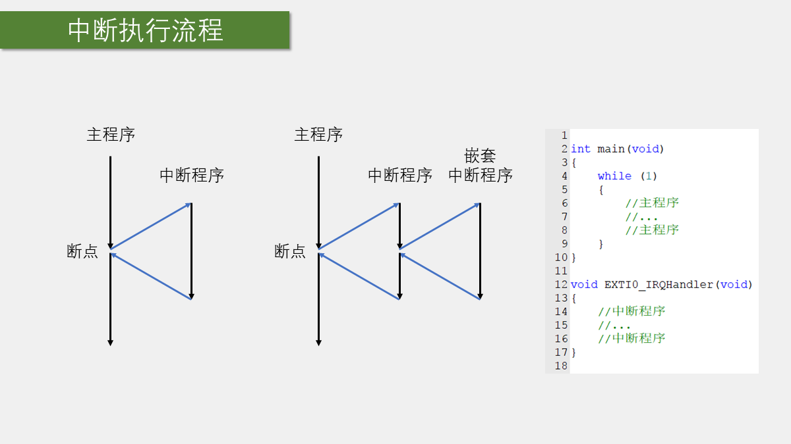
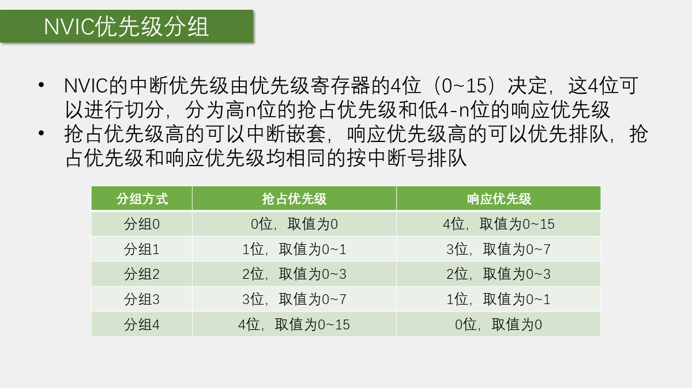
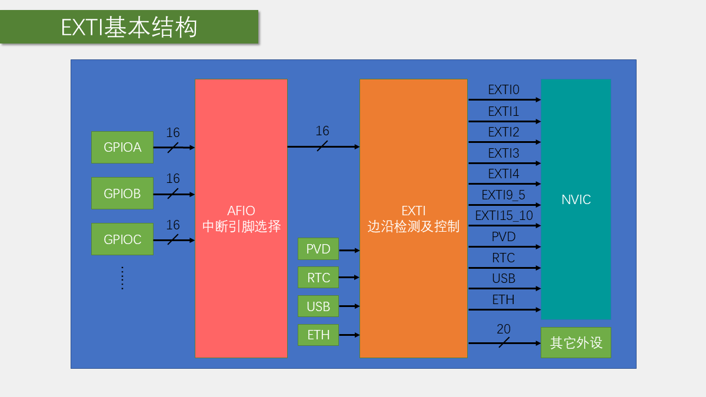
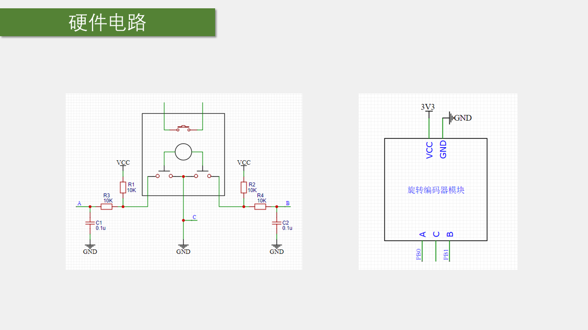

# 第 5 章 中断系统与 EXTI

## 本章闭环

本章先解决“CPU 如何及时处理突发事件”，再用两个实验完成闭环：

1. 对射式红外传感器的 DO 接到 PB14，利用下降沿触发 EXTI14，每触发一次就让计数值加一。
2. 旋转编码器的 A、B 相接到 PB0、PB1，利用两路外部中断判断旋转方向，并让 OLED 上的数字增减。

这两个实验共用同一条知识主线：

```text
外部信号产生边沿
 -> GPIO 读取电平
 -> AFIO 选择该引脚对应的 EXTI 输入
 -> EXTI 检测边沿并置位挂起标志
 -> NVIC 根据优先级向 CPU 提交中断
 -> CPU 根据向量表进入 IRQHandler
 -> 中断程序处理事件并清除挂起标志
```

## 1. 中断的基本概念

### 1.1 为什么需要中断

如果没有中断，CPU 想及时发现外部脉冲、串口数据到达或定时时间到，只能在主循环中不断查询相应标志。查询越频繁，越不容易漏掉事件，但 CPU 也越难处理其他任务。

中断改变了这种工作方式：主程序正常运行，事件到来时再由硬件通知 CPU。CPU 暂停主程序，转去执行对应的中断程序；处理完成后，回到原来暂停的位置继续执行。

| 概念 | 含义 |
| --- | --- |
| 中断源 | 能够提出中断请求的事件或外设，例如引脚边沿、定时器更新、串口接收 |
| 断点 | 主程序被中断时暂停的位置，不是调试器中的断点 |
| 中断服务函数 | 中断发生后由硬件自动进入的处理函数，也称 ISR |
| 现场保护与恢复 | 保存并恢复 CPU 的必要运行状态，使中断返回后能继续执行原程序；C 语言工程中通常由编译器生成相应代码 |

中断适合处理“必须及时响应”的事件，但它不会让 CPU 同时执行两段程序。中断期间，低优先级代码仍然处于暂停状态，因此中断程序必须尽量简短。

### 1.2 中断执行与中断嵌套



普通中断的执行顺序是：

```text
主程序 -> 中断发生 -> 保存现场 -> 执行中断程序
       -> 恢复现场 -> 返回断点 -> 继续主程序
```

当某个中断程序正在运行时，如果又出现了抢占优先级更高的中断，CPU 可以暂停当前中断，先处理更高优先级的中断，再逐层返回。这就是**中断嵌套**。

### 1.3 中断优先级解决什么问题

多个中断源同时请求 CPU 时，需要决定先处理谁。STM32 使用 NVIC 统一管理中断，并把优先级拆成两部分：

- **抢占优先级**：决定能否打断正在执行的另一个中断。
- **响应优先级**：也称子优先级；当抢占优先级相同时，决定多个挂起中断的排队顺序。

优先级数值越小，优先级越高。响应优先级只影响排队，不能让一个中断嵌套进抢占优先级相同的中断。

## 2. STM32 的中断系统

### 2.1 中断资源与中断向量表

STM32F1 的 GPIO、定时器、ADC、USART、SPI、I2C、RTC 等许多外设都能提出中断请求。F1 系列最多可提供 68 个可屏蔽中断通道，具体芯片实际拥有的通道应以数据手册和对应启动文件为准。

中断发生后，硬件需要找到对应的处理函数。由于 C 函数最终放在 Flash 的哪个地址由链接器决定，系统在固定位置保存一张**中断向量表**，表项中记录各中断处理入口。启动文件已经给出了这些表项及默认弱定义，因此编写中断函数时必须使用规定名称，例如：

```c
void EXTI0_IRQHandler(void);
void EXTI1_IRQHandler(void);
void EXTI9_5_IRQHandler(void);
void EXTI15_10_IRQHandler(void);
```

这些函数不需要在主程序中调用。中断条件成立并通过 NVIC 后，硬件会根据向量表自动进入相应函数。函数名写错，程序就不会进入用户编写的处理函数。

### 2.2 NVIC 的作用

NVIC（Nested Vectored Interrupt Controller，嵌套向量中断控制器）是 Cortex-M3 内核外设。各外设先把中断请求送到 NVIC，NVIC 再根据使能状态、挂起状态和优先级决定 CPU 应处理哪个中断。

```text
EXTI / TIM / ADC / USART / ...
               -> NVIC -> CPU
```

NVIC 属于内核，不需要通过 `RCC_xxxPeriphClockCmd()` 单独开启时钟。

### 2.3 NVIC 优先级分组



STM32F1 实际使用优先级寄存器的高 4 位，因此共有 16 个优先等级。通过优先级分组，可以把这 4 位切分为抢占优先级和响应优先级：

| 分组 | 抢占优先级 | 响应优先级 |
| --- | --- | --- |
| `NVIC_PriorityGroup_0` | 0 位，只能取 0 | 4 位，可取 0~15 |
| `NVIC_PriorityGroup_1` | 1 位，可取 0~1 | 3 位，可取 0~7 |
| `NVIC_PriorityGroup_2` | 2 位，可取 0~3 | 2 位，可取 0~3 |
| `NVIC_PriorityGroup_3` | 3 位，可取 0~7 | 1 位，可取 0~1 |
| `NVIC_PriorityGroup_4` | 4 位，可取 0~15 | 0 位，只能取 0 |

本章实验采用分组 2：

```c
NVIC_PriorityGroupConfig(NVIC_PriorityGroup_2);
```

优先级判断顺序如下：

1. 抢占优先级更高的中断可以产生中断嵌套。
2. 抢占优先级相同时，响应优先级更高的挂起中断先执行。
3. 两者都相同时，按硬件中断号排序，中断号更小的先响应。

> [!important]
> 优先级分组是整个芯片的全局配置，一个工程只应选一种分组方式。课程为了展示完整模块，把分组代码写在初始化函数中；多模块工程更适合在系统初始化阶段统一配置一次。

## 3. EXTI 外部中断

### 3.1 EXTI 能做什么

EXTI（External Interrupt/Event Controller）可以监测指定输入线的电平边沿。对 GPIO 输入，常用触发方式包括：

- 上升沿：低电平变为高电平；
- 下降沿：高电平变为低电平；
- 双边沿：上升沿和下降沿都触发；
- 软件触发：程序通过软件中断寄存器主动产生触发。

EXTI 有两条响应路径：

- **中断响应**：把请求送入 NVIC，最终让 CPU 执行中断函数；
- **事件响应**：不进入中断函数，而是产生事件脉冲，用于唤醒或触发其他外设。

本章使用 `EXTI_Mode_Interrupt`，只讨论中断响应。

### 3.2 EXTI 线路与 AFIO 选择

STM32F1 的 EXTI0~EXTI15 与 GPIO 引脚编号一一对应，而不是与端口字母对应：

```text
PA0、PB0、PC0、... -> 竞争 EXTI0
PA1、PB1、PC1、... -> 竞争 EXTI1
...
PA15、PB15、PC15、... -> 竞争 EXTI15
```

AFIO 中的选择器负责确定某条 EXTI 线路接收哪个 GPIO 端口。因此所有 GPIO 都可以作为外部中断输入，但相同编号的引脚不能同时接入 EXTI。例如 PA0 和 PB0 不能同时作为 EXTI0 的输入，PA0 和 PB1 则可以分别使用 EXTI0、EXTI1。

配置映射时使用：

```c
GPIO_EXTILineConfig(GPIO_PortSourceGPIOB, GPIO_PinSource14);
```

这句代码把 PB14 接到 EXTI14。因为该函数实际配置 AFIO 寄存器，使用前必须开启 AFIO 时钟。

### 3.3 EXTI 的整体结构



GPIO 经 AFIO 选出 16 路输入后进入 EXTI 的边沿检测电路。EXTI 检测到有效边沿后：

1. 置位对应线路的挂起标志；
2. 若中断路径未被屏蔽，则向 NVIC 提交请求；
3. NVIC 允许后，CPU 进入对应的中断函数。

EXTI16~EXTI19 在 F1 系列结构图中还可连接 PVD、RTC 闹钟、USB 唤醒和以太网唤醒等内部信号；具体线路是否存在及用途要以芯片型号为准。

### 3.4 EXTI 与 NVIC 通道的对应关系

为了减少 NVIC 通道占用，EXTI 的部分线路共用中断入口：

| EXTI 线路 | NVIC 通道 | 中断函数 |
| --- | --- | --- |
| EXTI0 | `EXTI0_IRQn` | `EXTI0_IRQHandler()` |
| EXTI1 | `EXTI1_IRQn` | `EXTI1_IRQHandler()` |
| EXTI2 | `EXTI2_IRQn` | `EXTI2_IRQHandler()` |
| EXTI3 | `EXTI3_IRQn` | `EXTI3_IRQHandler()` |
| EXTI4 | `EXTI4_IRQn` | `EXTI4_IRQHandler()` |
| EXTI5~EXTI9 | `EXTI9_5_IRQn` | `EXTI9_5_IRQHandler()` |
| EXTI10~EXTI15 | `EXTI15_10_IRQn` | `EXTI15_10_IRQHandler()` |

共享入口中必须先判断是哪条线路触发，再只处理并清除对应挂起位：

```c
if (EXTI_GetITStatus(EXTI_Line14) == SET)
{
    /* 处理 EXTI14 对应的事件 */
    EXTI_ClearITPendingBit(EXTI_Line14);
}
```

`EXTI_GetITStatus()` 同时检查挂起位和中断屏蔽状态；`EXTI_ClearITPendingBit()` 通过向挂起寄存器对应位写 1 清除标志。若不清除，CPU 返回后会再次响应同一中断。

### 3.5 什么时候适合使用外部中断

外部中断适合读取**外部驱动、突发且持续时间短**的信号，例如：

- 旋转编码器输出脉冲；
- 对射式红外传感器的快速遮挡信号；
- 红外遥控接收头输出的脉冲波形。

普通机械按键虽然也是外部事件，但会抖动，而且通常还要判断按下、松手和长按。课程不推荐直接用 EXTI 处理普通按键；要求不高时可在主循环轮询，要求后台扫描时可用定时器周期采样并消抖。

## 4. 外部中断的标准库配置流程

从 GPIO 到 CPU，需要依次打通五个环节：

| 步骤 | 配置对象 | 目的 |
| --- | --- | --- |
| 1 | RCC | 开启 GPIO 和 AFIO 时钟 |
| 2 | GPIO | 把引脚配置为合适的输入模式 |
| 3 | AFIO | 选择某个端口的引脚接入对应 EXTI 线路 |
| 4 | EXTI | 选择线路、触发边沿和中断模式 |
| 5 | NVIC | 选择中断通道、使能并配置优先级 |

EXTI 没有对应的独立 RCC 时钟使能项，NVIC 又属于内核外设，因此本章只需要显式开启 GPIOB 和 AFIO 时钟。

### 4.1 开启 GPIO 与 AFIO 时钟

```c
RCC_APB2PeriphClockCmd(
    RCC_APB2Periph_GPIOB | RCC_APB2Periph_AFIO,
    ENABLE
);
```

函数与参数所属总线必须对应。`GPIOB` 和 `AFIO` 都在 APB2 上，因此应调用 `RCC_APB2PeriphClockCmd()`。

### 4.2 配置 GPIO 输入

```c
GPIO_InitTypeDef GPIO_InitStructure;
GPIO_InitStructure.GPIO_Mode = GPIO_Mode_IPU;
GPIO_InitStructure.GPIO_Pin = GPIO_Pin_14;
GPIO_InitStructure.GPIO_Speed = GPIO_Speed_50MHz;
GPIO_Init(GPIOB, &GPIO_InitStructure);
```

外部中断输入通常根据外部电路选择浮空、上拉或下拉输入。本章模块在空闲时需要稳定高电平，因此采用上拉输入。`GPIO_Speed` 对输入模式不起作用，但结构体成员仍按标准模板赋值完整。

### 4.3 配置 AFIO 引脚映射

```c
GPIO_EXTILineConfig(GPIO_PortSourceGPIOB, GPIO_PinSource14);
```

这里的第二个参数是编号 `GPIO_PinSource14`，不是位掩码 `GPIO_Pin_14`。

### 4.4 配置 EXTI

```c
EXTI_InitTypeDef EXTI_InitStructure;
EXTI_InitStructure.EXTI_Line = EXTI_Line14;
EXTI_InitStructure.EXTI_LineCmd = ENABLE;
EXTI_InitStructure.EXTI_Mode = EXTI_Mode_Interrupt;
EXTI_InitStructure.EXTI_Trigger = EXTI_Trigger_Falling;
EXTI_Init(&EXTI_InitStructure);
```

`EXTI_Line` 是线路位掩码，因此可以用按位或同时初始化多条线路；`EXTI_Trigger` 应根据传感器的实际波形选择，而不是只看“遮挡”或“松开”的文字描述。

### 4.5 配置 NVIC

```c
NVIC_PriorityGroupConfig(NVIC_PriorityGroup_2);

NVIC_InitTypeDef NVIC_InitStructure;
NVIC_InitStructure.NVIC_IRQChannel = EXTI15_10_IRQn;
NVIC_InitStructure.NVIC_IRQChannelCmd = ENABLE;
NVIC_InitStructure.NVIC_IRQChannelPreemptionPriority = 1;
NVIC_InitStructure.NVIC_IRQChannelSubPriority = 1;
NVIC_Init(&NVIC_InitStructure);
```

PB14 使用 EXTI14，而 EXTI10~EXTI15 共用 `EXTI15_10_IRQn`，所以不能把 NVIC 通道误写成引脚编号。

## 5. 实验一：对射式红外传感器计次

### 5.1 硬件连接与目标

连接方式：

| 模块引脚 | STM32 |
| --- | --- |
| VCC | 3.3V |
| GND | GND |
| DO | PB14 |

OLED 接线沿用上一章。挡光片经过传感器凹槽时，DO 会产生电平跳变。课程程序选择下降沿触发，每次进入 EXTI14 中断就把计数变量加一，再由主循环把计数值显示到 OLED。

### 5.2 `CountSensor.h`

```c
#ifndef __COUNT_SENSOR_H
#define __COUNT_SENSOR_H

#include <stdint.h>

void CountSensor_Init(void);
uint16_t CountSensor_Get(void);

#endif
```

### 5.3 `CountSensor.c`

```c
#include "stm32f10x.h"
#include "CountSensor.h"

static volatile uint16_t CountSensor_Count;

void CountSensor_Init(void)
{
    RCC_APB2PeriphClockCmd(
        RCC_APB2Periph_GPIOB | RCC_APB2Periph_AFIO,
        ENABLE
    );

    GPIO_InitTypeDef GPIO_InitStructure;
    GPIO_InitStructure.GPIO_Mode = GPIO_Mode_IPU;
    GPIO_InitStructure.GPIO_Pin = GPIO_Pin_14;
    GPIO_InitStructure.GPIO_Speed = GPIO_Speed_50MHz;
    GPIO_Init(GPIOB, &GPIO_InitStructure);

    GPIO_EXTILineConfig(GPIO_PortSourceGPIOB, GPIO_PinSource14);

    EXTI_InitTypeDef EXTI_InitStructure;
    EXTI_InitStructure.EXTI_Line = EXTI_Line14;
    EXTI_InitStructure.EXTI_LineCmd = ENABLE;
    EXTI_InitStructure.EXTI_Mode = EXTI_Mode_Interrupt;
    EXTI_InitStructure.EXTI_Trigger = EXTI_Trigger_Falling;
    EXTI_Init(&EXTI_InitStructure);

    NVIC_PriorityGroupConfig(NVIC_PriorityGroup_2);

    NVIC_InitTypeDef NVIC_InitStructure;
    NVIC_InitStructure.NVIC_IRQChannel = EXTI15_10_IRQn;
    NVIC_InitStructure.NVIC_IRQChannelCmd = ENABLE;
    NVIC_InitStructure.NVIC_IRQChannelPreemptionPriority = 1;
    NVIC_InitStructure.NVIC_IRQChannelSubPriority = 1;
    NVIC_Init(&NVIC_InitStructure);
}

uint16_t CountSensor_Get(void)
{
    return CountSensor_Count;
}

void EXTI15_10_IRQHandler(void)
{
    if (EXTI_GetITStatus(EXTI_Line14) == SET)
    {
        CountSensor_Count++;
        EXTI_ClearITPendingBit(EXTI_Line14);
    }
}
```

`CountSensor_Count` 同时被主程序和中断函数访问，因此声明为 `volatile`，防止编译器把对它的读取长期缓存起来。这里的 `uint16_t` 在 Cortex-M3 上可用单次半字访问，但 `volatile` 本身并不能保证更复杂的多步操作具有原子性。

### 5.4 主程序

```c
#include "stm32f10x.h"
#include "OLED.h"
#include "CountSensor.h"

int main(void)
{
    OLED_Init();
    CountSensor_Init();

    OLED_ShowString(1, 1, "Count:");

    while (1)
    {
        OLED_ShowNum(1, 7, CountSensor_Get(), 5);
    }
}
```

把 `EXTI_Trigger_Falling` 分别改为 `EXTI_Trigger_Rising` 和 `EXTI_Trigger_Rising_Falling`，可以观察上升沿、下降沿和双边沿触发的差异。若双边沿触发，遮挡和移开通常都会计数一次。

## 6. 实验二：旋转编码器计次

### 6.1 正交编码器如何判断方向

旋转编码器用来测量位置、速度或方向。课程使用的机械编码器模块输出 A、B 两路方波，两路信号相差约 $90^\circ$，称为正交信号：

- 一个方向旋转时，A 相领先 B 相；
- 反方向旋转时，B 相领先 A 相。

因此，在一相出现有效边沿时读取另一相的电平，就能判断旋转方向。



课程接线如下：

| 模块引脚 | STM32 |
| --- | --- |
| VCC | 3.3V |
| GND | GND |
| A | PB0 |
| B | PB1 |

模块电路中的 C 是编码器公共端，已接到 GND；本实验不使用旋转轴按键。

只让 A 相触发中断也能判断方向，但两个方向更新计数的机械位置不完全对称。课程让 A、B 两相的下降沿都触发中断：

| 中断时刻 | 读取另一相 | 课程定义的结果 |
| --- | --- | --- |
| A 相下降沿，即 EXTI0 | B 相为低电平 | 计数减一 |
| B 相下降沿，即 EXTI1 | A 相为低电平 | 计数加一 |

这样正反转都在一个完整步进接近结束时更新数字。若 A、B 接反，或希望改变正方向定义，交换 A/B 接线或交换加减号即可。

### 6.2 `Encoder.h`

```c
#ifndef __ENCODER_H
#define __ENCODER_H

#include <stdint.h>

void Encoder_Init(void);
int16_t Encoder_Get(void);

#endif
```

### 6.3 `Encoder.c`

```c
#include "stm32f10x.h"
#include "Encoder.h"

static volatile int16_t Encoder_Count;

void Encoder_Init(void)
{
    RCC_APB2PeriphClockCmd(
        RCC_APB2Periph_GPIOB | RCC_APB2Periph_AFIO,
        ENABLE
    );

    GPIO_InitTypeDef GPIO_InitStructure;
    GPIO_InitStructure.GPIO_Mode = GPIO_Mode_IPU;
    GPIO_InitStructure.GPIO_Pin = GPIO_Pin_0 | GPIO_Pin_1;
    GPIO_InitStructure.GPIO_Speed = GPIO_Speed_50MHz;
    GPIO_Init(GPIOB, &GPIO_InitStructure);

    GPIO_EXTILineConfig(GPIO_PortSourceGPIOB, GPIO_PinSource0);
    GPIO_EXTILineConfig(GPIO_PortSourceGPIOB, GPIO_PinSource1);

    EXTI_InitTypeDef EXTI_InitStructure;
    EXTI_InitStructure.EXTI_Line = EXTI_Line0 | EXTI_Line1;
    EXTI_InitStructure.EXTI_LineCmd = ENABLE;
    EXTI_InitStructure.EXTI_Mode = EXTI_Mode_Interrupt;
    EXTI_InitStructure.EXTI_Trigger = EXTI_Trigger_Falling;
    EXTI_Init(&EXTI_InitStructure);

    NVIC_PriorityGroupConfig(NVIC_PriorityGroup_2);

    NVIC_InitTypeDef NVIC_InitStructure;
    NVIC_InitStructure.NVIC_IRQChannel = EXTI0_IRQn;
    NVIC_InitStructure.NVIC_IRQChannelCmd = ENABLE;
    NVIC_InitStructure.NVIC_IRQChannelPreemptionPriority = 1;
    NVIC_InitStructure.NVIC_IRQChannelSubPriority = 1;
    NVIC_Init(&NVIC_InitStructure);

    NVIC_InitStructure.NVIC_IRQChannel = EXTI1_IRQn;
    NVIC_InitStructure.NVIC_IRQChannelSubPriority = 2;
    NVIC_Init(&NVIC_InitStructure);
}

int16_t Encoder_Get(void)
{
    int16_t Temp = Encoder_Count;
    Encoder_Count = 0;
    return Temp;
}

void EXTI0_IRQHandler(void)
{
    if (EXTI_GetITStatus(EXTI_Line0) == SET)
    {
        if (GPIO_ReadInputDataBit(GPIOB, GPIO_Pin_1) == Bit_RESET)
        {
            Encoder_Count--;
        }
        EXTI_ClearITPendingBit(EXTI_Line0);
    }
}

void EXTI1_IRQHandler(void)
{
    if (EXTI_GetITStatus(EXTI_Line1) == SET)
    {
        if (GPIO_ReadInputDataBit(GPIOB, GPIO_Pin_0) == Bit_RESET)
        {
            Encoder_Count++;
        }
        EXTI_ClearITPendingBit(EXTI_Line1);
    }
}
```

EXTI0 和 EXTI1 各自独占一个 IRQHandler，因此这里分别编写两个中断函数。两者抢占优先级相同，不会彼此嵌套；同时挂起时，响应优先级为 1 的 EXTI0 先处理。

### 6.4 主程序

```c
#include "stm32f10x.h"
#include "OLED.h"
#include "Encoder.h"

int16_t Number;

int main(void)
{
    OLED_Init();
    Encoder_Init();

    OLED_ShowString(1, 1, "Number:");

    while (1)
    {
        Number += Encoder_Get();
        OLED_ShowSignedNum(1, 8, Number, 5);
    }
}
```

`Encoder_Get()` 返回“上次读取后新增的正负计数”，所以主程序用 `+=` 累加，而不是直接赋值。

> [!note]
> 课程的机械编码器演示速度较低，`Encoder_Get()` 采用“读取后清零”的简单写法。读取与清零是两个操作；如果两者之间恰好发生中断，新计数可能被清零。更严格的实现应在极短临界区内完成交换，或让驱动返回只增不清的累计值。高速编码器更适合使用定时器的编码器接口。

## 7. 中断程序设计原则

### 7.1 中断函数要短而确定

适合放在中断函数中的操作：

- 读取必要的引脚或状态位；
- 更新时间戳、计数器或少量数据；
- 把数据快速转存到缓冲区；
- 置位标志，通知主程序继续处理；
- 清除本次中断的挂起标志。

不适合放在中断函数中的操作：

- `Delay_ms()` 等长时间等待；
- 等待按键松手；
- OLED 全屏刷新；
- 复杂浮点运算；
- 阻塞式串口或其他通信。

中断程序越长，主程序和低优先级中断被推迟得越久，连续事件也越容易丢失。

### 7.2 主程序与中断程序不要争用同一硬件

CPU 进入和退出中断时会保护寄存器等处理器现场，但不会自动保存外部设备的通信过程。假设主程序正在向 OLED 发送一半数据，中断程序又调用 OLED 驱动并改变了显示位置；中断返回后，主程序虽然能继续运行，OLED 的内部状态却已经改变，显示就可能错乱。

更稳妥的协作方式是：

```text
中断函数：采集最少信息 -> 更新计数/数据 -> 置标志 -> 清挂起位
主循环：读取标志/计数 -> 执行显示、计算、通信等耗时任务
```

### 7.3 `volatile` 的边界

`volatile` 告诉编译器“这个值可能在当前代码之外发生变化”，适合修饰中断和主程序共享的简单状态，但它不提供：

- 多步操作的原子性；
- 多变量之间的一致快照；
- 对共享外设的互斥访问。

当主程序需要对共享变量执行“读出并清零”“判断后修改”等复合操作时，仍要根据实时性要求设计临界区或改用更合适的数据交换方式。

### 7.4 共享中断入口只能统一定义

一个工程中，同名 IRQHandler 只能有一个实际定义。若 EXTI10~EXTI15 被多个模块使用，不能让每个模块分别定义 `EXTI15_10_IRQHandler()`；应在唯一的处理函数中检查各线路挂起位，再分发给相应模块。

## 8. 验收与排错

### 8.1 对射式红外传感器

预期现象：每出现一次所选有效边沿，OLED 计数增加一次。

若完全不进入中断，按信号链从前到后检查：

1. 示波器、逻辑分析仪或读引脚确认 PB14 上确实出现了目标边沿；
2. GPIOB 与 AFIO 时钟是否开启；
3. PB14 是否配置为合适的输入模式；
4. AFIO 是否把 GPIOB 的 14 号引脚映射到 EXTI14；
5. EXTI14 的线路、模式、触发边沿和使能是否正确；
6. NVIC 通道是否为 `EXTI15_10_IRQn` 且已经使能；
7. 函数名是否严格写成 `EXTI15_10_IRQHandler`。

若一次动作连续计数，检查信号是否抖动、输入是否悬空、是否误用了双边沿，以及挂起位是否正确清除。

### 8.2 旋转编码器

预期现象：向一个方向旋转数字增加，反方向旋转数字减小。

- 只能加不能减或只能减不能加：检查两路 EXTI 映射、NVIC 通道和 IRQHandler。
- 方向相反：交换 A/B 接线，或交换中断中的 `++` 与 `--`。
- 一格跳多个数：机械触点仍可能抖动，可增加硬件/软件滤波；高速、稳定计数应使用定时器编码器接口。
- 偶尔漏计：检查中断函数是否过长、主程序是否存在长时间关中断，以及 `Encoder_Get()` 的读取清零竞态。

## 本章小结

中断的核心不是某个固定函数，而是完整链路：事件先由外设产生，EXTI 等外设置位状态并申请中断，NVIC 完成使能和优先级裁决，CPU 再根据向量表进入规定的 IRQHandler。

配置 GPIO 外部中断时，按 **RCC → GPIO → AFIO → EXTI → NVIC** 的顺序打通信号；进入中断后，先判断来源，快速处理，最后清除对应挂起位。对射式红外实验展示了单路外部中断计次，旋转编码器实验进一步展示了两路正交信号、多个 NVIC 通道和主程序/中断之间的数据交接。
