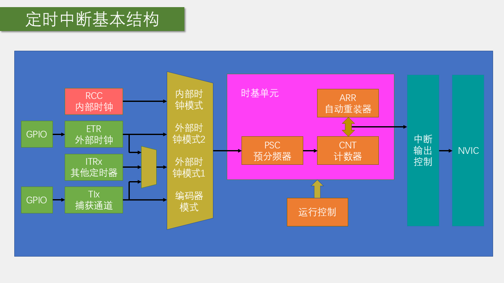
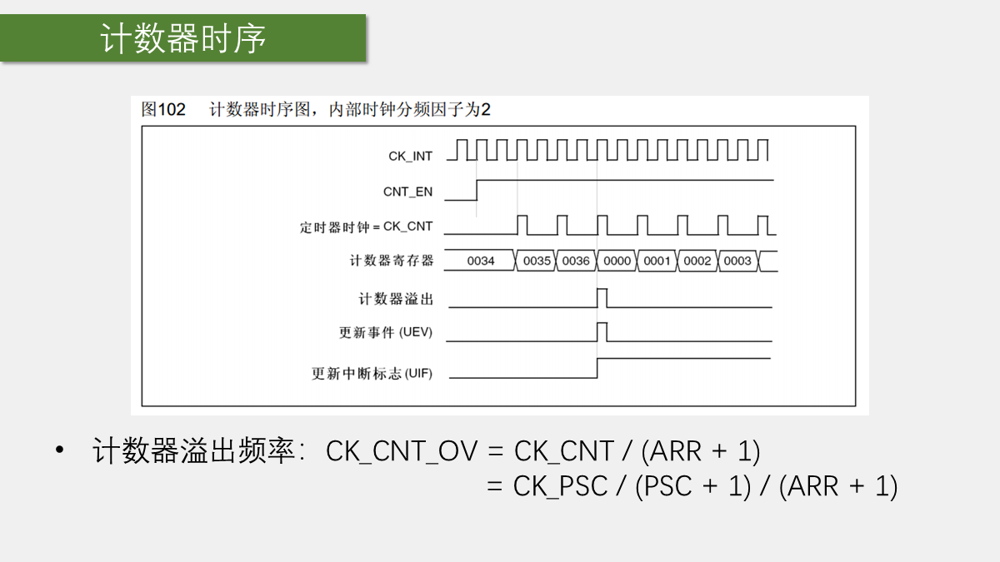
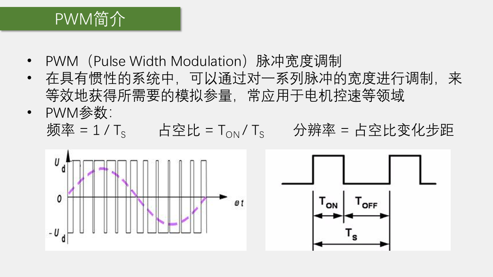
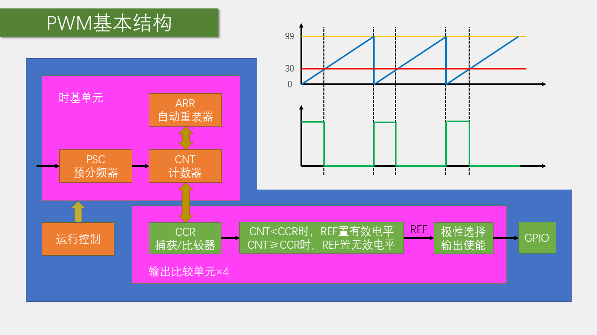
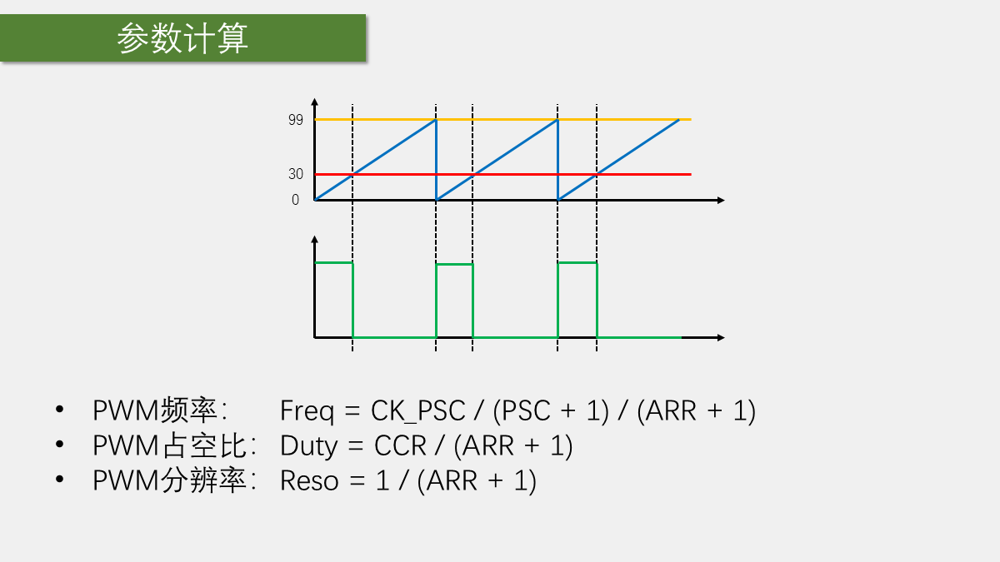
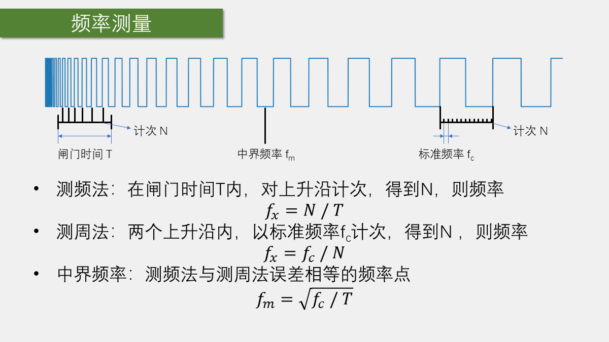
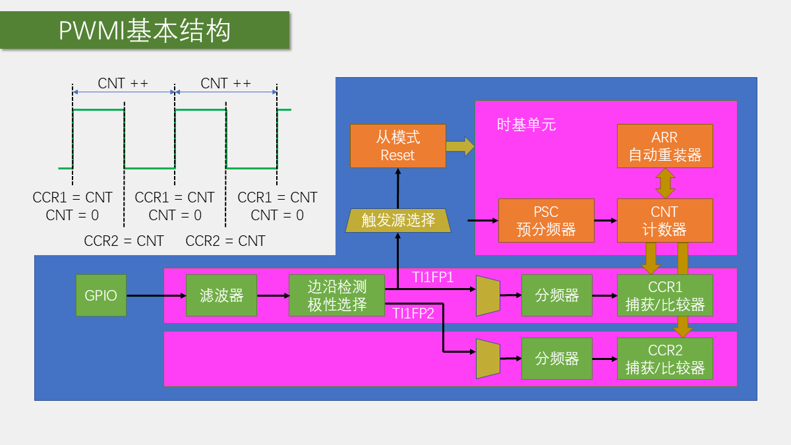
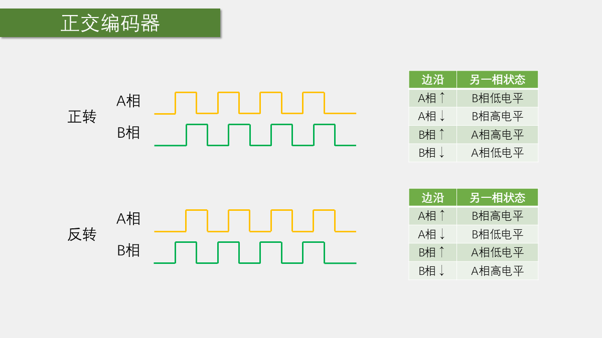
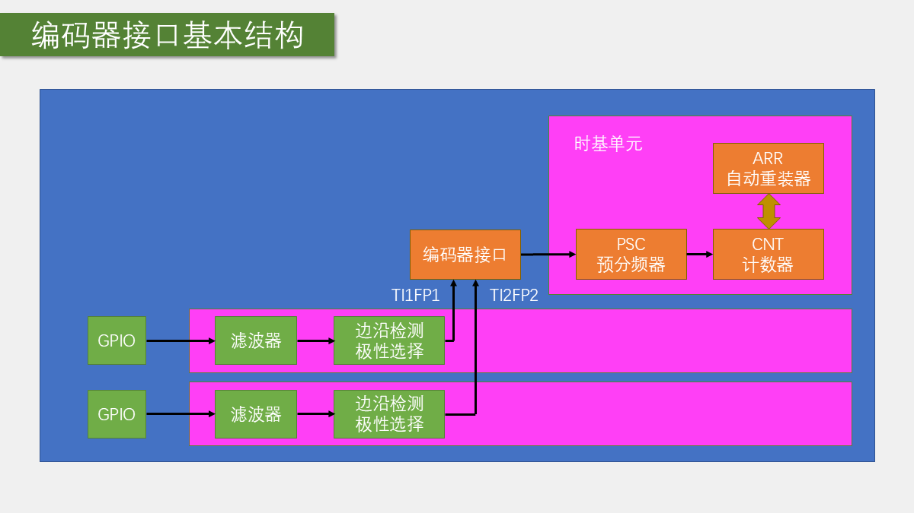

# 第 6 章 定时器 TIM

## 本章闭环

定时器的核心是一个由时钟驱动的计数器。围绕同一个 `CNT`，STM32 又加入了预分频、自动重装、捕获比较和主从触发等电路，于是得到四类常用功能：

```text
时钟源 -> PSC 预分频 -> CNT 计数 -> ARR 决定更新周期
                                  |
                                  +-> 更新事件/更新中断：周期执行任务
                                  +-> 与 CCR 比较：输出 PWM
                                  +-> 边沿到来时锁存到 CCR：测频率和占空比
                                  +-> 正交信号控制加减：读取编码器
```

## 1. 定时中断与内外时钟源

### 1.1 定时器解决什么问题

定时器（Timer，缩写为 TIM）可以对输入时钟计数，并在计数达到设定值时产生事件或中断。只要输入时钟的频率准确，“数脉冲”就等价于“量时间”，因此定时器可用于时钟、秒表、周期采样和周期执行算法。

STM32F103 的通用定时器具有 16 位 `PSC`、`CNT` 和 `ARR`。若定时器时钟为 72 MHz，并把预分频和自动重装都设为最大分频范围，则单次向上计数的最长周期约为：

$$
T_{max}=\frac{65536\times65536}{72\times10^6}\approx59.65\text{ s}
$$

需要更长周期时，可以在更新中断中做软件计数，也可以利用主从触发把多个定时器级联。入门工程通常优先采用“定时器产生较短基准周期，软件再累计”的方法。

### 1.2 定时器类型与资源

STM32F1 的定时器按功能复杂度分为三类：

| 类型 | 典型编号 | 总线 | 主要功能 |
| --- | --- | --- | --- |
| 高级定时器 | TIM1、TIM8 | APB2 | 通用定时器全部功能，另有重复计数器、互补输出、死区和刹车输入 |
| 通用定时器 | TIM2~TIM5 | APB1 | 定时中断、内外时钟、输入捕获、输出比较、编码器接口和主从触发 |
| 基本定时器 | TIM6、TIM7 | APB1 | 时基、更新中断和触发 DAC |

具体芯片未必拥有表中的全部定时器。课程所用 STM32F103C8T6 具有 TIM1、TIM2、TIM3、TIM4，即 1 个高级定时器和 3 个通用定时器，没有 TIM6、TIM7。使用外设前应先查数据手册，而不是只看标准库中是否存在相应宏定义。

### 1.3 时基单元：PSC、CNT、ARR

时基单元由三个核心寄存器构成：

- `PSC`（Prescaler）：预分频器。实际分频系数为 `PSC + 1`。
- `CNT`（Counter）：计数器。每来一个计数时钟就加一或减一。
- `ARR`（Auto-Reload Register）：自动重装寄存器，决定计数边界。

在最常用的边沿对齐、向上计数模式中，`CNT` 从 0 数到 `ARR`，下一个计数时钟到来时回到 0，并产生更新事件；若允许更新中断，还会向 NVIC 提交中断请求。因此：

$$
f_{CNT}=\frac{f_{TIM}}{PSC+1}
$$

$$
f_{update}=\frac{f_{TIM}}{(PSC+1)(ARR+1)},\qquad
T_{update}=\frac{(PSC+1)(ARR+1)}{f_{TIM}}
$$

公式中的两个 `+1` 来自实际计数范围：预分频器从 0 数到 `PSC`，主计数器从 0 数到 `ARR`。

基本定时器只支持向上计数；通用和高级定时器还支持向下计数与中央对齐计数。课程后续实验均采用向上计数。

### 1.4 基本、通用与高级定时器的结构扩展

基本定时器只有时基单元。更新事件除了可以产生中断，还能由主模式映射到 `TRGO`，直接触发 DAC 等外设。这样可让定时器按固定频率触发 DAC 输出下一个采样点，无需 CPU 每次进入中断。

通用定时器在时基单元两侧增加了更多数据通路：

- **时钟输入**：内部时钟、ETR 外部时钟、其他定时器的 ITR、捕获通道 TIx。
- **四个捕获比较通道**：输出比较时用来产生波形，输入捕获时用来锁存计数值。
- **主从触发**：一个定时器可以触发另一个定时器，也可由输入边沿自动复位、启动或门控自身计数器。
- **编码器接口**：根据两路正交信号自动控制 `CNT` 加减。

高级定时器再增加适合电机功率驱动的重复计数器、互补输出、死区和刹车输入。STM32F103 的 TIM1 重复计数器 `RCR` 为 8 位，范围是 `0~255`；它不是普通 16 位计数器。

### 1.5 时钟源选择



课程使用的常见时钟源如下：

| 时钟源 | 数据通路 | 常见用途 | 标准库函数 |
| --- | --- | --- | --- |
| RCC 内部时钟 | `CK_INT` | 常规定时、PWM、输入捕获计时基准 | `TIM_InternalClockConfig()` |
| ETR 外部时钟模式 2 | ETR 直接进入时钟选择 | 外部脉冲计数 | `TIM_ETRClockMode2Config()` |
| 外部时钟模式 1 | `TRGI` 进入从模式控制器 | ETR、ITRx 或 TIx 驱动计数 | `TIM_ETRClockMode1Config()` 等 |
| 编码器模式 | TI1、TI2 经编码器接口 | 正交编码器计数 | `TIM_EncoderInterfaceConfig()` |

外部时钟模式 1 的触发输入还可来自其他定时器的 `TRGO`。例如把 TIM3 的更新事件映射到 `TRGO`，再让 TIM2 选择对应的 `ITR` 作为外部时钟，就构成定时器级联。

若只是从 ETR 引脚输入外部计数脉冲，外部时钟模式 2 路径最直接。模式 1 和模式 2 对 ETR 而言都能完成计数，但模式 1 会占用 `TRGI`/从模式通路。

### 1.6 预装载与更新时序



`PSC` 并不是写入后立刻改变实际分频。软件写入的是预装载寄存器，更新事件到来后，数值才转移到真正工作的影子寄存器。这样可避免一个计数周期的前后两段使用不同频率。

`ARR` 也可选择是否启用预装载：

- 未启用预装载：写入后立即改变计数边界。
- 启用预装载：新值在更新事件时生效，周期边界更完整。

标准库 `TIM_TimeBaseInit()` 在初始化末尾会主动产生一次更新事件，使预分频值立即装入影子寄存器。副作用是更新标志 `UIF` 会被置位，因此应在开启更新中断前调用 `TIM_ClearFlag(TIMx, TIM_FLAG_Update)`，否则程序刚启动就可能先进入一次中断。

### 1.7 STM32F103 默认时钟树

课程工程的 `SystemInit()` 使用外部 8 MHz 晶振，经 PLL 倍频 9 倍得到 72 MHz 系统时钟。默认分频关系是：

```text
SYSCLK = 72 MHz
HCLK   = 72 MHz
PCLK2  = 72 MHz   -> TIM1 时钟 = 72 MHz
PCLK1  = 36 MHz   -> 因 APB1 预分频不为 1，TIM2~TIM4 时钟 = 2 x PCLK1 = 72 MHz
```

通用规则是：APB 预分频为 1 时，定时器时钟等于对应 `PCLK`；APB 预分频不为 1 时，定时器时钟等于 `2 x PCLK`。因此不能直接把 `PCLK1 = 36 MHz` 代入 TIM2/TIM3/TIM4 的公式。

如果外部晶振失效且系统仍以内部 8 MHz 时钟运行，按 72 MHz 计算的延时会明显变慢。遇到定时周期近似慢 9 倍时，应检查外部晶振、PLL 和系统时钟切换状态。

### 1.8 标准库配置流程

定时中断的配置顺序是：

1. 开启 TIM 时钟。
2. 选择时基单元的时钟源。
3. 配置 `PSC`、`ARR` 和计数模式。
4. 清除更新标志并允许更新中断输出。
5. 配置 NVIC 通道和优先级。
6. 启动定时器，并编写规定名称的中断函数。

常用标准库接口：

| 任务 | 接口 |
| --- | --- |
| 初始化时基 | `TIM_TimeBaseInit()` |
| 选择内部时钟 | `TIM_InternalClockConfig()` |
| 选择 ETR 外部时钟 | `TIM_ETRClockMode1Config()`、`TIM_ETRClockMode2Config()` |
| 允许中断输出 | `TIM_ITConfig()` |
| 启停计数器 | `TIM_Cmd()` |
| 改写/读取计数值 | `TIM_SetCounter()`、`TIM_GetCounter()` |
| 单独改写 PSC/ARR | `TIM_PrescalerConfig()`、`TIM_SetAutoreload()` |
| 查询和清除中断标志 | `TIM_GetITStatus()`、`TIM_ClearITPendingBit()` |

### 1.9 实验 `6-1`：定时器定时中断

目标是让 TIM2 每隔 1 s 产生一次更新中断。取：

$$
PSC=7200-1,\qquad ARR=10000-1
$$

则 `CNT` 频率为 10 kHz，累计 10000 个计数正好是 1 s。

```c
#include "stm32f10x.h"

void Timer_Init(void)
{
    RCC_APB1PeriphClockCmd(RCC_APB1Periph_TIM2, ENABLE);
    TIM_InternalClockConfig(TIM2);

    TIM_TimeBaseInitTypeDef timeBase;
    timeBase.TIM_ClockDivision = TIM_CKD_DIV1;
    timeBase.TIM_CounterMode = TIM_CounterMode_Up;
    timeBase.TIM_Period = 10000 - 1;
    timeBase.TIM_Prescaler = 7200 - 1;
    timeBase.TIM_RepetitionCounter = 0;
    TIM_TimeBaseInit(TIM2, &timeBase);

    TIM_ClearFlag(TIM2, TIM_FLAG_Update);
    TIM_ITConfig(TIM2, TIM_IT_Update, ENABLE);

    NVIC_PriorityGroupConfig(NVIC_PriorityGroup_2);

    NVIC_InitTypeDef nvic;
    nvic.NVIC_IRQChannel = TIM2_IRQn;
    nvic.NVIC_IRQChannelCmd = ENABLE;
    nvic.NVIC_IRQChannelPreemptionPriority = 2;
    nvic.NVIC_IRQChannelSubPriority = 1;
    NVIC_Init(&nvic);

    TIM_Cmd(TIM2, ENABLE);
}
```

中断函数名称来自启动文件。先判断更新中断状态，再执行任务，最后清除挂起标志：

```c
volatile uint16_t Number;

void TIM2_IRQHandler(void)
{
    if (TIM_GetITStatus(TIM2, TIM_IT_Update) == SET)
    {
        Number++;
        TIM_ClearITPendingBit(TIM2, TIM_IT_Update);
    }
}
```

`Number` 同时被中断和主程序访问，应声明为 `volatile`。中断函数应保持简短；OLED 刷屏等耗时操作放在主循环中，只在中断里更新状态。

### 1.10 实验 `6-2`：定时器外部时钟

本实验把对射式红外传感器的 DO 接到 PA0。PA0 是 TIM2_ETR，外部每产生一个有效边沿，`CNT` 加一；`ARR = 10 - 1` 时，计满 10 次后更新并清零。

```c
RCC_APB1PeriphClockCmd(RCC_APB1Periph_TIM2, ENABLE);
RCC_APB2PeriphClockCmd(RCC_APB2Periph_GPIOA, ENABLE);

GPIO_InitTypeDef gpio;
gpio.GPIO_Mode = GPIO_Mode_IPU;
gpio.GPIO_Pin = GPIO_Pin_0;
gpio.GPIO_Speed = GPIO_Speed_50MHz;
GPIO_Init(GPIOA, &gpio);

TIM_ETRClockMode2Config(
    TIM2,
    TIM_ExtTRGPSC_OFF,
    TIM_ExtTRGPolarity_NonInverted,
    0x0F
);

TIM_TimeBaseInitTypeDef timeBase;
timeBase.TIM_ClockDivision = TIM_CKD_DIV1;
timeBase.TIM_CounterMode = TIM_CounterMode_Up;
timeBase.TIM_Period = 10 - 1;
timeBase.TIM_Prescaler = 1 - 1;
timeBase.TIM_RepetitionCounter = 0;
TIM_TimeBaseInit(TIM2, &timeBase);
```

`TIM_ExtTRGPSC_OFF` 表示 ETR 不额外分频；`NonInverted` 表示不反相；滤波参数 `0x0F` 适合课程中的机械式/传感器慢脉冲，但会增加延迟并限制最高输入频率。高速、边沿干净的外部时钟应按信号频率重新选择滤波参数。

## 2. 输出比较与 PWM

### 2.1 输出比较的作用

输出比较（Output Compare，OC）把 `CNT` 与捕获比较寄存器 `CCR` 比较，再根据比较结果控制通道输出。每个通用或高级定时器通常有四个捕获比较通道；四路拥有各自的 `CCR`，但共享同一个 `PSC`、`CNT` 和 `ARR`。

因此，同一定时器的四路 PWM：

- 频率相同，因为共用时基。
- 周期起点同步。
- 占空比可分别设置，因为 `CCR1~CCR4` 相互独立。

输入捕获和输出比较共用通道引脚及 `CCR`，同一个通道不能同时承担两种功能。

### 2.2 PWM 的基本思想与参数



PWM（Pulse Width Modulation，脉冲宽度调制）通过快速切换高低电平，并调节高电平持续时间，控制具有惯性的系统。LED 的余晖与人眼视觉暂留、电机的机械惯性，都能把快速开关效果表现为连续的亮度或速度。

PWM 有三个核心参数：

- **频率**：每秒重复多少个周期，$f=1/T$。
- **占空比**：高电平时间占周期的比例，$D=T_{ON}/T$。
- **分辨率**：占空比能够变化的最小步距。

PWM 不一定用于“等效模拟量”。舵机把高电平脉宽解释为角度命令，此时 PWM 更像一种单线控制协议。

### 2.3 输出比较模式

STM32F1 的输出比较单元提供多种模式：

| 模式 | `CNT` 与 `CCR` 匹配时的行为 | 常见用途 |
| --- | --- | --- |
| 冻结 | 保持原输出 | 暂停输出状态 |
| 匹配时有效/无效 | 匹配时置有效或无效电平 | 一次性电平控制 |
| 匹配时翻转 | 匹配时翻转输出 | 输出固定 50% 占空比的方波 |
| 强制有效/无效 | 忽略比较结果，固定输出 | 强制电平 |
| PWM 模式 1/2 | 根据大小关系连续控制输出 | 输出频率、占空比可调的 PWM |

课程统一采用向上计数、PWM 模式 1、有效电平为高：

```text
CNT < CCR  -> REF 为有效电平（高）
CNT >= CCR -> REF 为无效电平（低）
```

PWM 模式 2 与模式 1 的 `REF` 极性相反；最终输出级还可以再次选择极性，因此不同组合可能得到相同波形。

### 2.4 PWM 基本结构与参数计算





在边沿对齐、向上计数、PWM 模式 1、有效电平为高的条件下：

$$
f_{PWM}=\frac{f_{TIM}}{(PSC+1)(ARR+1)}
$$

$$
D=\frac{CCR}{ARR+1}
$$

$$
\Delta D=\frac{1}{ARR+1}
$$

例如 `ARR = 99` 时，一个周期包含 100 个计数，占空比分辨率为 1%。`CCR = 30` 时，`CNT = 0~29` 共 30 个计数输出高电平，因此占空比为 30%。

边界要单独注意：

- `CCR = 0`：始终不满足 `CNT < CCR`，占空比为 0%。
- `CCR = ARR`：占空比是 $ARR/(ARR+1)$，还不是严格 100%。
- `CCR = ARR + 1`：整个计数周期都满足 `CNT < CCR`，可得到严格 100%；但当 `ARR = 65535` 时，16 位 `CCR` 无法写入 65536。

设计参数时通常先按分辨率确定 `ARR`，再由目标频率确定 `PSC`，最后用 `CCR` 调占空比。

### 2.5 高级定时器的互补输出、死区与刹车

高级定时器 TIM1/TIM8 的前三个通道带互补输出，适合驱动半桥或三相桥。上下功率管切换时，器件关断并非瞬时完成；若一只还未完全关断，另一只已经导通，就可能造成电源直通。死区电路会让上下管在切换期间同时关断一小段时间。

刹车输入 `BKIN` 可在外部故障或时钟失效时快速关闭输出。以上功能主要用于功率驱动，本章实验使用普通通用定时器，不配置这些电路。

### 2.6 舵机与直流电机的控制要求

#### 舵机

课程使用 SG90 舵机，控制信号周期约为 20 ms，即 50 Hz。典型角度映射为：

| 高电平时间 | 角度 |
| --- | --- |
| 0.5 ms | 0°（也可定义为 -90°） |
| 1.5 ms | 90°（中位） |
| 2.5 ms | 180°（也可定义为 +90°） |

舵机由 5 V 电源供电，信号线接 STM32 PWM 引脚。若舵机使用独立电源，电源地必须与 STM32 共地。具体脉宽范围和机械角度应以舵机数据手册及实测为准，避免撞到机械限位。

#### TB6612 驱动直流电机

GPIO 不能直接驱动电机。课程使用 TB6612 双路 H 桥模块：

- `VM` 接电机电源。
- `VCC` 接 3.3 V 逻辑电源。
- `GND` 与 STM32 共地。
- `STBY` 拉高使能芯片。
- `AIN1/AIN2` 控制方向。
- `PWMA` 输入 PWM，控制速度。

| AIN1 | AIN2 | PWMA | 状态 |
| --- | --- | --- | --- |
| 1 | 0 | PWM | 一个方向旋转 |
| 0 | 1 | PWM | 反方向旋转 |
| 0 | 0 | 任意 | 停止/高阻，具体状态以模块真值表为准 |
| 1 | 1 | 任意 | 短刹车 |

### 2.7 PWM 的标准库配置流程

1. 开启 TIM 和 GPIO 时钟。
2. 把通道对应 GPIO 配置为复用推挽输出 `GPIO_Mode_AF_PP`。
3. 配置内部时钟和时基单元。
4. 用 `TIM_OCStructInit()` 先给输出比较结构体默认值。
5. 配置 PWM 模式、极性、输出使能和初始 `CCR`。
6. 调用对应通道的 `TIM_OCxInit()`，再启动定时器。

运行中可用 `TIM_SetCompare1()` 至 `TIM_SetCompare4()` 修改各通道 `CCR`。若需要让新占空比严格在周期边界生效，可按通道启用比较寄存器预装载。

### 2.8 实验 `6-3`：PWM 驱动 LED 呼吸灯

PA0 对应 TIM2_CH1。设 `ARR = 100 - 1`、`PSC = 720 - 1`，得到 1 kHz PWM 和 1% 占空比分辨率。

```c
void PWM_Init(void)
{
    RCC_APB1PeriphClockCmd(RCC_APB1Periph_TIM2, ENABLE);
    RCC_APB2PeriphClockCmd(RCC_APB2Periph_GPIOA, ENABLE);

    GPIO_InitTypeDef gpio;
    gpio.GPIO_Mode = GPIO_Mode_AF_PP;
    gpio.GPIO_Pin = GPIO_Pin_0;
    gpio.GPIO_Speed = GPIO_Speed_50MHz;
    GPIO_Init(GPIOA, &gpio);

    TIM_InternalClockConfig(TIM2);

    TIM_TimeBaseInitTypeDef timeBase;
    timeBase.TIM_ClockDivision = TIM_CKD_DIV1;
    timeBase.TIM_CounterMode = TIM_CounterMode_Up;
    timeBase.TIM_Period = 100 - 1;
    timeBase.TIM_Prescaler = 720 - 1;
    timeBase.TIM_RepetitionCounter = 0;
    TIM_TimeBaseInit(TIM2, &timeBase);

    TIM_OCInitTypeDef oc;
    TIM_OCStructInit(&oc);
    oc.TIM_OCMode = TIM_OCMode_PWM1;
    oc.TIM_OCPolarity = TIM_OCPolarity_High;
    oc.TIM_OutputState = TIM_OutputState_Enable;
    oc.TIM_Pulse = 0;
    TIM_OC1Init(TIM2, &oc);

    TIM_Cmd(TIM2, ENABLE);
}

void PWM_SetCompare1(uint16_t compare)
{
    TIM_SetCompare1(TIM2, compare);
}
```

主循环让 `CCR1` 在 0 和 100 之间往返变化：

```c
uint16_t i;

while (1)
{
    for (i = 0; i <= 100; i++)
    {
        PWM_SetCompare1(i);
        Delay_ms(10);
    }
    for (i = 0; i <= 100; i++)
    {
        PWM_SetCompare1(100 - i);
        Delay_ms(10);
    }
}
```

这里 `compare` 恰好与百分比相同，是因为 `ARR + 1 = 100`；换成其他 `ARR` 后，`CCR` 不能再直接当成百分比。

#### 引脚重映射

TIM2_CH1 默认在 PA0，也可通过 TIM2 部分重映射 1 移到 PA15。PA15 上电默认属于 JTAG，因此还需关闭 JTAG、保留 SWD：

```c
RCC_APB2PeriphClockCmd(RCC_APB2Periph_AFIO, ENABLE);
GPIO_PinRemapConfig(GPIO_PartialRemap1_TIM2, ENABLE);
GPIO_PinRemapConfig(GPIO_Remap_SWJ_JTAGDisable, ENABLE);
```

随后应把 GPIO 初始化引脚同步改为 PA15。不要使用 `GPIO_Remap_SWJ_Disable` 随意关闭全部 SWJ，否则 SWD 下载接口也会失效。

### 2.9 实验 `6-4`：PWM 驱动舵机

PA1 对应 TIM2_CH2。课程把计数频率设为 1 MHz，使一个计数等于 $1\ \mu s$：

```c
timeBase.TIM_Period = 20000 - 1;
timeBase.TIM_Prescaler = 72 - 1;
TIM_TimeBaseInit(TIM2, &timeBase);

oc.TIM_Pulse = 0;
TIM_OC2Init(TIM2, &oc);
```

于是 `CCR2 = 500~2500` 就直接对应 0.5~2.5 ms。把角度线性映射到脉宽：

```c
void Servo_SetAngle(float angle)
{
    if (angle < 0)
    {
        angle = 0;
    }
    else if (angle > 180)
    {
        angle = 180;
    }

    PWM_SetCompare2((uint16_t)(angle / 180.0f * 2000.0f + 500.0f));
}
```

实际使用时应先限制角度，再做映射。不同舵机的安全脉宽范围可能小于 0.5~2.5 ms。

### 2.10 实验 `6-5`：PWM 驱动直流电机

PA2 对应 TIM2_CH3；PA4、PA5 作为方向控制输出。课程将 `ARR = 100 - 1`、`PSC = 36 - 1`，得到 20 kHz PWM，既保留 1% 分辨率，又把开关声移到大多数人可听范围上限附近。

```c
void Motor_Init(void)
{
    RCC_APB2PeriphClockCmd(RCC_APB2Periph_GPIOA, ENABLE);

    GPIO_InitTypeDef gpio;
    gpio.GPIO_Mode = GPIO_Mode_Out_PP;
    gpio.GPIO_Pin = GPIO_Pin_4 | GPIO_Pin_5;
    gpio.GPIO_Speed = GPIO_Speed_50MHz;
    GPIO_Init(GPIOA, &gpio);

    PWM_Init();
}

void Motor_SetSpeed(int8_t speed)
{
    if (speed >= 0)
    {
        GPIO_SetBits(GPIOA, GPIO_Pin_4);
        GPIO_ResetBits(GPIOA, GPIO_Pin_5);
        PWM_SetCompare3((uint16_t)speed);
    }
    else
    {
        GPIO_ResetBits(GPIOA, GPIO_Pin_4);
        GPIO_SetBits(GPIOA, GPIO_Pin_5);
        PWM_SetCompare3((uint16_t)(-speed));
    }
}
```

接口约定 `speed` 为 `-100~100`：符号控制方向，绝对值控制占空比。调用者应先限幅，避免把超范围或 `INT8_MIN` 传入该函数。

## 3. 输入捕获与 PWMI

### 3.1 输入捕获的作用

输入捕获（Input Capture，IC）在通道引脚出现指定边沿时，把当前 `CNT` 自动锁存到对应 `CCR`。输出比较是“比较后输出电平”，输入捕获则是“边沿到来时保存计数值”。

输入捕获可测量数字信号的频率、周期、脉宽和占空比。若被测信号是正弦波或幅值超过 3.3 V，必须先通过比较、限幅、隔离等前端电路，转换为符合 STM32 输入电平要求的数字信号。

### 3.2 测频法与测周法



**测频法（M 法）**：在固定闸门时间 $T_g$ 内统计待测信号边沿数 $N$：

$$
f_x=\frac{N}{T_g}
$$

它适合高频信号。闸门时间越长，结果更新越慢，但平均效果越强。

**测周法（T 法）**：在待测信号相邻同类边沿之间，用已知标准频率 $f_c$ 计数，得到 $N$：

$$
T_x=\frac{N}{f_c},\qquad f_x=\frac{f_c}{N}
$$

它适合低频信号，通常每个周期都能更新一次结果，但对单周期抖动更敏感。

两种方法都存在约一个计数的量化误差。令两者的计数规模相同，可得到中界频率：

$$
f_m=\sqrt{\frac{f_c}{T_g}}
$$

待测频率低于 $f_m$ 时优先测周法，高于 $f_m$ 时优先测频法。这是误差角度的选择原则，实际还要同时考虑更新速度和硬件上限。

### 3.3 输入捕获通道的数据路径

一路输入捕获信号依次经过：

```text
GPIO/TIx -> 数字滤波 -> 边沿极性选择
         -> 直连/交叉通道选择 -> 输入预分频
         -> 捕获 CNT 到 CCR -> 置位捕获标志/可选中断
```

结构体 `TIM_ICInitTypeDef` 的参数正好对应这条路径：

| 参数 | 作用 |
| --- | --- |
| `TIM_Channel` | 选择通道 |
| `TIM_ICPolarity` | 选择上升沿、下降沿等捕获极性 |
| `TIM_ICSelection` | 选择直连 TI 或交叉 TI |
| `TIM_ICPrescaler` | 每 1、2、4 或 8 个有效边沿捕获一次 |
| `TIM_ICFilter` | 设置数字滤波采样频率和连续采样次数 |

滤波器不会按固定比例改变信号频率；它要求连续若干次采样一致后才承认电平变化。参数越强，抗毛刺能力越好，但延迟越大、可接受的最高输入频率越低。

### 3.4 主从触发实现自动测周

只捕获 `CCR` 还不够。为了让每次读数都表示“刚结束的一个周期”，还需在同一个有效边沿自动把 `CNT` 清零：

1. 通道一选择 `TI1FP1` 上升沿捕获，把 `CNT` 锁存到 `CCR1`。
2. 触发源选择同一个 `TI1FP1`。
3. 从模式选择 `Reset`，有效边沿到来时自动复位 `CNT`。

于是每次上升沿都完成两件事：先得到上一周期的计数值，再让下一周期从 0 开始。整个测量由硬件反复执行，CPU 只需在需要时读取 `CCR1`。

课程把“主模式、触发源选择、从模式”合称为主从触发模式：

- 主模式把本定时器内部信号映射到 `TRGO`，用于触发其他外设。
- 触发源选择决定哪个信号成为 `TRGI`。
- 从模式决定 `TRGI` 到来后执行复位、门控、启动或外部时钟等动作。

### 3.5 PWMI 同时测频率和占空比



PWMI（PWM Input）让两个捕获通道同时观察同一个引脚：

- 通道一：直连 TI1、上升沿捕获，`CCR1` 保存整个周期计数。
- 通道二：交叉到 TI1、下降沿捕获，`CCR2` 保存高电平计数。
- `TI1FP1` 同时触发从模式 Reset，在上升沿清零 `CNT`。

因此：

$$
f_x=\frac{f_c}{CCR1},\qquad
D=\frac{CCR2}{CCR1}\times100\%
$$

标准库 `TIM_PWMIConfig()` 会根据给定的主通道，自动配置另一个通道为相反极性和交叉输入。该快捷配置主要用于通道 1、2 组合。

### 3.6 输入捕获的标准库配置流程

1. 开启 TIM 与 GPIO 时钟。
2. 把输入引脚配置为上拉、下拉或浮空输入。
3. 配置内部时钟、`PSC`、`ARR`，确定测周标准频率和计数上限。
4. 用 `TIM_ICInit()` 配置单通道，或用 `TIM_PWMIConfig()` 配置 PWMI 双通道。
5. 用 `TIM_SelectInputTrigger()` 选择触发源。
6. 用 `TIM_SelectSlaveMode()` 选择 Reset 从模式。
7. 启动定时器，运行时用 `TIM_GetCapturex()` 读取捕获值。

### 3.7 实验 `6-6`：输入捕获模式测频率

课程先用 TIM2_CH1/PA0 输出待测 PWM，再用导线接到 TIM3_CH1/PA6。TIM3 的 `PSC = 72 - 1`，故标准计数频率 $f_c=1\text{ MHz}$；`ARR = 65536 - 1`，使 16 位计数范围全部可用。

```c
void IC_Init(void)
{
    RCC_APB1PeriphClockCmd(RCC_APB1Periph_TIM3, ENABLE);
    RCC_APB2PeriphClockCmd(RCC_APB2Periph_GPIOA, ENABLE);

    GPIO_InitTypeDef gpio;
    gpio.GPIO_Mode = GPIO_Mode_IPU;
    gpio.GPIO_Pin = GPIO_Pin_6;
    gpio.GPIO_Speed = GPIO_Speed_50MHz;
    GPIO_Init(GPIOA, &gpio);

    TIM_InternalClockConfig(TIM3);

    TIM_TimeBaseInitTypeDef timeBase;
    timeBase.TIM_ClockDivision = TIM_CKD_DIV1;
    timeBase.TIM_CounterMode = TIM_CounterMode_Up;
    timeBase.TIM_Period = 65536 - 1;
    timeBase.TIM_Prescaler = 72 - 1;
    timeBase.TIM_RepetitionCounter = 0;
    TIM_TimeBaseInit(TIM3, &timeBase);

    TIM_ICInitTypeDef ic;
    ic.TIM_Channel = TIM_Channel_1;
    ic.TIM_ICFilter = 0x0F;
    ic.TIM_ICPolarity = TIM_ICPolarity_Rising;
    ic.TIM_ICPrescaler = TIM_ICPSC_DIV1;
    ic.TIM_ICSelection = TIM_ICSelection_DirectTI;
    TIM_ICInit(TIM3, &ic);

    TIM_SelectInputTrigger(TIM3, TIM_TS_TI1FP1);
    TIM_SelectSlaveMode(TIM3, TIM_SlaveMode_Reset);
    TIM_Cmd(TIM3, ENABLE);
}
```

理论上应直接用捕获到的周期计数 $N$ 计算：

```c
uint32_t IC_GetFreq(void)
{
    uint16_t period = TIM_GetCapture1(TIM3);

    if (period == 0)
    {
        return 0;
    }

    return 1000000UL / period;
}
```

课程配套源码使用 `1000000 / (CCR1 + 1)`，用于修正自测时观察到的固定一计数偏差。这个 `+1` 不是输入捕获的通用公式：边沿与计数时钟的相位、同步电路和读取方式都可能改变误差方向。测外部信号时应保留原始捕获值，用已知频率校准后再决定是否补偿。

### 3.8 实验 `6-7`：PWMI 测频率和占空比

把单通道初始化替换为 PWMI 快捷配置，其余触发源和 Reset 从模式保持不变：

```c
TIM_ICInitTypeDef ic;
ic.TIM_Channel = TIM_Channel_1;
ic.TIM_ICFilter = 0x0F;
ic.TIM_ICPolarity = TIM_ICPolarity_Rising;
ic.TIM_ICPrescaler = TIM_ICPSC_DIV1;
ic.TIM_ICSelection = TIM_ICSelection_DirectTI;
TIM_PWMIConfig(TIM3, &ic);

TIM_SelectInputTrigger(TIM3, TIM_TS_TI1FP1);
TIM_SelectSlaveMode(TIM3, TIM_SlaveMode_Reset);
TIM_Cmd(TIM3, ENABLE);
```

读取时先缓存两个寄存器并检查分母：

```c
uint32_t IC_GetFreq(void)
{
    uint16_t period = TIM_GetCapture1(TIM3);
    return period == 0 ? 0 : 1000000UL / period;
}

uint32_t IC_GetDuty(void)
{
    uint16_t period = TIM_GetCapture1(TIM3);
    uint16_t high = TIM_GetCapture2(TIM3);
    return period == 0 ? 0 : (uint32_t)high * 100 / period;
}
```

### 3.9 测量范围与误差边界

当 $f_c=1\text{ MHz}$、`ARR = 65535` 时，不溢出的理论最低频率约为：

$$
f_{min}=\frac{10^6}{65536}\approx15.26\text{ Hz}
$$

降低标准频率可进一步测低频，但会降低高频分辨率。测周法约有一个计数的量化误差，若周期计数为 $N$，相对量化误差量级约为 $1/N$。例如：

- 要求误差不高于约 1%，应尽量让 $N\ge100$，在 1 MHz 计数时对应频率不高于约 10 kHz。
- 要求误差不高于约 0.1%，应尽量让 $N\ge1000$，对应频率不高于约 1 kHz。

还要处理三个工程边界：

- 输入停止后 `CCR` 会保留最后一次值，不会自动归零，应设置超时判定。
- 启动后尚未捕获时寄存器可能为 0，除法前必须检查。
- `0x0F` 是很强的输入滤波，输入频率较高时可能漏边沿，应结合 RM0008 中的滤波采样参数调整。

## 4. 编码器接口

### 4.1 为什么使用编码器接口

外部中断也能对编码器脉冲加减计数，但电机高速旋转时可能每秒产生数千甚至更多边沿。若 CPU 每个边沿都进入中断，只为执行一次 `++` 或 `--`，会浪费大量软件资源。

定时器编码器接口直接接收两路正交信号，并根据边沿及另一相电平自动控制 `CNT` 加减。它相当于“带方向判断的外部时钟”，可用于测量位置、方向和速度。

每个通用或高级定时器只有一个编码器接口，并占用该定时器的 CH1 和 CH2。配置为编码器模式后，定时器的时钟和计数方向由编码器接口托管，常规内部计数时钟和 `TIM_CounterMode_Up/Down` 不再决定计数方向。

### 4.2 正交编码器如何判断方向



正交编码器输出 A、B 两相方波，两相相差约 90°。向一个方向旋转时 A 相超前 B 相，反向旋转时 B 相超前 A 相。每个边沿到来时，检查另一相电平，就能区分方向。

使用 A、B 两相的上升沿和下降沿共同计数，一组完整正交周期可得到 4 个计数，即常说的 4 倍频。旋转越快，边沿越密；方向改变时，`CNT` 的加减方向随之改变。

正交关系还具有一定抗噪能力：若一相不变，另一相因毛刺连续跳变，计数方向会加减交替，理想情况下净计数接近 0。但这不能替代输入滤波、正确接线和良好信号完整性。

### 4.3 编码器接口基本结构



两路信号分别从 CH1、CH2 进入，经输入滤波和极性处理后形成 `TI1FP1`、`TI2FP2`，再送入编码器接口。编码器接口控制 `CNT` 的计数时钟和方向，`ARR` 仍决定计数器回绕边界。

编码器有三种计数模式：

| 模式 | 实际计数边沿 | 标准库参数 |
| --- | --- | --- |
| 编码器模式 1 | 在 TI2FP2 的两个边沿计数，方向由 TI1FP1 决定 | `TIM_EncoderMode_TI1` |
| 编码器模式 2 | 在 TI1FP1 的两个边沿计数，方向由 TI2FP2 决定 | `TIM_EncoderMode_TI2` |
| 编码器模式 3 | 在 TI1FP1、TI2FP2 的两个边沿都计数 | `TIM_EncoderMode_TI12` |

这里的模式 1、模式 2 按 RM0008 中 `SMS=001`、`SMS=010` 的硬件定义命名。标准库宏名中的 `TI1`、`TI2` 容易让人误以为是在同名输入边沿计数，应以表中的实际数据通路为准。

课程采用模式 3，以获得最高计数分辨率。

编码器模式下，`TIM_ICPolarity_Rising` 表示输入不反相，并不是“只在上升沿计数”；`TIM_ICPolarity_Falling` 表示先反相该路信号。反相任意一路或交换 A/B 接线，都会改变正负方向；同时反相两路通常不会改变方向关系。

### 4.4 实验 `6-8`：编码器接口测速

旋转编码器 A、B 相接到 PA6、PA7，对应 TIM3_CH1、TIM3_CH2。初始化步骤是：开启时钟 -> 配置两路 GPIO 输入 -> 配置满量程时基 -> 配置 CH1/CH2 滤波 -> 选择编码器模式 -> 启动 TIM3。

```c
void Encoder_Init(void)
{
    RCC_APB1PeriphClockCmd(RCC_APB1Periph_TIM3, ENABLE);
    RCC_APB2PeriphClockCmd(RCC_APB2Periph_GPIOA, ENABLE);

    GPIO_InitTypeDef gpio;
    gpio.GPIO_Mode = GPIO_Mode_IPU;
    gpio.GPIO_Pin = GPIO_Pin_6 | GPIO_Pin_7;
    gpio.GPIO_Speed = GPIO_Speed_50MHz;
    GPIO_Init(GPIOA, &gpio);

    TIM_TimeBaseInitTypeDef timeBase;
    timeBase.TIM_ClockDivision = TIM_CKD_DIV1;
    timeBase.TIM_CounterMode = TIM_CounterMode_Up;
    timeBase.TIM_Period = 65536 - 1;
    timeBase.TIM_Prescaler = 1 - 1;
    timeBase.TIM_RepetitionCounter = 0;
    TIM_TimeBaseInit(TIM3, &timeBase);

    TIM_ICInitTypeDef ic;
    TIM_ICStructInit(&ic);
    ic.TIM_Channel = TIM_Channel_1;
    ic.TIM_ICFilter = 0x0F;
    TIM_ICInit(TIM3, &ic);

    ic.TIM_Channel = TIM_Channel_2;
    ic.TIM_ICFilter = 0x0F;
    TIM_ICInit(TIM3, &ic);

    TIM_EncoderInterfaceConfig(
        TIM3,
        TIM_EncoderMode_TI12,
        TIM_ICPolarity_Rising,
        TIM_ICPolarity_Rising
    );

    TIM_SetCounter(TIM3, 0);
    TIM_Cmd(TIM3, ENABLE);
}
```

### 4.5 读取位置与速度

若直接读取 `CNT`，得到的是相对于初始位置的累计计数。把 16 位无符号位模式解释为 `int16_t` 后，`65535` 对应 `-1`、`65534` 对应 `-2`，可自然表示零点附近的反向计数：

```c
int16_t Encoder_GetPosition(void)
{
    return (int16_t)TIM_GetCounter(TIM3);
}
```

测速属于测频法：每隔固定闸门时间读取一次增量并清零计数器。

```c
int16_t Encoder_GetDelta(void)
{
    int16_t delta = (int16_t)TIM_GetCounter(TIM3);
    TIM_SetCounter(TIM3, 0);
    return delta;
}
```

课程最终用 TIM2 的 1 s 更新中断作为闸门，避免在主循环中 `Delay_ms(1000)`：

```c
volatile int16_t Speed;

void TIM2_IRQHandler(void)
{
    if (TIM_GetITStatus(TIM2, TIM_IT_Update) == SET)
    {
        Speed = Encoder_GetDelta();
        TIM_ClearITPendingBit(TIM2, TIM_IT_Update);
    }
}
```

此时 `Speed` 的单位是“计数/闸门时间”，不是直接的 r/min。若每转一圈产生 $C$ 个计数，闸门时间为 $T_g$ 秒，则：

$$
n_{r/s}=\frac{\Delta CNT}{C\,T_g},\qquad
n_{r/min}=\frac{60\,\Delta CNT}{C\,T_g}
$$

这里的 $C$ 必须按当前解码模式和机械传动比换算。`TIM_EncoderMode_TI12` 使用四边沿计数，不能直接把编码器标称的单通道脉冲数当作 $C$。

16 位有符号模计数能正确恢复单次增量的前提是一个采样周期内真实增量满足：

$$
|\Delta CNT|<32768
$$

高速电机应缩短闸门时间，既提高刷新率，也避免增量跨过半个 16 位计数范围。严格测速还要考虑“读取后再清零”之间可能丢失的极少量边沿；更高要求时可用连续模差、输入捕获或 DMA 等方案。

## 5. 验收与排错

| 实验 | 正常现象 | 优先检查 |
| --- | --- | --- |
| `6-1` 定时中断 | OLED 数值每秒加一，启动时从 0 开始 | TIM 时钟、PSC/ARR、更新标志、NVIC 和 ISR 名称 |
| `6-2` 外部时钟 | 每个有效外部脉冲让 `CNT` 加一，计满 10 次更新 | PA0/ETR、极性、滤波、传感器共地 |
| `6-3` 呼吸灯 | LED 平滑变亮变暗，PWM 约 1 kHz | PA0 是否为复用推挽、TIM2_CH1、LED 极性 |
| `6-4` 舵机 | 0~180°命令对应约 0.5~2.5 ms 脉宽 | 5 V 供电、共地、50 Hz 周期、机械限位 |
| `6-5` 直流电机 | 正负速度改变方向，绝对值改变转速 | TB6612 的 VM/VCC/STBY、PA2/PA4/PA5、PWM 频率 |
| `6-6` 输入捕获 | PA0 输出频率与 PA6 测得频率接近 | TIM3_CH1、导线、标准计数频率、分母为 0 |
| `6-7` PWMI | 频率和占空比同时正确 | 直连/交叉通道、捕获极性、`CCR1/CCR2` 对应关系 |
| `6-8` 编码器 | 正反转符号相反，停止后下个闸门值为 0 | PA6/PA7、两路滤波、编码器模式和闸门时间 |

通用排错顺序：

1. **先查资源映射**：定时器编号、通道和 GPIO 是否对应。
2. **再查时钟**：APB 倍频口径是否正确，TIM 与 GPIO 时钟是否已开启。
3. **再查数据通路**：GPIO 模式、极性、滤波、直连/交叉和主从触发是否连通。
4. **最后查公式和边界**：`PSC/ARR/CCR` 的 `+1`、除零、溢出、超时和有符号范围。

## 本章小结

定时器各功能并不是互不相干的模块，而是围绕同一条计数主线展开：

- `PSC + CNT + ARR` 构成时基，解决“多久一次”。
- `CNT` 与 `CCR` 比较得到 PWM，解决“何时翻转输出”。
- 输入边沿把 `CNT` 锁存到 `CCR`，解决“两个边沿相隔多久”。
- 两路正交边沿控制 `CNT` 加减，解决“转了多少、朝哪个方向”。

掌握时钟来源、计数边界和 `CNT/CCR` 的数据流后，定时中断、PWM、输入捕获和编码器接口就能用同一套思路分析。
