# 第 7 章 ADC 模数转换

## 本章闭环

ADC 把引脚上的连续电压转换成程序可以处理的数字量。本章围绕同一条信号链完成两个实验：

```text
模拟电压 -> GPIO 模拟输入 -> ADC 通道选择 -> 采样保持
        -> 逐次逼近转换 -> ADC_DR -> 程序读取与显示
```

| 工程 | 目标 | 配置方式 |
| --- | --- | --- |
| `7-1 AD单通道` | 读取 `PA0` 电位器，显示 `0~4095` 原始值和换算电压 | 单次转换、非扫描、软件触发 |
| `7-2 AD多通道` | 依次读取 `PA0~PA3` 四路模拟量 | 每次动态选择一个通道 |

学习重点不是只得到一个数，而是能从输入电压范围、分辨率、采样时间和转换模式推出正确配置，并知道多通道扫描为什么通常需要 DMA 保存结果。

## 1. ADC 简介

ADC（Analog-Digital Converter，模拟-数字转换器）将引脚上连续变化的模拟电压转换为内存中可存储、处理的数字量，是模拟电路与数字电路之间的桥梁。

与 ADC 相反，DAC 将数字量转换为模拟电压。PWM 也能通过占空比等效得到模拟效果，并且开关器件只工作在完全导通和完全关断状态，功率损耗较小，因此更适合电机调速等大功率控制；真正的 DAC 更常用于波形生成、信号发生器和音频等场景。STM32F103C8T6 本身没有 DAC 外设。

### 1.1 STM32 ADC 的主要参数

- **12 位逐次逼近型 ADC**：量化结果范围为 $0\sim(2^{12}-1)$，即 `0~4095`。
- **最快约 $1\ \mu\text{s}$ 转换时间**：对应最高约 $1\text{ MHz}$ 的转换速率。
- **输入电压范围**：通常为 $0\sim3.3\text{ V}$，具体由参考电压决定。
- **18 个输入通道**：最多包含 16 个外部输入和 2 个内部信号源。
- **两个转换组**：规则组最多排列 16 个通道，注入组最多排列 4 个通道。
- **模拟看门狗**：可自动监测指定通道是否越过高、低阈值，并申请中断。

STM32F103C8T6 具有 `ADC1`、`ADC2` 两个 ADC 外设，但受封装引脚数量限制，只引出了 10 个外部输入通道。

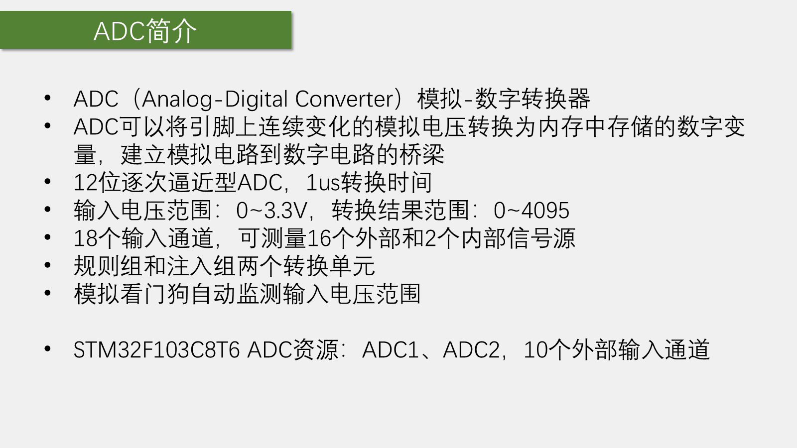

### 1.2 分辨率、转换时间与电压换算

位数决定量化精细程度。12 位 ADC 有 $2^{12}=4096$ 个量化等级，输出码为 `0~4095`。课堂中按满量程近似换算：

$$
V_{in}\approx\frac{D}{4095}\times 3.3\text{ V}
$$

从理想量化区间的角度，也可用 $D/4096$ 表示每个码对应的步长，因此满量程码对应的电压会比参考电压略小一个最低有效位。两种写法只差约一个 LSB；本课程显示电压时使用 `4095`，按 `4095 -> 3.3 V` 处理。

转换时间表示从启动转换到产生数字结果所需的时间。只有在采集高频信号或要求高采样率时，才需要重点检查 ADC 的最高转换速率是否足够。

### 1.3 外部与内部通道

16 个外部通道直接连接 GPIO 模拟输入；两个内部通道分别是：

- **内部温度传感器**：可用于测量芯片内部温度；
- **内部参考电压 `VREFINT`**：约为 $1.2\text{ V}$，相对稳定，可在供电并非精确 $3.3\text{ V}$ 时用于校正实际参考电压。

使用内部温度传感器或 `VREFINT` 前，需要调用 `ADC_TempSensorVrefintCmd()` 开启内部通道。

### 1.4 规则组、注入组与模拟看门狗

普通 ADC 每次选择一个通道并转换一次。STM32 可以预先排列多个通道，按序自动转换：

- **规则组**用于常规采样，最多 16 个序列位置，但只有一个 `ADC_DR` 数据寄存器。后一次结果会覆盖前一次结果，多通道扫描时通常要用 DMA 及时搬运数据。
- **注入组**用于需要优先处理的转换，最多 4 个通道，并有 4 个独立数据寄存器，结果不会互相覆盖。

模拟看门狗内部设置高、低阈值并指定监测通道。当结果高于上阈值或低于下阈值时，可产生 `AWD` 标志并申请中断，从而免去 CPU 持续轮询比较。

## 2. 逐次逼近型 ADC 的工作原理

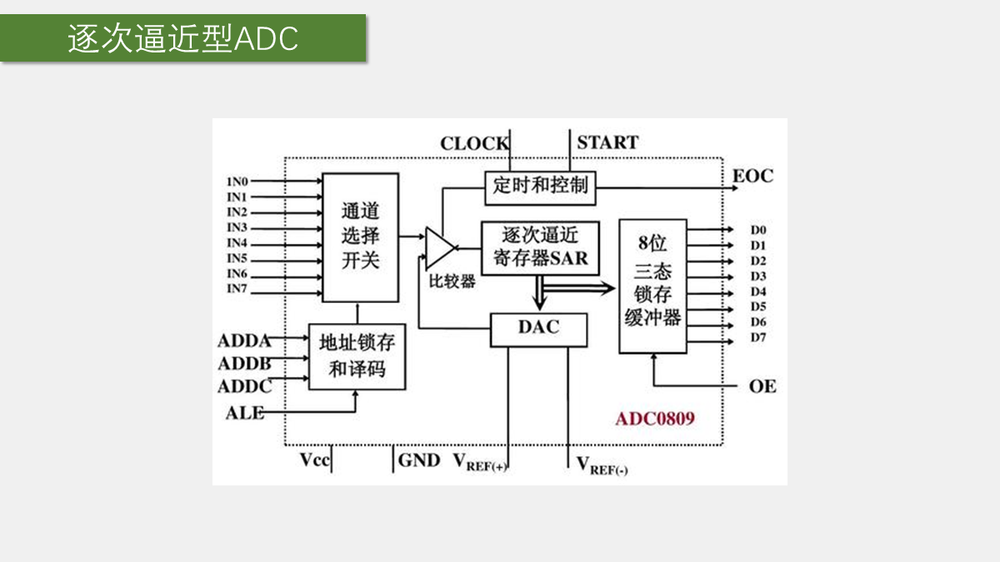

课堂以经典的 ADC0809 为例说明逐次逼近过程：

1. 多路模拟开关根据通道地址选中一路输入。
2. 比较器比较外部未知电压与内部 DAC 输出的已知电压。
3. 逐次逼近寄存器从最高位到最低位依次试探每一位是 `1` 还是 `0`。
4. 若 DAC 电压偏高，就降低试探码；若偏低，就提高试探码，直到两者近似相等。
5. 最终试探码就是输入电压的数字编码，转换完成后产生 `EOC` 信号。

这一过程类似二分查找。8 位 ADC 需要依次判断 8 位，12 位 ADC 需要判断 12 位。`START` 用于启动转换，`CLOCK` 推动逐步比较，`VREF+` 与 `VREF-` 决定 DAC 满量程，也就决定 ADC 的输入范围。

## 3. STM32 ADC 框图

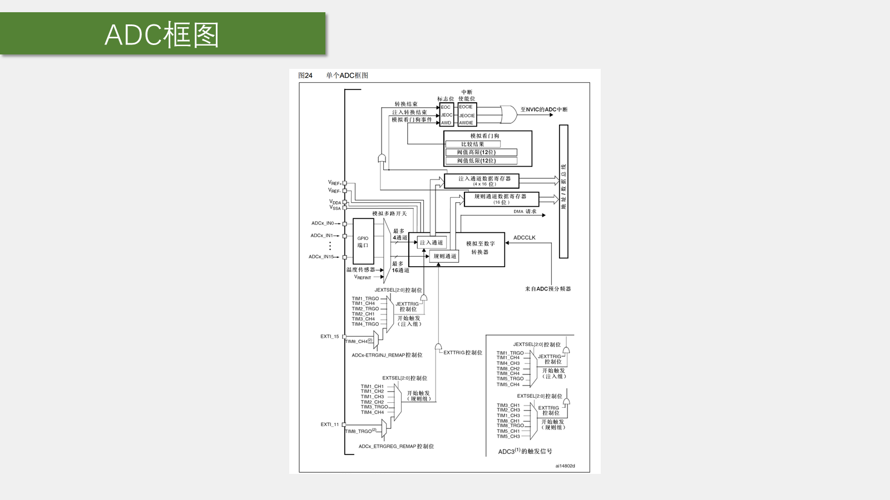

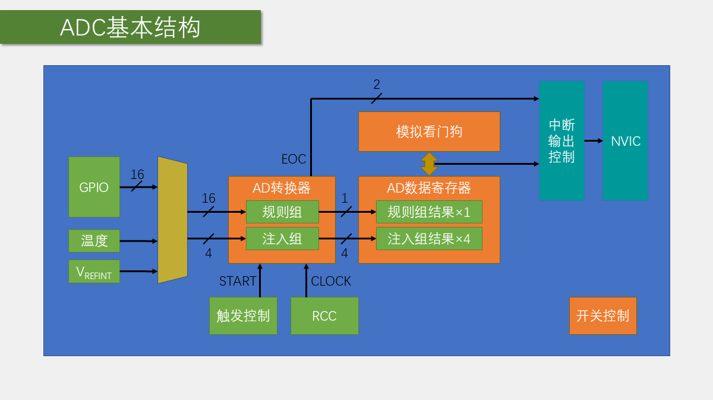

按信号流向阅读框图：

1. 左侧 16 个 GPIO 通道和 2 个内部通道进入模拟多路开关。
2. 通道被编入规则组或注入组序列。
3. 软件或硬件触发信号启动转换。
4. `ADCCLK` 驱动逐次比较过程。
5. 转换结果进入规则组或注入组数据寄存器。
6. 转换完成、模拟看门狗越界等状态可形成标志位，并可进一步连接到 NVIC。

### 3.1 软件触发与硬件触发

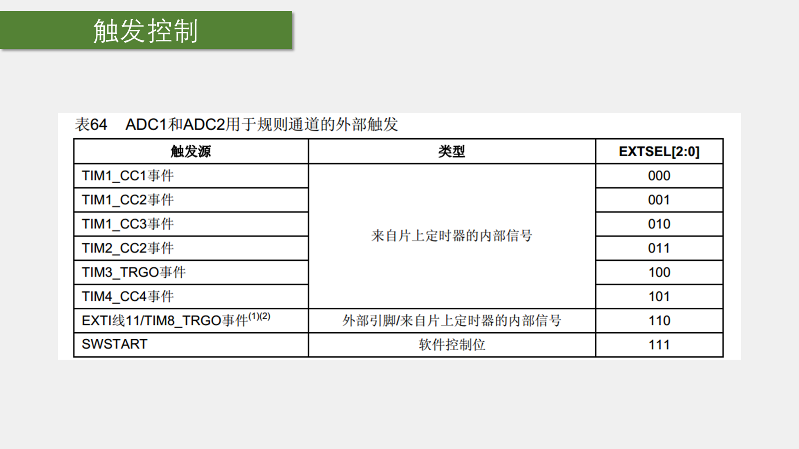

- **软件触发**：程序调用函数置位启动位，适合本章的按需读取。
- **硬件触发**：由定时器通道、`TRGO` 或外部事件触发，适合固定周期采样。

例如要每 $1\text{ ms}$ 采样一次，可以让 TIM3 每 $1\text{ ms}$ 产生一次更新事件并通过 `TRGO` 直接触发 ADC。整个链路由硬件完成，无须每毫秒进入中断，采样周期也不会受中断响应延迟影响。

### 3.2 参考电压与模拟电源

`VREF+`、`VREF-` 决定 ADC 的参考范围，`VDDA`、`VSSA` 为模拟部分供电。在 STM32F103C8T6 上，参考端已在芯片内部与模拟电源相连；课程核心板上 `VDDA=3.3V`、`VSSA=GND`，因此输入范围为 $0\sim3.3\text{ V}$。

### 3.3 ADC 时钟

`ADCCLK` 来自 APB2 时钟经 RCC 预分频。系统配置中 `PCLK2=72MHz`，ADC 时钟上限为 `14MHz`，可选的 `/2`、`/4`、`/6`、`/8` 分频结果如下：

| 分频 | ADCCLK | 是否满足上限 |
| --- | ---: | --- |
| `/2` | 36 MHz | 否 |
| `/4` | 18 MHz | 否 |
| `/6` | 12 MHz | 是 |
| `/8` | 9 MHz | 是 |

本章选择 `/6`，即 `ADCCLK=12MHz`。

### 3.4 状态与中断

- `EOC`：转换结束标志。依据 STM32F1 寄存器说明，规则组或注入组转换结束都可能置位它；读取 `ADC_DR` 时会自动清除。
- `JEOC`：注入组转换结束标志。
- `AWD`：模拟看门狗越界标志。

这些标志既可以由程序轮询，也可以在开放对应中断后通向 NVIC。

## 4. 输入通道

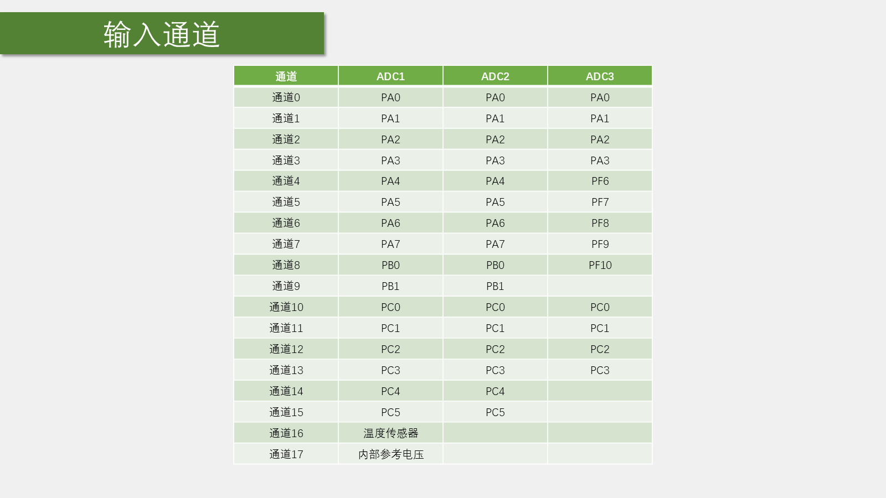

STM32F103C8T6 可用的 10 个外部 ADC 通道为：

| 通道 | 引脚 | 通道 | 引脚 |
| --- | --- | --- | --- |
| `ADC_Channel_0` | PA0 | `ADC_Channel_5` | PA5 |
| `ADC_Channel_1` | PA1 | `ADC_Channel_6` | PA6 |
| `ADC_Channel_2` | PA2 | `ADC_Channel_7` | PA7 |
| `ADC_Channel_3` | PA3 | `ADC_Channel_8` | PB0 |
| `ADC_Channel_4` | PA4 | `ADC_Channel_9` | PB1 |

`ADC1` 和 `ADC2` 的外部通道引脚相同。两个 ADC 可以独立采集不同信号，也可以组成双 ADC 模式，例如交叉采样同一通道以提高采样率。本章只使用 `ADC1` 独立模式。

系列完整通道表还包含 `ADC_Channel_16` 内部温度传感器和 `ADC_Channel_17` 内部参考电压，这两个内部通道仅属于 `ADC1`。

## 5. 规则组的四种转换模式

转换模式由“单次/连续”和“非扫描/扫描”两个开关组合而成。

### 5.1 单次转换，非扫描模式

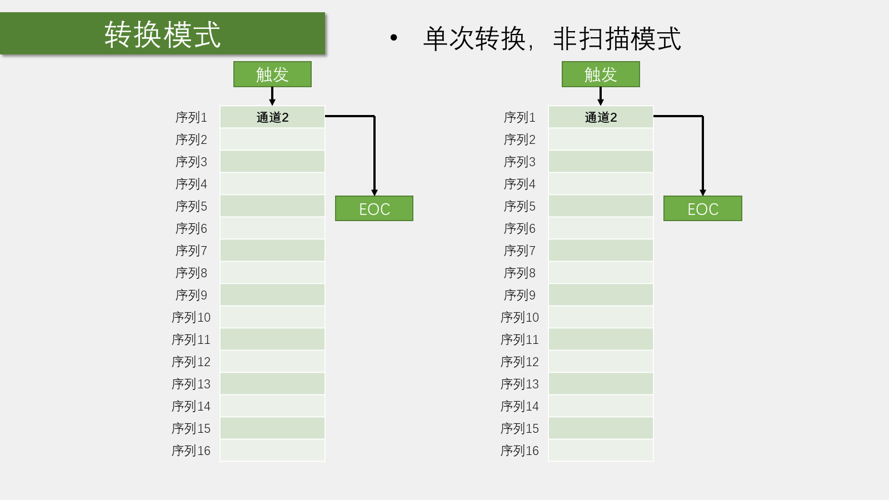

规则序列只有第 1 个位置有效。每次触发只转换该通道一次，完成后置位 `EOC` 并停止。再次转换需要重新触发；若想换通道，就在触发前改写序列 1。

### 5.2 连续转换，非扫描模式

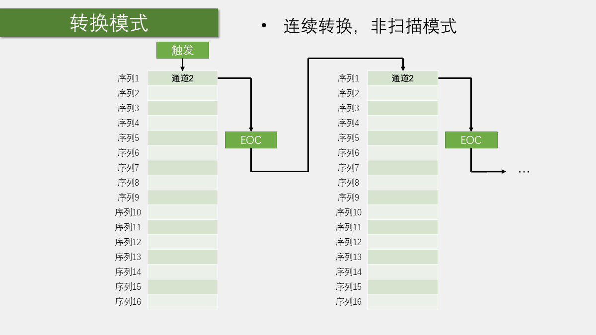

仍只使用序列 1，但一次触发后会连续重复转换。程序读取 `ADC_DR` 时得到最近一次结果，不再需要每次手动启动。

### 5.3 单次转换，扫描模式

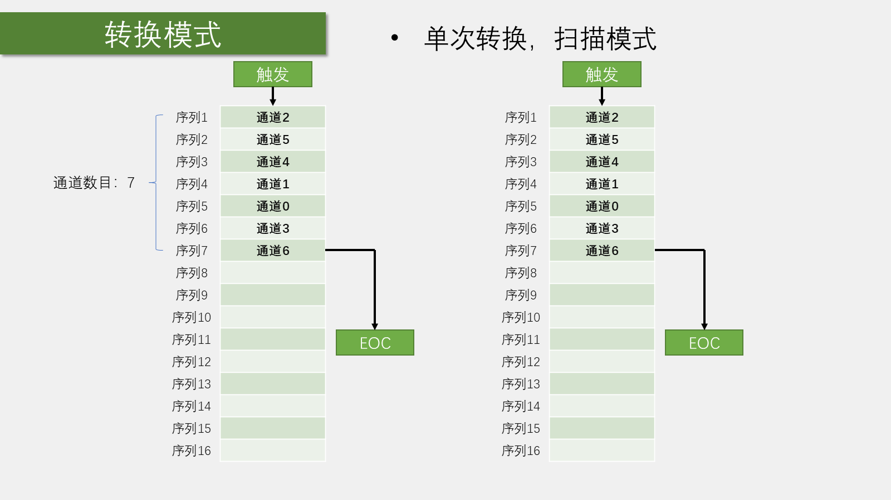

序列表可填写多个通道，并通过 `ADC_NbrOfChannel` 指定有效序列长度。每次触发后按顺序扫描一轮，整组完成后停止。由于规则组只有一个数据寄存器，通常要用 DMA 保存各通道结果。

### 5.4 连续转换，扫描模式

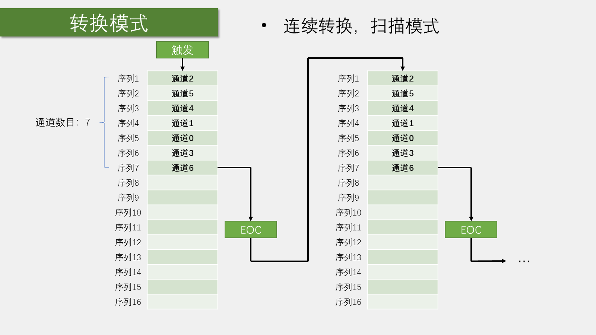

一次触发后不断循环扫描整个序列，同样通常配合 DMA。扫描模式还可使用间断模式，让序列每转换若干通道后暂停，等待下一次触发；本章暂不使用。

## 6. 数据对齐、转换时间与校准

### 6.1 数据对齐

12 位结果存入 16 位数据寄存器时有两种方式：

- **右对齐**：高 4 位补 `0`，直接读取就是 `0~4095`，本章使用这种方式。
- **左对齐**：结果整体左移 4 位；若只读取高 8 位，相当于舍弃低 4 位精度，把 12 位结果简化为 8 位结果。

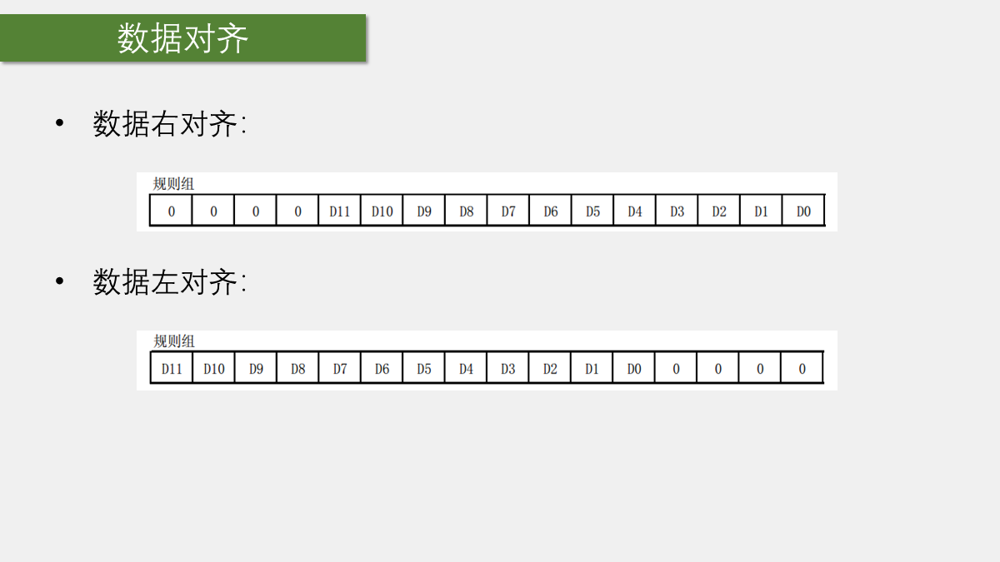

### 6.2 采样保持与转换时间

AD 转换可分为“采样保持”和“量化编码”两部分。量化编码需要一段时间，如果这期间输入电压仍在变化，就无法准确比较。因此 ADC 先闭合采样开关，让内部采样电容获得输入电压；随后断开开关并保持该电压，再进行逐次比较。

STM32 ADC 的总转换时间为：

$$
T_{conv}=T_{sample}+12.5T_{ADC}
$$

当 `ADCCLK=14MHz`、采样时间为 1.5 个 ADC 周期时：

$$
T_{conv}=\frac{1.5+12.5}{14\text{ MHz}}=1\ \mu\text{s}
$$

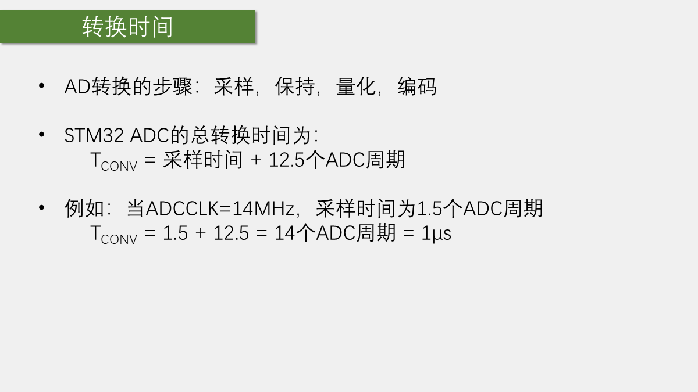

采样时间越长，采样电容越容易充到稳定电压，对毛刺和较高源阻抗也更宽容，但转换速度会降低。不能通过把 `ADCCLK` 提高到额定上限之外来追求速度，否则转换稳定性无法保证。

本章使用 55.5 周期采样时间和 `12MHz` ADC 时钟，因此一次转换约为：

$$
T_{conv}=\frac{55.5+12.5}{12\text{ MHz}}\approx5.67\ \mu\text{s}
$$

### 6.3 校准

ADC 内置自校准功能，可减小内部电容器组变化引起的精度误差。课程按照固定流程，在 ADC 上电后执行一次：

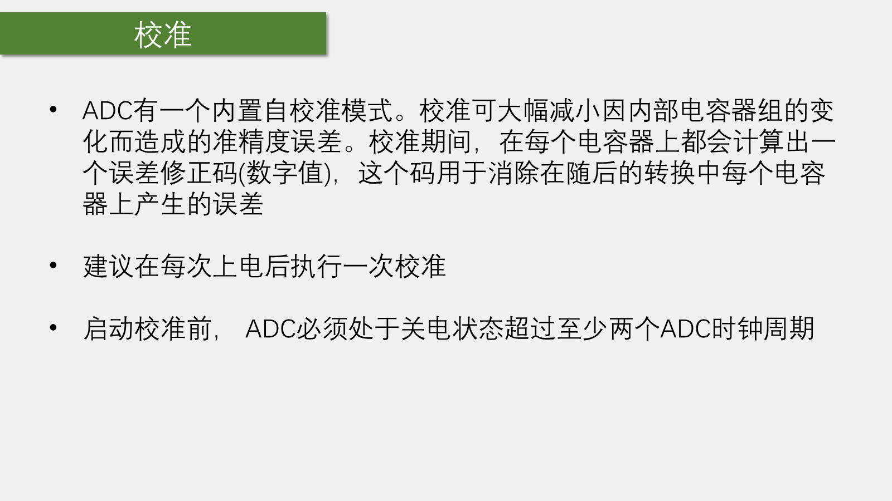

1. 复位校准寄存器；
2. 等待复位校准完成；
3. 启动校准；
4. 等待校准完成。

## 7. 硬件电路

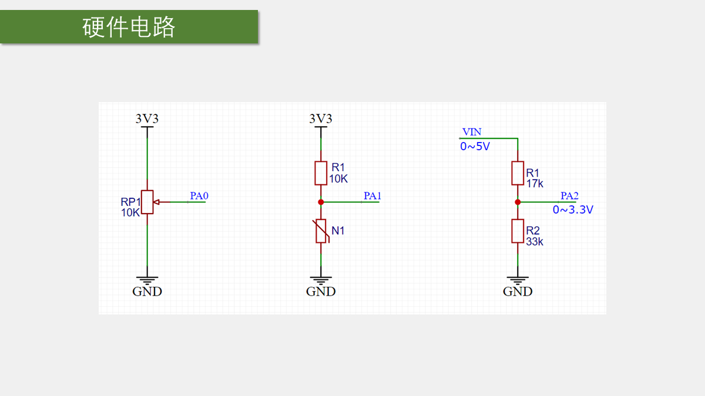

### 7.1 电位器产生可调电压

电位器两个固定端分别接 `3.3V` 和 `GND`，滑动端输出 $0\sim3.3\text{ V}$。电位器整体跨接在电源两端，阻值不能过小，课程使用 `10kΩ`，一般至少应为千欧级。

### 7.2 电阻型传感器分压

光敏电阻、热敏电阻、红外接收管等可近似看作可变电阻。将它与固定电阻串联分压，便可把阻值变化转换成 ADC 能读取的电压变化。固定电阻通常选在传感器典型阻值附近，以获得较好的中间量程；交换上下两只电阻的位置会反转输出变化方向。

使用课程传感器模块时，应接 `AO` 模拟输出；比较器产生的 `DO` 是数字输出，不用于本章的模拟量采集。

### 7.3 测量高于 3.3 V 的电压

例如用 $17\text{k}\Omega$ 与 $33\text{k}\Omega$ 分压测量 $0\sim5\text{ V}$：

$$
V_{ADC}=V_{in}\times\frac{33}{17+33}=0.66V_{in}
$$

输入 $5\text{ V}$ 时，ADC 端为 $3.3\text{ V}$。更高电压不宜只用简单电阻分压，应使用专用采集、隔离放大等电路，保证高低压侧安全隔离。

## 8. 实验一：AD 单通道

### 8.1 接线与配置思路

电位器滑动端接 `PA0`，对应 `ADC_Channel_0`。初始化链路为：

1. 开启 `ADC1` 和 `GPIOA` 时钟，配置 ADC 预分频；
2. 将 `PA0` 配置为模拟输入，断开 GPIO 数字输入输出电路对模拟信号的影响；
3. 把通道 0 写入规则组序列 1，并设置采样时间；
4. 配置独立模式、单次转换、非扫描、软件触发和右对齐；
5. 使能 ADC 并执行校准；
6. 每次读取时执行“软件触发 → 等待 `EOC` → 读取 `ADC_DR`”。

### 8.2 初始化代码

```c
#include "stm32f10x.h"

void AD_Init(void)
{
    RCC_APB2PeriphClockCmd(RCC_APB2Periph_ADC1, ENABLE);
    RCC_APB2PeriphClockCmd(RCC_APB2Periph_GPIOA, ENABLE);
    RCC_ADCCLKConfig(RCC_PCLK2_Div6);

    GPIO_InitTypeDef GPIO_InitStructure;
    GPIO_InitStructure.GPIO_Mode = GPIO_Mode_AIN;
    GPIO_InitStructure.GPIO_Pin = GPIO_Pin_0;
    GPIO_InitStructure.GPIO_Speed = GPIO_Speed_50MHz;
    GPIO_Init(GPIOA, &GPIO_InitStructure);

    ADC_RegularChannelConfig(
        ADC1,
        ADC_Channel_0,
        1,
        ADC_SampleTime_55Cycles5
    );

    ADC_InitTypeDef ADC_InitStructure;
    ADC_InitStructure.ADC_Mode = ADC_Mode_Independent;
    ADC_InitStructure.ADC_DataAlign = ADC_DataAlign_Right;
    ADC_InitStructure.ADC_ExternalTrigConv = ADC_ExternalTrigConv_None;
    ADC_InitStructure.ADC_ContinuousConvMode = DISABLE;
    ADC_InitStructure.ADC_ScanConvMode = DISABLE;
    ADC_InitStructure.ADC_NbrOfChannel = 1;
    ADC_Init(ADC1, &ADC_InitStructure);

    ADC_Cmd(ADC1, ENABLE);

    ADC_ResetCalibration(ADC1);
    while (ADC_GetResetCalibrationStatus(ADC1) == SET) {}
    ADC_StartCalibration(ADC1);
    while (ADC_GetCalibrationStatus(ADC1) == SET) {}
}
```

`ADC_RegularChannelConfig()` 的参数依次为 ADC 外设、通道、规则组序列位置和采样时间。不同序列位置可以填写不同通道，各通道也可设置不同采样时间。

### 8.3 启动、等待与读取

```c
uint16_t AD_GetValue(void)
{
    ADC_SoftwareStartConvCmd(ADC1, ENABLE);

    while (ADC_GetFlagStatus(ADC1, ADC_FLAG_EOC) == RESET) {}

    return ADC_GetConversionValue(ADC1);
}
```

不要用 `ADC_GetSoftwareStartConvStatus()` 判断转换是否结束。它读取的是 `SWSTART` 启动位，而该位在转换开始后会很快被硬件清零，与转换是否完成没有对应关系。正确做法是轮询 `ADC_FLAG_EOC`。

`ADC_GetConversionValue()` 读取 `ADC_DR`，读取动作会自动清除 `EOC`，因此这里无须再手动清标志位。

### 8.4 显示原始值和电压

```c
uint16_t ADValue;
float Voltage;

ADValue = AD_GetValue();
Voltage = (float)ADValue / 4095 * 3.3;
```

必须先把 `ADValue` 转成浮点数，否则整数除法会直接舍弃小数部分。课堂 OLED 驱动没有浮点显示函数，因此将整数部分和小数部分分开显示：

```c
OLED_ShowNum(2, 9, Voltage, 1);
OLED_ShowNum(2, 11, (uint16_t)(Voltage * 100) % 100, 2);
```

若只进行阈值判断或记录数据，可以直接使用原始 AD 值，不必换算为电压。

### 8.5 波动、滞回与滤波

AD 值末位轻微波动是正常现象。若直接用单一阈值控制开关，结果在阈值附近抖动时，输出也会频繁翻转。可设置两个阈值形成滞回：低于下阈值执行一种状态，高于上阈值再切换回另一状态。

若希望显示更平滑，还可采用均值滤波，例如连续读取 10 或 20 次后取平均值；也可以舍弃低位、降低有效分辨率，以减小末位跳动。

### 8.6 改为连续转换

把 `ADC_ContinuousConvMode` 改为 `ENABLE`，并在初始化结束后只触发一次：

```c
ADC_SoftwareStartConvCmd(ADC1, ENABLE);
```

此后 ADC 会不断转换并刷新 `ADC_DR`，`AD_GetValue()` 可直接返回 `ADC_GetConversionValue(ADC1)`。课堂演示现象与单次转换相同，区别在于程序不必每次重新触发和等待。

## 9. 实验二：AD 多通道

### 9.1 接线与实验现象

| 信号源 | ADC 引脚 | ADC 通道 |
| --- | --- | --- |
| 电位器 | PA0 | 通道 0 |
| 光敏传感器 `AO` | PA1 | 通道 1 |
| 热敏传感器 `AO` | PA2 | 通道 2 |
| 反射式红外传感器 `AO` | PA3 | 通道 3 |

课堂中的变化关系为：电位器旋转时 `AD0` 变化；遮挡光敏电阻时 `AD1` 增大；手握热敏电阻时 `AD2` 减小；手靠近反射式红外传感器时 `AD3` 减小。这些方向由模块内部的分压接法决定，不是 ADC 固有规律。

### 9.2 为什么本节不用扫描模式

扫描模式看似最适合多通道，但规则组只有一个 `ADC_DR`。STM32F1 在扫描过程中不会为每个单独通道都提供可供软件可靠搬运的完成时机，整组完成时前面的结果已经被后续结果覆盖；而单通道转换只需几微秒，CPU 手动搬运也很难保证及时。

间断模式可以让扫描过程暂停，但仍需靠足够长的延时猜测单通道是否完成，既不省事也不高效。因此课堂暂不使用扫描模式，等下一章学习 DMA 后再采用“扫描模式 + DMA”。

本章继续使用单次转换、非扫描模式：每次转换前动态改写规则组序列 1，然后触发、等待并读取。

### 9.3 动态选择通道

将 `PA0~PA3` 全部配置为模拟输入：

```c
GPIO_InitStructure.GPIO_Pin =
    GPIO_Pin_0 | GPIO_Pin_1 | GPIO_Pin_2 | GPIO_Pin_3;
```

把通道参数传入读取函数，并将通道配置移动到触发之前：

```c
uint16_t AD_GetValue(uint8_t ADC_Channel)
{
    ADC_RegularChannelConfig(
        ADC1,
        ADC_Channel,
        1,
        ADC_SampleTime_55Cycles5
    );

    ADC_SoftwareStartConvCmd(ADC1, ENABLE);
    while (ADC_GetFlagStatus(ADC1, ADC_FLAG_EOC) == RESET) {}

    return ADC_GetConversionValue(ADC1);
}
```

主循环依次读取四个通道：

```c
AD0 = AD_GetValue(ADC_Channel_0);
AD1 = AD_GetValue(ADC_Channel_1);
AD2 = AD_GetValue(ADC_Channel_2);
AD3 = AD_GetValue(ADC_Channel_3);
```

每次调用都完整执行“选择通道 → 启动转换 → 等待完成 → 读取结果”，因此四个结果不会互相覆盖。这是本章用非扫描模式实现低速多通道轮询的核心方法。

## 10. 验收与排错

| 现象 | 优先检查 |
| --- | --- |
| 结果始终为 `0` | `PA0~PA3` 接线、GPIO 模拟输入、ADC1 时钟、通道编号 |
| 结果始终接近 `4095` | 输入是否悬空或误接 `3.3V`，传感器是否共地 |
| 数值与电压不符 | 参考电压、`4095` 换算、是否发生整数除法 |
| 多通道数据对应错误 | 通道参数与物理引脚是否一致，调用顺序是否对应显示位置 |
| 程序卡在等待转换 | ADC 是否使能、软件触发配置、是否轮询 `ADC_FLAG_EOC` |
| 数值末位跳动 | 电源与接地、输入阻抗、采样时间；必要时使用滞回或均值滤波 |

排错时按“输入电压 -> GPIO 模式 -> ADC 时钟与通道 -> 触发 -> `EOC` -> `ADC_DR`”逐段确认，不要先用滤波掩盖接线或配置错误。

## 本章小结

本章按照 ADC 的完整信号链完成了两项实验：模拟电压从 GPIO 通道进入，经规则组选择、软件触发和逐次逼近转换后写入 `ADC_DR`，程序轮询 `EOC` 读取结果，再显示原始值或换算电压。

- 单通道使用单次转换、非扫描模式，流程最直观；
- 连续转换模式只需触发一次，数据寄存器持续刷新；
- 低速多通道可在每次转换前动态改写序列 1；
- 扫描模式的多结果保存应交给 DMA，下一章继续学习。
