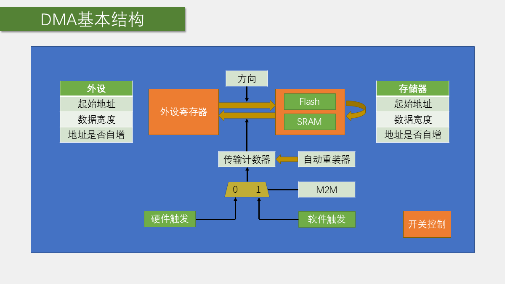
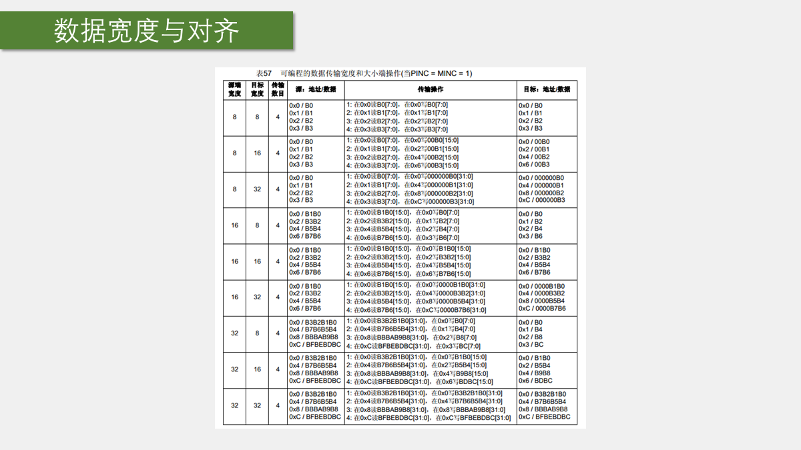
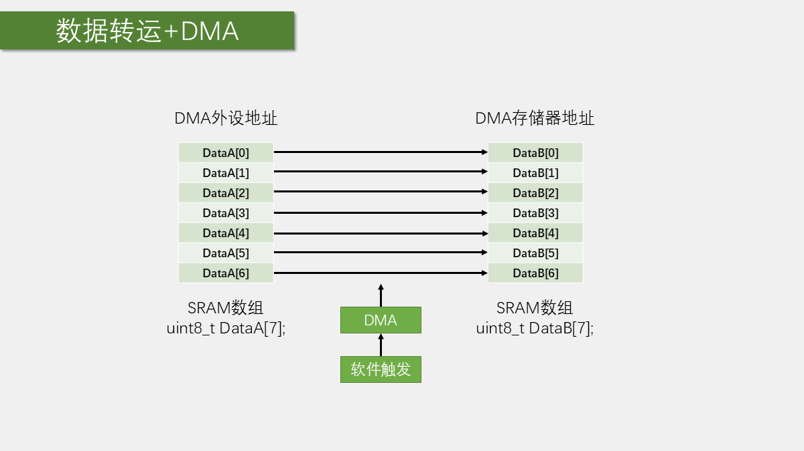
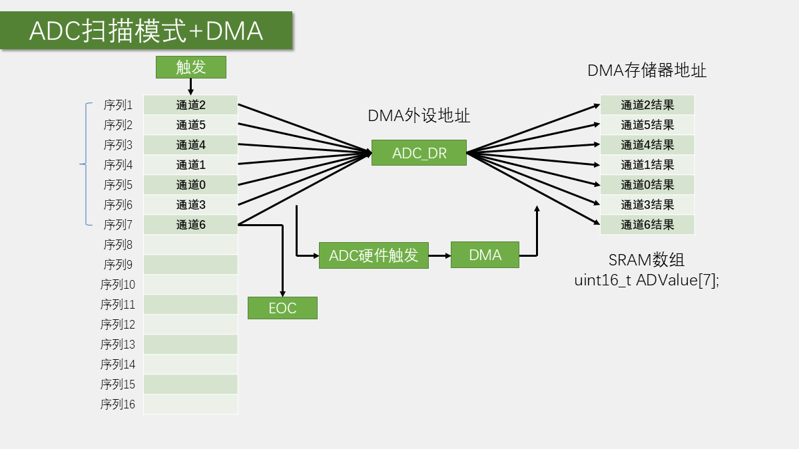

# 第 8 章 DMA 数据搬运

## 学习目标与前置知识

学完本章后，你应能：

- 用“源地址、目的地址、数据宽度、地址自增、传输次数、触发方式”推导 DMA 配置；
- 区分存储器到存储器复制、外设到存储器采集和存储器到外设发送；
- 使用 STM32F10x 标准外设库完成一次性 DMA 复制；
- 使用 ADC 扫描模式和 DMA 循环模式连续保存多路采样结果；
- 根据“无数据、数据覆盖、结果错位、重复启动失败”等现象定位问题。

默认平台为课程使用的 `STM32F103C8T6`，标准外设库为 `STM32F10x_StdPeriph_Lib_V3.5.0`，系统时钟为 `72MHz`。开始前应已掌握 GPIO、OLED、ADC 单通道和 ADC 多通道配置，尤其要理解：**ADC 规则组可以连续转换多个通道，但只有一个规则组数据寄存器 `ADC1->DR`。**

## 本章闭环

DMA（Direct Memory Access，直接存储器访问）按照预先配置的规则，在两个地址之间自动搬运数据。CPU 只负责初始化、启动或处理完成事件，不必逐个执行读写指令。

本章使用课程资料中的两个工程：

| 工程 | 数据路径 | 触发方式 | 运行结果 |
| --- | --- | --- | --- |
| `8-1 DMA数据转运` | `DataA[] -> DMA1_Channel1 -> DataB[]` | 软件触发 | 启动后，`DataB[]` 复制出 `DataA[]` 的内容 |
| `8-2 DMA+AD多通道` | `ADC1->DR -> DMA1_Channel1 -> AD_Value[]` | ADC 硬件请求 | ADC 连续扫描 `PA0~PA3`，数组持续刷新四路结果 |

DMA 的所有配置都可以还原成六个问题：

1. 从哪里读？
2. 写到哪里？
3. 一次搬运多少位？
4. 搬运后地址是否移动？
5. 一共搬运多少次？
6. 由软件启动，还是等待外设请求？

后文每个配置项都围绕这六个问题展开。

## 1. DMA 解决什么问题

### 1.1 CPU 搬运与 DMA 搬运

不用 DMA 时，CPU 通常需要反复执行“读取数据、判断状态、写入数据”的循环。例如 ADC 连续采样时，CPU 必须及时读取 `ADC1->DR`，再把结果写入数组。如果转换速度较快，CPU 会被大量重复的数据搬运工作占用。

使用 DMA 后，数据通路变为：

```text
数据源 -> DMA -> 数据目的地
             ^
             |
       软件启动或外设请求
```

DMA 不是处理算法，它只负责按规则复制数据。滤波、换算、协议解析仍由 CPU 或其他处理单元完成。

常见数据路径包括：

- 外设寄存器 -> SRAM：ADC 采样、串口接收、SPI 接收；
- SRAM -> 外设寄存器：串口发送、SPI 发送；
- Flash/SRAM -> SRAM：数组复制、查找表搬运。

### 1.2 软件触发与硬件触发

- **软件触发**：适合一次性存储器复制。调用启动函数后，DMA 连续搬运，直到传输计数器归零。
- **硬件触发**：适合外设数据。外设每准备好一个数据，就发出一次 DMA 请求，DMA 响应一次并搬运一个数据单元。

硬件请求不是任意连接的。STM32F103C8T6 的 `ADC1` DMA 请求连接到 `DMA1_Channel1`，因此 ADC1 不能随意改用 DMA1 的其他通道。使用其他外设时，应先查参考手册中的 DMA 请求映射表。

## 2. STM32F103 的 DMA 结构

STM32F103C8T6 具有 `DMA1`，包含 7 个通道。部分容量或封装型号还具有 `DMA2`，但本章两个工程只使用 `DMA1_Channel1`。



阅读图时抓住三条数据关系：

1. 左侧“外设站点”和右侧“存储器站点”各自保存一个起始地址、数据宽度和地址自增设置；
2. 传输计数器决定还要搬运多少个数据单元；
3. `M2M` 和硬件触发共同决定传输由谁启动。

图中的“外设站点”是 DMA 结构体中的命名，不表示该地址一定属于外设。`8-1 DMA数据转运` 把 SRAM 中的 `DataA` 填入外设站点，只是为了配合 `DMA_DIR_PeripheralSRC` 表示“外设站点是源”；它仍然是一个 SRAM 地址。

### 2.1 DMA 通道与仲裁

每个 DMA 通道有独立的配置寄存器和传输计数器，可以连接规定的硬件请求。多个通道同时请求总线时，由 DMA 控制器按优先级仲裁：

```text
CPU / DMA 通道
      |
   总线仲裁
      |
Flash、SRAM、外设寄存器
```

优先级有 `VeryHigh`、`High`、`Medium` 和 `Low` 四级。只有多个通道同时活动时，优先级才会明显影响等待顺序；它不会改变单个通道的数据内容。

### 2.2 地址空间与可访问性

DMA 读写的是地址。对本章实验最重要的区域是：

| 区域 | 常见地址前缀 | 典型内容 | DMA 使用提示 |
| --- | --- | --- | --- |
| 主 Flash | `0x0800...` | 程序代码、只读常量 | 通常可读，不能像 SRAM 一样直接写入 |
| SRAM | `0x2000...` | 普通变量、数组、堆栈 | 可读写，是 DMA 目标数组的主要位置 |
| 外设寄存器 | `0x4000...` | GPIO、ADC、USART 等寄存器 | 读写属性必须以参考手册为准 |

普通全局数组通常位于 SRAM；`const` 数组通常位于 Flash。课程工程中可以把数组地址显示到 OLED 上观察其地址前缀，但具体地址由链接脚本、编译器和工程配置决定，不能只凭前缀推断所有存储属性。

外设寄存器也是映射到地址空间的存储单元。例如：

```c
ADC1->DR
```

表示访问 ADC1 数据寄存器。课程芯片中 ADC1 基地址为 `0x40012400`，`DR` 偏移为 `0x4C`，因此：

$$
\text{ADC1->DR 地址}=0x40012400+0x4C=0x4001244C
$$

实际工程应优先使用 `&ADC1->DR` 和库定义，不要手写物理地址。

## 3. DMA 的六个核心参数

### 3.1 两个站点：地址、宽度和自增

STM32 标准库用“外设站点”和“存储器站点”描述 DMA 两端。每一端都要配置：

1. 起始地址；
2. 数据宽度；
3. 地址是否自增。



数据宽度决定一次传输的数据单元，可以是：

- `Byte`：8 位；
- `HalfWord`：16 位；
- `Word`：32 位。

地址自增决定下一次传输访问哪个地址：

- **使能自增**：传输完成后移动到下一个数据单元，适合数组；
- **关闭自增**：每次都访问同一个地址，适合 `ADC1->DR`、USART 数据寄存器等固定寄存器。

典型选择如下：

| 场景 | 源地址 | 目的地址 | 源自增 | 目的自增 | 宽度 |
| --- | --- | --- | --- | --- | --- |
| `uint8_t` 数组复制 | 移动 | 移动 | 开 | 开 | Byte |
| ADC 扫描采集 | 固定 `ADC1->DR` | 移动数组 | 关 | 开 | HalfWord |
| USART 连续发送 | 移动数组 | 固定 `USARTx->DR` | 开 | 关 | 通常 Byte |

两端宽度最好保持一致。若宽度不一致，DMA 会按硬件规则扩展或截断数据，初学阶段容易得到难以解释的结果。

### 3.2 方向与传输次数

`DMA_DIR_PeripheralSRC` 表示“外设站点是源”，数据从外设站点流向存储器站点。这里的“外设站点”可以实际填 SRAM 地址。

传输计数器记录的是**数据单元的个数**，不是总字节数：

- Byte 宽度、数组长度为 4：传输次数为 4，总计 4 字节；
- HalfWord 宽度、四路 ADC：传输次数为 4，总计 8 字节。

当计数器减到 0 时：

- `DMA_Mode_Normal`：本轮停止；
- `DMA_Mode_Circular`：自动恢复初始计数，进入下一轮。

循环模式只重装计数器和地址，不会为数组生成额外的“新副本”。DMA 继续写入同一块缓冲区，因此 CPU 读取数组时必须考虑数据可能正在更新。

### 3.3 `M2M`、通道使能与外设请求

`DMA_M2M` 的含义是存储器到存储器：

- `DMA_M2M_Enable`：使用软件触发，适合 `DataA -> DataB`；
- `DMA_M2M_Disable`：等待外设硬件请求，适合 `ADC1->DR -> AD_Value[]`。

启动一次 DMA 传输还必须满足：

1. DMA 时钟已开启；
2. 通道配置有效；
3. 传输计数器大于 0；
4. 通道已使能；
5. 使用硬件触发时，外设的 DMA 请求输出已开启。

以 ADC 为例，`DMA_Cmd(DMA1_Channel1, ENABLE)` 只打开 DMA 通道，`ADC_DMACmd(ADC1, ENABLE)` 才打开 ADC1 发往 DMA 的请求输出；两者缺一不可。

## 4. 从任务反推配置

### 4.1 SRAM 数组复制

任务：把 `DataA[0]` 到 `DataA[3]` 复制到 `DataB[0]` 到 `DataB[3]`。



先写出数据关系：

```text
DataA[0] -> DataB[0]
DataA[1] -> DataB[1]
DataA[2] -> DataB[2]
DataA[3] -> DataB[3]
```

因此参数为：

| 参数 | 配置 | 推导理由 |
| --- | --- | --- |
| 外设站点地址 | `DataA` | 把源数组放在外设站点 |
| 存储器站点地址 | `DataB` | 目的数组位于 SRAM |
| 外设站点宽度 | Byte | 元素类型是 `uint8_t` |
| 存储器站点宽度 | Byte | 两端宽度一致 |
| 两端地址自增 | Enable | 每次移动到下一个数组元素 |
| 方向 | `DMA_DIR_PeripheralSRC` | 外设站点是源 |
| 传输次数 | `4` | 四个 Byte 数据单元 |
| 模式 | `DMA_Mode_Normal` | 只复制一轮 |
| 触发 | `DMA_M2M_Enable` | 软件启动 |

### 4.2 ADC 扫描结果保存

任务：ADC 依次转换四个规则组通道，把每次转换结果保存到 `AD_Value[0]` 到 `AD_Value[3]`。



ADC 规则组只有一个 `ADC1->DR`。第一个通道转换完成后，结果进入 `DR`；下一个通道转换完成时，`DR` 会被新结果覆盖。DMA 必须在每次转换完成请求到来时及时读取 `DR`，并把结果写入数组的下一个位置。

参数为：

| 参数 | 配置 | 推导理由 |
| --- | --- | --- |
| 外设站点地址 | `&ADC1->DR` | 所有转换结果都从同一个寄存器读 |
| 存储器站点地址 | `AD_Value` | 结果写入 SRAM 数组 |
| 外设地址自增 | Disable | 始终读取 `DR` |
| 存储器地址自增 | Enable | 依次写入数组元素 |
| 两端宽度 | HalfWord | ADC 数据寄存器按 16 位配置 |
| 传输次数 | `4` | 每轮有四个转换结果 |
| 方向 | `DMA_DIR_PeripheralSRC` | ADC 寄存器是源 |
| 模式 | Normal 或 Circular | 由单次还是连续采样决定 |
| 触发 | 硬件请求 | 等待 ADC 转换完成 |

四个数组元素的含义由 ADC 的规则组序列决定，而不是由 DMA 决定。例如：

```c
ADC_RegularChannelConfig(ADC1, ADC_Channel_0, 1, ADC_SampleTime_55Cycles5);
ADC_RegularChannelConfig(ADC1, ADC_Channel_1, 2, ADC_SampleTime_55Cycles5);
ADC_RegularChannelConfig(ADC1, ADC_Channel_2, 3, ADC_SampleTime_55Cycles5);
ADC_RegularChannelConfig(ADC1, ADC_Channel_3, 4, ADC_SampleTime_55Cycles5);
```

那么正常情况下：

```text
AD_Value[0] <-> 通道 0（PA0）
AD_Value[1] <-> 通道 1（PA1）
AD_Value[2] <-> 通道 2（PA2）
AD_Value[3] <-> 通道 3（PA3）
```

若调整了规则组顺序，数组含义也会随之改变。

## 5. 实验一：`8-1 DMA数据转运`

### 5.1 实验目标与准备

目标是观察：DMA 启动前 `DataB[]` 不变，DMA 完成后 `DataB[]` 与 `DataA[]` 对应位置相同。

准备：

- STM32F103C8T6 开发板；
- OLED；
- ST-Link；
- 课程资料中的工程 `STM32Project-有注释版\8-1 DMA数据转运`。

这个实验没有额外传感器。DMA 在芯片内部工作，OLED 只用来显示源数组、目的数组和地址。

### 5.2 初始化模块

课程工程的 `System\MyDMA.c` 将初始化和启动分成两个函数：

```c
#include "stm32f10x.h"

uint16_t MyDMA_Size;

void MyDMA_Init(uint32_t AddrA, uint32_t AddrB, uint16_t Size)
{
    MyDMA_Size = Size;

    RCC_AHBPeriphClockCmd(RCC_AHBPeriph_DMA1, ENABLE);

    DMA_InitTypeDef DMA_InitStructure;
    DMA_InitStructure.DMA_PeripheralBaseAddr = AddrA;
    DMA_InitStructure.DMA_PeripheralDataSize = DMA_PeripheralDataSize_Byte;
    DMA_InitStructure.DMA_PeripheralInc = DMA_PeripheralInc_Enable;
    DMA_InitStructure.DMA_MemoryBaseAddr = AddrB;
    DMA_InitStructure.DMA_MemoryDataSize = DMA_MemoryDataSize_Byte;
    DMA_InitStructure.DMA_MemoryInc = DMA_MemoryInc_Enable;
    DMA_InitStructure.DMA_DIR = DMA_DIR_PeripheralSRC;
    DMA_InitStructure.DMA_BufferSize = Size;
    DMA_InitStructure.DMA_Mode = DMA_Mode_Normal;
    DMA_InitStructure.DMA_M2M = DMA_M2M_Enable;
    DMA_InitStructure.DMA_Priority = DMA_Priority_Medium;

    DMA_Init(DMA1_Channel1, &DMA_InitStructure);
    DMA_Cmd(DMA1_Channel1, DISABLE);
}

void MyDMA_Transfer(void)
{
    DMA_Cmd(DMA1_Channel1, DISABLE);
    DMA_SetCurrDataCounter(DMA1_Channel1, MyDMA_Size);
    DMA_Cmd(DMA1_Channel1, ENABLE);

    while (DMA_GetFlagStatus(DMA1_FLAG_TC1) == RESET)
    {
    }

    DMA_ClearFlag(DMA1_FLAG_TC1);
}
```

初始化阶段先关闭通道，是为了避免配置尚未完成时就开始工作。正常模式传输完成后，通道也会停止；下一次启动必须遵循：

```text
关闭通道 -> 重装传输计数器 -> 重新使能通道 -> 等待完成
```

`DMA_SetCurrDataCounter()` 只能在通道关闭时调用。若工程还使用了 DMA 中断，应按相同边界清理和处理传输完成标志。

### 5.3 主函数和数据流

课程工程中的核心定义和调用如下：

```c
uint8_t DataA[] = {0x01, 0x02, 0x03, 0x04};
uint8_t DataB[] = {0, 0, 0, 0};

int main(void)
{
    OLED_Init();
    MyDMA_Init((uint32_t)DataA, (uint32_t)DataB, 4);

    while (1)
    {
        DataA[0]++;
        DataA[1]++;
        DataA[2]++;
        DataA[3]++;

        /* 此时先显示 DataA 和 DataB，观察转运前的差异 */
        Delay_ms(1000);

        MyDMA_Transfer();

        /* 再次显示 DataA 和 DataB，观察转运后的对应关系 */
        Delay_ms(1000);
    }
}
```

执行链为：

```text
DataA[]（SRAM）
 -> DMA1_Channel1 软件触发
 -> 每次搬运 1 Byte，源和目的地址都自增
 -> DataB[]（SRAM）
 -> OLED 显示结果
```

### 5.4 验收与变体

验收标准：

1. 下载并运行 `8-1 DMA数据转运`；
2. DMA 启动前，`DataB[]` 保持初始值；
3. DMA 完成后，`DataB[0]~DataB[3]` 与启动瞬间的 `DataA[0]~DataA[3]` 一致；
4. 下一轮 `DataA[]` 改变后，再次调用 `MyDMA_Transfer()`，`DataB[]` 能更新为新值。

可以把 `DataA` 改成 `const` 数组，观察其地址通常落在 `0x0800...` 的 Flash 区域，从而测试 Flash 到 SRAM 的读取复制。但此时不能再执行 `DataA[i]++`，因为 Flash 中的常量不能像 SRAM 变量一样修改。

## 6. 实验二：ADC 扫描 + DMA

### 6.1 实验目标与接线

目标是让 ADC1 连续扫描四个模拟输入，并让 OLED 持续显示四个结果。

准备：

- STM32F103C8T6 开发板；
- OLED；
- `PA0`、`PA1`、`PA2`、`PA3` 四路模拟输入。课程工程可接电位器或稳定的 `0~3.3V` 模拟电压；
- 课程资料中的工程 `STM32Project-有注释版\8-2 DMA+AD多通道`。

模拟输入不得超过芯片允许的模拟电源和参考范围。若使用电位器，应确认两端接 `3.3V` 和 `GND`，滑动端接 ADC 引脚，并与开发板共地。

### 6.2 ADC 规则组配置

工程 `Hardware\AD.c` 先配置规则组序列，再配置 ADC：

```c
ADC_RegularChannelConfig(ADC1, ADC_Channel_0, 1, ADC_SampleTime_55Cycles5);
ADC_RegularChannelConfig(ADC1, ADC_Channel_1, 2, ADC_SampleTime_55Cycles5);
ADC_RegularChannelConfig(ADC1, ADC_Channel_2, 3, ADC_SampleTime_55Cycles5);
ADC_RegularChannelConfig(ADC1, ADC_Channel_3, 4, ADC_SampleTime_55Cycles5);

ADC_InitStructure.ADC_Mode = ADC_Mode_Independent;
ADC_InitStructure.ADC_DataAlign = ADC_DataAlign_Right;
ADC_InitStructure.ADC_ExternalTrigConv = ADC_ExternalTrigConv_None;
ADC_InitStructure.ADC_ContinuousConvMode = ENABLE;
ADC_InitStructure.ADC_ScanConvMode = ENABLE;
ADC_InitStructure.ADC_NbrOfChannel = 4;
ADC_Init(ADC1, &ADC_InitStructure);
```

这里有两个容易混淆的开关：

- `ADC_ScanConvMode = ENABLE`：一次规则组中依次转换多个序列位置；
- `ADC_ContinuousConvMode = ENABLE`：一轮规则组完成后自动开始下一轮。

扫描模式决定“一轮里面转换谁”；连续模式决定“一轮结束后是否继续”。

### 6.3 DMA 配置

ADC1 的 DMA 请求固定连接到 `DMA1_Channel1`。课程工程中的关键配置如下：

```c
DMA_InitTypeDef DMA_InitStructure;

RCC_AHBPeriphClockCmd(RCC_AHBPeriph_DMA1, ENABLE);

DMA_InitStructure.DMA_PeripheralBaseAddr = (uint32_t)&ADC1->DR;
DMA_InitStructure.DMA_PeripheralDataSize = DMA_PeripheralDataSize_HalfWord;
DMA_InitStructure.DMA_PeripheralInc = DMA_PeripheralInc_Disable;
DMA_InitStructure.DMA_MemoryBaseAddr = (uint32_t)AD_Value;
DMA_InitStructure.DMA_MemoryDataSize = DMA_MemoryDataSize_HalfWord;
DMA_InitStructure.DMA_MemoryInc = DMA_MemoryInc_Enable;
DMA_InitStructure.DMA_DIR = DMA_DIR_PeripheralSRC;
DMA_InitStructure.DMA_BufferSize = 4;
DMA_InitStructure.DMA_Mode = DMA_Mode_Circular;
DMA_InitStructure.DMA_M2M = DMA_M2M_Disable;
DMA_InitStructure.DMA_Priority = DMA_Priority_Medium;

DMA_Init(DMA1_Channel1, &DMA_InitStructure);
DMA_Cmd(DMA1_Channel1, ENABLE);
ADC_DMACmd(ADC1, ENABLE);
```

配置与任务的对应关系是：

```text
ADC1->DR（固定地址、HalfWord）
 -> ADC 转换完成请求
 -> DMA1_Channel1
 -> AD_Value[0]、[1]、[2]、[3]（HalfWord，地址自增）
 -> 计数器归零后循环重装
```

DMA 必须在 ADC 开始产生请求前准备好。课程工程的完整顺序是：

1. 开启 ADC1、GPIOA 和 DMA1 时钟；
2. 设置 ADC 时钟为 `PCLK2 / 6 = 12MHz`；
3. 把 `PA0~PA3` 配成模拟输入；
4. 配置 ADC 规则组和连续扫描；
5. 配置并使能 DMA 通道；
6. 打开 `ADC_DMACmd(ADC1, ENABLE)`；
7. 使能 ADC；
8. 执行 ADC 校准；
9. 调用 `ADC_SoftwareStartConvCmd(ADC1, ENABLE)` 启动第一轮转换。

### 6.4 主循环与验收

结果数组由 `AD.c` 定义，在 `AD.h` 中声明：

```c
/* AD.c */
uint16_t AD_Value[4];

/* AD.h */
extern uint16_t AD_Value[4];
```

主循环只需读取数组并显示：

```c
OLED_ShowString(1, 1, "AD0:");
OLED_ShowString(2, 1, "AD1:");
OLED_ShowString(3, 1, "AD2:");
OLED_ShowString(4, 1, "AD3:");

while (1)
{
    OLED_ShowNum(1, 5, AD_Value[0], 4);
    OLED_ShowNum(2, 5, AD_Value[1], 4);
    OLED_ShowNum(3, 5, AD_Value[2], 4);
    OLED_ShowNum(4, 5, AD_Value[3], 4);
    Delay_ms(100);
}
```

验收标准：

1. 给 `PA0~PA3` 输入不同电压；
2. 下载运行 `8-2 DMA+AD多通道`；
3. OLED 的 `AD0~AD3` 都能显示 `0~4095` 范围内的结果；
4. 改变某一路输入时，对应数组位置随之变化；
5. 四路结果不会全部长期显示同一个通道的数据。

如果把 DMA 改成 `DMA_Mode_Normal`，它只会保存一轮四个结果。再次采样前需要停止通道、重装传输计数器并重新使能；连续采样则应保留 `Circular`，并考虑 CPU 读取数组时的数据一致性。

## 7. 常见误区与排错顺序

### 7.1 “外设站点”不等于“外设地址”

在 `8-1` 中，`DataA` 是 SRAM 数组，却被填写到 `DMA_PeripheralBaseAddr`。这里的“外设”指 DMA 的第一个地址站点，不是地址所属的物理模块。真正决定方向的是地址站点和 `DMA_DIR` 的组合。

### 7.2 地址自增配置反了

如果 ADC 外设地址开启自增，DMA 读完 `ADC1->DR` 后会去读相邻地址，结果自然错误。ADC 采集应当是：

```text
外设地址固定，存储器地址自增
```

相反，USART 发送数组时通常是：

```text
存储器地址自增，外设地址固定
```

### 7.3 把“传输次数”当成字节数

`DMA_BufferSize` 的单位由数据宽度决定。四路 ADC 使用 `HalfWord` 时，`DMA_BufferSize = 4` 表示四个半字，不是四个字节。

### 7.4 只打开 DMA 通道，没有打开外设请求

ADC 实验必须同时存在：

```c
DMA_Cmd(DMA1_Channel1, ENABLE);
ADC_DMACmd(ADC1, ENABLE);
```

前者使 DMA 通道能够工作，后者使 ADC 在转换完成时向 DMA 发请求。

### 7.5 DMA 正在更新时读取循环数组

循环 DMA 会不断覆盖同一数组。CPU 可能在读取 `AD_Value[0]` 到 `AD_Value[3]` 的过程中，DMA 恰好开始下一轮，导致一次显示中混有新旧数据。

入门实验中，`Delay_ms(100)` 通常足以观察稳定现象，但这不是严格的一致性保证。需要完整快照时，可使用：

- DMA 传输完成或半传输中断；
- 双缓冲或软件快照；
- 在明确的采样边界读取数据。

### 7.6 建议排错顺序

| 现象 | 优先检查 |
| --- | --- |
| 完全没有搬运 | DMA 时钟、通道使能、`DMA_M2M`、硬件请求输出 |
| 只有第一个数组元素正确 | 目的地址是否 `MemoryInc_Enable` |
| ADC 数值长期不变 | GPIO 模拟输入、ADC 是否启动、`ADC_DMACmd` 是否开启 |
| ADC 四路结果错位 | 规则组 Rank 顺序与数组索引 |
| 数值像字节拼接错误 | ADC 两端是否都为 `HalfWord` |
| 第二次 Normal 模式不工作 | 是否按“关闭 -> 重装计数 -> 使能”启动 |
| 数组偶尔新旧混合 | DMA 更新期间读取，需增加同步边界 |

排错时一次只改变一个配置项，先确认时钟和触发，再检查地址和宽度，最后检查数组索引和显示代码。

## 8. 自测题

1. `DataA[4] -> DataB[4]` 的 Byte 数组复制中，为什么两端地址都要自增？
2. ADC 扫描四个通道时，为什么 DMA 的外设地址不能自增？
3. `DMA_Mode_Normal` 和 `DMA_Mode_Circular` 的主要区别是什么？
4. `DMA_Cmd(DMA1_Channel1, ENABLE)` 和 `ADC_DMACmd(ADC1, ENABLE)` 分别打开了什么？
5. 如果 `AD_Value[0]` 正确而后三个元素不正确，应优先检查哪个参数？

答案提示：

1. 源和目的都要依次访问数组的下一个元素；
2. 四次转换结果都从同一个 `ADC1->DR` 读取；
3. Normal 一轮后停止，Circular 计数器和地址在一轮后自动重装；
4. 前者打开 DMA 通道，后者打开 ADC 的 DMA 请求输出；
5. 检查存储器地址自增和传输宽度。

## 本章小结

DMA 的本质是按照固定规则完成：

```text
读源地址 -> 按数据宽度取一个数据单元
         -> 必要时移动源地址
         -> 写目的地址
         -> 必要时移动目的地址
         -> 传输计数减一
         -> 等待下一次触发或继续下一次传输
```

配置 DMA 时，先画出数据路径，再逐项确定：

> 源地址、目的地址、数据宽度、地址自增、传输次数、触发方式、传输模式。

存储器复制通常使用软件触发和 Normal 模式；ADC 扫描通常使用外设地址固定、存储器地址自增、HalfWord、硬件触发和 Circular 模式。掌握这条推导链后，串口、SPI 等外设的 DMA 配置也只是替换数据源、目的地和请求映射。

本章未展开 DMA 中断、双缓冲和存储器到外设的完整工程。串口发送数组是下一步自然的练习：把源数组放到存储器站点，把 USART 数据寄存器放到外设站点，并根据 USART 的 DMA 请求映射选择正确通道。
