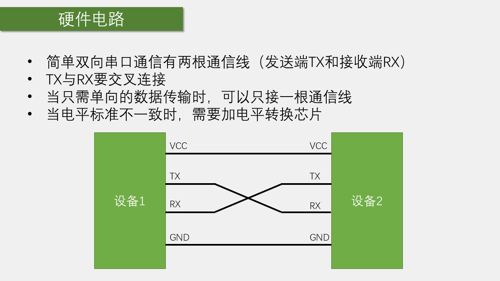
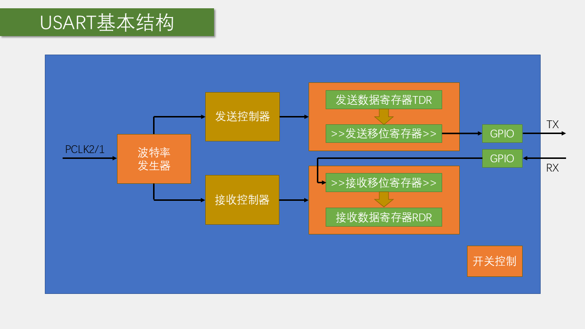
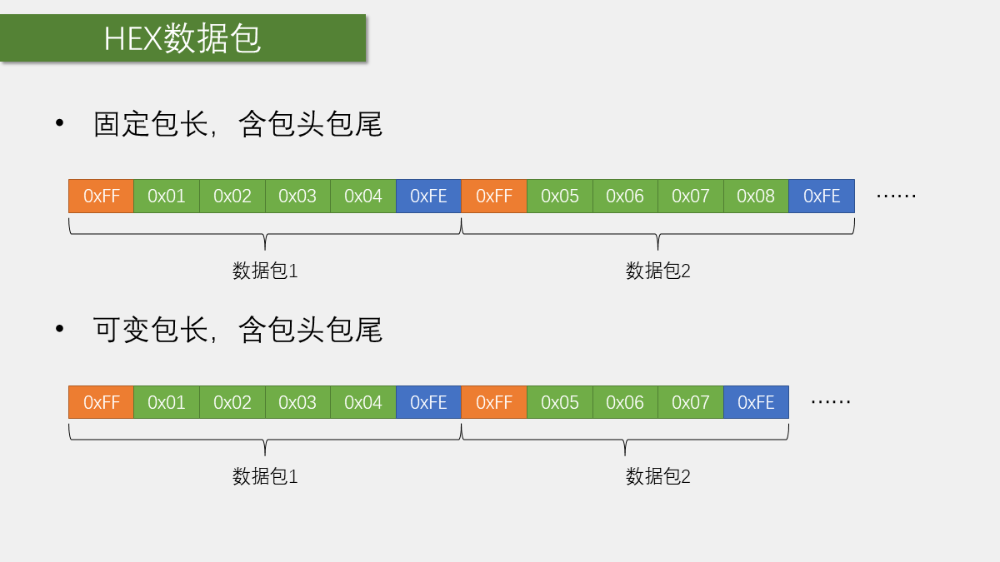
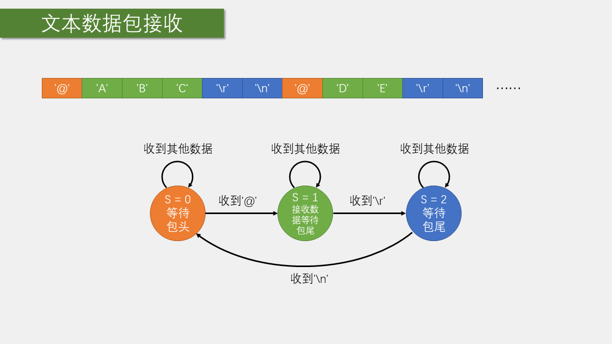
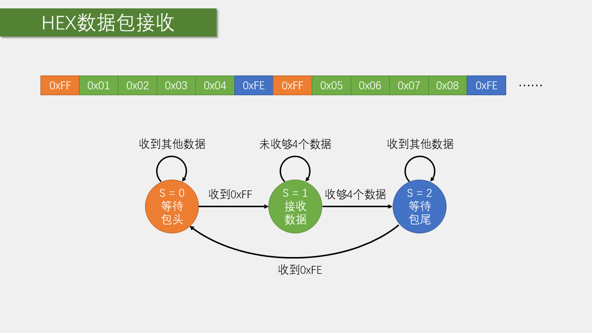

# 第 9 章 USART 串口通信

## 本章闭环

USART 把程序中的字节转换成串行电平，也把 RX 引脚上的数据帧还原成字节。本章从字节收发逐步扩展到完整消息，共完成四个工程：

| 工程 | 目标 | 核心机制 |
| --- | --- | --- |
| `9-1 串口发送` | 发送字节、数组、字符串、数字和格式化文本 | 轮询 `TXE` |
| `9-2 串口发送+接收` | 中断接收一个字节，主循环显示并回显 | `RXNE` 中断 + 标志交接 |
| `9-3 串口收发HEX数据包` | 收发 `FF + 4 字节 + FE` 固定包 | 三状态接收机 |
| `9-4 串口收发文本数据包` | 接收 `@命令\r\n` 并控制 LED | 文本状态机 + `strcmp` |

完整链路是：

```text
应用数据 -> 数据包规则 -> USART_DR -> 发送移位寄存器 -> PA9/TX
PA10/RX -> 接收移位寄存器 -> USART_DR -> RXNE 中断 -> 缓冲区/标志 -> 主循环
```

## 1. 为什么需要通信接口

STM32 内部的定时器、ADC、PWM 等外设可以直接通过寄存器控制，但蓝牙、姿态传感器、外部 Flash 等功能通常由外挂芯片完成。通信接口负责在 STM32 和外挂设备之间交换数据，使主控能够：

- 向外挂芯片写入配置；
- 从外挂芯片读取状态或测量值；
- 通过电脑调试和观察程序运行过程。

通信协议就是双方共同遵守的规则，包括连接哪些线、什么时候发送、数据如何编码、如何判断一帧结束等。

课程中涉及的常见通信接口如下：

| 接口 | 典型引脚 | 同步性 | 常见特点 |
| --- | --- | --- | --- |
| USART | TX、RX | 异步 | 接线少，适合设备间和电脑调试 |
| I2C | SCL、SDA | 同步 | 两根线可挂多个设备 |
| SPI | SCK、MOSI、MISO、CS | 同步 | 速度高，片选明确 |

## 2. USART 的接线、帧格式与硬件结构

### 2.1 TX 与 RX 交叉连接



串口连接需要满足：

- STM32 的 `TX` 接对方的 `RX`；
- STM32 的 `RX` 接对方的 `TX`；
- 两边 `GND` 共地；
- 使用 3.3 V TTL 电平。

USB 转串口模块上的 `VCC` 跳线应选择 3.3 V。TTL 串口不能直接接 RS-232 电平，后者的电压范围和逻辑极性不同。

### 2.2 异步通信与数据帧

USART 没有单独的时钟线，发送方和接收方必须预先约定波特率。常见配置是 `9600` 或 `115200` baud、`8N1`：

- 8 位数据；
- 无校验；
- 1 位停止位。



一帧通常由以下部分组成：

```text
空闲高电平 -> 起始位 0 -> 数据位（低位先发） -> 可选校验位 -> 停止位 1
```

接收方检测到起始位后，按照双方约定的波特率在相应时间点采样数据位。因此波特率、数据位、校验位和停止位任一项不一致，都可能造成乱码。

### 2.3 USART 发送与接收数据通路

发送端包含发送数据寄存器和发送移位寄存器。程序把数据写入 `USART_DR` 后，硬件先把它转移到移位寄存器，再按帧格式从 TX 低位先行发送。`TXE=1` 表示发送数据寄存器已经空，可以写入下一个字节；`TC=1` 才表示数据寄存器和移位寄存器都已空，最后一个停止位已经发送完成。

接收端在 RX 上检测起始位并采样，拼成一个字节后送入接收数据寄存器，同时置位 `RXNE`。如果上一个字节未及时读取，下一个字节又到达，就可能出现溢出错误。因此连续接收不应在中断中刷新 OLED 或执行长时间阻塞操作。

USART1 挂在 APB2，总线时钟通常为 72 MHz；USART2、USART3 挂在 APB1，默认通常为 36 MHz。标准库会按当前外设时钟计算 `BRR`，修改系统时钟后必须重新核对波特率。

## 3. USART1 的标准库配置链

课程使用 USART1 与电脑通信。STM32F103C8T6 的常用引脚是：

- `PA9`：USART1_TX，复用推挽输出；
- `PA10`：USART1_RX，上拉输入；
- USART1 挂在 APB2 总线。

标准库初始化的基本顺序如下：

```c
RCC_APB2PeriphClockCmd(RCC_APB2Periph_USART1 |
                       RCC_APB2Periph_GPIOA, ENABLE);

GPIO_InitTypeDef GPIO_InitStructure;
GPIO_InitStructure.GPIO_Speed = GPIO_Speed_50MHz;

GPIO_InitStructure.GPIO_Pin = GPIO_Pin_9;
GPIO_InitStructure.GPIO_Mode = GPIO_Mode_AF_PP;
GPIO_Init(GPIOA, &GPIO_InitStructure);

GPIO_InitStructure.GPIO_Pin = GPIO_Pin_10;
GPIO_InitStructure.GPIO_Mode = GPIO_Mode_IPU;
GPIO_Init(GPIOA, &GPIO_InitStructure);

USART_InitTypeDef USART_InitStructure;
USART_InitStructure.USART_BaudRate = 9600;
USART_InitStructure.USART_HardwareFlowControl =
    USART_HardwareFlowControl_None;
USART_InitStructure.USART_Mode = USART_Mode_Tx | USART_Mode_Rx;
USART_InitStructure.USART_Parity = USART_Parity_No;
USART_InitStructure.USART_StopBits = USART_StopBits_1;
USART_InitStructure.USART_WordLength = USART_WordLength_8b;

USART_Init(USART1, &USART_InitStructure);
USART_Cmd(USART1, ENABLE);
```

波特率最终由外设时钟和波特率寄存器 `BRR` 决定。修改系统时钟后，应重新确认时钟配置和 USART 初始化是否匹配。

配置顺序保持为：

```text
开启 GPIOA/USART1 时钟
 -> PA9 复用推挽，PA10 上拉输入
 -> USART_Init() 配置 9600、8N1、收发模式
 -> 需要接收时开启 RXNE 中断并配置 NVIC
 -> USART_Cmd() 使能外设
```

## 4. 实验一：串口发送


课程程序启动后依次发送 `0x41`、数组 `0x42 0x43 0x44 0x45`、字符串和数字。串口助手使用 `9600`、`8N1`；HEX 模式显示原始字节，文本模式按字符编码解释字节，所以 `0x41` 显示为 `A`。

### 4.1 发送一个字节

向数据寄存器写入一个字节后，USART 硬件会自动完成起始位、数据位和停止位的发送。发送函数需要等待发送数据寄存器为空：

```c
void Serial_SendByte(uint8_t Byte)
{
    USART_SendData(USART1, Byte);
    while (USART_GetFlagStatus(USART1, USART_FLAG_TXE) == RESET)
    {
    }
}
```

`TXE` 表示发送数据寄存器为空，可以写入下一个字节。它不等价于最后一位已经离开引脚；如果必须等待整帧发送完成，应根据具体场景使用 `TC`。

### 4.2 发送数组、字符串和数字

在单字节函数之上，可以继续封装：

```c
void Serial_SendArray(uint8_t *Array, uint16_t Length)
{
    uint16_t i;
    for (i = 0; i < Length; i++)
    {
        Serial_SendByte(Array[i]);
    }
}

void Serial_SendString(char *String)
{
    while (*String != '\0')
    {
        Serial_SendByte((uint8_t)*String);
        String++;
    }
}
```

数字需要先转换成字符或通过格式化函数输出，不能把十进制数字的“显示形式”和底层字节混为一谈。

### 4.3 把 `printf` 移植到串口

课程介绍了把 `printf` 输出重定向到 USART 的思路。核心是实现字符输出函数，让 C 库的格式化结果逐字符调用 `Serial_SendByte()`。常见写法是重写 `fputc`：

```c
int fputc(int ch, FILE *f)
{
    Serial_SendByte((uint8_t)ch);
    return ch;
}
```

完成重定向后即可使用：

```c
printf("Number1 = %d\r\n", 1);
printf("Number2 = %d\r\n", 2);
```

串口助手中看到的文本，本质上仍然是逐字节发送的 ASCII 字符。

课程还用 `vsprintf()` 实现 `Serial_Printf()`，先把格式化结果写入 `char String[100]`，再调用 `Serial_SendString()`。这适合演示，但 `vsprintf()` 不检查长度；工程中应改用 `vsnprintf()` 并把缓冲区大小传入，避免格式化结果越界。

## 5. 实验二：串口中断接收与回显

### 5.1 查询接收标志

最直接的入门写法是在主循环中查询 `RXNE`：

```c
if (USART_GetFlagStatus(USART1, USART_FLAG_RXNE) == SET)
{
    uint8_t Byte = USART_ReceiveData(USART1);
    OLED_ShowHexNum(1, 1, Byte, 2);
    Serial_SendByte(Byte);
}
```

读取 `USART_ReceiveData()` 会取出接收数据，并完成对接收寄存器的处理。主循环查询适合低速、低负载实验；数据量较大或必须及时接收时，应使用接收中断。

### 5.2 使用接收中断

接收中断的基本流程是：

1. 开启 `USART_IT_RXNE`；
2. 配置 NVIC 和 `USART1_IRQn`；
3. 在中断函数中读取接收数据；
4. 把字节放入缓冲区或更新状态机；
5. 由主循环处理完整消息。

中断函数中不应执行大量 OLED 刷新、格式化打印或长时间等待，否则可能造成后续字节丢失。

课程使用一个字节缓冲和一个完成标志交接：

```c
uint8_t Serial_RxData;
uint8_t Serial_RxFlag;

void USART1_IRQHandler(void)
{
    if (USART_GetITStatus(USART1, USART_IT_RXNE) == SET)
    {
        Serial_RxData = USART_ReceiveData(USART1);
        Serial_RxFlag = 1;
        USART_ClearITPendingBit(USART1, USART_IT_RXNE);
    }
}

uint8_t Serial_GetRxFlag(void)
{
    if (Serial_RxFlag == 1)
    {
        Serial_RxFlag = 0;
        return 1;
    }
    return 0;
}
```

主循环检测到标志后读取数据、回发并更新 OLED。这个单字节邮箱只适合低速演示；如果主循环来不及处理，后到字节会覆盖先到字节。连续字节流应使用数据包缓冲区或环形缓冲区。

## 6. 实验三、四：串口数据包

### 6.1 为什么要设计数据包

USART 只提供连续的字节流。若直接发送：

```text
12 34 56 78
```

接收方无法仅凭字节本身判断这是四字节命令、两条两字节命令，还是上一条消息的尾部和下一条消息的开头。

因此应用层要增加包头、长度、载荷和包尾等规则：

```text
包头 + 数据长度/数据内容 + 包尾
```

### 6.2 HEX 数据包

课程中的 HEX 数据包适合固定长度的二进制数据。例如约定：

```text
0xFF + 固定长度数据 + 0xFE
```

接收方按照固定状态接收：

1. 等待 `0xFF`；
2. 连续保存规定数量的数据字节；
3. 等待 `0xFE`；
4. 包完成，通知主循环处理；
5. 状态复位，等待下一包。



固定长度数据包按位置判断字段，因此 4 字节载荷本身可以出现 `0xFF` 或 `0xFE`，不会被误当成头尾。它的薄弱点是缺少校验和重新同步规则：一旦丢失或插入一个字节，后续字段位置就会错位。可变长度协议才需要进一步使用长度字段、转义或其他定界方法；无论定长还是变长，都可加入校验提高错误检测能力。

课程的接收状态机直接写在 `USART1_IRQHandler()` 中：

```c
static uint8_t RxState;
static uint8_t pRxPacket;

if (RxState == 0)
{
    if (RxData == 0xFF)
    {
        RxState = 1;
        pRxPacket = 0;
    }
}
else if (RxState == 1)
{
    Serial_RxPacket[pRxPacket++] = RxData;
    if (pRxPacket >= 4)
    {
        RxState = 2;
    }
}
else if (RxState == 2)
{
    if (RxData == 0xFE)
    {
        RxState = 0;
        Serial_RxFlag = 1;
    }
}
```

该格式的载荷固定为 4 字节，所以数组边界由状态机保证。若包尾错误，课程代码会停留在状态 2，直到再次收到 `0xFE`；更可靠的协议应在错误时复位、增加长度和校验，必要时设置帧间超时。

### 6.3 文本数据包

文本数据包直接使用字符传输，课程中以换行作为一条消息的结束：

```text
@command,value\r\n
```

接收时不断把字符写入数组，直到检测到 `\r\n`，再在字符串末尾补上 `\0`，交给主循环作为 C 字符串处理。



文本协议可读性好，便于串口助手和人工调试；代价是每个数字通常需要多个 ASCII 字符，数据量和解析开销更大。

课程文本包实际约定为：

```text
@LED_ON\r\n
@LED_OFF\r\n
```

中断在收到 `@` 后开始保存正文，检测到 `\r\n` 后补 `\0` 并置位完成标志。主循环用 `strcmp()` 比较 `LED_ON`、`LED_OFF`，执行 LED 控制并返回 `LED_ON_OK\r\n`、`LED_OFF_OK\r\n` 或 `ERROR_COMMAND\r\n`。

`Serial_RxFlag == 1` 时，状态 0 不接受新包头，相当于暂时冻结单缓冲区，直到主循环处理并清标志。但课程数组长度为 100，接收状态机没有检查 `pRxPacket` 上限；工程代码必须在写入前限制索引，超长帧应丢弃并复位状态。

### 6.4 用状态机接收

课程把两种数据包都拆成有限个状态，而不是在一个循环里堆叠大量条件：



HEX 固定长度包可以抽象为：

```text
状态 0：等待包头
状态 1：接收固定长度载荷
状态 2：等待包尾
完成：置位接收完成标志，回到状态 0
```

文本可变长度包可以抽象为：

```text
状态 0：等待文本包头
状态 1：持续接收字符
状态 2：等待换行结束
完成：补 '\0'，置位完成标志，回到状态 0
```

状态机的关键不是状态数量，而是每个状态只负责一种明确的输入判断。实现时还必须处理：

- 缓冲区越界；
- 新包头出现在异常数据中；
- 包尾错误或超时；
- 一包尚未处理时下一包已经到达；
- 中断写缓冲区和主循环读缓冲区之间的并发关系。

低速入门实验可以使用单缓冲区；更可靠的实现应在“接收完成”时冻结缓冲区，或使用双缓冲区、环形缓冲区。

## 7. 验收与排错

课程还介绍了串口助手和 FlyMcu。FlyMcu 使用 USART1 系统 Bootloader 下载程序，属于烧录链路，不是本章应用层收发代码的一部分。串口实验按下面顺序验证：

1. 先确认 USB 转串口模块使用 3.3 V TTL，并检查共地；
2. 用固定字节 `0x55` 检查基本时序；
3. 测试单字节发送，再测试数组和字符串；
4. 测试 `0x41` 接收、OLED 显示和回显；
5. 最后测试 HEX 数据包和文本数据包。

排错优先级：

- 完全乱码：查电平、共地、波特率、`8N1` 和系统时钟；
- 只能发送：查 `RX`/`TX` 是否交叉、PA10 模式和接收逻辑；
- 只能接收：查 PA9 复用推挽和串口助手端口；
- 单字节正常但丢包：查中断处理时间、缓冲区边界和状态复位；
- 文本乱码但 HEX 正常：查字符编码和 `\r\n` 结束规则。

## 本章小结

USART 的学习顺序应保持分层：

1. USART 硬件负责把字节转换成串行电平；
2. 帧格式和波特率决定双方如何解释这些电平；
3. 发送、接收和中断函数提供字节级接口；
4. HEX/文本数据包和状态机解决消息边界问题。

只有把物理连接、帧参数、字节收发、缓冲区和协议解析连成一条链，串口通信程序才真正闭环。
