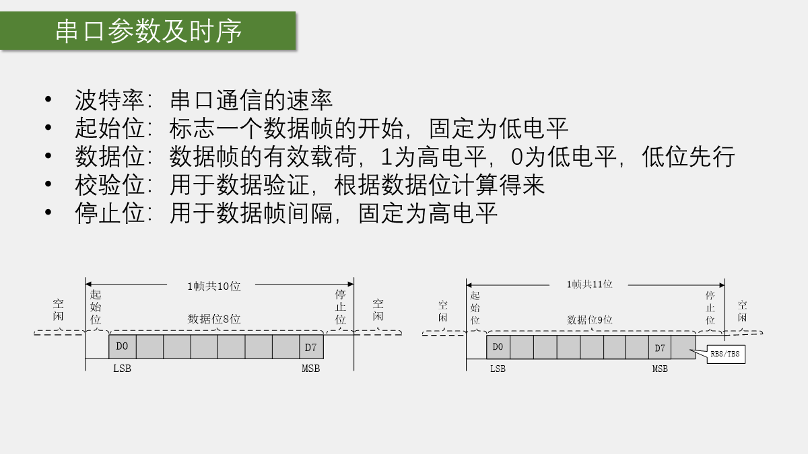
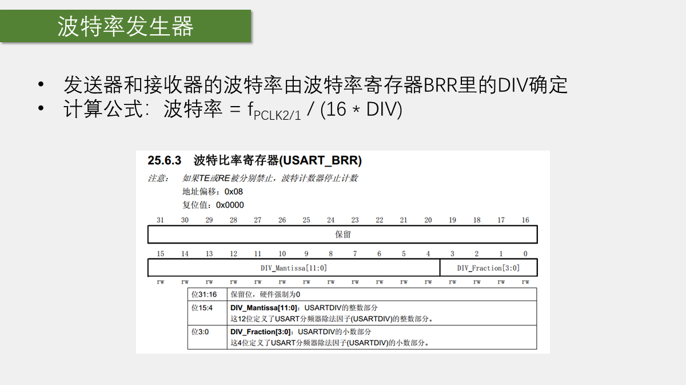
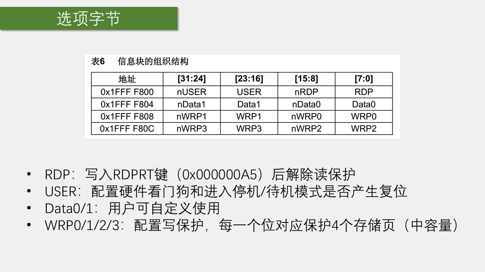

# 第 9 章 USART 串口通信

## 1. 学习目标与工程

默认平台：STM32F103C8T6、STM32F10x 标准外设库 V3.5.0、USART1。引脚为 PA9（TX）、PA10（RX）。配套应用工程统一使用 9600 baud、8 位数据、无校验、1 位停止（8N1）。

| 工程             | 现象                   | 外设                  |
| -------------- | -------------------- | ------------------- |
| 9-1 串口发送       | 字节、数组、字符串、数字、printf  | USART1、OLED         |
| 9-2 串口发送+接收    | 单字节接收、OLED 显示、回显     | USART1、OLED         |
| 9-3 串口收发HEX数据包 | FF + 4 字节 + FE       | USART1、OLED、PB1 按键  |
| 9-4 串口收发文本数据包  | @LED_ON\\r\\n 控制 LED | USART1、OLED、PA1 LED |

## 2. 串口通信基础

USART 的全称是通用同步/异步收发器，UART 是只保留异步功能的叫法。本章使用异步串口。它没有独立时钟线，通信双方必须预先约定波特率、数据位、校验位和停止位。

### 2.1 接线

| USB 转串口 | STM32           |
| ------- | --------------- |
| GND     | GND             |
| TXD     | PA10（USART1_RX） |
| RXD     | PA9（USART1_TX）  |
| VCC     | 3.3 V           |

必须共地，TX 和 RX 交叉连接。TTL 串口不能直接接 RS-232，后者需要 MAX3232 等电平转换。9-1 只发送时可只接 PA9 到模块 RXD；9-2 至 9-4 必须连接两根通信线。

### 2.2 8N1 一帧

~~~text
空闲高电平 -> 起始位 0 -> 8 位数据（低位先发） -> 无校验 -> 停止位 1
~~~

8N1 每帧通常占 10 个比特时间，因此有效字节率约为 baud/10。波特率或帧格式不一致会产生乱码、丢字节或完全无数据。

图中左侧是常见的 8 位数据帧：起始位固定为低电平，数据从 D0（最低位）开始发送，最后以高电平停止位结束；右侧是 9 位数据帧，多出的最高位可用于地址标记或特殊协议。阅读串口时序时，先从“空闲高电平”找起始位，再按约定的位数和方向采样。

### 2.3 HEX 与文本

串口本身只传字节。字符 A 经过 ASCII 编码后是 0x41：HEX 模式显示 41，文本模式显示 A。中文是否正常取决于源码、编译器和串口助手的编码是否一致（UTF-8 或 GBK）。

## 3. USART 外设内部结构

写 USART_DR 实际写入发送数据寄存器 TDR，读 USART_DR 实际读取接收数据寄存器 RDR。发送移位寄存器把字节逐位送到 TX；接收移位寄存器从 RX 采样并拼成字节，再转移到 RDR。

| 标志 | 含义 |
| --- | --- |
| TXE | 发送数据寄存器为空，可以写下一个字节 |
| TC | 整帧（含停止位）发送完成 |
| RXNE | 接收数据寄存器非空，有新字节可读 |
| ORE | 接收溢出 |
| PE、FE、NE | 奇偶、帧、噪声错误 |

课程阻塞发送等待 TXE，适合连续发送；需要确认最后一位已经离开引脚时应等待 TC。

USART1 挂在 APB2，课程时钟下常见 PCLK2 为 72 MHz；USART2、USART3 挂在 APB1，常见 PCLK1 为 36 MHz。波特率发生器通过 USARTDIV 分频并生成采样时钟，修改系统时钟后必须重新确认波特率。

图中公式说明：波特率由外设时钟和 USARTDIV 共同决定，BRR 的高位保存整数分频部分，低位保存小数分频部分。配置 9600 baud 时不要只修改 `USART_BaudRate`；如果系统时钟树变了，必须同时确认 USART1 实际得到的 PCLK2 是否仍为课程中的 72 MHz。

USART 还支持硬件流控 RTS/CTS、DMA、同步时钟输出、智能卡、IrDA、LIN 和多机唤醒。本章不使用这些模式，但应知道：RTS/CTS 用额外信号防止接收方处理不过来；DMA 可减轻 CPU；同步模式只提供时钟输出。

### 3.5 字长、校验和停止位

标准库中的字长选项通常为 8 位或 9 位，这里的字长包含可能存在的奇偶校验位。8 位字长通常配无校验，对应完整的 8 位有效载荷；9 位字长可用于 8 位有效数据加 1 位校验，也可在特殊协议中作为 9 位有效数据。停止位支持 0.5、1、1.5 和 2 位，普通串口最常用 1 位。校验可选无校验、奇校验或偶校验。若选择 8 位字长又打开校验，有效数据位会减少，因此课程统一使用 8N1。

9 位帧仍然遵循“空闲、起始、数据、停止”的顺序，只是数据区多一个最高位。校验由硬件自动生成或检查，应用程序通常只读取剥离后的数据。

### 3.6 引脚复用与重映射

USART2 的常用引脚是 PA2/PA3，USART3 的常用引脚是 PB10/PB11，USART1 的常用引脚是 PA9/PA10。部分外设支持重映射到另一组 GPIO；设计电路时应先查数据手册和 AFIO 重映射表，避免与 OLED、按键、定时器等功能冲突。不能因为“同名 USART1”就随意更换引脚。

### 3.7 从寄存器角度看框图

状态寄存器 SR 保存 TXE、TC、RXNE 等硬件状态；数据寄存器 DR 负责收发数据；控制寄存器 CR 配置收发使能、中断、字长、校验和停止位；波特率寄存器 BRR 保存分频系数。标准库结构体把这些位封装起来，但排错时仍可回到参考手册核对寄存器位。

## 4. 实验准备

硬件：STM32F103C8T6 开发板、ST-Link、USB 转 3.3 V TTL 模块、OLED、杜邦线；9-3 另需 PB1 按键，9-4 另需 PA1 LED 和限流电阻。

串口助手步骤：

1. 插入模块，在设备管理器确认 COM 号。
2. 关闭占用该端口的其他软件。
3. 设置 9600、8 位、无校验、1 位停止、无硬件流控。
4. 原始字节实验使用 HEX；字符串实验使用文本。
5. 文本包必须发送实际的回车和换行，即 CR（\\r）和 LF（\\n）。

## 5. USART1 初始化

初始化顺序是：开启 GPIOA 和 USART1 时钟；PA9 复用推挽；收发时 PA10 上拉输入；配置串口参数；需要接收时开启 RXNE 中断和 NVIC；最后使能 USART。

~~~c
RCC_APB2PeriphClockCmd(RCC_APB2Periph_USART1 | RCC_APB2Periph_GPIOA, ENABLE);

GPIO_InitTypeDef GPIO_InitStructure;
GPIO_InitStructure.GPIO_Pin = GPIO_Pin_9;
GPIO_InitStructure.GPIO_Mode = GPIO_Mode_AF_PP;
GPIO_InitStructure.GPIO_Speed = GPIO_Speed_50MHz;
GPIO_Init(GPIOA, &GPIO_InitStructure);

GPIO_InitStructure.GPIO_Pin = GPIO_Pin_10;
GPIO_InitStructure.GPIO_Mode = GPIO_Mode_IPU;
GPIO_Init(GPIOA, &GPIO_InitStructure);

USART_InitTypeDef USART_InitStructure;
USART_InitStructure.USART_BaudRate = 9600;
USART_InitStructure.USART_HardwareFlowControl = USART_HardwareFlowControl_None;
USART_InitStructure.USART_Mode = USART_Mode_Tx | USART_Mode_Rx;
USART_InitStructure.USART_Parity = USART_Parity_No;
USART_InitStructure.USART_StopBits = USART_StopBits_1;
USART_InitStructure.USART_WordLength = USART_WordLength_8b;
USART_Init(USART1, &USART_InitStructure);

USART_ITConfig(USART1, USART_IT_RXNE, ENABLE);
NVIC_PriorityGroupConfig(NVIC_PriorityGroup_2);
NVIC_InitTypeDef NVIC_InitStructure;
NVIC_InitStructure.NVIC_IRQChannel = USART1_IRQn;
NVIC_InitStructure.NVIC_IRQChannelCmd = ENABLE;
NVIC_InitStructure.NVIC_IRQChannelPreemptionPriority = 1;
NVIC_InitStructure.NVIC_IRQChannelSubPriority = 1;
NVIC_Init(&NVIC_InitStructure);

USART_Cmd(USART1, ENABLE);
~~~

USART1_IRQHandler 的名字来自启动文件，不能拼错。读取 USART_ReceiveData 通常会清除 RXNE，课程代码同时调用 USART_ClearITPendingBit 也可以。

## 6. 实验一：发送

工程：9-1 串口发送。

### 6.1 基本发送函数

~~~c
void Serial_SendByte(uint8_t Byte)
{
    USART_SendData(USART1, Byte);
    while (USART_GetFlagStatus(USART1, USART_FLAG_TXE) == RESET)
    {
    }
}

void Serial_SendArray(uint8_t *Array, uint16_t Length)
{
    uint16_t i;
    for (i = 0; i < Length; i++)
    {
        Serial_SendByte(Array[i]);
    }
}

void Serial_SendString(char *String)
{
    uint16_t i;
    for (i = 0; String[i] != '\0'; i++)
    {
        Serial_SendByte((uint8_t)String[i]);
    }
}
~~~

Serial_SendByte(0x41) 是发送一个原始字节；不是发送字符 4 和 1。字符串依靠 \0 结束，数组则必须显式传入长度。

### 6.2 数字和 printf

课程 Serial_SendNumber 按十进制高位到低位发送，固定宽度不足时补 0。例如发送 7、长度 3，结果为 007。它只处理无符号数。

~~~c
int fputc(int ch, FILE *f)
{
    Serial_SendByte((uint8_t)ch);
    return ch;
}

void Serial_Printf(char *format, ...)
{
    char String[100];
    va_list arg;
    va_start(arg, format);
    vsprintf(String, format, arg);
    va_end(arg);
    Serial_SendString(String);
}
~~~

使用重定向 printf 时，在 Keil Options for Target -> C/C++ 勾选 Use MicroLIB。也可先 sprintf 到数组再发送，或直接使用 Serial_Printf。课程缓冲区为 100 字节，vsprintf 不检查边界；长字符串应改为 vsnprintf。

### 6.3 完整主函数

~~~c
#include "stm32f10x.h"
#include "OLED.h"
#include "Serial.h"

int main(void)
{
    uint8_t MyArray[] = {0x42, 0x43, 0x44, 0x45};
    char String[100];

    OLED_Init();
    Serial_Init();
    Serial_SendByte(0x41);
    Serial_SendArray(MyArray, 4);
    Serial_SendString("\r\nNum1=");
    Serial_SendNumber(111, 3);
    printf("\r\nNum2=%d", 222);
    sprintf(String, "\r\nNum3=%d", 333);
    Serial_SendString(String);
    Serial_Printf("\r\nNum4=%d\r\n", 444);

    while (1)
    {
    }
}
~~~

验收：HEX 接收区看到 41 42 43 44 45；文本区看到 ABCDE、Num1=111、Num2=222、Num3=333、Num4=444。复位会再次发送。

## 7. 实验二：接收、中断与回显

工程：9-2 串口发送+接收。

查询法是在主循环检查 RXNE：

~~~c
if (USART_GetFlagStatus(USART1, USART_FLAG_RXNE) == SET)
{
    uint8_t RxData = USART_ReceiveData(USART1);
    Serial_SendByte(RxData);
}
~~~

中断法把字节放入变量，再置标志位：

~~~c
uint8_t Serial_RxData;
uint8_t Serial_RxFlag;

void USART1_IRQHandler(void)
{
    if (USART_GetITStatus(USART1, USART_IT_RXNE) == SET)
    {
        Serial_RxData = (uint8_t)USART_ReceiveData(USART1);
        Serial_RxFlag = 1;
        USART_ClearITPendingBit(USART1, USART_IT_RXNE);
    }
}

uint8_t Serial_GetRxFlag(void)
{
    if (Serial_RxFlag == 1)
    {
        Serial_RxFlag = 0;
        return 1;
    }
    return 0;
}

uint8_t Serial_GetRxData(void)
{
    return Serial_RxData;
}
~~~

这是一字节邮箱：中断负责投递，主循环负责取走。主循环处理不及时会覆盖旧数据。

~~~c
int main(void)
{
    uint8_t RxData;
    OLED_Init();
    OLED_ShowString(1, 1, "RxData:");
    Serial_Init();

    while (1)
    {
        if (Serial_GetRxFlag() == 1)
        {
            RxData = Serial_GetRxData();
            Serial_SendByte(RxData);
            OLED_ShowHexNum(1, 8, RxData, 2);
        }
    }
}
~~~

验收：HEX 模式发送 41 或 AF，OLED 与串口回显相同字节；文本模式发送 A，HEX 接收区应显示 41。

## 8. 数据包设计

连续发送 X、Y、Z、X、Y、Z 时，接收方若从中间开始接收，就不知道当前字节对应哪个量。数据包用边界标记解决这个问题。

常见方法：

1. 把最高位作为标志位，优点是不增加字节，缺点是破坏数据范围。
2. 固定长度包：包头、固定载荷、包尾，解析简单。
3. 可变长度包：包头、任意长度载荷、包尾，适合文本指令。

图中上半部分是固定长度包：每个包都由 `0xFF` 包头、4 个载荷字节和 `0xFE` 包尾组成；下半部分是可变长度包，载荷字节数可以变化。固定长度便于状态机按计数器接收，可变长度则必须依靠包尾、长度字段或转义规则判断边界。

若载荷可能与包头包尾重复，应限制载荷范围、使用固定长度、增加边界字节或加入转义。可靠产品还应加入长度、校验和或 CRC、超时和错误复位。16 位、32 位、float 或结构体都可通过 uint8_t 指针按字节发送，但要约定字节序、长度和格式。

## 9. 实验三：固定长度 HEX 数据包

工程：9-3 串口收发HEX数据包。PB1 接按键。

协议：

~~~text
FF + 4 字节载荷 + FE
~~~

发送函数：

~~~c
uint8_t Serial_TxPacket[4];

void Serial_SendPacket(void)
{
    Serial_SendByte(0xFF);
    Serial_SendArray(Serial_TxPacket, 4);
    Serial_SendByte(0xFE);
}
~~~

接收状态为 0 等待 FF，1 接收四个载荷，2 等待 FE：

~~~c
uint8_t Serial_RxPacket[4];
uint8_t Serial_RxFlag;

void USART1_IRQHandler(void)
{
    static uint8_t RxState = 0;
    static uint8_t pRxPacket = 0;

    if (USART_GetITStatus(USART1, USART_IT_RXNE) == SET)
    {
        uint8_t RxData = (uint8_t)USART_ReceiveData(USART1);

        if (RxState == 0)
        {
            if (RxData == 0xFF)
            {
                RxState = 1;
                pRxPacket = 0;
            }
        }
        else if (RxState == 1)
        {
            Serial_RxPacket[pRxPacket++] = RxData;
            if (pRxPacket >= 4)
            {
                RxState = 2;
            }
        }
        else if (RxState == 2)
        {
            if (RxData == 0xFE)
            {
                RxState = 0;
                Serial_RxFlag = 1;
            }
        }

        USART_ClearITPendingBit(USART1, USART_IT_RXNE);
    }
}
~~~

必须使用 else if 或 switch，避免一次中断执行多个状态。

主函数核心：

~~~c
int main(void)
{
    uint8_t KeyNum;
    OLED_Init();
    Key_Init();
    Serial_Init();
    OLED_ShowString(1, 1, "TxPacket");
    OLED_ShowString(3, 1, "RxPacket");

    Serial_TxPacket[0] = 0x01;
    Serial_TxPacket[1] = 0x02;
    Serial_TxPacket[2] = 0x03;
    Serial_TxPacket[3] = 0x04;

    while (1)
    {
        KeyNum = Key_GetNum();
        if (KeyNum == 1)
        {
            Serial_TxPacket[0]++;
            Serial_TxPacket[1]++;
            Serial_TxPacket[2]++;
            Serial_TxPacket[3]++;
            Serial_SendPacket();
            OLED_ShowHexNum(2, 1, Serial_TxPacket[0], 2);
            OLED_ShowHexNum(2, 4, Serial_TxPacket[1], 2);
            OLED_ShowHexNum(2, 7, Serial_TxPacket[2], 2);
            OLED_ShowHexNum(2, 10, Serial_TxPacket[3], 2);
        }

        if (Serial_GetRxFlag() == 1)
        {
            OLED_ShowHexNum(4, 1, Serial_RxPacket[0], 2);
            OLED_ShowHexNum(4, 4, Serial_RxPacket[1], 2);
            OLED_ShowHexNum(4, 7, Serial_RxPacket[2], 2);
            OLED_ShowHexNum(4, 10, Serial_RxPacket[3], 2);
        }
    }
}
~~~

验收：按键后串口收到 FF 02 03 04 05 FE；发送 FF 11 22 33 44 FE，OLED 显示 11 22 33 44。

## 10. 实验四：文本数据包与 LED

工程：9-4 串口收发文本数据包。PA1 接 LED。

协议：

~~~text
@ + 文本载荷 + \r\n
~~~

例如 @LED_ON\\r\\n、@LED_OFF\\r\\n。@ 标记开始，CRLF 标记结束；没有换行，状态机不会提交数据。

~~~c
char Serial_RxPacket[100];
uint8_t Serial_RxFlag;

void USART1_IRQHandler(void)
{
    static uint8_t RxState = 0;
    static uint8_t pRxPacket = 0;

    if (USART_GetITStatus(USART1, USART_IT_RXNE) == SET)
    {
        uint8_t RxData = (uint8_t)USART_ReceiveData(USART1);

        if (RxState == 0)
        {
            if (RxData == '@' && Serial_RxFlag == 0)
            {
                RxState = 1;
                pRxPacket = 0;
            }
        }
        else if (RxState == 1)
        {
            if (RxData == '\r')
            {
                RxState = 2;
            }
            else if (pRxPacket < sizeof(Serial_RxPacket) - 1)
            {
                Serial_RxPacket[pRxPacket++] = (char)RxData;
            }
            else
            {
                RxState = 0;
                pRxPacket = 0;
            }
        }
        else if (RxState == 2)
        {
            if (RxData == '\n')
            {
                Serial_RxPacket[pRxPacket] = '\0';
                Serial_RxFlag = 1;
                RxState = 0;
            }
        }

        USART_ClearITPendingBit(USART1, USART_IT_RXNE);
    }
}
~~~

主循环用 strcmp 解析命令：

~~~c
if (Serial_RxFlag == 1)
{
    OLED_ShowString(4, 1, "                ");
    OLED_ShowString(4, 1, Serial_RxPacket);

    if (strcmp(Serial_RxPacket, "LED_ON") == 0)
    {
        LED1_ON();
        Serial_SendString("LED_ON_OK\r\n");
        OLED_ShowString(2, 1, "LED_ON_OK       ");
    }
    else if (strcmp(Serial_RxPacket, "LED_OFF") == 0)
    {
        LED1_OFF();
        Serial_SendString("LED_OFF_OK\r\n");
        OLED_ShowString(2, 1, "LED_OFF_OK      ");
    }
    else
    {
        Serial_SendString("ERROR_COMMAND\r\n");
        OLED_ShowString(2, 1, "ERROR_COMMAND   ");
    }

    Serial_RxFlag = 0;
}
~~~

验收：文本模式并启用回车换行。发送 @LED_ON\\r\\n，LED 点亮并返回 LED_ON_OK；发送 @LED_OFF\\r\\n，LED 熄灭并返回 LED_OFF_OK；未知命令返回 ERROR_COMMAND。

## 11. FlyMcu 与 ST-Link Utility

### 11.1 FlyMcu

FlyMcu 通过 STM32F1 系统存储器中的 USART1 Bootloader 下载。Keil 的 Options for Target -> Output 勾选 Create HEX File 后生成 HEX。USB 转串口接 PA9、PA10、GND；课程演示 Bootloader 波特率为 115200，与应用工程 9600 不同是正常的。

步骤：BOOT0 置 1、BOOT1 保持 0；按复位；FlyMcu 选择 COM 和 HEX 文件并下载；完成后 BOOT0 恢复 0，再复位运行用户程序。启动配置只在复位时锁存。BOOT0=0 时从主 Flash 的 0x08000000 启动，BOOT0=1、BOOT1=0 时从系统存储器的 Bootloader 启动，两个都为 1 时从 SRAM 启动，本章不使用 SRAM 启动。

如果开发板没有 RTS、DTR 控制 BOOT0 和复位的“一键下载”电路，就必须手动拨跳线并复位。带一键下载电路的模块可把 RTS、DTR 当作普通控制输出，通过三极管分别控制 BOOT0 和 NRST；FlyMcu 的 RTS/DTR 高低电平选项必须与实际电路一致。没有该电路时这些下拉选项对硬件不起作用。

FlyMcu 还可以读取 Flash、整片擦除和读取器件信息。读出的文件通常是 BIN 原始数据，没有地址信息；HEX 文件带地址信息。课程演示版本主要用于下载 HEX，读出的 BIN 未必能在同一版本中直接重新下载。芯片标称容量应以数据手册为准，软件读出的容量异常时不要据此扩大程序范围。

选项字节包含读保护、硬件参数、用户数据和写保护。解除读保护通常会擦除主 Flash；写保护区域若被下载覆盖会导致失败。修改保护前先备份。

图中列出了信息块的地址和字段：RDP 控制读保护，USER 控制硬件看门狗及待机/停机复位行为，Data0/1 可供用户保存参数，WRP0～3 用于按页设置写保护。修改这些字段前，应先确认目标芯片型号和保护范围；解除 RDP 可能触发整片 Flash 擦除，不能把它当作普通程序下载选项。

### 11.2 ST-Link Utility

ST-Link Utility 通过 SWDIO、SWCLK、GND 和目标板供电下载，不需要串口模块。连接后可读取、保存、擦除、编程 HEX/BIN，也可在 Target -> Option Bytes 单独修改保护和用户参数。它还提供 ST-Link 固件升级功能。

## 12. 故障排查

| 现象 | 检查顺序 |
| --- | --- |
| 没有 COM | 驱动、USB 线、端口占用 |
| 完全无数据 | 供电、共地、TX/RX、USART1 时钟 |
| 发送正常、接收无效 | 模块 TXD 是否接 PA10，中断和 NVIC 是否开启 |
| 接收正常、发送无效 | PA9 是否复用推挽，模块 RXD 是否接对 |
| 全是乱码 | 波特率、8N1、电平、系统时钟 |
| 英文正常中文乱码 | UTF-8/GBK 编码不一致 |
| 单字节正常但丢包 | 邮箱或单缓冲区覆盖，中断处理过重 |
| 文本无响应 | 是否发送 @、CRLF，是否补 \\0 |
| HEX 错位 | FF、FE、固定长度 4 和错误复位 |
| FlyMcu 无法握手 | BOOT0、复位时序、USART1 接线、HEX、COM |
| 下载后仍进 Bootloader | BOOT0 未恢复为 0 |

始终按“供电和共地 -> 发送 0x41 -> 单字节回显 -> 数据包 -> OLED/按键/LED”的顺序排查，一次只改一个变量。

## 13. 验收清单与练习

- [ ] 会完成 TX-RX 交叉接线和共地。
- [ ] 会解释 8N1、TXE、TC、RXNE。
- [ ] 完成 9-1 的字节、数组、字符串、数字和 printf。
- [ ] 完成 9-2 的 OLED 显示和回显。
- [ ] 完成 9-3 的 FF + 4 字节 + FE 数据包。
- [ ] 完成 9-4 的 LED_ON、LED_OFF 和错误命令。
- [ ] 能画出两个状态机并解释丢包边界。
- [ ] 能区分 FlyMcu 的 USART1 Bootloader 与 ST-Link 的 SWD。

练习：把 HEX 载荷扩展到 8 字节；加入长度和校验和；增加 LED_TOGGLE 文本指令；用环形缓冲区替换单字节邮箱；把 Serial_Printf 改成带长度限制的 vsnprintf。
