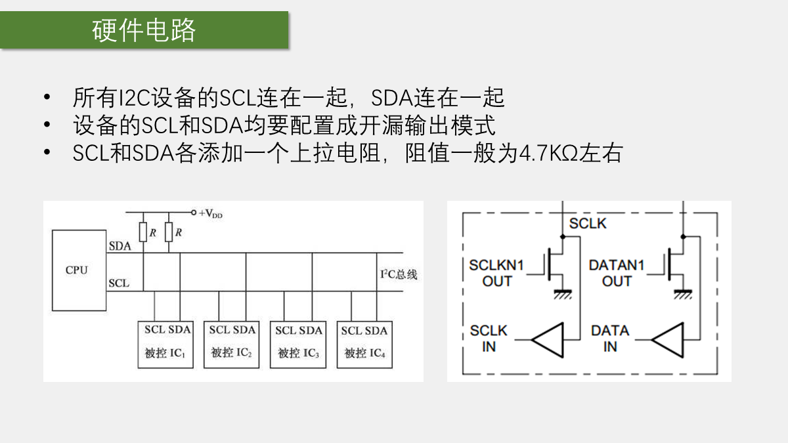
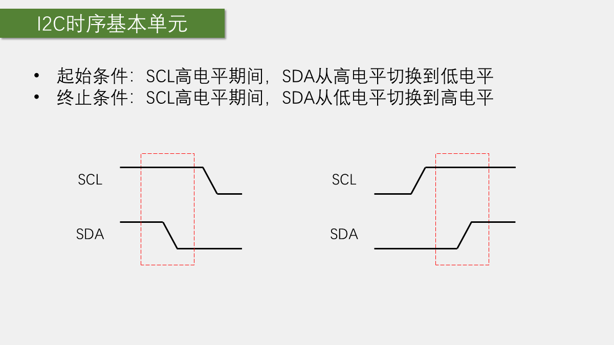
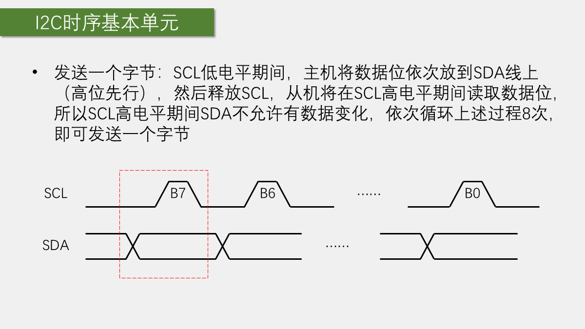
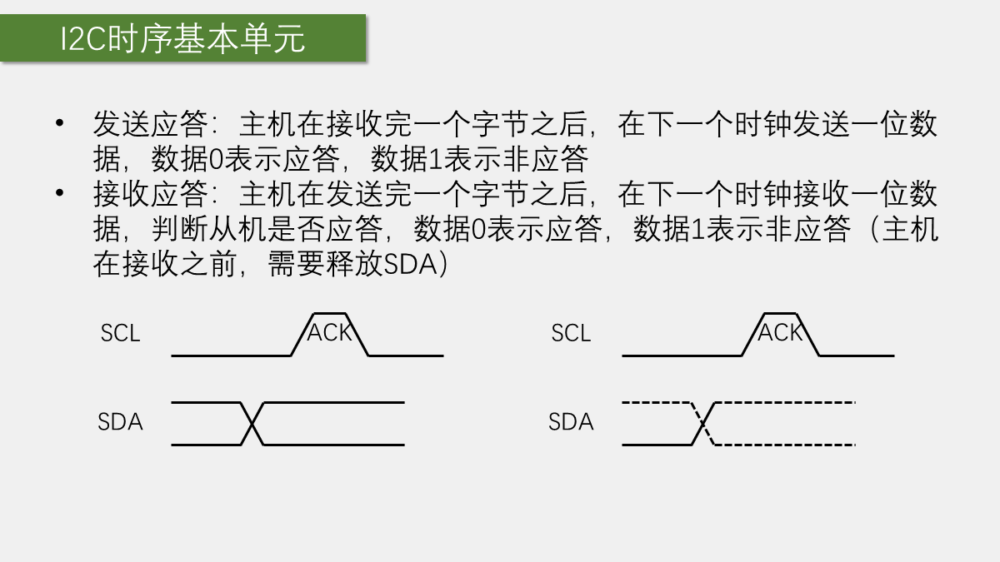
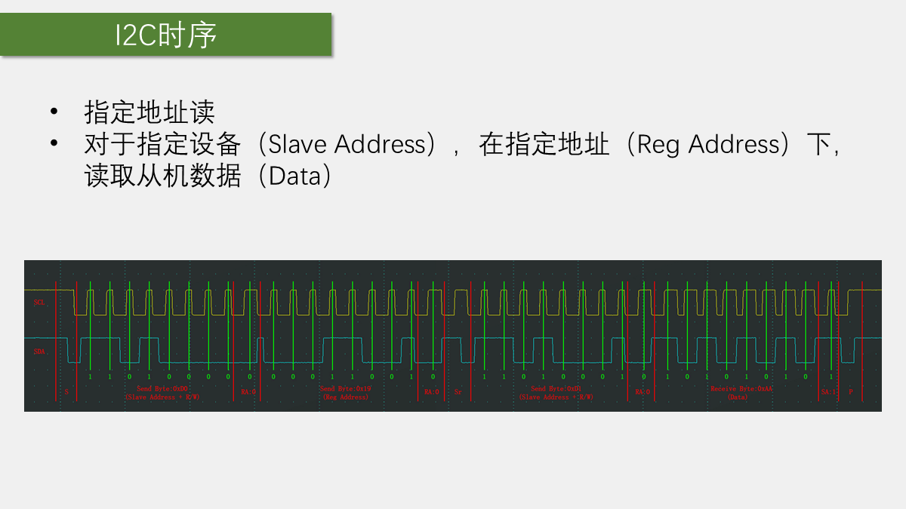
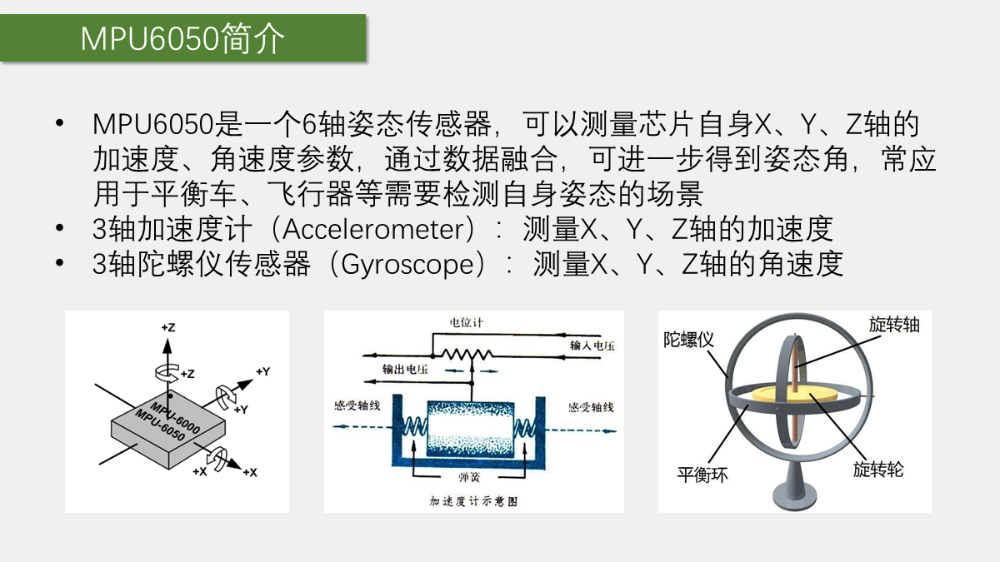
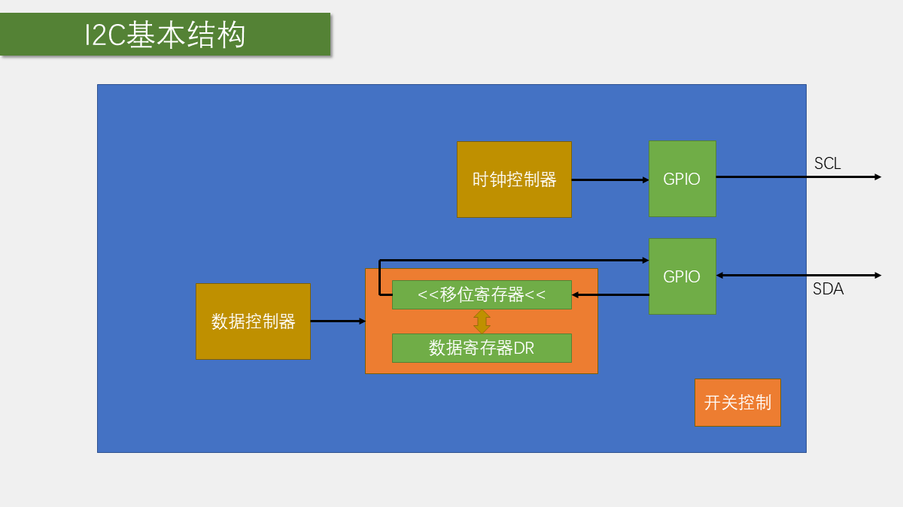
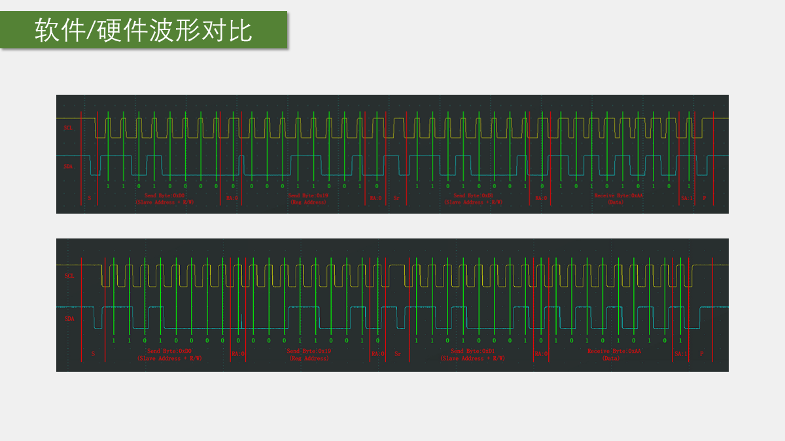

# 第 10 章 I2C 与 MPU6050

## 本章闭环

I2C 用两根开漏总线完成多设备寄存器读写。本章先用 GPIO 手动产生协议，再把底层替换为 I2C2 外设，两个工程共用同一套 MPU6050 寄存器接口：

| 工程 | SCL/SDA | 底层实现 | 验收结果 |
| --- | --- | --- | --- |
| `10-1 软件I2C读写MPU6050` | `PB10/PB11`，也可换普通 GPIO | `MyI2C.c` 手动翻转电平 | ID 为 `0x68`，六轴原始值变化 |
| `10-2 硬件I2C读写MPU6050` | 固定为 I2C2 的 `PB10/PB11` | 标准库事件接口 | 与软件 I2C 显示一致 |

```text
GPIO/I2C2 时序 -> 从机地址 -> MPU6050 寄存器地址
             -> 写配置或读数据 -> 组合 16 位有符号值 -> OLED
```

## 1. 从“读写外部寄存器”理解 I2C

STM32 内部外设通过地址映射寄存器控制；外挂芯片也可以把控制寄存器组织成线性地址空间。主控只需要通过通信协议发送：

- 从机地址；
- 寄存器地址；
- 写入的数据，或读取数据的请求。

例如，向 `0x06` 地址写入 `0xAA`，可以抽象成：

```text
从机地址 + 写方向 + 寄存器地址 0x06 + 数据 0xAA
```

读取 `0x06` 则先告诉从机寄存器地址，再切换到读方向，让从机返回该地址的数据。

I2C 针对这个过程增加了多设备共享、应答和同步时钟等规则，目标是在只使用两根线的情况下可靠完成寄存器事务。

## 2. I2C 的电气结构与接线

### 2.1 两根线和上拉



I2C 使用：

- `SCL`：串行时钟线；
- `SDA`：串行数据线。

两根线通常都是开漏结构，并通过上拉电阻获得逻辑高电平。设备只能主动拉低总线，不能强行输出高电平：

- 输出 `0`：器件主动拉低；
- 输出 `1`：器件释放总线，由上拉电阻拉高。

这样多个设备才能安全共享同一条总线。课程常见上拉电阻约为 `4.7 kΩ`，实际还要结合总线电容和速度选择。

### 2.2 主机、从机与地址

I2C 通信通常由主机发起：

- 主机产生 `SCL`；
- 主机决定当前是读还是写；
- 从机根据地址响应；
- 同一时刻只有一个设备主动驱动 SDA。

MPU6050 的 `AD0` 引脚决定 7 位地址最低位：课程模块 `AD0=0`，7 位地址为 `0x68`。课程驱动把地址左移后定义为 `0xD0`，最低位留给 R/W；标准库 `I2C_Send7bitAddress()` 也按这种左移后的形式接收地址。换用其他驱动 API 时，要先确认它需要 7 位地址 `0x68` 还是地址字节 `0xD0`，不能重复左移。

## 3. I2C 基本时序

### 3.1 起始和停止



- 起始条件：`SCL` 为高时，`SDA` 从高变低；
- 停止条件：`SCL` 为高时，`SDA` 从低变高。

数据传输期间通常保持 `SCL` 为低时改变 SDA，`SCL` 为高时采样 SDA。

### 3.2 发送与接收一个字节



I2C 高位先发送。发送方在 SCL 低电平期间准备 SDA，在 SCL 高电平期间保持稳定供接收方采样。接收时方向相反：主机先释放 SDA，从机在 SCL 低电平期间准备数据，主机在高电平期间读取。发送 8 位后，第 9 个时钟用于 ACK。

### 3.3 ACK 和 NACK



接收方在第 9 个时钟把 SDA 拉低表示 ACK，表示当前字节已经接收；保持 SDA 释放表示 NACK，常用于主机读完最后一个字节后通知从机停止继续发送。

因此，一个完整字节事务不是只有 8 个数据位，还包括第 9 个应答位。

## 4. 指定地址读写

### 4.1 指定地址写

指定地址写的基本流程是：

```text
START
从机地址 + W
ACK
寄存器地址
ACK
数据
ACK
STOP
```

写多个连续寄存器时，从机通常会自动递增内部地址指针：

```text
寄存器地址 -> 数据 0 -> 数据 1 -> 数据 2 -> ...
```

### 4.2 当前地址读与指定地址读

当前地址读不先发送寄存器地址，而是直接以读方向寻址，从从机内部当前地址指针所指位置取数据。它依赖上一次事务留下的地址指针，单独使用时不够直观。

指定地址读通常先用写方向设置地址，再重复起始并切换读方向：

```text
START
从机地址 + W
ACK
寄存器地址
ACK
重复 START
从机地址 + R
ACK
读取数据
主机 ACK 或 NACK
STOP
```



读取多个字节时，除最后一个字节外主机都发送 ACK，最后一个字节发送 NACK 并停止。

## 5. MPU6050 的寄存器与数据



### 5.1 模块连接与手册分工

模块至少需要连接：

- `VCC`；
- `GND`；
- `SCL`；
- `SDA`。

确认模块电平、供电和上拉条件满足后，再开始软件读写。SCL 和 SDA 接反、没有共地或总线没有上拉，都会表现为设备无应答。

产品说明书用于查功能、量程、引脚和电气参数；寄存器映射用于查寄存器地址及各位含义。写驱动时必须以寄存器映射为直接依据，不能只凭模块简介猜配置值。

### 5.2 先读设备 ID

设备 ID 是第一项验收。它可以确认：

- I2C 起始、停止和字节发送基本正确；
- 从机地址选择正确；
- 指定地址读流程能够完成；
- MPU6050 至少已经响应总线事务。

只有 ID 读取正常后，才继续写配置寄存器和读取传感器数据。

### 5.3 解除睡眠并配置量程

MPU6050 上电后通常处于睡眠状态。课程代码先向电源管理寄存器写入唤醒配置，再根据需要设置：

- 加速度计量程；
- 陀螺仪量程；
- 数字低通滤波；
- 采样分频。

如果仍处于睡眠状态，后续读取的数据可能无效，因此“先写配置、再读数据”是实验顺序中的关键。

课程初始化实际写入：

```c
MPU6050_WriteReg(MPU6050_PWR_MGMT_1, 0x01);
MPU6050_WriteReg(MPU6050_PWR_MGMT_2, 0x00);
MPU6050_WriteReg(MPU6050_SMPLRT_DIV, 0x09);
MPU6050_WriteReg(MPU6050_CONFIG, 0x06);
MPU6050_WriteReg(MPU6050_GYRO_CONFIG, 0x18);
MPU6050_WriteReg(MPU6050_ACCEL_CONFIG, 0x18);
```

其中 `PWR_MGMT_1=0x01` 解除睡眠并选择时钟源；`PWR_MGMT_2=0x00` 不关闭任何轴；陀螺仪和加速度计配置 `0x18`，分别选择课程使用的最大量程。原始值到物理单位的比例必须与量程设置一致。

### 5.4 读取六轴原始数据

加速度和陀螺仪数据通常各由高字节、低字节组成，并且相关寄存器连续排列。读取后按大端顺序组合：

```c
int16_t value = (int16_t)(((uint16_t)high << 8) | low);
```

得到的原始值不是直接的物理单位，还需要根据量程换算为加速度或角速度。入门实验先观察姿态变化是否引起数据同步变化，再进行单位换算。

课程代码逐个读取高、低字节，逻辑直观但事务较多。由于 `0x3B~0x48` 连续排列，更高效的实现可以从 `ACCEL_XOUT_H` 开始连续读取 14 字节，再按位置组合；这属于保持同一协议、减少重复事务，不改变寄存器含义。

## 6. 实验一：软件 I2C 读写 MPU6050


### 6.1 GPIO 配置

软件 I2C 不需要占用固定的 I2C 外设引脚，只要使用支持开漏输出和输入读取的 GPIO 即可。初始化通常完成：

1. 开启 GPIO 时钟；
2. 配置 SCL、SDA 为开漏输出；
3. 释放两根线，确认总线被上拉为高电平；
4. 用微秒级延时控制时序。

### 6.2 底层时序函数

建议把时序拆成小函数：

```text
I2C_Start()
I2C_Stop()
I2C_SendByte()
I2C_ReceiveByte()
I2C_SendAck()
I2C_SendNack()
```

发送一个字节时，在 SCL 低电平阶段设置 SDA，在 SCL 高电平阶段保持并让从机采样。接收一个字节时，主机释放 SDA，在 SCL 高电平阶段读取引脚。

每次发送和接收一个字节后都要处理 ACK。若从机没有应答，应尽快退出当前事务，而不是永久等待。

课程的底层接口为：

```c
void MyI2C_Start(void);
void MyI2C_Stop(void);
void MyI2C_SendByte(uint8_t Byte);
uint8_t MyI2C_ReceiveByte(void);
void MyI2C_SendAck(uint8_t AckBit);
uint8_t MyI2C_ReceiveAck(void);
```

`AckBit=0` 表示 ACK，`AckBit=1` 表示 NACK。读取单字节后，主机发送 NACK，再产生 STOP，表示不再继续接收。

### 6.3 封装寄存器读写

底层时序正确后，再封装面向器件的函数：

```text
MPU6050_WriteReg(address, data)
MPU6050_ReadReg(address)
MPU6050_ReadRegs(address, buffer, count)
```

这样 MPU6050 初始化代码只描述“向哪个寄存器写什么”，不会混入 GPIO 翻转细节。

课程软件 I2C 调用了 `MyI2C_ReceiveAck()`，但没有根据返回值中止事务。这足以演示波形，不等于具备错误传播。工程驱动应让写寄存器、读寄存器返回状态；任一步 NACK 都停止事务并向上层报告。

### 6.4 主程序与现象

主程序先显示 `WHO_AM_I`，再连续读取六轴原始值：

```c
MPU6050_Init();
ID = MPU6050_GetID();

while (1)
{
    MPU6050_GetData(&AX, &AY, &AZ, &GX, &GY, &GZ);
    OLED_ShowSignedNum(2, 1, AX, 5);
    OLED_ShowSignedNum(3, 1, AY, 5);
    OLED_ShowSignedNum(4, 1, AZ, 5);
    OLED_ShowSignedNum(2, 8, GX, 5);
    OLED_ShowSignedNum(3, 8, GY, 5);
    OLED_ShowSignedNum(4, 8, GZ, 5);
}
```

ID 应读为 `0x68`。转动模块时，相应轴的加速度和角速度原始值变化；静止时陀螺仪仍可能存在零偏，这不是通信失败。

## 7. 实验二：硬件 I2C 读写 MPU6050

### 7.1 固定引脚与初始化



课程示例使用硬件 I2C 引脚，常见连接为：

- `PB10`：I2C2_SCL；
- `PB11`：I2C2_SDA。

硬件 I2C 初始化需要配置：

- I2C 时钟和 GPIO 复用开漏；
- I2C 速率；
- 占空比；
- 自身地址；
- 7 位地址模式；
- ACK；
- 外设使能。

课程实际使用 I2C2、`50 kHz`、7 位地址和 ACK：

```c
GPIO_InitStructure.GPIO_Mode = GPIO_Mode_AF_OD;
GPIO_InitStructure.GPIO_Pin = GPIO_Pin_10 | GPIO_Pin_11;
GPIO_Init(GPIOB, &GPIO_InitStructure);

I2C_InitStructure.I2C_Mode = I2C_Mode_I2C;
I2C_InitStructure.I2C_ClockSpeed = 50000;
I2C_InitStructure.I2C_DutyCycle = I2C_DutyCycle_2;
I2C_InitStructure.I2C_Ack = I2C_Ack_Enable;
I2C_InitStructure.I2C_AcknowledgedAddress = I2C_AcknowledgedAddress_7bit;
I2C_InitStructure.I2C_OwnAddress1 = 0x00;
I2C_Init(I2C2, &I2C_InitStructure);
I2C_Cmd(I2C2, ENABLE);
```

### 7.2 按事件推进事务

硬件 I2C 不应只写成一串无条件寄存器操作，而应按事件确认每一步已经完成：

```text
产生 START
等待主机模式事件
发送从机地址
等待地址发送完成
发送寄存器地址
等待发送完成
读写数据
发送 STOP
```

指定地址读需要在写入寄存器地址后产生重复起始，再发送读方向地址。



### 7.3 单字节读取时的 ACK 和 STOP

硬件 I2C 读取一个字节时，在接收最后一个字节之前关闭 ACK 并产生 STOP，读完后再恢复 ACK：

```c
I2C_AcknowledgeConfig(I2C2, DISABLE);
I2C_GenerateSTOP(I2C2, ENABLE);
MPU6050_WaitEvent(I2C2, I2C_EVENT_MASTER_BYTE_RECEIVED);
Data = I2C_ReceiveData(I2C2);
I2C_AcknowledgeConfig(I2C2, ENABLE);
```

多字节接收的最后 1、2、3 个字节处理顺序更复杂，不能简单把这个单字节模板复制到任意长度。

还要注意，STM32F1 主机单字节接收对 `ACK`、`ADDR` 标志清除和 `STOP` 的先后有专门要求。课程用 `I2C_CheckEvent()` 等待接收模式后才关闭 ACK，便于展示事件链，但通用驱动应按 RM0008 的单字节接收序列实现，并结合芯片勘误核对；不要把多字节事件轮询代码机械裁成一个字节。

### 7.4 超时与错误返回

课程演示中常见的等待写法是：

```c
while (!I2C_CheckEvent(I2C2, I2C_EVENT_MASTER_BYTE_TRANSMITTING))
{
}
```

课程 `MPU6050_WaitEvent()` 已加入 `10000` 次计数，但超时后只是 `break`，没有返回错误，调用方仍继续后续步骤。因此它只避免永久卡死，不能证明事务成功。工程代码应让等待函数返回成功/失败；设备掉电、线路短路或总线异常时，超时后执行：

1. 释放 SCL、SDA；
2. 发送停止条件或执行总线恢复；
3. 清理错误标志；
4. 返回错误码。

## 8. 验收与排错

推荐顺序：

1. 检查供电、共地和上拉；
2. 读取 MPU6050 ID；
3. 写入唤醒和量程配置；
4. 读取一组加速度数据；
5. 读取完整六轴数据；
6. 将软件 I2C 替换为硬件 I2C，对比结果。

现象与原因：

- 没有 ACK：查供电、地址、上拉、SCL/SDA 是否接反；
- SDA 始终为高：主机没有驱动、引脚模式错误或没有产生时钟；
- SDA 始终为低：线路短路、从机卡死或开漏释放逻辑错误；
- ID 正确但数据不变：检查是否解除睡眠、寄存器地址和连续读取顺序；
- 硬件 I2C 卡死：检查事件顺序、错误标志和超时处理；
- 数据高低字节错位：检查寄存器起始地址、自动递增和字节组合。

## 本章小结

I2C 的学习链条是：

1. 用两根开漏总线和上拉电阻建立电气条件；
2. 用 START、字节、ACK 和 STOP 构成一次事务；
3. 用指定地址读写访问外挂芯片寄存器；
4. 先用软件 I2C 验证时序，再迁移到硬件 I2C；
5. 最终通过 MPU6050 的 ID 和六轴数据验证整个链路。

软件 I2C 和硬件 I2C 的区别主要在底层时序由谁产生，上层的 MPU6050 寄存器读写流程应保持一致。
