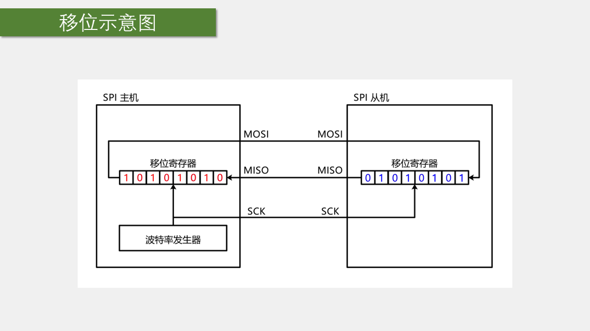
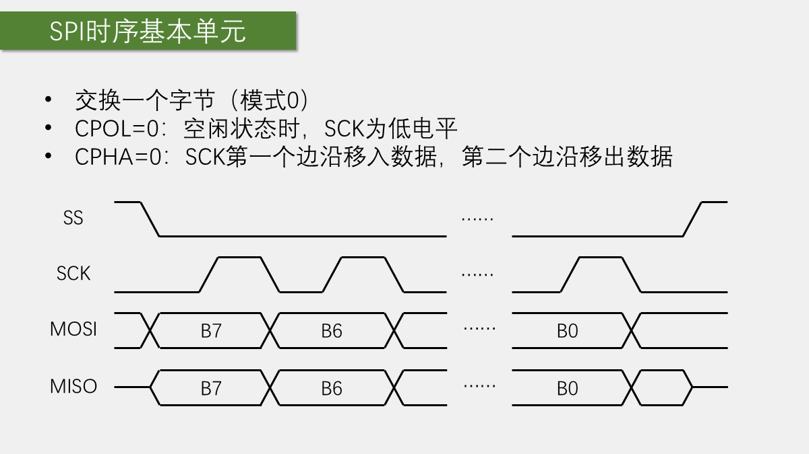
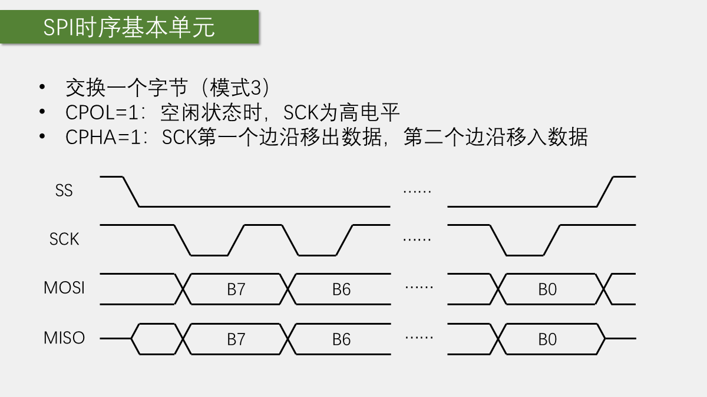
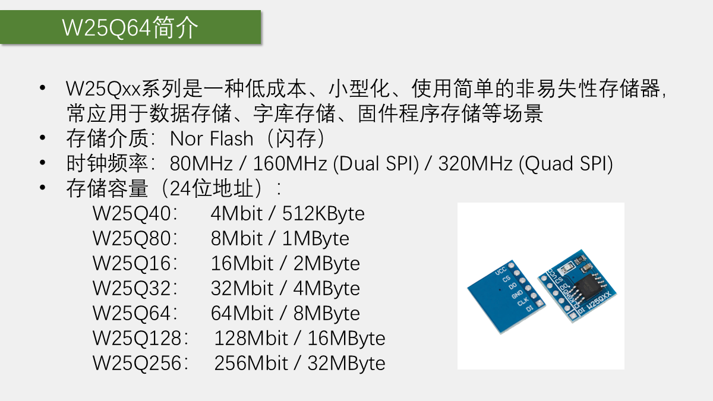
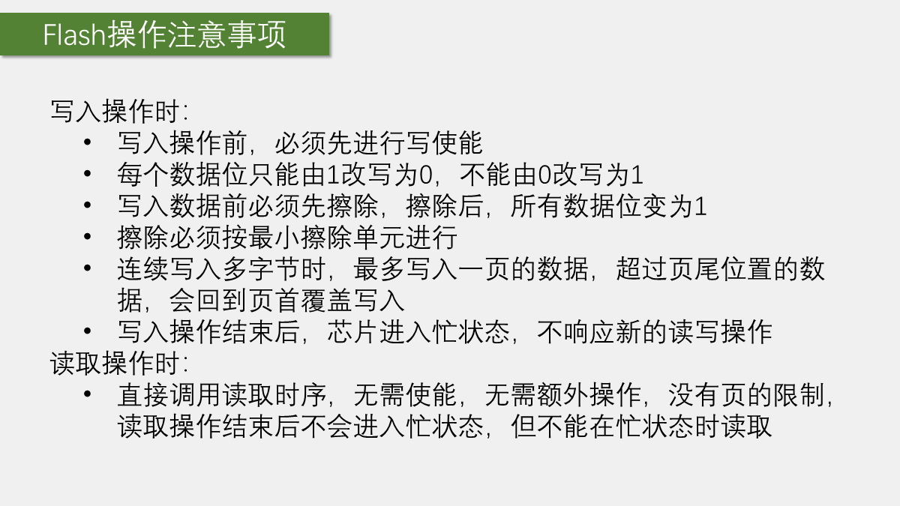
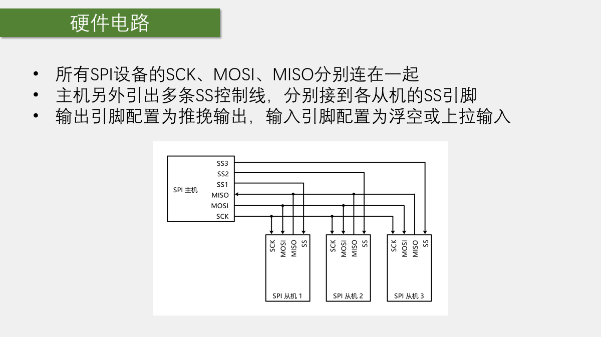
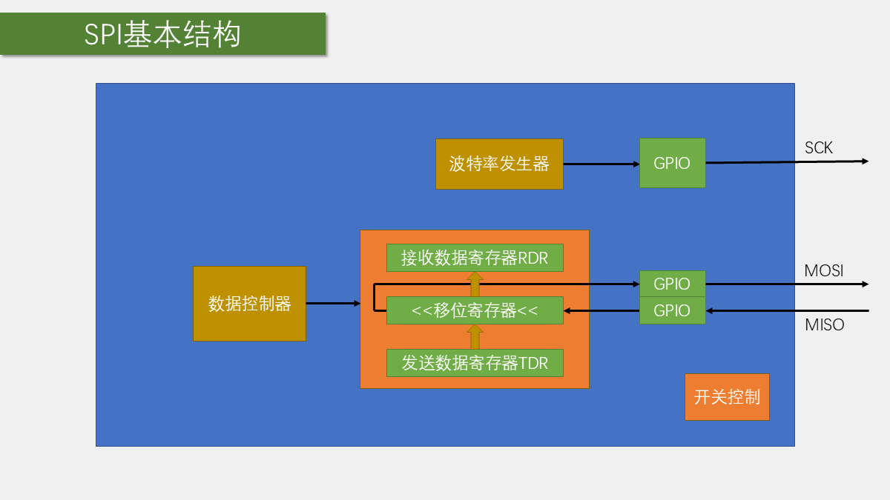
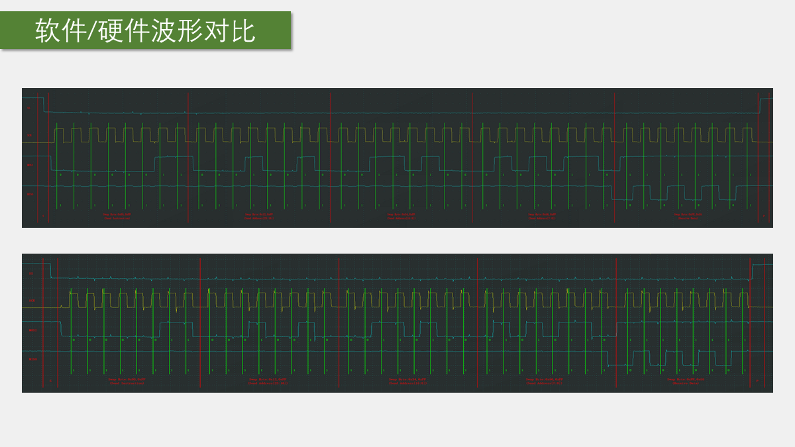

# 第 11 章 SPI 与 W25Q64

## 本章闭环

SPI 负责按时钟交换字节，W25Q64 指令负责解释这些字节。软件 SPI 和硬件 SPI 只替换最底层的 `MySPI_SwapByte()`，上层 Flash 驱动保持不变：

| 工程 | 字节交换方式 | 上层验收 |
| --- | --- | --- |
| `11-1 软件SPI读写W25Q64` | GPIO 手动产生模式 0 时序 | 读 JEDEC ID，擦除、写入、读回 |
| `11-2 硬件SPI读写W25Q64` | SPI1 全双工主机 | 与软件 SPI 结果一致 |

```text
GPIO/SPI1 交换字节
 -> CS 划分一次指令事务
 -> 指令 + 24 位地址 + 数据
 -> 写使能/等待 BUSY
 -> 读回比较
```

## 1. SPI 的硬件连接与交换机制



SPI 常用四根线：

| 信号 | 含义 | 方向（主机视角） |
| --- | --- | --- |
| `SCK` | 串行时钟 | 主机输出 |
| `MOSI` | 主机输出、从机输入 | 主机输出 |
| `MISO` | 主机输入、从机输出 | 主机输入 |
| `CS/SS` | 片选 | 主机输出 |

SCK、MOSI、MISO 可以由多个从机共享，但每个从机通常需要独立 CS。未被选中的从机必须让 MISO 处于高阻态，不能干扰当前通信。

SPI 是同步、全双工协议：每个时钟周期同时移出一位、移入一位。因此底层函数叫 `SwapByte()`，而不是单纯的发送或接收函数。只接收时也必须发送占位字节来产生时钟；只发送时也会收到一个通常被忽略的字节。

## 2. CPOL、CPHA 与字节交换

### 2.1 四种模式

`CPOL` 决定 SCK 空闲电平，`CPHA` 决定在哪个边沿采样数据。两者组合得到四种 SPI 模式：

| 模式 | CPOL | CPHA |
| --- | --- | --- |
| 0 | 0 | 0 |
| 1 | 0 | 1 |
| 2 | 1 | 0 |
| 3 | 1 | 1 |





课程中的 W25Q64 使用 SPI 模式 0。主机在一个边沿改变数据，在另一个边沿采样；模式设置错误时，常见现象是 ID 错位或读回数据异常。

### 2.2 软件交换一个字节

软件 SPI 模式 0 的基本顺序是：

```text
SCK 拉低
输出 MOSI 最高位
SCK 拉高
读取 MISO
SCK 拉低
移向下一位
重复 8 次
```

伪代码如下：

```c
uint8_t SPI_SwapByte(uint8_t Byte)
{
    uint8_t i;
    uint8_t Receive = 0;

    for (i = 0; i < 8; i++)
    {
        MOSI_Write((Byte & 0x80) != 0);
        Byte <<= 1;

        SCK_Write(1);
        Receive <<= 1;
        if (MISO_Read())
        {
            Receive |= 0x01;
        }
        SCK_Write(0);
    }

    return Receive;
}
```

只想发送时仍然会收到一个字节，只是接收结果通常被忽略；只想接收时仍然必须发送占位字节，例如 `0x00` 或 `0xFF`，因为没有时钟就不会产生接收数据。

## 3. W25Q64 的存储结构与指令



W25Q64 是容量为 8 MB 的非易失性 Flash。主机通过 SPI 指令访问它，典型事务都由 CS 拉低开始、CS 拉高结束。

W25Q64 容量为 64 Mbit，即 8 MB，使用 24 位地址。存储空间按页、扇区和块组织：一页 256 B，一个扇区 4 KB；读操作可连续跨地址，页编程必须服从页边界，擦除以扇区或更大单位进行。

### 3.1 读 ID

读 ID 的基本流程是：

```text
CS = 0
发送读 ID 指令
发送占位字节，同时接收厂商 ID
继续发送占位字节，同时接收器件 ID
CS = 1
```

课程示例使用的读 ID 指令是 `0x9F`。CS 必须覆盖完整指令和返回数据，不能在中间意外拉高。

### 3.2 读数据

```text
CS = 0
发送读数据指令
发送 24 位地址
连续发送占位字节并读取数据
CS = 1
```

读取可以跨越多个地址，Flash 内部地址会自动递增。

### 3.3 页编程

页编程的流程是：

```text
写使能
CS = 0
发送页编程指令
发送 24 位地址
发送本页数据
CS = 1
等待 BUSY 清零
```



页编程一次最多写一页，W25Q64 一页通常为 256 字节。若从页尾附近开始写入并超过页边界，数据可能回绕到本页开头，不能按普通线性地址理解。

### 3.4 扇区擦除

扇区擦除的流程是：

```text
写使能
CS = 0
发送扇区擦除指令
发送 24 位地址
CS = 1
等待 BUSY 清零
```

课程主要使用 4 KB 扇区擦除。擦除的最小单位不是一个字节，而是一个扇区、块或整片。

## 4. Flash 写入限制与状态寄存器

### 4.1 写入前必须写使能

W25Q64 默认禁止编程和擦除。执行页编程或扇区擦除前，要先发送写使能指令；操作完成后芯片通常会自动清除写使能状态。

### 4.2 位只能从 1 变成 0

Flash 编程只能把位从 `1` 写成 `0`，不能直接把 `0` 改回 `1`。如果要让某一位恢复为 `1`，必须先擦除所在扇区，使整个扇区回到 `0xFF`。

因此测试程序应使用专用测试扇区，避免覆盖重要数据。

### 4.3 擦除和编程都需要等待

指令发送完成不等于内部操作已经完成。芯片通过状态寄存器的 `BUSY` 位表示当前是否仍在擦除或编程：

```c
while (W25Q64_ReadStatusRegister() & 0x01)
{
}
```

实际工程应增加超时。擦除或编程期间不要继续发送新的写操作；读取前也要确认上一次内部操作已经结束。

### 4.4 课程使用的指令

| 功能 | 指令 |
| --- | --- |
| 写使能 | `0x06` |
| 读状态寄存器 1 | `0x05` |
| 页编程 | `0x02` |
| 4 KB 扇区擦除 | `0x20` |
| 读数据 | `0x03` |
| 读 JEDEC ID | `0x9F` |
| 占位字节 | `0xFF` |

驱动把这些常量集中放在 `W25Q64_Ins.h`，器件函数只组合事务，不散落魔法数字。

## 5. W25Q64 驱动分层

驱动分成三层：

```text
GPIO 或 SPI1
 -> MySPI_Start()/Stop()/SwapByte()
 -> W25Q64_WriteEnable()/WaitBusy()/ReadID()
 -> SectorErase()/PageProgram()/ReadData()
```

`MySPI_Start()`、`MySPI_Stop()` 实际控制普通 GPIO 的 CS。把 CS 留给软件管理，可以精确保证“指令、地址和数据”属于同一个事务，也便于一条 SPI 总线挂多个从机。

## 6. 实验一：软件 SPI 读写 W25Q64



### 6.1 GPIO 初始化

软件 SPI 使用普通 GPIO：

- SCK：推挽输出；
- MOSI：推挽输出；
- MISO：输入；
- CS：推挽输出，默认拉高。

W25Q64 未被选中时 CS 必须保持高电平。每条指令开始前拉低 CS，整条指令事务结束后再拉高。

课程接线直接选在 SPI1 默认引脚上，便于第二个工程原线切换：

| W25Q64 | STM32 | 软件 SPI 配置 |
| --- | --- | --- |
| CS | PA4 | 推挽输出 |
| CLK | PA5 | 推挽输出 |
| DO/MISO | PA6 | 上拉输入 |
| DI/MOSI | PA7 | 推挽输出 |

初始化后先令 CS 为高、SCK 为低，对应模式 0 的空闲状态。

### 6.2 软件 SPI 交换函数

课程按最高位到最低位循环：先设置 MOSI，再拉高 SCK 并读取 MISO，最后拉低 SCK。由于软件 GPIO 较慢，未额外插入延时也能满足本实验模块的时序；这不代表所有器件、所有主频都可忽略手册的建立时间和保持时间。

### 6.3 Flash 指令函数

页编程函数的核心事务为：

```c
W25Q64_WriteEnable();
MySPI_Start();
MySPI_SwapByte(W25Q64_PAGE_PROGRAM);
MySPI_SwapByte(Address >> 16);
MySPI_SwapByte(Address >> 8);
MySPI_SwapByte(Address);
for (i = 0; i < Count; i++)
{
    MySPI_SwapByte(DataArray[i]);
}
MySPI_Stop();
W25Q64_WaitBusy();
```

课程函数没有检查 `Count` 和页剩余空间，也不会自动拆页。调用者必须保证 `Count <= 256`，并且 `页内偏移 + Count <= 256`；否则数据可能回绕覆盖同一页开头。

### 6.4 主程序与实验现象

软件 SPI 代码按下面顺序验证：

1. 初始化 GPIO 和 CS；
2. 实现 `SPI_SwapByte()`；
3. 读取并显示厂商 ID、器件 ID；
4. 等待不忙；
5. 擦除测试扇区；
6. 从地址 `0x000000` 写入 `0x01 0x02 0x03 0x04`；
7. 读取四字节并显示；
8. 修改数组为 `0xA1 0xB2 0xC3 0xD4`，再次擦除、写入和读取；
9. 注释掉擦除和写入，只读出擦除后的区域，验证 `0xFF`。

课程主程序读取 `MID=0xEF`、`DID=0x4017`，擦除地址 `0x000000` 所在扇区，写入 `01 02 03 04`，再读回并显示。该地址只是教学用测试区；实际项目必须规划存储布局，避免每次启动都擦除有效数据。

## 7. 实验二：硬件 SPI1 读写 W25Q64

### 7.1 引脚与初始化



SPI1 常用引脚：

- `PA5`：SCK；
- `PA6`：MISO；
- `PA7`：MOSI；
- CS：普通 GPIO，由软件控制。

硬件 SPI 初始化需要匹配：

- 主机模式；
- 全双工；
- 8 位数据；
- 高位先行；
- 时钟分频；
- CPOL/CPHA；
- NSS 管理方式。

课程中的 W25Q64 使用模式 0，并通过普通 GPIO 管理 CS。SPI1 挂在 APB2，课程使用 `SPI_BaudRatePrescaler_128`，在 72 MHz 外设时钟下 SCK 约为：

$$
f_{SCK}=\frac{72\text{ MHz}}{128}=562.5\text{ kHz}
$$

```c
SPI_InitStructure.SPI_Mode = SPI_Mode_Master;
SPI_InitStructure.SPI_Direction = SPI_Direction_2Lines_FullDuplex;
SPI_InitStructure.SPI_DataSize = SPI_DataSize_8b;
SPI_InitStructure.SPI_FirstBit = SPI_FirstBit_MSB;
SPI_InitStructure.SPI_BaudRatePrescaler = SPI_BaudRatePrescaler_128;
SPI_InitStructure.SPI_CPOL = SPI_CPOL_Low;
SPI_InitStructure.SPI_CPHA = SPI_CPHA_1Edge;
SPI_InitStructure.SPI_NSS = SPI_NSS_Soft;
```

### 7.2 硬件交换函数

标准库的基本写法是：

```c
uint8_t MySPI_SwapByte(uint8_t ByteSend)
{
    while (SPI_I2S_GetFlagStatus(SPI1, SPI_I2S_FLAG_TXE) != SET)
    {
    }

    SPI_I2S_SendData(SPI1, ByteSend);

    while (SPI_I2S_GetFlagStatus(SPI1, SPI_I2S_FLAG_RXNE) == RESET)
    {
    }

    return SPI_I2S_ReceiveData(SPI1);
}
```

SPI 每次发送都会同时接收，因此必须读取接收寄存器，避免后续出现溢出或状态异常。实际工程同样需要给等待标志增加超时。



底层函数先等待 `TXE`，写入数据，再等待 `RXNE` 并读取接收寄存器。通用实现应保留两次状态检查，并给等待增加超时。

### 7.3 保持事务边界

硬件 SPI 只是替换字节交换方式，W25Q64 的指令事务不能改变：

```text
CS 拉低
发送完整指令、地址和数据
CS 拉高
等待 BUSY 清零
```

如果在指令、地址或数据之间拉高 CS，从机通常会把前面的内容当成一条不完整事务，导致读写失败。

## 8. 验收与排错

推荐顺序：

1. 读厂商和器件 ID；
2. 擦除测试扇区；
3. 读回并确认全为 `0xFF`；
4. 页编程写入已知数组；
5. 读回并逐字节比较；
6. 断电重启后再次读取，验证非易失性；
7. 将软件 SPI 换成硬件 SPI，重复上述测试。

常见现象：

- 全读 `0xFF`：查供电、CS、MISO、指令和地址；
- 全读 `0x00`：查 MISO 短路、SPI 模式和输入配置；
- ID 正确但写不进去：查写使能、BUSY、擦除和页边界；
- 数据整体错位：查 CPOL/CPHA、位序和 CS 边界；
- 写入跨页后内容异常：拆分成不跨页的多次页编程；
- 写入原有非 `0xFF` 区域失败：先擦除所在扇区。

## 本章小结

SPI 只规定“字节怎样交换”，W25Q64 指令才规定“这些字节代表什么”。课程的验证链应保持：

```text
GPIO/SPI 交换一个字节
    -> 读取 ID
        -> 擦除测试扇区
            -> 页编程
                -> 读取并比较
```

软件 SPI 和硬件 SPI 可以互相替换，但 CS 边界、指令顺序、写使能、页限制和 BUSY 等待不能省略。
