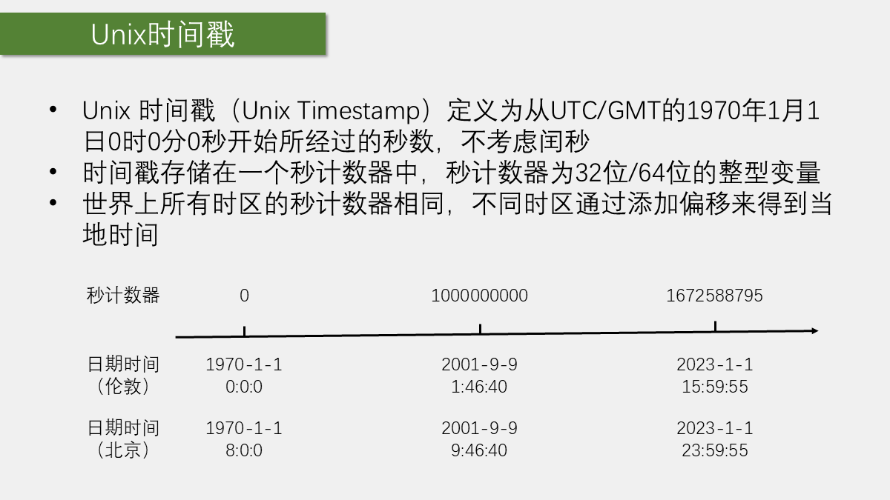
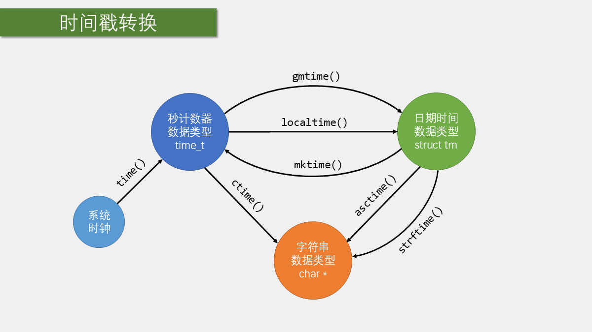
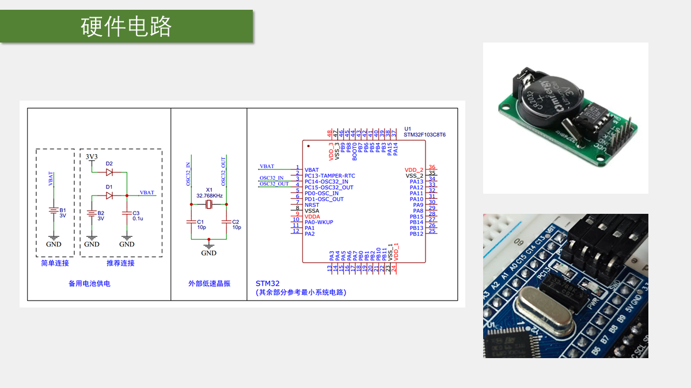
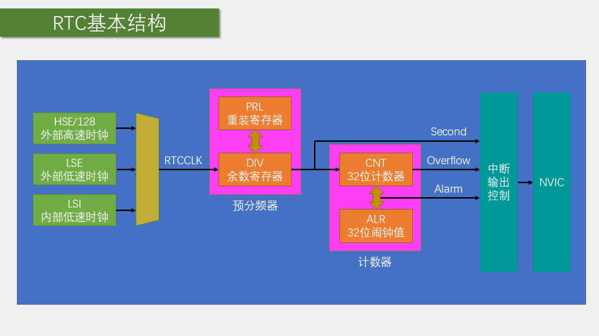
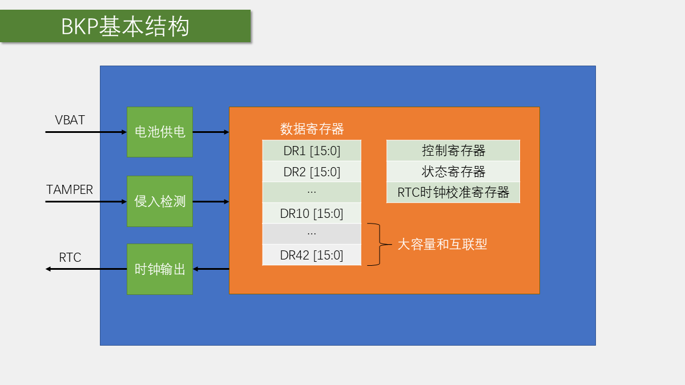

# 第 12 章 BKP 与 RTC

## 本章闭环

BKP 和 RTC 都位于后备域：BKP 保存少量状态，RTC 用低速时钟持续累计秒数。本章完成两个工程：

| 工程 | 目标 | 验收重点 |
| --- | --- | --- |
| `12-1 读写备份寄存器` | 按键修改并写入 `BKP_DR1/DR2` | 复位和 VDD 掉电后数据保持 |
| `12-2 实时时钟` | 时间戳与日期时间互转 | 只首次设时，VDD 掉电期间继续走时 |

```text
LSE 32.768 kHz -> RTC 预分频器 -> 1 Hz -> 32 位 CNT 时间戳
VBAT ---------------------------------> RTC + BKP 后备域供电
```

这里的关键不是“每秒加一”本身，而是同时处理后备域写保护、时钟源、首次初始化标记、跨时钟域同步和时区转换。

## 1. Unix 时间戳与日期时间

### 1.1 Unix 时间戳的定义



Unix 时间戳是从 UTC `1970-01-01 00:00:00` 开始经过的秒数。它本质上是一个连续递增的整数计数器，不直接携带时区信息。

例如，设备内部可以只保存一个秒计数器，显示时再把它转换为年、月、日、时、分、秒。

### 1.2 为什么使用时间戳

时间戳适合：

- 计算两个时刻之间的秒数差；
- 比较先后关系；
- 保存和传输时间；
- 让底层计时只维护一个递增计数器。

缺点是它不直观，读取时必须转换成日期和时间。

### 1.3 UTC、GMT 与北京时间

时间戳以 UTC 为基准。北京时间为 UTC+8，显示本地时间时需要进行时区转换。建议：

- 存储和通信统一使用 UTC 时间戳；
- 只在显示层转换为北京时间；
- 不要在多个函数中重复加 8 小时。



### 1.4 C 语言时间结构与课程转换方式

使用 `struct tm` 时要注意：

- `tm_year` 表示从 1900 年开始的偏移量；
- `tm_mon` 范围为 `0～11`，0 表示 1 月；
- `tm_mday` 才是从 1 开始的日号。

因此，显示年份和月份时不能直接把 `tm_year`、`tm_mon` 当作人类习惯的数值。

课程写入 RTC 时把北京时间转换成 UTC 时间戳，读取时再加 8 小时：

```c
time_date.tm_year = MyRTC_Time[0] - 1900;
time_date.tm_mon  = MyRTC_Time[1] - 1;
time_date.tm_mday = MyRTC_Time[2];
time_date.tm_hour = MyRTC_Time[3];
time_date.tm_min  = MyRTC_Time[4];
time_date.tm_sec  = MyRTC_Time[5];

time_cnt = mktime(&time_date) - 8 * 60 * 60;
RTC_SetCounter(time_cnt);
```

```c
time_cnt = RTC_GetCounter() + 8 * 60 * 60;
time_date = *localtime(&time_cnt);
```

这套写法依赖 C 库的时区环境和 `time_t` 宽度。课程工具链中用于演示可行；跨平台工程应明确 `mktime()`、`localtime()` 的时区约定，并确认 32 位时间戳的 2038 年边界是否可接受。

## 2. BKP、RTC 与后备域

### 2.1 后备域的作用



BKP、RTC、RTC 时钟源和备用电源接口共同构成后备域。主电源存在时，系统正常访问这些外设；主电源关闭而 `VBAT` 有效时，后备域仍可保持：

- BKP 备份寄存器数据；
- RTC 计数值；
- RTC 使用的低速时钟。

### 2.2 BKP 的功能

BKP 适合保存少量需要跨复位或跨主电源掉电保留的状态，例如：

- RTC 是否已经完成首次初始化；
- 上一次运行模式；
- 少量校准参数；
- 掉电前的状态标记。

它不适合替代大容量 Flash，也不适合在没有 `VBAT` 的情况下宣称数据永久保存。

STM32F103C8T6 属于中容量器件，课程所用 BKP 用户数据容量为 20 字节，即 10 个 16 位备份寄存器。它适合标志和少量参数，不适合频繁写入的大块数据。

### 2.3 访问权限与后备域复位

访问 BKP 和 RTC 前要开启对应时钟，并通过 PWR 允许后备域写访问：

```c
RCC_APB1PeriphClockCmd(RCC_APB1Periph_PWR |
                       RCC_APB1Periph_BKP, ENABLE);
PWR_BackupAccessCmd(ENABLE);
```

只开启 BKP 时钟而没有开启 PWR 写访问，写入操作可能不会生效。

调用 `BKP_DeInit()` 或执行后备域复位会清除 BKP 数据，并复位 RTC 与后备域时钟配置。普通系统复位不会自动清除这些内容。排错时要区分“CPU 复位”和“后备域复位”。

## 3. RTC 时钟源、预分频与同步

### 3.1 LSE、LSI 与 HSE/128

RTC 需要一个低速时钟源。常见选择包括：

- `LSE`：外部 32.768 kHz 晶振，精度较高，可由 `VBAT` 维持；
- `LSI`：内部低速 RC，成本低但精度较差；
- `HSE/128`：由高速外部时钟分频得到，主电源断开后不能依靠 VBAT 继续运行。

LSE 经过 `32768` 分频后可以得到 1 Hz：

$$
f_{\mathrm{RTC}}=\frac{32768\ \mathrm{Hz}}{32768}=1\ \mathrm{Hz}
$$

这也是课程中 `RTC_SetPrescaler(32768 - 1)` 的原因。

LSI 约为 40 kHz，频率误差较大，而且不能由 VBAT 维持。课程把它作为 LSE 无法起振时的替代代码，但使用 LSI 后，VDD 掉电期间 RTC 会暂停，不能再满足本章的掉电走时目标。

### 3.2 RTC 的核心计数器



RTC 可以看作一个由低速时钟驱动的独立计数器：

```text
RTC 时钟 -> 预分频器 -> 1 Hz 秒计数器 -> 时间戳
```

时间显示并不是 RTC 直接保存年、月、日，而是先读取秒计数器，再转换为日期和时间。

RTC 的 20 位预分频器包含重装值 `PRL` 和当前除法余数 `DIV`。`RTC_GetDivider()` 读取的是当前余数，它会随时钟递减；课程把它显示在 OLED 第四行，用来观察一秒内部的分频过程。

### 3.3 跨时钟域同步与写完成

RTC 由低速时钟驱动，而 CPU 通过 APB1 访问。APB1 接口曾关闭后，首次读取前要等待 `RSF` 同步；写 `PRL`、`CNT`、`ALR` 前后要等待配置与写操作完成。标准库封装为：

```c
RTC_WaitForSynchro();
RTC_WaitForLastTask();
```

每次调用 `RTC_SetPrescaler()` 或 `RTC_SetCounter()` 后，都应再次等待上一写任务完成，不能连续无条件写入。

### 3.4 后备域初始化只做一次

如果每次启动都重新设置 RTC 计数器，按复位键或主电源重新上电后时间都会回到初值。因此需要使用 BKP 标记区分：

- 第一次配置；
- 普通复位；
- 后备域仍然有效的重新启动。

## 4. 实验一：读写 BKP 备份寄存器



课程用 ST-Link 的 `3.3V` 接 `VBAT` 模拟备用电池，`PB1` 接按键。注意只能接 3.3 V，不能误接 ST-Link 的 5 V 输出。

### 4.1 基本库函数

课程中的 BKP 代码只需要掌握几个库函数：

```c
BKP_DeInit();
BKP_WriteBackupRegister(BKP_DR1, data);
data = BKP_ReadBackupRegister(BKP_DR1);
```

`BKP_DR1`、`BKP_DR2` 等表示不同的备份寄存器。

### 4.2 读写实验

课程数组初值为 `0x1234`、`0x5678`。每按一次键，两个值各加一，写入 `BKP_DR1/DR2`，主循环持续读回并显示：

```c
uint16_t ArrayWrite[] = {0x1234, 0x5678};
uint16_t ArrayRead[2];

BKP_WriteBackupRegister(BKP_DR1, ArrayWrite[0]);
BKP_WriteBackupRegister(BKP_DR2, ArrayWrite[1]);

ArrayRead[0] = BKP_ReadBackupRegister(BKP_DR1);
ArrayRead[1] = BKP_ReadBackupRegister(BKP_DR2);
```

OLED 第一行显示本次写入值，第二行显示实际读回值。按复位键后，第一行会回到程序数组初值，但第二行仍读出后备域中的上次数据；保留 VBAT 并断开 VDD 后，读回值也应保持。

### 4.3 BKP 不是 Flash

BKP 在 VDD 断开后依靠 VBAT 保持。若 VDD 和 VBAT 同时失电，数据会丢失；它没有 Flash 的非易失存储特性。验证时应分别测试复位、只断 VDD、VDD/VBAT 全断三种情况。

## 5. 实验二：RTC 实时时钟

### 5.1 用标记判断是否首次初始化

RTC 初始化可以使用一个不容易误判的标记：

```c
#define RTC_INIT_FLAG 0xA5A5

if (BKP_ReadBackupRegister(BKP_DR1) != RTC_INIT_FLAG)
{
    /* 第一次配置 RTC */
}
else
{
    /* 后备域已有有效配置，只做同步 */
}
```

首次配置成功后写入标记。后续复位读取到该标记，就不能再次覆盖 RTC 当前计数值。

标记只说明“后备域曾被本程序配置”，不验证时钟是否仍在正常运行。量产设备还应考虑标记碰撞、晶振失败、时间合法范围和用户重新设时流程。

### 5.2 首次配置

课程使用 LSE 作为 RTC 时钟源，基本顺序如下：

```c
RCC_APB1PeriphClockCmd(RCC_APB1Periph_PWR |
                       RCC_APB1Periph_BKP, ENABLE);
PWR_BackupAccessCmd(ENABLE);

if (BKP_ReadBackupRegister(BKP_DR1) != RTC_INIT_FLAG)
{
    RCC_LSEConfig(RCC_LSE_ON);
    while (RCC_GetFlagStatus(RCC_FLAG_LSERDY) != SET)
    {
    }

    RCC_RTCCLKConfig(RCC_RTCCLKSource_LSE);
    RCC_RTCCLKCmd(ENABLE);

    RTC_WaitForSynchro();
    RTC_WaitForLastTask();

    RTC_SetPrescaler(32768 - 1);
    RTC_WaitForLastTask();

    RTC_SetCounter(initial_timestamp);
    RTC_WaitForLastTask();

    BKP_WriteBackupRegister(BKP_DR1, RTC_INIT_FLAG);
}
```

### 5.3 普通复位

如果 BKP 标记已经存在，不再重新设置时钟源和计数器，只等待 RTC 同步：

```c
else
{
    RTC_WaitForSynchro();
    RTC_WaitForLastTask();
}
```

`RTC_WaitForSynchro()` 用于等待 RTC 时钟域与 APB1 访问域完成同步；`RTC_WaitForLastTask()` 用于等待上一次 RTC 写操作结束。

### 5.4 读取和显示

```c
uint32_t timestamp = RTC_GetCounter();
uint32_t prescaler = RTC_GetDivider();
```

读取秒计数器后，再使用时间转换函数得到年、月、日、时、分、秒。课程主循环显示：

- 当前日期；
- 当前时间；
- 原始时间戳；
- 预分频器当前值。

第一次运行把 `MyRTC_Time[]` 中的 `2023-01-01 23:59:55` 写入 RTC。复位后不再设置，时间应继续递增；需要重新设时，应显式调用 `MyRTC_SetTime()`，不能靠每次启动覆盖。

## 6. LSE 起振与工程处理

课程测试中有些芯片可能出现 LSE 不起振，程序会卡在：

```c
while (RCC_GetFlagStatus(RCC_FLAG_LSERDY) != SET)
{
}
```

实际工程不应永久等待，应加入超时：

```c
uint32_t timeout = 0xFFFF;
while (RCC_GetFlagStatus(RCC_FLAG_LSERDY) == RESET)
{
    if (timeout-- == 0)
    {
        /* 报告 LSE 启动失败，切换备用方案或停止初始化 */
        break;
    }
}
```

排查 LSE 时检查：

- 32.768 kHz 晶振是否焊接；
- 负载电容和 PCB 走线是否合适；
- 后备域是否被错误复位；
- `VBAT` 是否供电；
- 芯片和开发板的 RTC 晶振电路是否一致。

课程还观察到某些板卡在主电源断开后，VBAT 可能通过板上路径给其他电路提供微弱供电，导致指示灯或 OLED 仍有微光。这属于硬件电源路径现象，不等同于 RTC 功能失败。

课程原代码会无限等待 `LSERDY`。工程版应在超时后返回明确错误；若切换 LSI，必须同时说明精度下降且 VDD 掉电后停止走时，不能把“程序不再卡死”误当成 RTC 功能等价恢复。

## 7. 验收与排错

### 7.1 BKP 验证

1. 接好 `VBAT`；
2. 写入 `BKP_DR1`、`BKP_DR2`；
3. 读取并显示；
4. 按复位键，确认数据不变；
5. 断开主电源、保留 `VBAT`，确认数据保持；
6. 断开 `VBAT`，确认数据丢失。

### 7.2 RTC 验证

1. 首次运行时设置测试时间；
2. 检查日期、时间戳和预分频值；
3. 按复位键，确认时间继续运行；
4. 保留 `VBAT` 并断开主电源；
5. 恢复主电源，确认时间没有回到初值；
6. 比较断电前后的时间差，确认 RTC 在后备电源下继续走时。

常见问题：

- 每次启动都回到初值：BKP 标记没有写入或每次都执行了 `RTC_SetCounter()`；
- BKP 写不进去：没有开启 PWR 时钟或没有调用 `PWR_BackupAccessCmd(ENABLE)`；
- 主电源掉电后时间停止：VBAT 未接、后备域未配置或没有使用 LSE；
- 时间快慢不准：检查时钟源、预分频值和晶振；
- 日期差一天或月份差一：检查时区以及 `struct tm` 的年份、月份偏移；
- 程序卡在 `LSERDY`：检查晶振和后备电源，并加入超时。

## 本章小结

BKP 与 RTC 的课程闭环是：

```text
BKP 写入/读取
    -> 复位和主电源掉电保持
        -> 时间戳计数
            -> LSE 产生 1 Hz RTC 时钟
                -> BKP 标记控制首次初始化
                    -> RTC 在 VBAT 下继续走时
```

RTC 的核心不是简单地“每秒加一”，而是保证后备域供电、时钟源、首次初始化判定、寄存器同步和时间转换全部正确。
