# PCB 设计入门教程

## 如何使用这份教程

PCB 设计并不等于“会操作 EDA 软件”。软件只负责把设计意图画出来，真正决定板子能否工作的，是下面这条知识链：

1. 看懂元件和原理图，知道电路为什么这样连接；
2. 把原理图中的逻辑连接转换为 PCB 上的实际铜连接；
3. 选择正确封装，完成布局、布线和规则检查；
4. 输出生产文件，经过加工、焊接和调试得到成品。

第一次阅读建议按顺序学习。已有电路基础的读者，可以从“第三部分：PCB 设计基础”开始；遇到元件、网络或 KCL/KVL 等概念不清楚时，再回到第二部分查阅。

| 部分 | 解决的问题 | 对应课程 |
| --- | --- | --- |
| 第一部分：认识 PCB | PCB 从哪里来，EDA 用来做什么 | 第 1～2 课 |
| 第二部分：电路与原理图基础 | 元件如何工作，怎样读懂和表达电路 | 第 3～7 课 |
| 第三部分：PCB 设计基础 | 板上有什么、各层做什么、怎样从原理图走到成品 | 第 8～11 课 |
| 附录 | 术语、读图方法和设计流程速查 | 全课程 |

---

## 第一部分：认识 PCB

### 第 1 章 课程路线与学习目标

PCB 是 **Printed Circuit Board** 的缩写，中文通常称“印制电路板”或“印刷电路板”。它的核心作用有两个：

- **机械支撑**：把电阻、电容、芯片、连接器等器件固定在确定的位置；
- **电气连接**：用铜箔形成的导线、焊盘和过孔，按照原理图规定的关系连接器件。

入门阶段的目标不是一开始就挑战复杂高速板，而是建立一套不会混乱的基本认知：能识别常见元件，能读懂简单原理图，知道 PCB 每个组成部分的作用，并理解从原理图到成品板的完整流程。

*图 1-1　课程把学习过程划分为入门、强化和进阶阶段；本文只整理入门篇。*

课程选择嘉立创 EDA 专业版作为工具，主要原因是它集成了原理图、PCB、元件库和 3D 预览等常用能力，并且与国内元器件和 PCB 制造资源衔接紧密。但无论以后改用 Altium Designer、KiCad 还是其他 EDA，元件、网络、封装、布局和布线这些基础概念都不会改变。

### 第 2 章 PCB 技术为什么会出现

#### 2.1 从手工接线到印制线路

早期电子设备使用电子管和大量导线。器件之间需要人工逐根接线、焊接，不仅生产效率低，线路也容易接错、松脱，设备体积很难缩小。电子设备逐渐复杂后，人们需要一种能重复制造、连接可靠、便于批量生产的布线方法，PCB 技术由此产生。

*图 2-1　PCB 的直接价值，是把原本依赖人工的接线关系变成可复制的图形。*

1920 年代，人们开始尝试在绝缘基板上形成导电线路。核心思想与今天一致：先确定线路图形，再通过印刷、沉积、电镀或蚀刻等工艺，让导电材料只保留在需要连接的位置。

*图 2-2　“印制”并不限定某一种工艺，它强调的是线路图形能够稳定、重复地制造。*

#### 2.2 晶体管、集成电路推动 PCB 普及

20 世纪中期，晶体管逐步取代电子管，电子设备开始小型化。随后集成电路把越来越多的晶体管集成到单个芯片中，引脚数量和连接密度不断增加。手工飞线已经无法兼顾效率、体积和一致性，PCB 因而成为电子产品的基础制造方式。

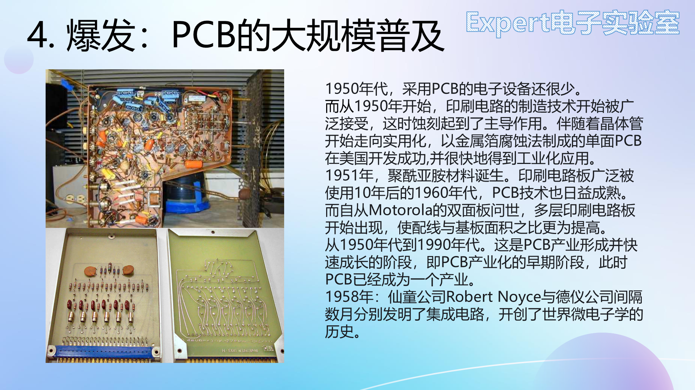

*图 2-3　元件小型化和批量生产需求共同推动了 PCB 普及。*

PCB 的演进大致沿着几条方向展开：

- 从单面板发展到双面板、多层板；
- 从较宽的导线和间距发展到更高密度互连；
- 从普通通孔发展出盲孔、埋孔、微孔等结构；
- 从刚性板扩展到柔性板、刚柔结合板和多种特殊基材；
- 从手工贴图、胶带拼版发展到计算机辅助设计。

#### 2.3 CAD 与 EDA 改变设计方式

个人计算机普及后，PCB 设计逐渐从手工绘图转向 CAD。设计者可以在屏幕上放置器件、编辑连线、修改布局，并由软件执行规则检查。相比纸面设计，计算机设计更容易修改、复用和协作。

*图 2-4　CAD 让图纸编辑数字化，EDA 则进一步覆盖电路设计、验证和制造数据输出。*

EDA 是 **Electronic Design Automation**，即电子设计自动化。对 PCB 设计者来说，常见功能包括：

- 原理图绘制和电气规则检查；
- 元件符号、封装和器件属性管理；
- PCB 布局、布线、铺铜和设计规则检查；
- 3D 外观检查；
- 生产文件、物料表和坐标文件输出。

*图 2-5　软件界面会变，但原理图、封装、网络和设计规则是共通语言。*

这一章最重要的结论是：**PCB 不是一张“画得像电路板的图”，而是一组能被稳定制造的结构和连接关系。EDA 的任务，是把这些关系准确地表达成制造数据。**

---

## 第二部分：电路与原理图基础

### 第 3 章 从实物电路到原理图

#### 3.1 为什么需要抽象

面对一块焊满器件的电路板，仅凭照片很难判断每个器件的名称、引脚和连接关系。原理图的作用类似地图：它不复刻实物外观，而是保留分析电路所需的关键信息。

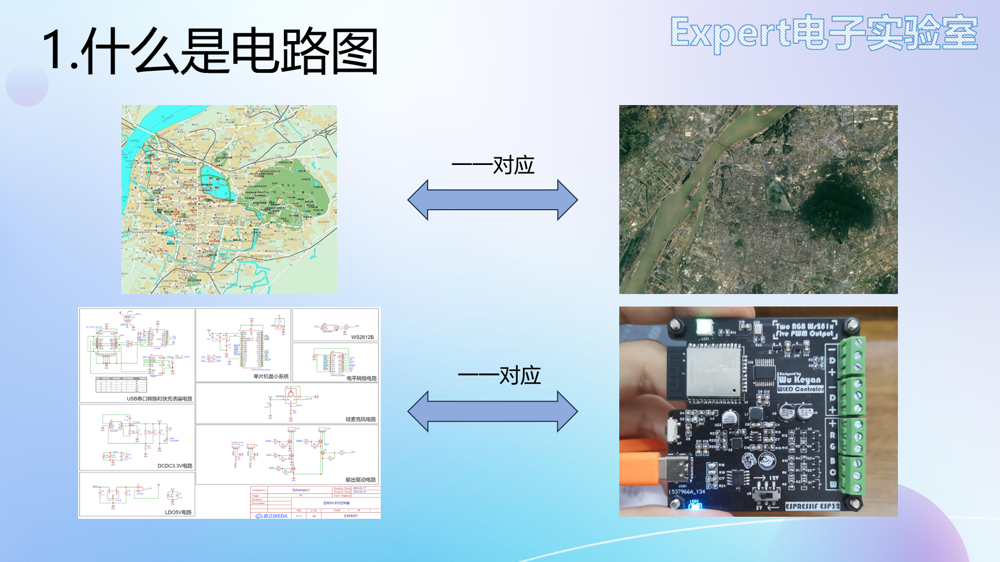

*图 3-1　实物位置、外形可以被简化，但关键对象和连接关系不能丢失。*

原理图中的器件位置通常不等于 PCB 上的实际位置。比如两个电阻在原理图上相邻，只表示这样画更容易理解，并不要求它们在 PCB 上紧挨着。原理图关心“谁和谁相连”，PCB 还要进一步关心“器件放在哪里、铜线怎样走”。

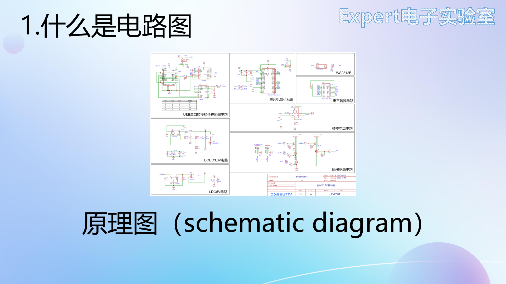

*图 3-2　原理图英文为 schematic diagram，是后续 PCB 设计的逻辑依据。*

#### 3.2 原理图四要素

一张可读的原理图通常包含四类信息：

1. **元件符号**：表示电阻、电容、芯片等器件及其引脚；
2. **连接线**：表示电气连接；
3. **节点**：表示多条连接在电气上汇合为同一点；
4. **注释**：说明模块功能、信号含义、关键参数和设计要求。

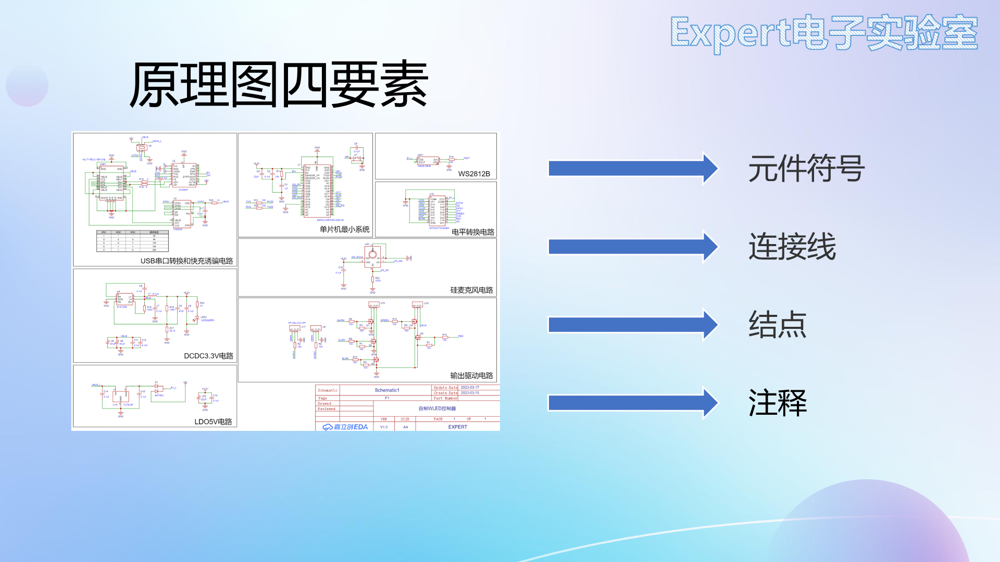

*图 3-3　元件和连接决定电路功能，注释决定别人能否快速、准确地理解设计。*

每个元件还应有唯一的位号，例如 `R1`、`C5`、`D2`、`U3`。字母通常说明器件类别，数字用于区分同类器件。位号会贯穿原理图、PCB、物料表和焊接调试，因此不能随意重复。

### 第 4 章 电阻、电容和电感

#### 4.1 电阻：限制电流并消耗能量

电阻常用字母 $R$ 表示，单位为欧姆（$\Omega$）。在线性电阻的工作范围内，电压与电流满足欧姆定律：

$$
U=IR
$$

电阻把电能转化为热等其他形式，常见功率关系为：

$$
P=UI=I^2R=\frac{U^2}{R}
$$

选择电阻时不能只看阻值，还要关注允许误差、额定功率、最大工作电压、温度系数和封装。实际功耗应留有余量，不能让电阻长期工作在额定功率边缘。

贴片电阻常用数字或字母标记阻值：

- 三位标记：前两位是有效数字，第三位是 $10$ 的幂。例如 `103` 表示 $10\times10^3\ \Omega=10\ \mathrm{k}\Omega$；
- 四位标记：前三位是有效数字，第四位是 $10$ 的幂。例如 `1001` 表示 $1\ \mathrm{k}\Omega$；
- `R` 代替小数点，例如 `4R7` 表示 $4.7\ \Omega$。

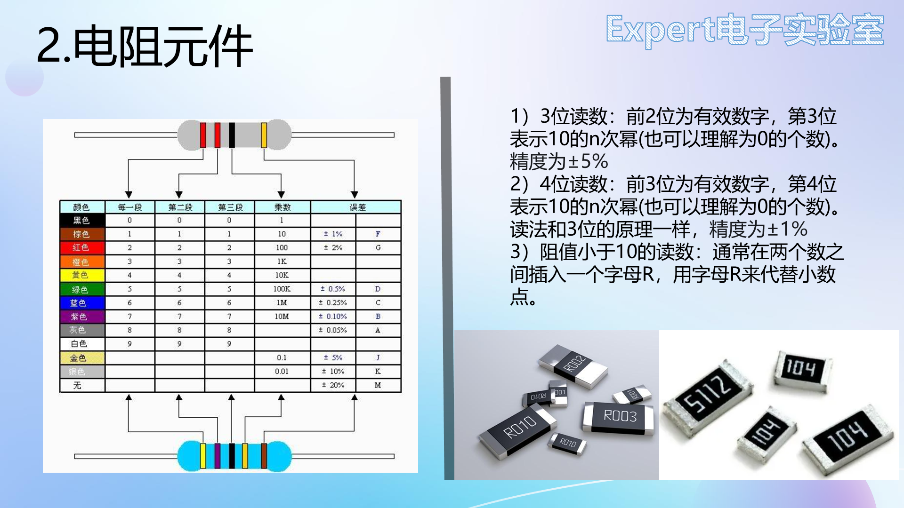

*图 4-1　小封装电阻不一定印字；无法确认时应查物料信息或测量，而不是凭外观猜测。*

#### 4.2 电容：储存电荷并抑制电压突变

电容常用字母 $C$ 表示，单位为法拉（F）。电荷、电压和电容的关系为：

$$
q=Cu
$$

电容电流与电压变化率满足：

$$
i_C=C\frac{\mathrm{d}u_C}{\mathrm{d}t}
$$

因此电容两端电压不能瞬间突变。若已知初始电压，则：

$$
u_C(t)=u_C(t_0)+\frac{1}{C}\int_{t_0}^{t}i_C(\tau)\,\mathrm{d}\tau
$$

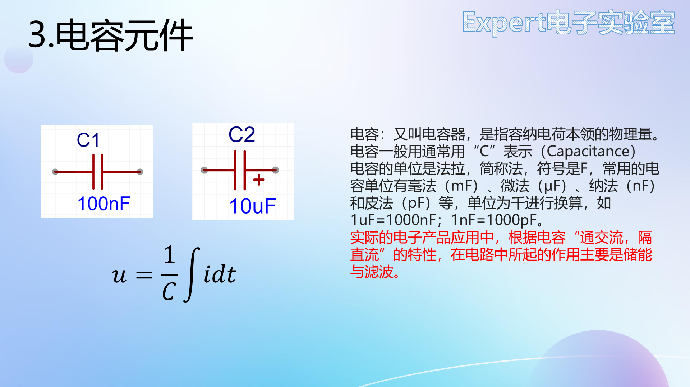

*图 4-2　常用单位按千进制换算：$1\ \mu\mathrm{F}=1000\ \mathrm{nF}$，$1\ \mathrm{nF}=1000\ \mathrm{pF}$。*

在直流稳态的理想模型中，电容相当于开路；对变化较快的信号，电容阻抗会降低。因此电容常用于电源去耦、滤波、耦合、定时和储能。

常见电容包括陶瓷电容、电解电容、钽电容和薄膜电容。使用时要特别注意：

- 电解、钽等有极性电容不能反接；
- 实际电容有耐压限制，额定耐压应高于工作电压；
- 电容值会受频率、温度、直流偏压和材料影响；
- 去耦电容必须靠近被去耦芯片的电源引脚，短而宽的回路比“原理图上接了”更重要。

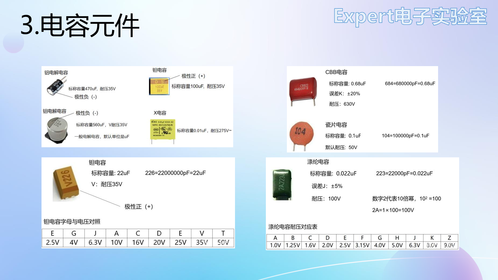

*图 4-3　原理图符号表达电气属性，实物外形和 PCB 封装则由具体型号决定。*

#### 4.3 电感：储存磁场能量并抑制电流突变

电感常用字母 $L$ 表示，单位为亨利（H），常用单位还有毫亨（mH）和微亨（$\mu$H）。电感电压与电流变化率满足：

$$
u_L=L\frac{\mathrm{d}i_L}{\mathrm{d}t}
$$

所以电感电流不能瞬间突变。理想电感在直流稳态下相当于短路，但实际电感存在绕组电阻、额定电流、饱和电流和频率特性。

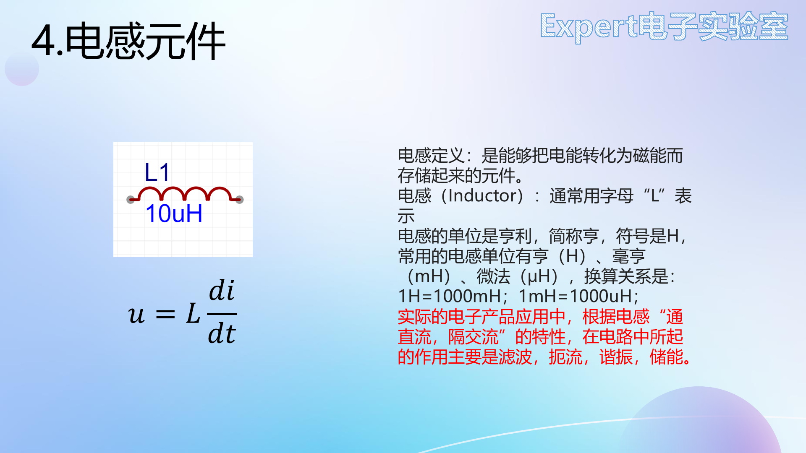

*图 4-4　电感常用于开关电源储能、滤波、选频和抑制电流变化。*

电阻、电容、电感的直觉可以这样区分：电阻限制当前电流并消耗能量；电容反对电压突然变化；电感反对电流突然变化。这一差别会直接影响器件布局和走线，例如开关电源中的高频电流回路必须尽量小。

### 第 5 章 二极管、三极管、场效应管与集成电路

#### 5.1 二极管：具有方向性的 PN 结器件

二极管有阳极 A 和阴极 K。普通硅二极管在正向电压达到一定程度后明显导通，反向时通常截止，因此常被概括为“单向导电”。这个说法适合建立直觉，但实际器件仍有正向压降、反向漏电、反向耐压和开关速度等限制。

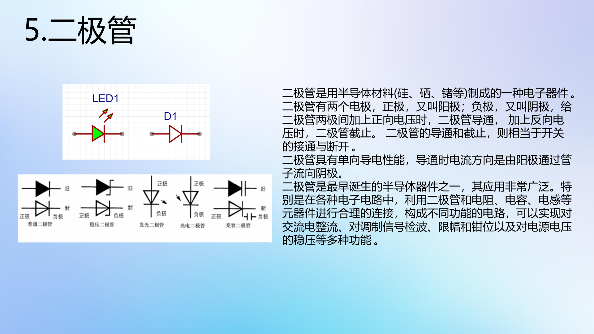

*图 5-1　电流正方向通常从阳极流向阴极；实物封装上的色环常用于标记阴极。*

不同二极管承担不同任务：整流二极管用于电源整流，肖特基二极管正向压降低、速度快，稳压二极管用于电压钳位，TVS 用于瞬态保护，LED 把电能转化为光。选型不能只写“D”，必须根据电流、耐压、速度、压降和封装选择具体型号。

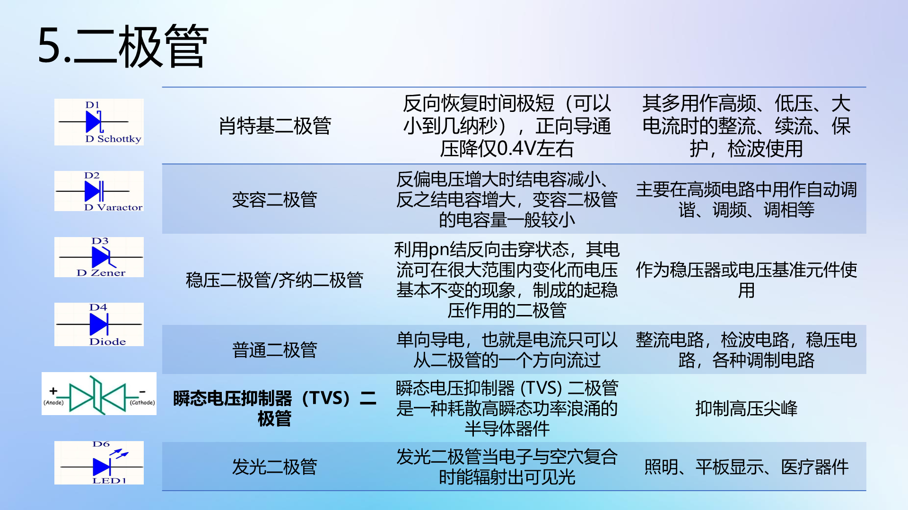

*图 5-2　LED 必须限制正向电流，最简单的方式是串联限流电阻。*

#### 5.2 双极型三极管：用较小控制量影响较大电流

双极型晶体管（BJT）分为 NPN 和 PNP，两者都有基极 B、集电极 C、发射极 E。入门分析中常把它理解为由基极电流控制集电极电流的器件：

$$
I_C\approx \beta I_B
$$

这个关系只适用于放大区，并且 $\beta$ 会随器件、温度和工作点变化，不能把它当作精确常数。

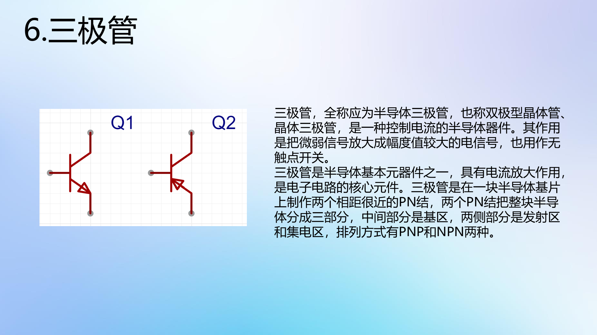

*图 5-3　NPN 与 PNP 的电流方向和偏置极性不同，设计时不能互换。*

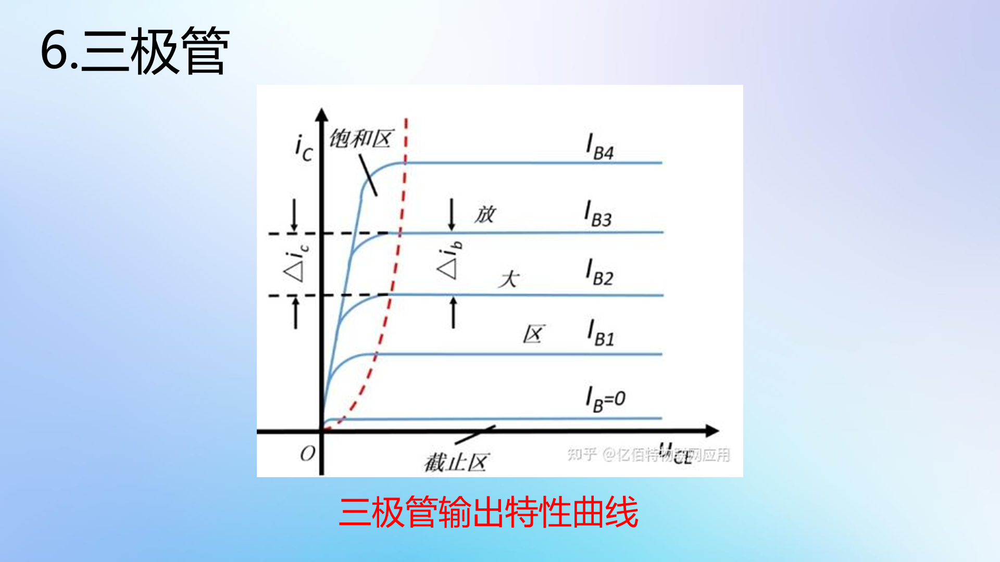

*图 5-4　输出曲线帮助区分截止区、放大区和饱和区。*

三极管的三个典型工作状态是：

- **截止**：基极没有足够驱动，集电极和发射极之间近似断开；
- **放大**：发射结正向偏置、集电结反向偏置，输出随输入变化；
- **饱和**：两个 PN 结均正向偏置，继续增加基极电流也难以按比例增加集电极电流。

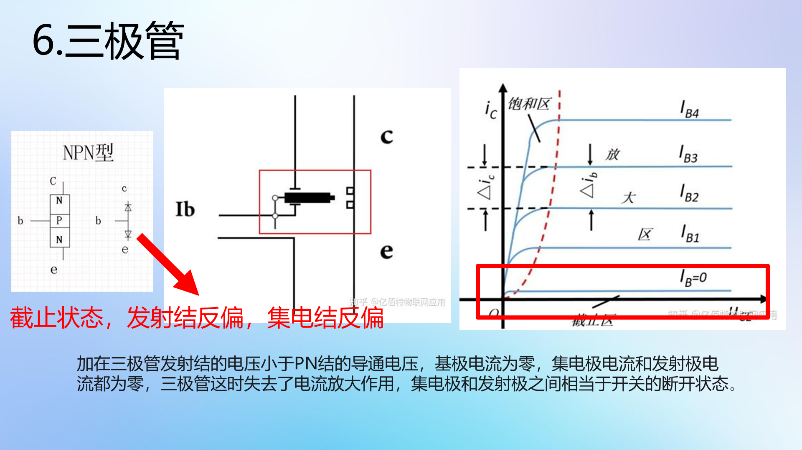

*图 5-5　截止状态可类比开关断开。*

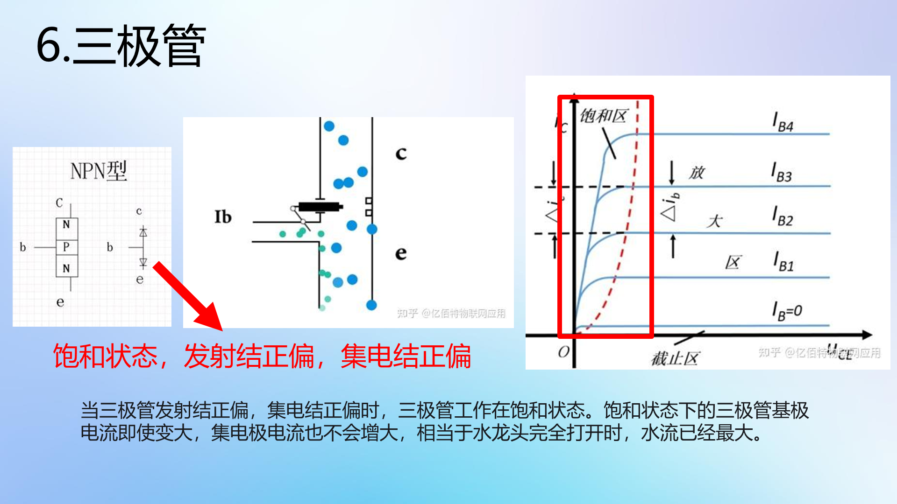

*图 5-6　饱和状态可类比开关接通，但仍存在饱和压降。*

把三极管当开关使用时，重点是确保“截止得干净、导通得充分”；把它当放大器使用时，则要建立合适的静态工作点，不能直接套用开关思路。

#### 5.3 场效应管：用栅源电压控制沟道

场效应管（FET）是电压控制型器件。PCB 中最常见的是 MOSFET，主要引脚为栅极 G、漏极 D、源极 S。栅极绝缘带来很高的直流输入电阻，但开关瞬间仍需要给栅极电容充放电，所以驱动能力和栅极回路布局仍然重要。

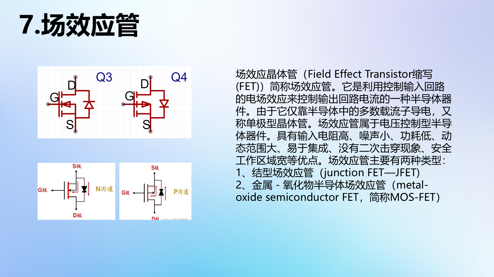

*图 5-7　MOSFET 常用于开关、电源转换、负载控制和信号处理。*

MOSFET 可按沟道分为 NMOS、PMOS，也可按工作方式分为增强型、耗尽型。入门设计中最常见的是增强型 NMOS 和 PMOS。判断 MOSFET 能否可靠导通，应查看数据手册给出的 $R_{DS(on)}$ 测试条件，而不能只看阈值电压 $V_{GS(th)}$；阈值电压只表示器件刚开始出现很小的漏极电流。

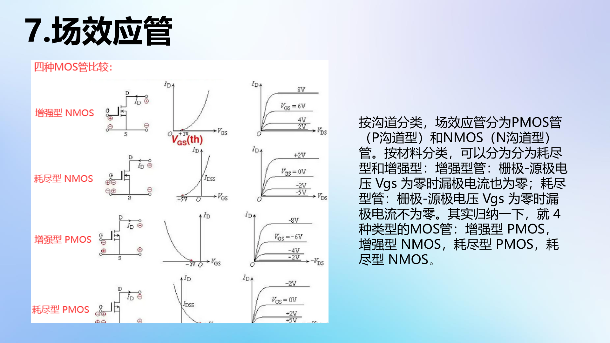

*图 5-8　“增强型/耗尽型”是工作方式分类，不是材料分类。*

#### 5.4 集成电路：把完整功能封装进芯片

集成电路（IC）把大量晶体管、电阻等结构制作在半导体芯片上，对外只露出有限引脚。原理图通常把 IC 画成带多个引脚的功能方框。设计者不需要知道芯片内部每个晶体管如何连接，但必须理解每个外部引脚的功能和限制。

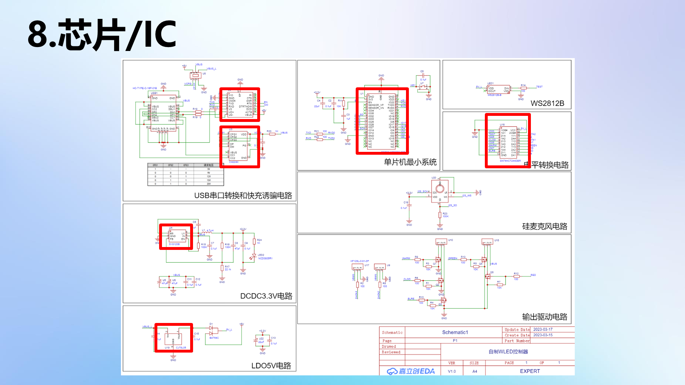

*图 5-9　面对芯片不能凭符号猜功能，下一章的数据手册才是设计依据。*

### 第 6 章 怎样阅读元件数据手册

#### 6.1 数据手册是芯片的技术身份证

原理图符号只能显示引脚和连接，不能完整告诉你器件能承受多大电压、怎样配置、外围元件如何选择。制造商发布的 **Datasheet（数据手册）** 才是这些信息的正式依据。

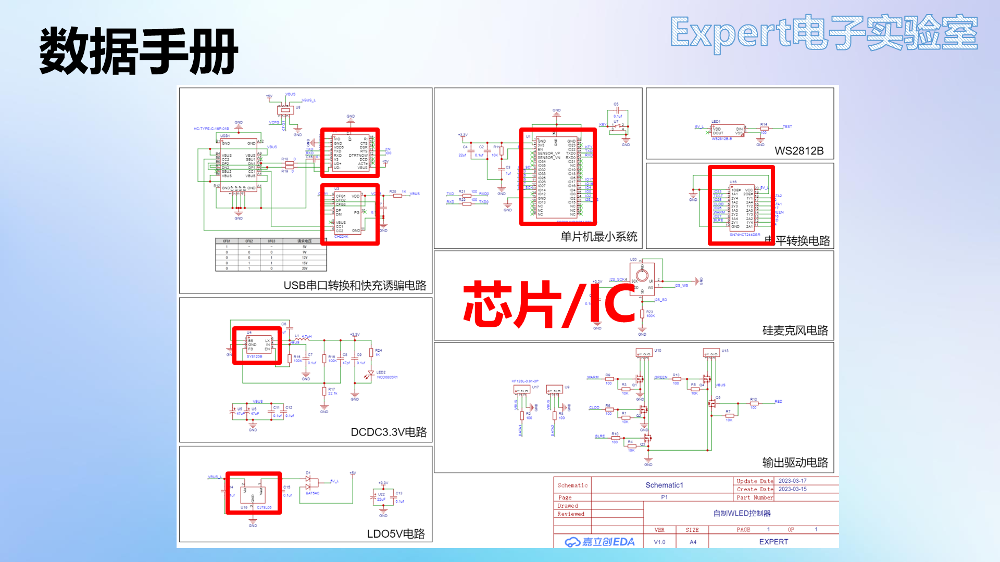

*图 6-1　同样是一个方框符号，不同芯片的供电、引脚和使用条件可能完全不同。*

查找数据手册时，优先使用制造商官网，并核对完整型号、后缀、封装和修订版本。第三方元器件平台适合快速检索，但重要参数仍应回到原厂文档确认。尤其要注意同一系列中的不同后缀可能代表温度等级、精度、功能、封装或包装方式不同。

#### 6.2 不要从第一页读到最后一页

对初学者更有效的阅读顺序是：

1. **标题、特性和应用范围**：确认器件是不是你要找的类型；
2. **功能框图**：先理解信号从哪里进、经过什么模块、从哪里出；
3. **引脚图和引脚说明**：建立引脚号、名称、方向和功能的对应关系；
4. **推荐工作条件**：确认正常设计应该使用的电压、电流和温度范围；
5. **电气特性**：在规定测试条件下读取典型值、最小值和最大值；
6. **典型应用电路**：理解外围器件和基本接法；
7. **设计与布局建议**：关注去耦、接地、反馈、散热和高电流回路；
8. **封装尺寸和订购信息**：选择正确封装并核对焊盘设计。

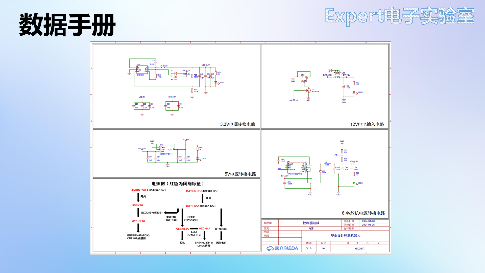

*图 6-2　先找与当前设计问题直接相关的章节，再沿交叉引用深入。*

数据手册中最容易混淆的两类表格是：

- **Absolute Maximum Ratings（绝对最大额定值）**：器件不应达到或超过的损坏边界，不是正常工作点；
- **Recommended Operating Conditions（推荐工作条件）**：设计应满足的正常使用范围。

如果一个芯片绝对最大输入电压是 6 V，并不意味着可以让它长期在 6 V 工作。正确做法是查看推荐范围，并为电源波动、纹波和瞬态留出余量。

#### 6.3 用降压芯片建立阅读框架

以 TPS5450 一类降压转换器为例，阅读数据手册时至少要找到：输入电压范围、输出电流能力、开关频率、反馈基准、使能条件、推荐电感和电容、二极管要求、热性能以及推荐布局。

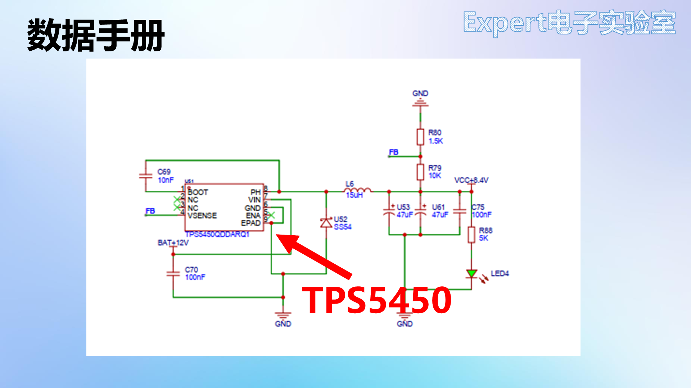

*图 6-3　数据手册不是只为“查一个数”，它同时给出电路和 PCB 布局的约束。*

读数据手册时始终把参数和它的 **Conditions（测试条件）** 放在一起看。同一个导通电阻、输出电流或精度指标，在不同供电、温度和频率下可能完全不同。只抄 Typical（典型值）而忽略 Min/Max（最小/最大值），很容易做出只能在样机上偶然工作的设计。

### 第 7 章 连接关系与基尔霍夫定律

#### 7.1 连接线、节点和网络

原理图中的线表示理想电气连接。进入 PCB 后，这条“线”会变成有宽度、厚度和长度的铜箔，因此会产生电阻、电感、耦合和载流能力等实际问题。入门分析阶段先把同一连接上的点视为等电位，后续再考虑走线的非理想特性。

**节点（node）** 是若干元件引脚或导线电气连接形成的同一点。图上两条线相交不一定连接，必须结合连接点标记和 EDA 软件规则判断。

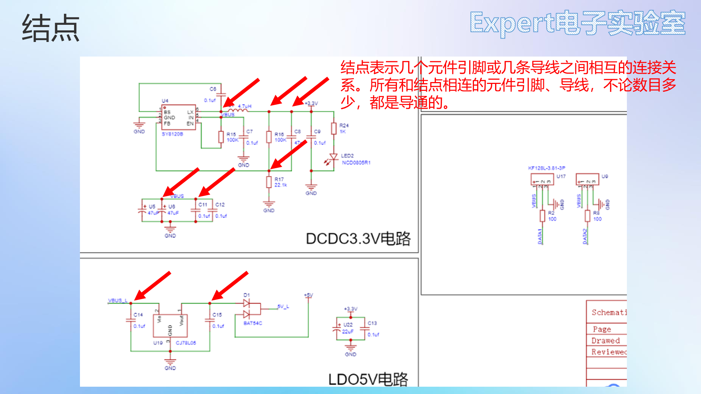

*图 7-1　连接点的图形规则必须统一，避免“看起来相交但没有连接”的歧义。*

数节点时，不要数红点或拐角的数量，而要判断有多少组彼此导通的连接。沿着一条理想导线能到达的所有引脚，都属于同一个节点。

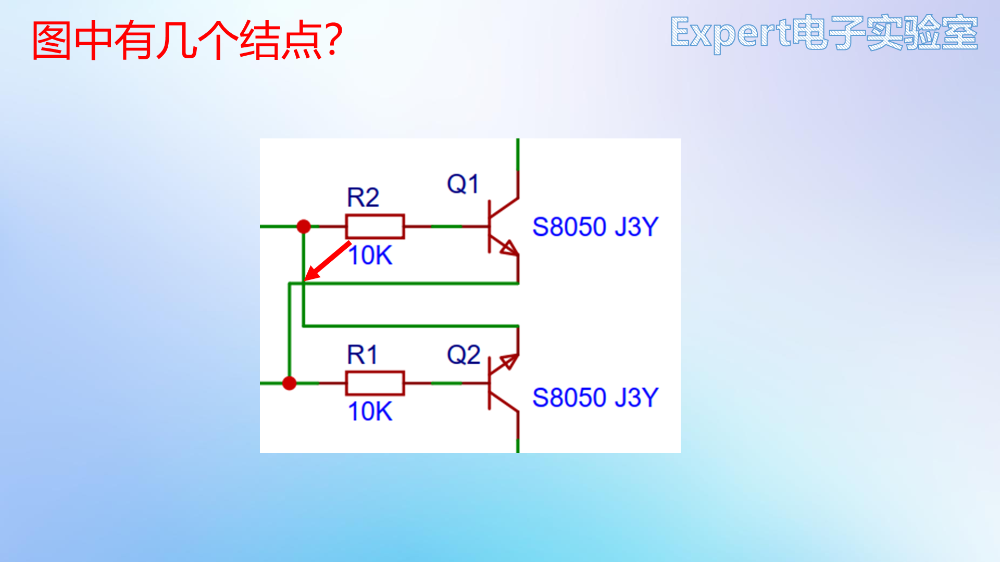

*图 7-2　导线形状可以弯曲，节点的判断只看电气连通性。*

在复杂原理图中，如果所有连接都画成长线，图纸会迅速变乱。**网络标签（net label）** 用名称表达连接关系：具有相同网络名的引脚，在逻辑上属于同一网络，即使图上没有直接画线。

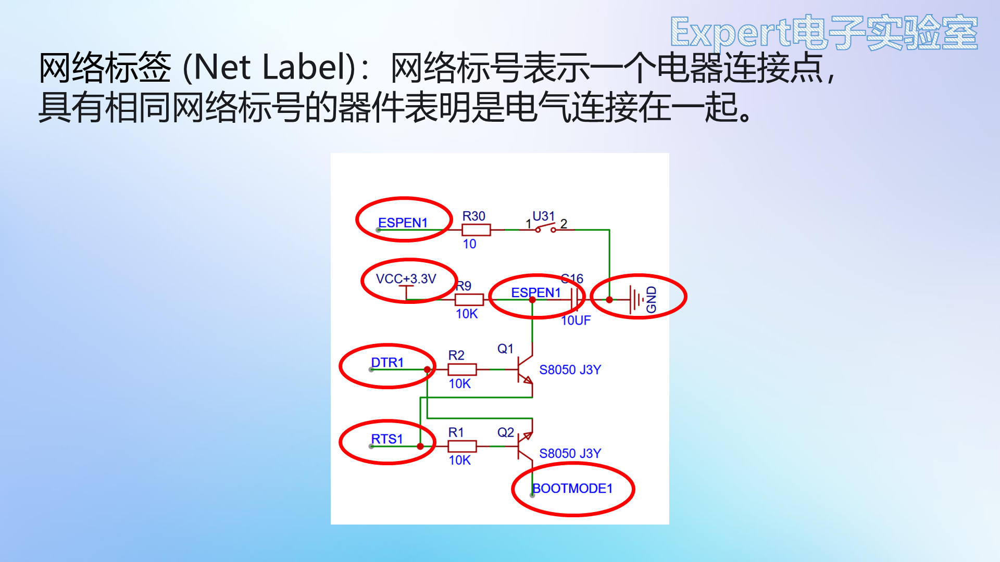

*图 7-3　网络标签既能简化连线，也能让信号含义直接显示在图上。*

网络名应体现用途，例如 `I2C_SCL`、`UART_TX`、`MOTOR_EN`，不要大量使用 `NET1`、`A1` 这类离开上下文就无法理解的名称。电源网络常使用专门符号或全局标签，如 `+5V`、`+3V3`、`GND`、`AGND`。

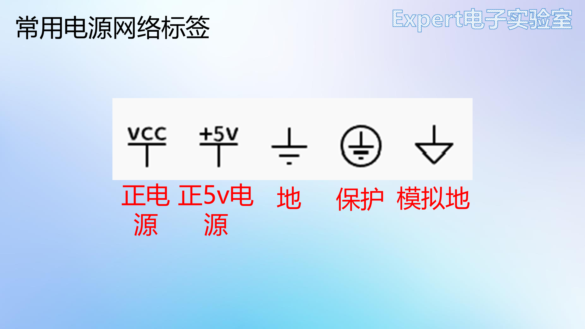

*图 7-4　名称不同的地不应默认相连；是否分开以及在哪里连接，应由电路设计明确决定。*

#### 7.2 支路、回路和网孔

**支路（branch）** 是通过同一电流的一条通路，可以由一个或多个串联元件构成。两个元件之间如果没有电流分叉，它们通常仍属于同一支路。

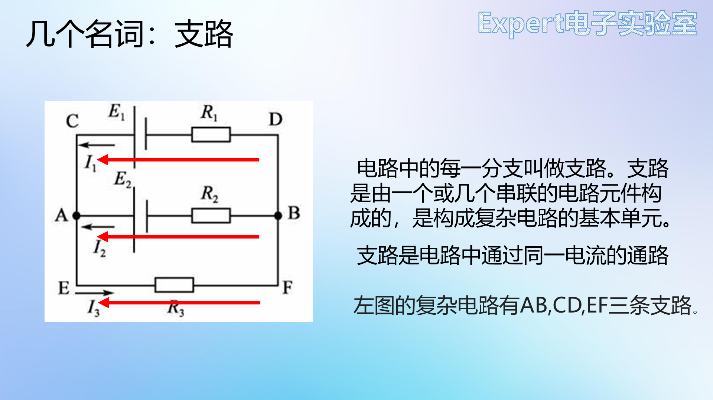

*图 7-5　支路是建立电流变量的基本对象。*

**回路（loop）** 是电路中的任意闭合路径。一个电路可能存在很多回路，但它们不一定彼此独立。选择独立回路时，每加入一个新回路，至少应包含一条此前独立回路没有提供的新支路信息。

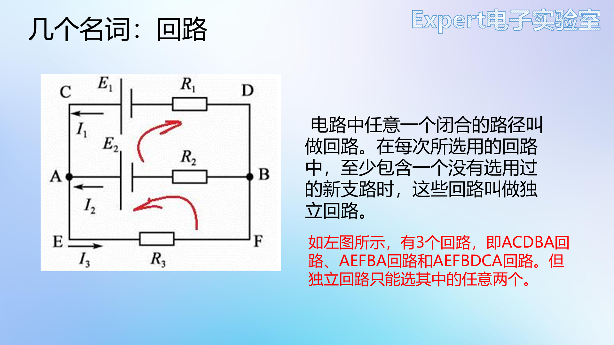

*图 7-6　不同闭合路径之间可能存在方程上的线性依赖。*

**网孔（mesh）** 是平面电路中内部不再包含其他支路的最小回路。网孔一定是回路，但回路不一定是网孔。

*图 7-7　区分节点、支路、回路和网孔，是后续列电路方程的基础。*

#### 7.3 KCL：节点处的电流约束

基尔霍夫电流定律（KCL）来自电荷守恒。在集总参数电路中，任意时刻流入一个节点的电流之和等于流出电流之和。若统一规定流出为正，则可写成：

$$
\sum_k i_k=0
$$

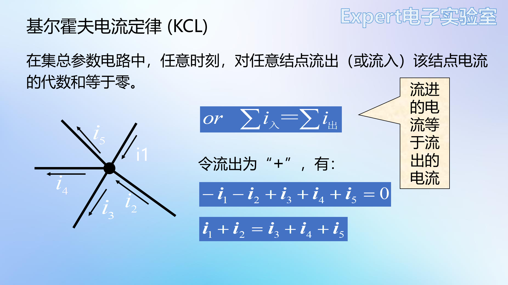

*图 7-8　参考方向可以自行假设；算出负值只表示实际方向与假设相反。*

列 KCL 方程的步骤：

1. 选定节点或包含多个节点的闭合面；
2. 给每条相关支路标出电流参考方向；
3. 统一流入或流出的正负号；
4. 写出代数和为零的方程；
5. 求解后用符号判断实际方向。

KCL 只约束节点电流，与支路中接的是电阻、电容还是其他器件无关。要建立电压与电流之间的关系，还需要元件自身的伏安特性。

#### 7.4 KVL：闭合路径上的电压约束

基尔霍夫电压定律（KVL）来自能量守恒。在集总参数电路中，沿任一闭合回路绕行一周，各段电压升降的代数和为零：

$$
\sum_k u_k=0
$$

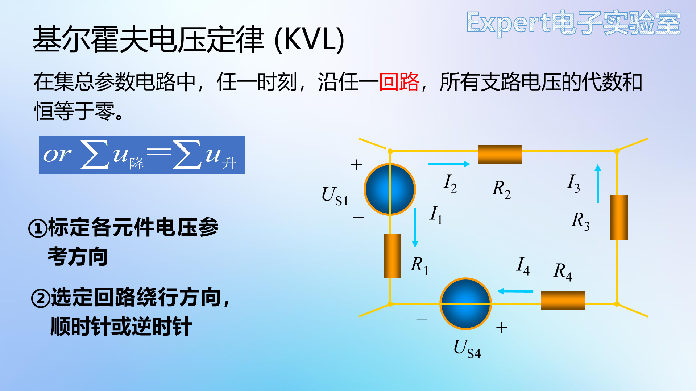

*图 7-9　先标电压参考方向，再选顺时针或逆时针绕行，整个方程保持同一符号规则。*

列 KVL 方程时，可以规定沿绕行方向遇到“$-$ 到 $+$”为电压上升，记正号；遇到“$+$ 到 $-$”为下降，记负号。也可以采用相反约定，但不能在同一个方程中途改变规则。

KCL 和 KVL 的边界也要记住：课程中的基本形式针对 **集总参数电路**。当电路尺寸远小于信号波长时，可以把电磁现象近似集中在理想元件中；频率升高、走线变长后，传播延迟和分布参数不能再忽略，PCB 走线本身也会成为电路的一部分。

### 第 8 章 怎样读懂并画好原理图

#### 8.1 读图不要从左上角逐个元件硬看

更有效的阅读顺序是先整体、后局部：

1. 从标题、版本和注释判断图纸用途；
2. 找电源入口、稳压和各电源网络，画出能量流向；
3. 按接口、主控、传感器、驱动、通信等功能划分模块；
4. 沿关键输入和输出追踪信号路径；
5. 查看关键芯片的数据手册，理解引脚和外围电路；
6. 最后检查保护、上拉下拉、去耦、测试点和未使用引脚。

注释的作用不是重复元件名称，而是说明图形本身无法充分表达的设计意图，例如模块功能、重要信号方向、器件特殊配置、调试条件和禁止事项。

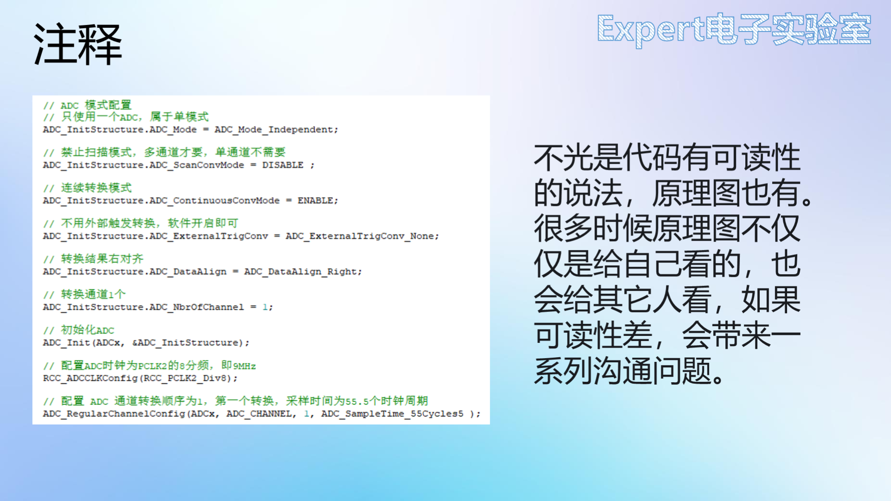

*图 8-1　好的注释让协作者知道“为什么这样接”，而不只是“这里接了什么”。*

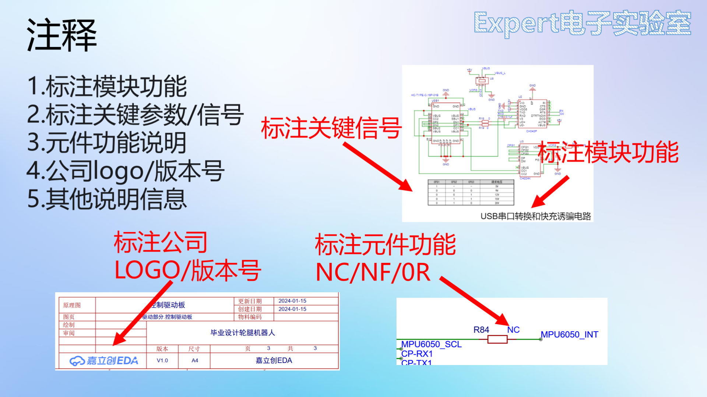

*图 8-2　模块边界、关键参数、NC/0R 等特殊功能和版本信息都适合明确标出。*

#### 8.2 一张好原理图的基本标准

原理图首先必须 **准确**，其次要做到 **规范、清晰、易读**。漂亮但连接错误的图纸没有价值；连接正确但难以理解的图纸，也会增加评审、PCB 设计、焊接和调试成本。

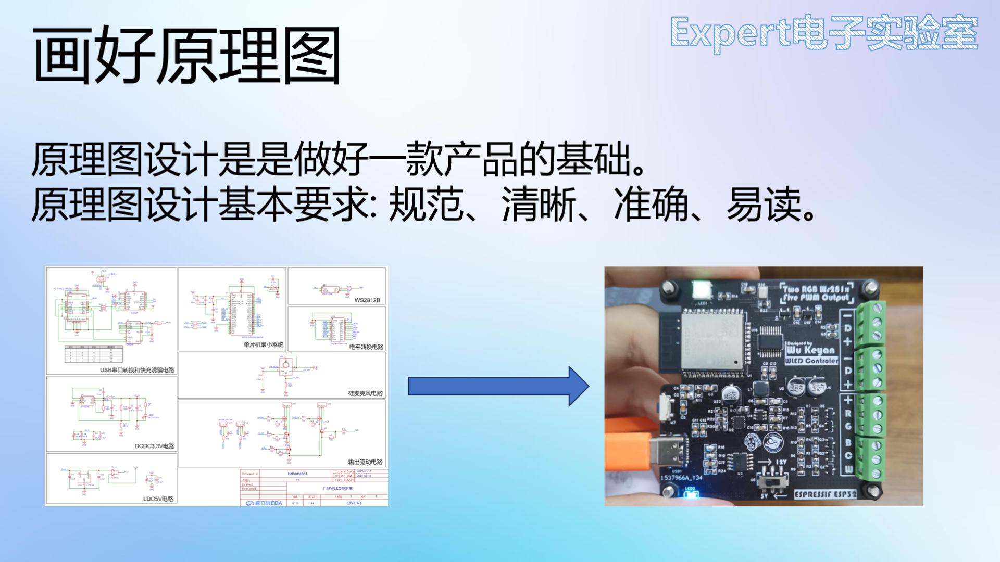

*图 8-3　原理图是产品设计、协作和后续检查的共同入口。*

复杂设计应按功能分模块、分图页。每页保持明确主题，并通过层次化端口或规则统一的网络标签连接。常见组织方式包括电源页、主控页、通信接口页、传感器页和执行器驱动页。

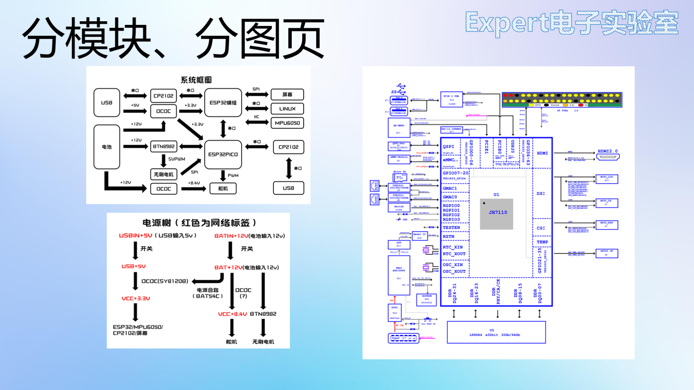

*图 8-4　模块化的目标是降低理解成本，而不是把同一条信号随意拆散。*

绘制时还应遵守这些习惯：

- 信号尽量按稳定方向流动，例如输入在左、输出在右，电源在上、地在下；
- 减少无意义的交叉和长距离回折；
- 标出无法从符号直接看出的参数和器件功能；
- 未使用引脚按照数据手册处理，必要时明确标记 `NC`；
- 网络标签命名一致，避免同义不同名或同名不同义；
- 在标题栏或注释区写明设计名称、版本和日期；
- 完成后运行电气规则检查，并人工复核关键网络。

#### 8.3 原理图只是完整产品链的起点

一块板从想法变成实物，至少要经过原理图设计、PCB 布局布线、生产加工和焊接组装。原理图中的错误会向后传递：错误引脚会变成错误焊盘连接，错误封装会导致器件无法焊接，遗漏的电源和去耦会让成品难以调试。

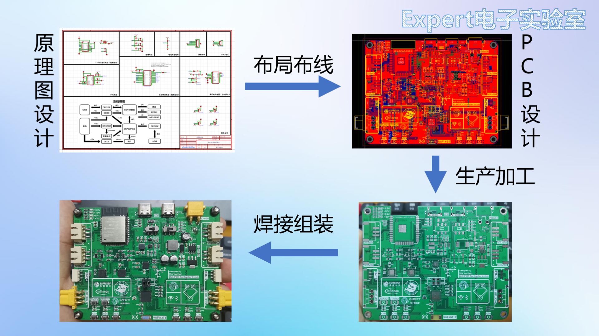

*图 8-5　每一步都依赖上一步的正确输出，也为下一步提供约束。*

进入 PCB 设计前，应能回答这些问题：

- 原理图和 PCB 分别表达什么？
- 位号、引脚号和网络名各自识别什么？
- 电容为什么要靠近芯片电源引脚？
- 二极管、BJT、MOSFET 的控制方式有什么差别？
- 绝对最大额定值为什么不能当作正常工作值？
- 节点、支路、回路和网孔有什么区别？

后面的封装映射、布局和规则检查都建立在这些概念之上。

---

## 第三部分：PCB 设计基础

### 第 9 章 PCB 上到底有什么

#### 9.1 从空板开始认识 PCB

一块还没有焊接器件的 PCB，看起来只是带颜色的薄板，但它已经包含了绝大多数电气连接和装配信息。最常见的双面板至少涉及基材、顶层铜、底层铜、阻焊、丝印、焊盘、过孔和板框。

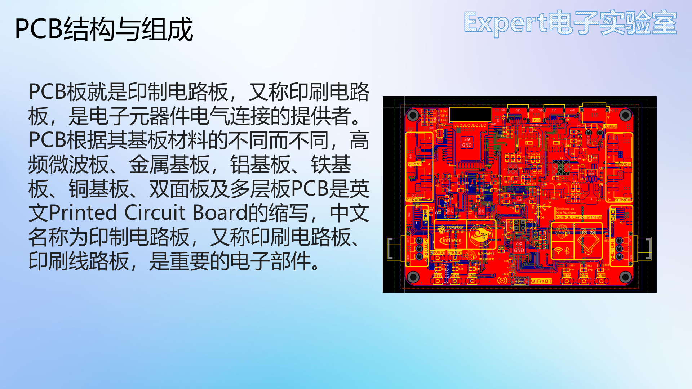

*图 9-1　绿色通常来自阻焊油墨，并不是基材或铜本身的颜色。*

理解 PCB 结构时，可以把对象分成三类：

- **导电对象**：走线、铺铜、焊盘、过孔及内部铜层；
- **制造与保护对象**：板框、钻孔、阻焊、锡膏开口等；
- **识别与装配对象**：丝印文字、位号、极性标记、定位和机械信息。

#### 9.2 走线：把网络变成有尺寸的铜箔

走线（track/trace）是 PCB 上连接焊盘、过孔和铜区的条状铜箔。它继承原理图网络关系，但不再是理想导线。线宽、铜厚、长度、回流路径和周围环境都会影响载流、压降、温升和信号完整性。

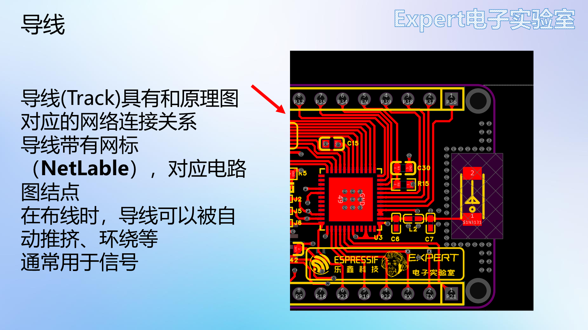

*图 9-2　EDA 根据网络表知道哪些焊盘应该相连，并用飞线提示尚未完成的连接。*

入门布线应先形成这些习惯：

- 线宽必须满足电流和制造能力，不要整板只用一种线宽；
- 电源和大电流回路优先短、宽、直接；
- 高速或敏感信号要关注连续回流路径，避免跨越分割；
- 转角、过孔和层切换应有明确理由；
- 不要为了视觉整齐牺牲电气性能。

#### 9.3 铺铜：用连续铜区连接网络

铺铜（copper pour/plane）是较大面积的铜区域，通常连接 GND 或电源网络。它可以降低连接阻抗、改善回流路径、帮助散热，也能减少需要单独布出的走线。

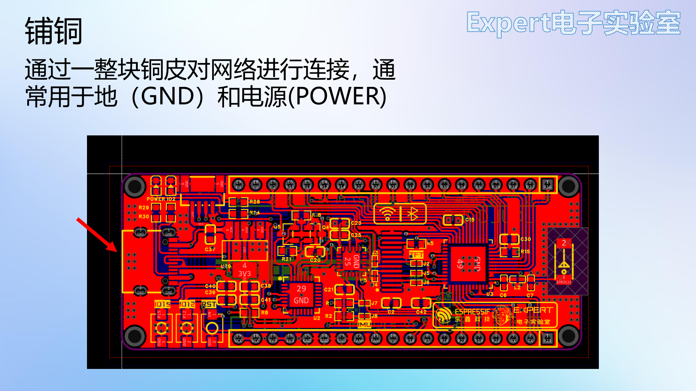

*图 9-3　铺铜必须分配到明确网络；一块没有正确连接和回流设计的铜皮，不会自动改善电路。*

铺铜完成后要重新填充并检查：是否出现孤立铜岛，细颈位置是否能承受电流，焊盘热焊盘连接是否合适，不同网络间距是否满足规则。对高速设计而言，“地铜很多”也不等于回流路径连续，关键是信号下方能否形成紧邻且不中断的参考平面。

#### 9.4 过孔：连接不同铜层

过孔（via）是在孔壁金属化后连接不同铜层的结构。普通信号过孔主要承担层间电气连接；与插件器件引脚配合并承担焊接、机械固定的结构，更准确地说是通孔焊盘，而不是普通过孔。

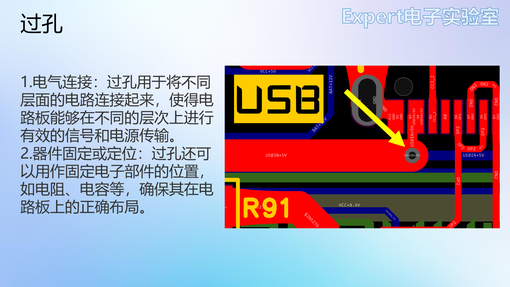

*图 9-4　换层时，走线从一个铜层进入过孔，再从目标铜层继续。*

常见过孔类型包括：

- **通孔**：从顶层贯穿到底层，工艺最常见；
- **盲孔**：从外层连接到一个或多个内层，但不贯穿整板；
- **埋孔**：只连接内部铜层，外表面看不到；
- **微孔**：通常使用激光加工，孔径和深度更小，多用于高密度互连。

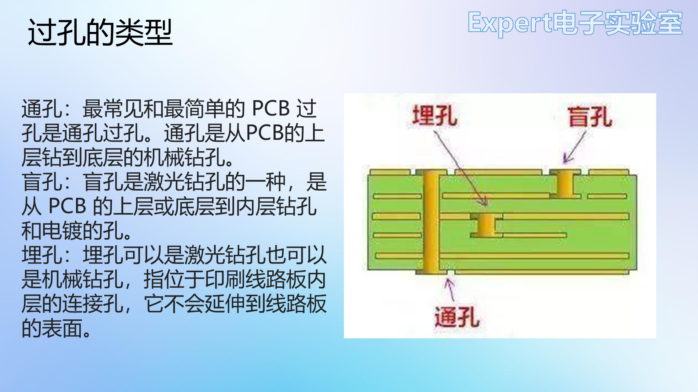

*图 9-5　高级孔结构会提高制造复杂度和成本，双层入门板通常使用通孔。*

过孔会引入额外电阻和寄生电感。大电流换层时常并联多个过孔；高速信号换层时还要为回流提供邻近地过孔，避免信号路径换了参考层而回流被迫绕行。

#### 9.5 焊盘：器件与电路板的连接界面

焊盘（pad）是用于焊接器件引脚的暴露铜区，可分为贴片焊盘和通孔焊盘。焊盘形状、尺寸、间距、孔径、阻焊开窗和锡膏开口都与具体封装和制造工艺有关。

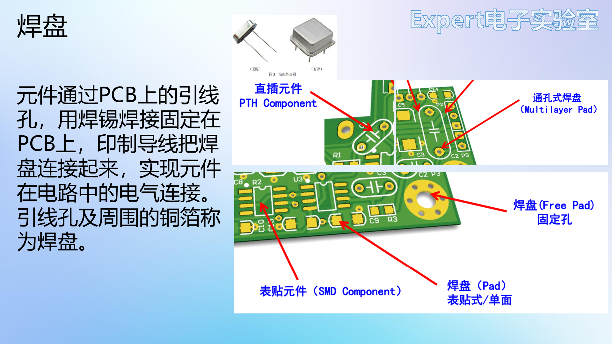

*图 9-6　焊盘编号必须与原理图符号的引脚号正确对应。*

焊盘过小可能导致焊接不良，过大则可能造成器件漂移、连锡或占用过多空间。封装设计应优先依据器件数据手册的推荐 land pattern；没有推荐值时，再结合行业标准和装配工艺计算。

#### 9.6 丝印、阻焊与锡膏

**丝印层（silkscreen）** 用于印刷位号、器件轮廓、方向、接口名称、版本等装配信息。丝印不能压到裸露焊盘上，文字也要满足制造厂最小线宽和字号。

**阻焊层（solder mask）** 定义哪些区域覆盖绝缘油墨、哪些铜需要露出。它能保护铜面、减少氧化和焊接短路，但不能代替满足安全要求的电气间距。

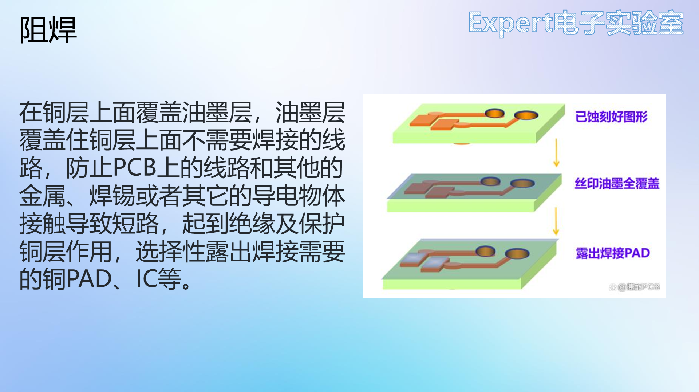

*图 9-7　常见绿色、黑色、红色等板面颜色主要来自阻焊油墨。*

**锡膏层（paste mask）** 主要用于制作 SMT 钢网开口。印刷锡膏时，锡膏通过钢网落到贴片焊盘上；插件焊盘通常不按同样方式开锡膏窗。阻焊开口和锡膏开口用途不同，不能混为一层。

### 第 10 章 PCB 叠层与各功能层

#### 10.1 Core、Prepreg 与铜箔

PCB 可以理解为由绝缘材料和铜层压合形成的“三明治”。常见材料包括：

- **Core（芯板）**：已经固化的绝缘基材，通常两面覆铜；
- **Prepreg（半固化片，常简称 PP）**：含树脂的玻璃纤维材料，在层压时流动、填充并固化，用于粘接芯板和铜箔；
- **铜箔**：蚀刻后形成走线、焊盘、铜区和参考平面。

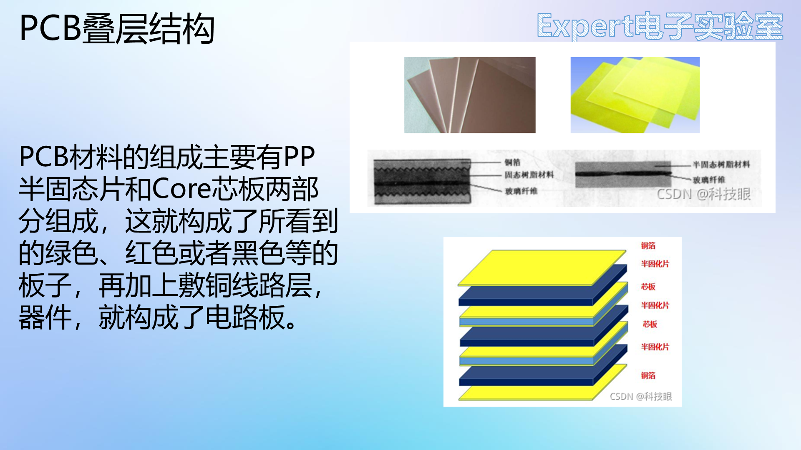

*图 10-1　课程中的“PP 半固态片”更准确地称为 PP 半固化片或 prepreg。*

双层板只有顶层和底层两个铜层；四层、六层等多层板还会加入内部铜层。层数增加并不只是为了“有更多地方走线”，更重要的是可以提供连续的地/电源参考平面，控制回流路径和阻抗。

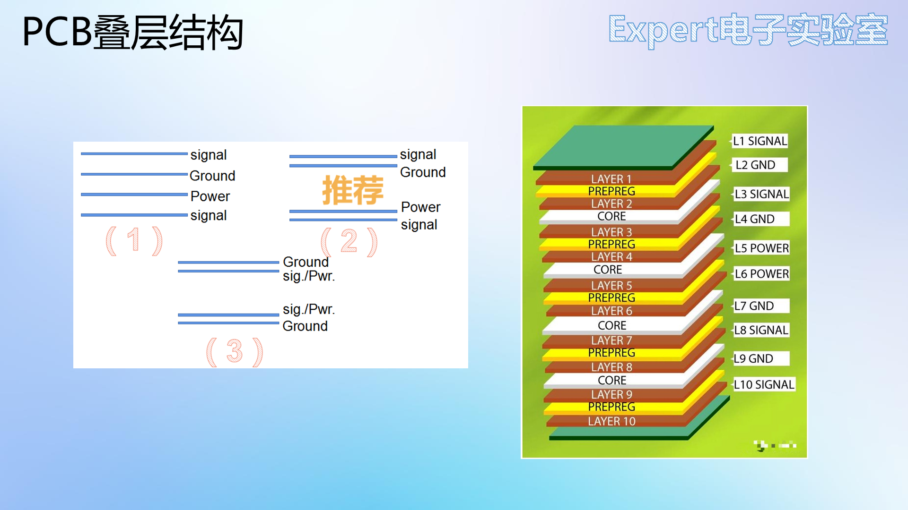

*图 10-2　具体层厚、铜厚和材料必须以制造厂提供的叠层参数为准。*

#### 10.2 信号层与参考平面

信号层包含走线和局部铜区。顶层、底层通常都是信号层，也可以放置器件；多层板的内层还可以作为信号层、完整地平面或电源平面。

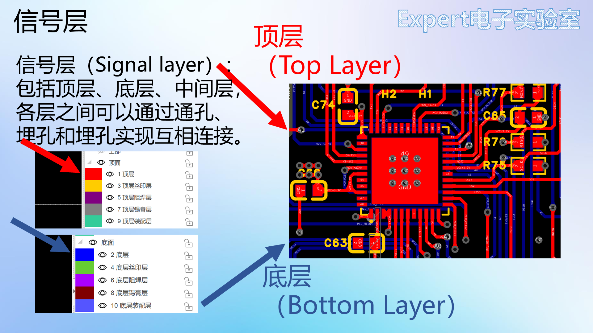

*图 10-3　不同层之间通过过孔连接；层切换同时会改变信号的参考环境。*

好的叠层要让重要信号层邻近完整参考平面。信号电流从源端流向负载时，回流会沿最小阻抗路径返回；频率越高，回流越倾向紧贴信号走线下方。若走线跨过地平面开槽或分割，回流被迫绕路，环路面积和电磁干扰都会增加。

#### 10.3 阻焊层和锡膏层在 EDA 中如何表达

EDA 中的阻焊层通常表达 **开窗区域**，即图形出现的位置反而是不覆盖阻焊油墨的位置。这个“负片式”含义很容易让初学者混淆。

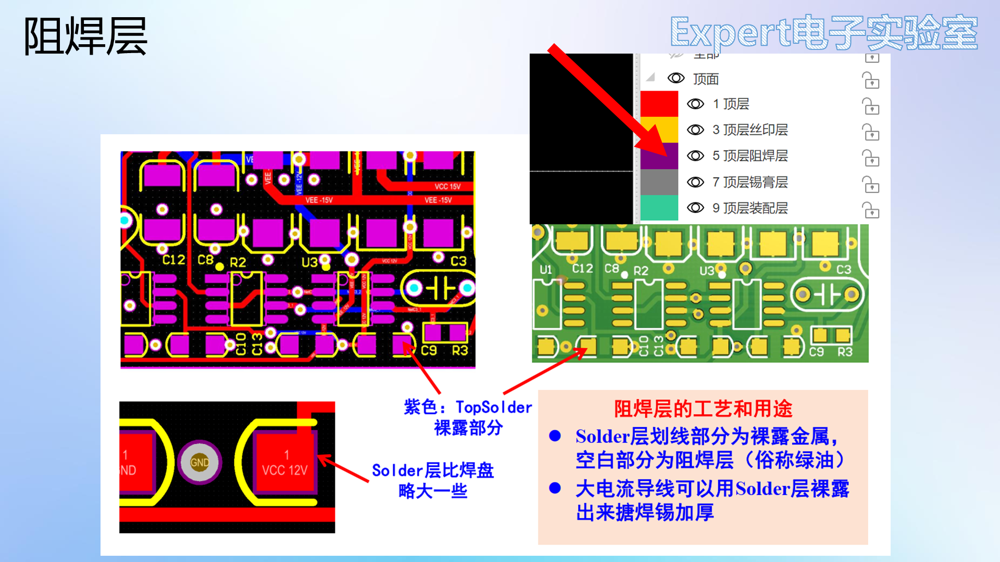

*图 10-4　顶层阻焊和底层阻焊分别控制两面的油墨开口。*

锡膏层也主要表达钢网开口。对细间距芯片、大焊盘或散热焊盘，锡膏开口可能需要分割或缩减，不能简单等同于铜焊盘尺寸。

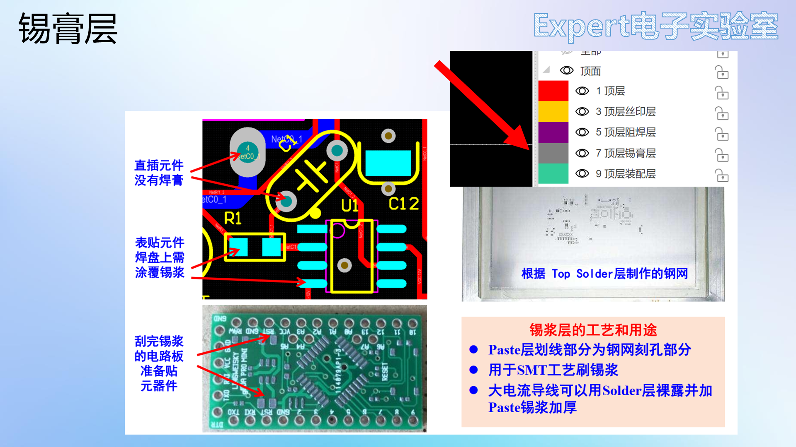

*图 10-5　锡膏层服务于贴片装配工艺，不承担电气连接。*

#### 10.4 机械层和板框层

机械层用于表达尺寸、定位孔、装配要求、禁止区域、外壳配合等非电气信息。不同 EDA 和制造流程对机械层用途的约定可能不同，因此交付生产前必须确认图层含义。

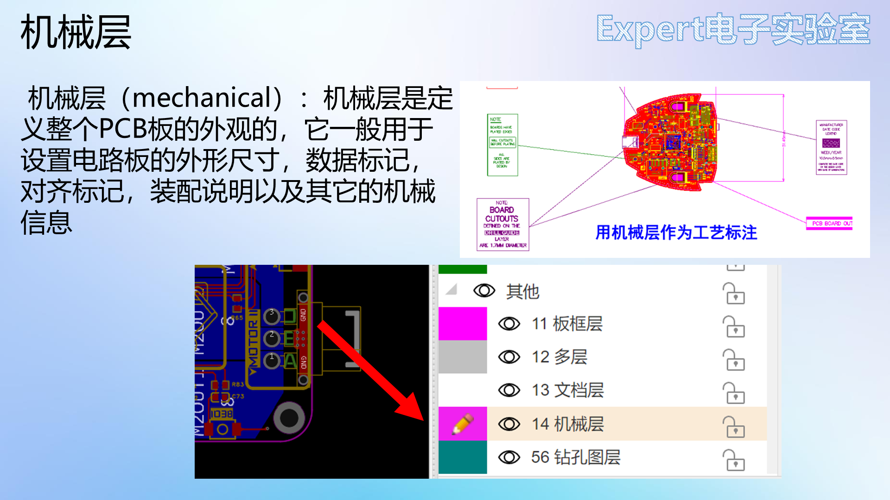

*图 10-6　机械信息决定 PCB 能否安装进外壳、对准接口并满足装配空间。*

板框层定义成品板的外形。轮廓应闭合、无重叠和断点；开槽、内挖孔和异形边界要使用制造商支持的方式表达。

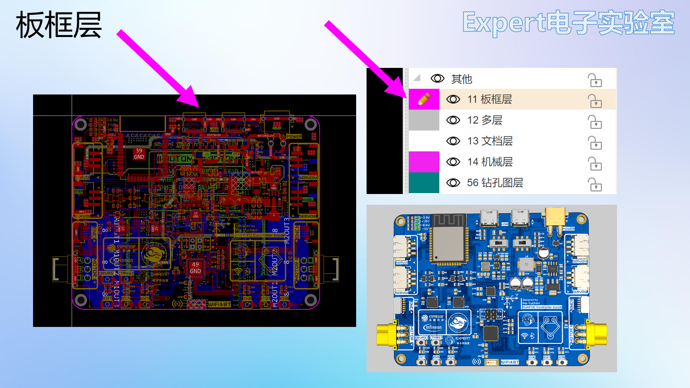

*图 10-7　板框错误会直接影响加工外形，是生产前必须重点检查的对象。*

#### 10.5 一张实用的四层板思路

入门四层板常见的思路之一是：

| 层 | 典型用途 |
| --- | --- |
| L1 顶层 | 器件和主要信号 |
| L2 内层 | 尽量完整的 GND 平面 |
| L3 内层 | 电源平面、低速信号或局部 GND |
| L4 底层 | 次要信号和器件 |

这不是适用于所有项目的固定模板。实际叠层要结合器件密度、信号速度、电源数量、阻抗要求、板厚和制造能力决定。最稳定的原则是：先保证关键参考平面连续，再安排信号和电源，而不是布完线后才考虑回流。

### 第 11 章 元件符号、封装与 3D 模型

#### 11.1 三种对象分别解决什么问题

一个完整的 EDA 元件通常包含：

- **元件符号（symbol）**：在原理图中表达逻辑功能和引脚；
- **PCB 封装（footprint/package）**：在 PCB 中表达焊盘、孔、外形和装配空间；
- **3D 模型**：用于检查器件高度、方向、外壳干涉和板级外观。

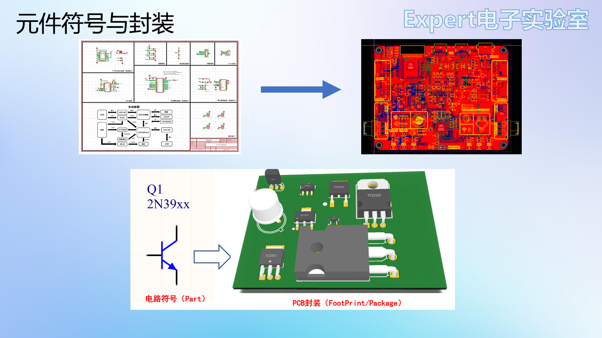

*图 11-1　四者描述的是同一个器件的不同视角，不能相互替代。*

原理图转换到 PCB 时，EDA 会根据符号关联的封装创建焊盘，并根据引脚号生成网络连接。这个过程不是“把方框变成器件图片”，而是把逻辑引脚映射到物理焊盘。

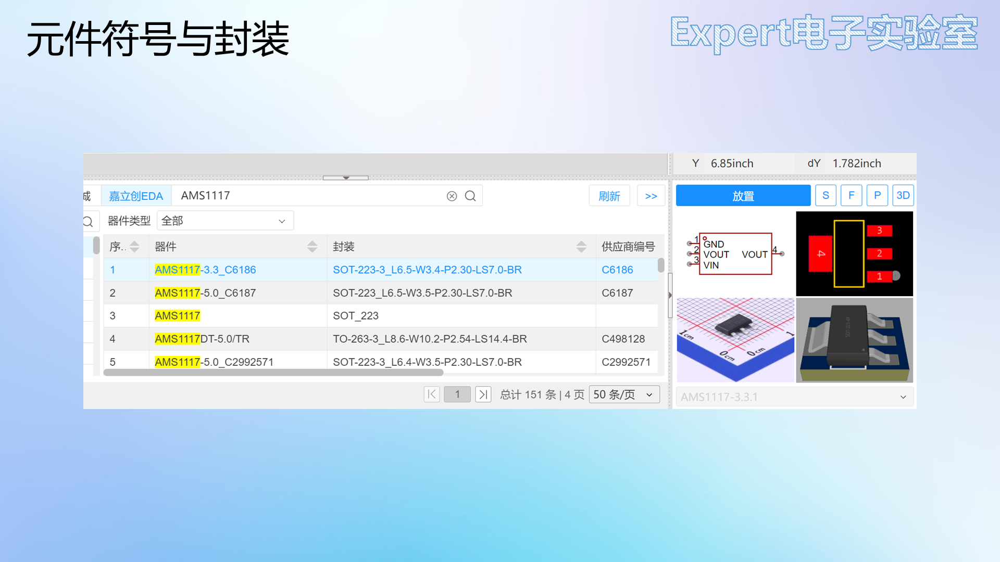

*图 11-2　封装选错时，即使网络关系正确，器件也可能无法安装。*

#### 11.2 引脚号与焊盘号必须一一对应

符号中的引脚编号必须与数据手册封装图中的引脚编号一致，封装焊盘编号再与符号对应。比如符号的 1 脚是 `GND`，那么封装的 1 号焊盘必须落到芯片实物的 1 脚位置。

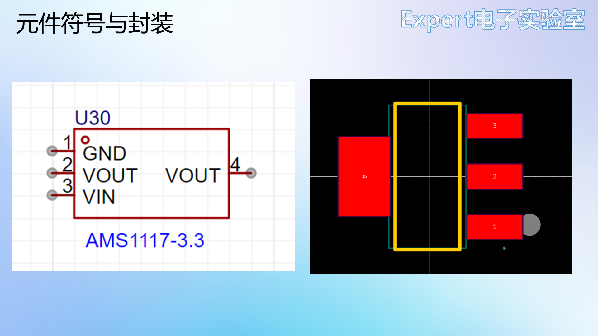

*图 11-3　引脚名称用于理解功能，编号才是符号与封装之间的连接键。*

方向判断常依赖 1 脚标记，例如圆点、缺口、倒角或丝印三角。建立自制封装时，应同时检查顶视图/底视图定义，避免把引脚顺序镜像。

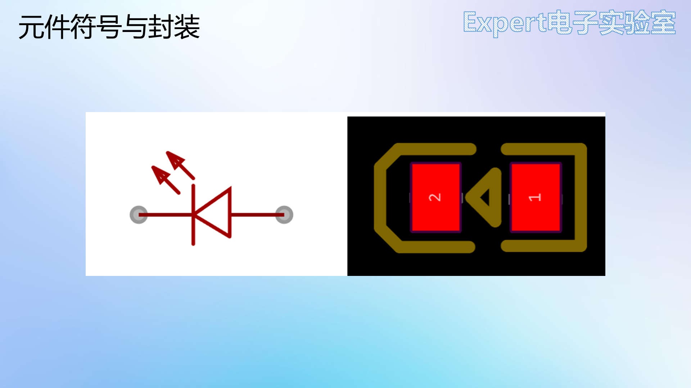

*图 11-4　仅凭“看起来差不多”选择封装，是初学者最常见也最致命的错误之一。*

#### 11.3 封装名称相同也要核对尺寸

同为 `SOP-8`、`QFN-32` 或 `0603` 的描述，仍可能存在体宽、引脚间距、裸露焊盘或公英制差异。选封装时应核对：

1. 引脚数量和编号；
2. 引脚间距（pitch）；
3. 本体长宽高；
4. 引脚形状和伸出尺寸；
5. 是否有 exposed pad，以及它的编号和接地要求；
6. 推荐焊盘尺寸、阻焊和锡膏处理；
7. 贴片、手焊或返修工艺需要的余量。

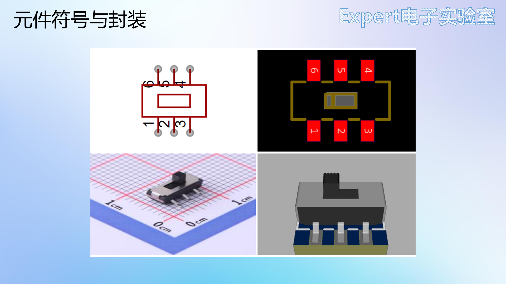

*图 11-5　封装的依据是数据手册尺寸和工艺要求，不是 3D 模型外观。*

3D 模型非常适合检查连接器方向、器件高度和外壳干涉，但 3D 对齐不代表焊盘一定正确。最终仍要回到二维封装尺寸、焊盘编号和数据手册核对。

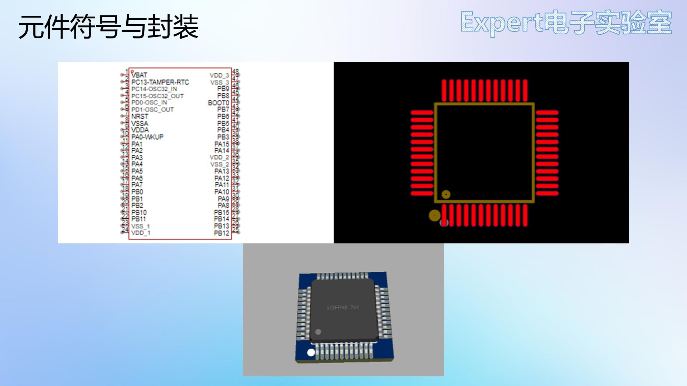

*图 11-6　符号、封装和 3D 模型都检查通过，元件库才算基本可用。*

### 第 12 章 从新建工程到成品 PCB

#### 12.1 完整设计流程

课程把一块板的诞生概括为原理图设计、PCB 设计、生产加工和焊接组装。展开后，可以得到一条更可执行的流程：

1. **明确需求**：输入输出、供电、尺寸、接口、环境、成本和数量；
2. **建立工程**：创建原理图和 PCB，设置项目名称与版本；
3. **元件选型**：确认型号、供货、参数、封装和替代料；
4. **绘制原理图**：按模块连接器件，添加电源、去耦、保护和注释；
5. **原理图检查**：运行 ERC，并人工核对电源、极性、引脚和网络；
6. **关联封装**：逐个确认引脚号、封装尺寸和方向；
7. **建立板框和规则**：设置层叠、线宽、间距、过孔和制造约束；
8. **布局**：先接口和固定位置，再核心器件、电源、去耦和其他器件；
9. **布线与铺铜**：先关键网络，再普通网络；处理回流、电流和散热；
10. **DRC 与复核**：清除规则错误，检查未布线、孤岛、丝印和机械冲突；
11. **输出制造资料**：生成并检查制造文件、钻孔、物料和装配数据；
12. **生产、焊接和调试**：先检查短路和供电，再分模块上电验证。

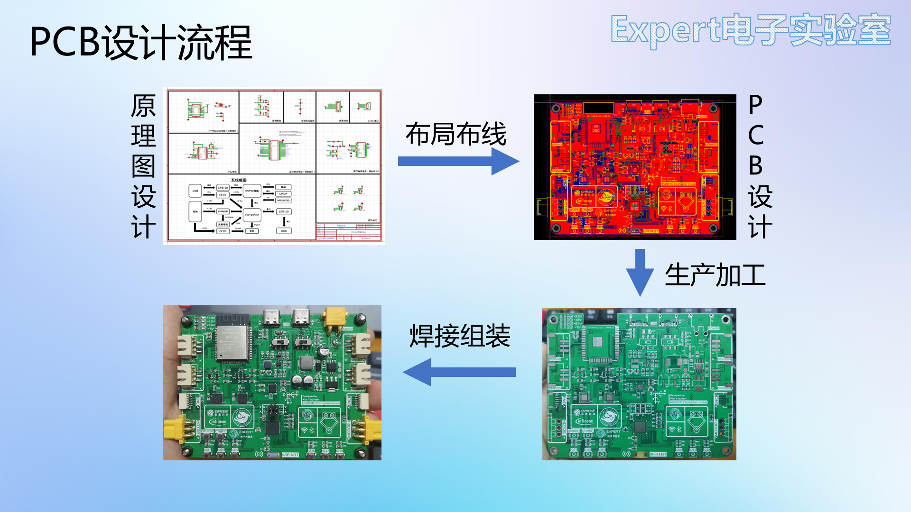

*图 12-1　流程不是单向流水线；检查发现问题时，应回到相应阶段修正并重新验证。*

#### 12.2 布局通常比布线更重要

好的布局会自然形成短而清晰的关键连接，差的布局则会迫使走线绕远、交叉和频繁换层。一个实用的布局顺序是：

1. 放置安装孔、板边接口、按键和必须对准外壳的器件；
2. 放置电源入口、保护和电源转换模块；
3. 放置主控、时钟、存储和高速接口；
4. 把去耦电容紧贴对应电源引脚；
5. 按信号流向放置模拟、数字、驱动和负载器件；
6. 检查器件间距、可焊性、散热和调试可达性。

布局阶段就要考虑回流和电流环路。开关电源的高 $\mathrm{d}i/\mathrm{d}t$ 回路、晶振回路和高速差分对等关键网络，不应等到普通走线全部完成后再勉强处理。

#### 12.3 DRC 是规则检查，不是设计正确证明

DRC（Design Rule Check）检查 PCB 图形是否违反已经设置的规则，例如铜间距过小、线宽不足、孔径不符合要求、未连接或对象越界。

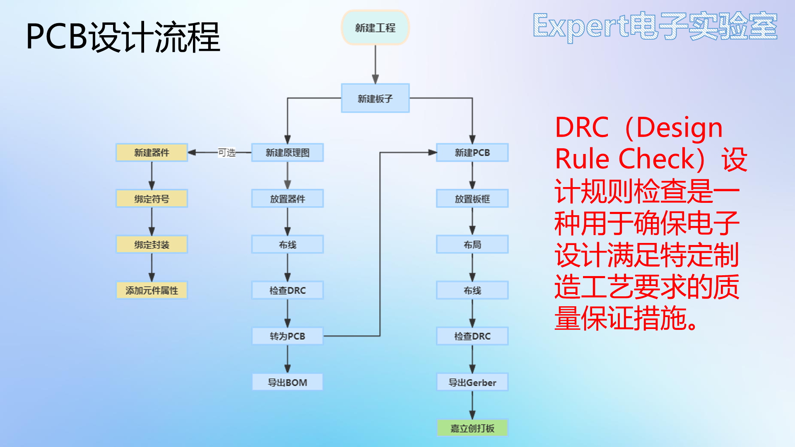

*图 12-2　DRC 能发现“违反规则”，前提是规则本身设置正确。*

DRC 通过不代表板子一定能工作。软件通常不知道：

- 芯片型号是否选错；
- 接口定义是否与外部设备一致；
- 电源时序、散热和余量是否合理；
- 去耦位置和回流路径是否有效；
- 丝印方向是否会误导装配；
- 板框和连接器能否与外壳配合。

因此生产前必须同时进行规则检查和人工评审。第一次设计的板子，最好让另一位同学按数据手册和接口定义独立复核。

#### 12.4 上电调试的基本顺序

拿到焊接完成的板子后，不要直接连接所有电源并运行完整程序。更稳妥的顺序是：

1. 目检器件方向、漏焊、连锡和错件；
2. 断电测量电源与地之间是否明显短路；
3. 使用限流电源，先以较小电流限制上电；
4. 检查各级电源电压、纹波和异常发热；
5. 检查时钟、复位和下载接口；
6. 分模块验证通信、传感器、驱动和负载；
7. 记录问题并回写原理图、PCB 和物料版本。

PCB 设计的完成标准不是“文件能下单”，而是设计数据、实物和调试结论能够相互对应，并且下一版可以根据记录继续改进。

---

## 附录 A：常用术语速查

| 术语 | 含义 |
| --- | --- |
| PCB | Printed Circuit Board，印制电路板 |
| EDA | Electronic Design Automation，电子设计自动化 |
| Schematic | 原理图，表达元件和逻辑连接 |
| Symbol | 元件符号，器件在原理图中的表示 |
| Footprint | PCB 封装，焊盘、孔和装配外形的集合 |
| Reference Designator | 位号，如 R1、C2、U3 |
| Pin / Pad | 原理图引脚 / PCB 焊盘，两者通过编号映射 |
| Net | 网络，电气上应互相连接的一组点 |
| Track / Trace | PCB 走线 |
| Copper Pour | 铺铜或铜区 |
| Via | 连接不同铜层的金属化孔 |
| Through / Blind / Buried Via | 通孔 / 盲孔 / 埋孔 |
| Solder Mask | 阻焊层，保护铜面并定义露铜区域 |
| Paste Mask | 锡膏层，主要用于制作 SMT 钢网开口 |
| Silkscreen | 丝印层，显示位号、方向和装配信息 |
| Core / Prepreg | 芯板 / 半固化片 |
| ERC | Electrical Rule Check，原理图电气规则检查 |
| DRC | Design Rule Check，PCB 设计规则检查 |
| BOM | Bill of Materials，物料清单 |

## 附录 B：原理图阅读检查表

- [ ] 图纸名称、版本和模块边界是否明确？
- [ ] 电源从哪里输入，经过哪些保护和转换，供给哪些模块？
- [ ] 每个 IC 的型号、供电、地、使能、复位和时钟是否清楚？
- [ ] 关键引脚是否与数据手册定义一致？
- [ ] 去耦电容、上拉下拉、保护和端接器件有什么作用？
- [ ] 输入、输出和通信接口的电平及方向是否一致？
- [ ] 网络标签是否清楚，有没有同名误连或异名漏连？
- [ ] 极性器件和未使用引脚是否正确处理？
- [ ] 注释是否说明了特殊配置、限制和调试条件？

## 附录 C：生产前检查表

### 原理图与元件库

- [ ] ERC 已处理，剩余警告有明确理由；
- [ ] 型号、参数、额定值和供货状态已确认；
- [ ] 符号引脚号与数据手册一致；
- [ ] 封装焊盘号、尺寸、方向和 1 脚标记已核对；
- [ ] 极性、接口定义、电源和地网络经过人工复核。

### PCB 布局与布线

- [ ] 板框闭合，安装孔、接口和禁布区符合机械要求；
- [ ] 去耦、电源、高速和敏感器件布局合理；
- [ ] 线宽、间距、过孔和铜厚满足电流及制造要求；
- [ ] 关键网络路径短，回流连续，没有无意跨分割；
- [ ] 铺铜网络正确，没有危险细颈和无意义孤岛；
- [ ] 大电流、散热和高压区域留有合理余量；
- [ ] 丝印不压焊盘，位号、方向、接口和版本可读。

### 输出与投产

- [ ] DRC 已通过，未布线数量为零；
- [ ] 逐层查看最终制造文件，确认铜、阻焊、丝印和钻孔；
- [ ] 板厚、层数、铜厚、表面处理、阻焊颜色等工艺参数明确；
- [ ] BOM 的位号、数量、型号和封装与设计一致；
- [ ] 贴片坐标、器件角度和正反面经过检查；
- [ ] 已保存可追溯的工程版本和生产归档。

## 结语

学完入门篇后，最重要的不是记住某个按钮在哪里，而是建立从 **元件功能 → 原理图网络 → 封装焊盘 → PCB 铜连接 → 制造与调试** 的连续思维。只要这条链路清楚，换一种 EDA 软件仍然能够继续设计；如果链路中有一环靠猜，错误就会一直传到实物板上。

第一次 PCB 设计应选择供电简单、器件数量少、接口清楚的项目。完整走一遍需求、原理图、封装核对、布局布线、检查、生产和调试，比只观看更多课程更能建立真实的设计能力。
