# PCB 设计强化教程

## 如何使用这份教程

强化篇默认读者已经知道原理图、PCB、网络、焊盘、过孔和封装分别是什么。如果这些概念仍不熟悉，建议先阅读同目录下的《PCB 设计入门教程》。

这份教程真正要训练的不是“记住菜单在哪里”，而是下面这条工程链路：

1. 根据功能需求选择器件，并从数据手册确认供电、引脚和外围电路；
2. 用正确的符号与封装建立器件，保证引脚编号和焊盘编号一一对应；
3. 绘制原理图，通过 ERC/DRC 后再转换为 PCB；
4. 先按接口、功能模块和关键回路布局，再按优先级完成布线；
5. 检查丝印、网络和制造规则，最后导出生产文件。

| 部分 | 要解决的问题 | 对应课程 |
| --- | --- | --- |
| 第一部分：软件与设计环境 | 怎样建立稳定、可检查的工作环境 | 第 12～14 课 |
| 第二部分：自建元件库 | 在线库没有器件时，怎样自己画符号和封装 | 第 15～16 课 |
| 第三部分：51 单片机核心板 | 怎样完成第一块完整的双层 PCB | 第 17～23 课 |
| 第四部分：USB Hub | 怎样处理 USB 接口与差分信号 | 第 24～28 课 |
| 附录 | 设计检查表、术语与操作速查 | 全课程 |

软件界面会随版本更新，菜单位置和名称可能与课程画面略有差异。遇到差异时，应按功能名称查找，不要只记鼠标路径。

---

## 第一部分：软件与设计环境

### 第 1 章 安装并建立工程

#### 1.1 选择桌面客户端

进入嘉立创 EDA 官网后，可以看到在线编辑器和桌面客户端。课程建议使用专业版桌面客户端：它不依赖浏览器标签页，长时间编辑大工程时通常更稳定，也更便于管理本地备份。

安装的一般流程如下：

1. 从官方页面下载与 Windows 系统匹配的专业版安装包；
2. 运行安装程序，选择安装目录并完成安装；
3. 首次启动后注册或登录账号；
4. 若当前版本要求授权或激活文件，按官网当时的说明完成激活；
5. 新建一个测试工程，确认原理图、PCB 和 3D 预览都能正常打开。

课程录制时的激活方式不一定适用于新版软件。授权、激活和下载入口应以当前官网为准，不应使用来历不明的安装包或激活文件。

#### 1.2 云端模式与本地模式

软件通常提供全在线、半离线或全离线一类的运行模式。三者的差别主要在工程和库保存在哪里，以及能否直接访问在线器件库。

| 模式 | 工程与个人库 | 在线系统库 | 适合场景 |
| --- | --- | --- | --- |
| 全在线 | 主要保存在云端 | 可用 | 初学、跨电脑使用、依赖在线商城库 |
| 半离线 | 主要保存在本地 | 可用 | 希望本地管理工程，同时使用在线库 |
| 全离线 | 保存在本地 | 通常不可用 | 断网环境、对数据位置有明确要求 |

初学阶段可以使用全在线模式，但“云端保存”不能替代项目归档。每完成一个重要节点，都应把工程导出到本地；投产版本还应单独保存原理图、PCB、BOM、坐标文件和 Gerber。

#### 1.3 新建工程后的文件关系

一个典型 PCB 工程至少包含原理图和 PCB 两类设计文件：

- **原理图**保存器件、引脚和网络的逻辑关系；
- **PCB**保存板框、封装位置、铜连接、过孔、铺铜和丝印；
- **元件库**保存符号、封装、3D 模型及它们之间的绑定；
- **输出文件**面向采购、贴片和制板，不应反向替代源工程。

新建工程后，先使用清晰的工程名，再检查工程树中是否已经创建原理图和 PCB。不要用 `test1`、`new` 之类名称长期保存正式项目，否则多版本并存后很难判断哪一个能投产。

### 第 2 章 认识嘉立创 EDA 专业版界面

#### 2.1 首页与工程导航

首页常用入口包括新建工程、打开工程、导入工程、新建符号和新建封装。真正开始设计后，注意力主要集中在四个区域：

- 顶部菜单和工具栏：文件、放置、设计、布线、检查和导出；
- 左侧导航栏：全部工程、当前工程、常用库和器件库；
- 右侧属性栏：当前图页、器件、导线、焊盘或图层的属性；
- 底部面板：器件库、日志、DRC 结果和查找结果。

属性栏具有上下文相关性。选择画布时显示图页属性，选择器件时显示位号、数值和封装，选择 PCB 导线时显示网络、层和线宽。许多“找不到设置”的问题，其实是没有先选中正确对象。

#### 2.2 原理图编辑器

原理图编辑器的核心任务是建立可靠的电气连接。常用功能包括：

- 从系统库、商城库或个人库放置器件；
- 放置导线、网络标签、电源端口和说明文本；
- 编辑器件位号、数值、型号和封装；
- 执行原理图设计规则检查；
- 将原理图变更同步到 PCB；
- 使用交叉选择定位原理图和 PCB 中的同一器件。

原理图上看似接触的两条线不一定已经形成网络。完成一组连接后，应放大检查端点和结点，并通过网络高亮或 DRC 验证，而不是只凭视觉判断。

#### 2.3 PCB 编辑器

PCB 编辑器除了导航栏和属性栏，还会显示图层面板。设计双层板时至少会频繁使用：

- 顶层和底层铜层；
- 顶层和底层丝印；
- 顶层和底层阻焊开窗；
- 板框层；
- 多层焊盘和过孔；
- 2D、3D 预览以及 DRC 结果。

`Q` 常用于在毫米和 mil 之间切换。毫米适合机械尺寸和封装外形，mil 常见于传统 PCB 线宽、间距和栅格。换算关系为：

$$
1\ \mathrm{mil}=0.001\ \mathrm{inch}=0.0254\ \mathrm{mm}
$$

单位切换只改变显示和输入习惯，不会自动把一个不合理的尺寸变合理。输入线宽、孔径或板框尺寸前，先确认当前单位。

#### 2.4 从原理图同步到 PCB

原理图和 PCB 之间不是两套互不相关的图。同步时，软件依据位号、封装和网络生成 PCB 上的封装与飞线。一个稳妥的顺序是：

1. 完成原理图连接并分配位号；
2. 为所有实体器件绑定正确封装；
3. 执行原理图检查，处理未连接和引脚类型问题；
4. 执行“更新 PCB”或“原理图转 PCB”；
5. 阅读变更列表后应用，不要无条件确认；
6. 在 PCB 中核对封装数量、网络数量和关键器件。

后续修改原理图时，仍通过同步命令更新 PCB。不要在 PCB 中随意改网络来掩盖原理图错误，否则下一次同步可能覆盖修改。

### 第 3 章 通用设置与设计规则

#### 3.1 先设置操作习惯，再设置工程规则

通用设置决定鼠标、栅格、吸附、单位、颜色、快捷键和自动保存；设计规则决定哪些几何或电气关系允许出现在板上。前者影响效率，后者影响板子是否可制造，两者不能混为一谈。


*图 3-1　通用设置负责编辑体验，设计规则负责约束原理图和 PCB。*

对新手最有价值的通用设置包括：

- 画布使用滚轮缩放、中键平移；
- 原理图启用合理栅格和吸附，避免引脚落在栅格之外；
- 移动符号时让导线跟随，旋转后重新检查网络；
- 新建封装默认使用毫米，便于对照数据手册；
- 十字光标设为易于观察的尺寸；
- 把对齐、分布、测量、过孔和铺铜等常用命令加入工具栏；
- 开启自动保存和自动备份，并明确备份目录。

课程给出的设置是一套可用起点，不是唯一答案。已经形成稳定操作习惯时，可以保留自己的快捷键和配色，但不要关闭保存、吸附和规则检查等安全机制。

#### 3.2 原理图检查规则

原理图规则检查常见项目包括悬空引脚、未连接网络、输出冲突、电源引脚问题和重复位号。初学阶段可以先启用全部检查，再逐项理解警告。

警告不等于一定有错，错误也不能靠“忽略”消失。例如未使用的芯片引脚可以放置明确的 No Connect 标记；有意相连的多个电源输出则需要重新判断电路，而不是直接屏蔽冲突。

#### 3.3 PCB 安全间距矩阵

PCB 安全间距通常以矩阵表示。行和列分别代表导线、焊盘、过孔、铜区、板框等对象，交叉单元格就是两类对象允许的最小间距。

阅读矩阵时先问两个问题：

1. 正在检查的是哪两类对象？
2. 规则属于全局规则，还是某个网络类的专用规则？

课程中出现的 `4 mil`、`6 mil` 等数值只能看作软件示例。真正投产时，最小线宽、最小间距、孔径、环宽、铜到板边距离和阻焊桥必须服从所选板厂的工艺能力，并为加工波动留出余量。

#### 3.4 物理规则和网络类

物理规则常见项目包括：

- 默认、最小和最大线宽；
- 过孔外径与钻孔直径；
- 差分对线宽、间距和长度误差；
- 铜到板框、槽孔和其他网络的间距；
- 平面层或铺铜与焊盘的连接方式；
- 阻焊和助焊层扩展量。

不能只建立一套“所有网络通用”的规则。电源、普通 GPIO、晶振、USB 差分对等网络承担的任务不同，应按需要建立网络类。比如电源网络通常需要更大的载流截面，USB 差分对需要由叠层、铜厚和介质参数共同确定线宽与间距。

热焊盘连接常用发散式连接，也叫热焊盘或 thermal relief。它减少大面积铜皮对焊接热量的吸收，手工焊接更容易；大电流或散热焊盘是否直连，需要结合电流、散热和装配工艺判断。

#### 3.5 设置完成的判定

完成环境设置后，用一个测试工程验证：

- 原理图引脚能稳定吸附到栅格；
- 移动器件后导线没有断开；
- 单位切换和尺寸输入符合预期；
- 原理图和 PCB 都能运行规则检查；
- 自动保存、备份路径和工程导出都可用；
- 3D 预览能正常显示封装方向和板框。

只有“设置窗口点过确认”不能算完成，必须通过一次最小设计闭环验证。

---

## 第二部分：自建元件库

### 第 4 章 绘制元件符号

#### 4.1 为什么必须会自建库

在线库可以提高效率，但不能替代核对。实际项目中可能遇到新器件、冷门器件、库中封装不匹配或已有器件数据错误。设计者最终要对引脚编号、封装尺寸和物料属性负责。

元件从资料到成板的关系如下：

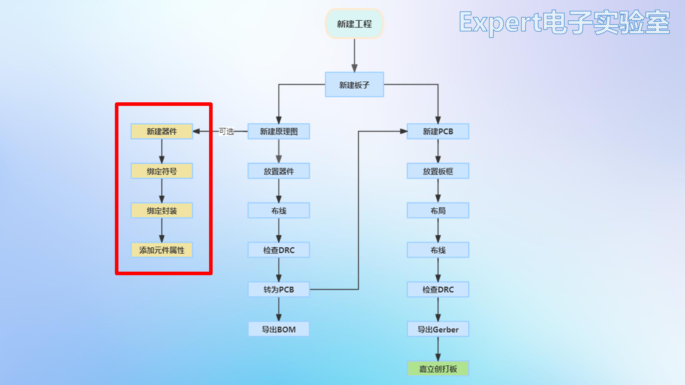

*图 4-1　元件选型之后建立符号和封装，随后才能进入原理图与 PCB 设计。*

课程以双运算放大器 `LM358DT` 为例。自建一个可用器件至少要完成四步：

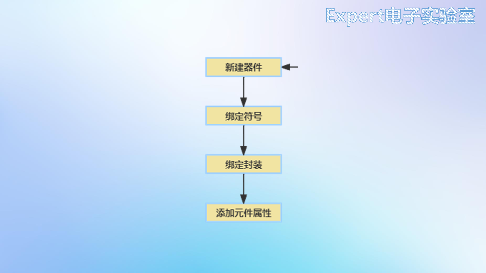

*图 4-2　新建器件后依次绑定符号、封装，并补充器件属性。*

#### 4.2 资料准备

开始画图前，应获得与具体订货型号匹配的数据手册，并确认：

- 制造商和完整型号；
- 器件功能与引脚定义；
- 封装名称和引脚数量；
- 顶视图还是底视图；
- 引脚编号方向和 1 脚标记；
- 是否存在同名但不同封装的型号。

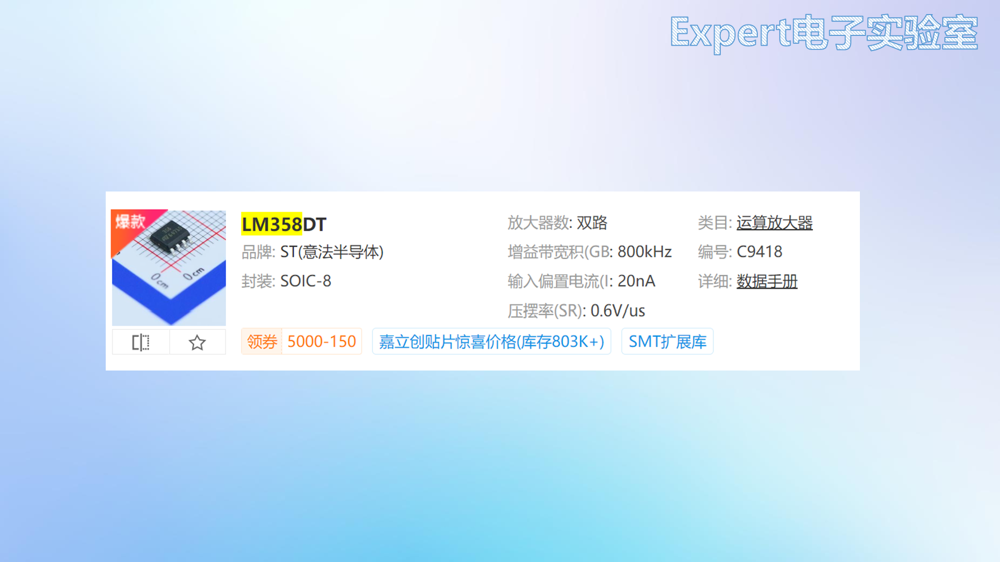

*图 4-3　商城条目适合定位数据手册，但最终仍要打开原厂资料核对引脚和封装。*

#### 4.3 LM358DT 的引脚表

`LM358DT` 是双运算放大器，SO-8 封装的常见引脚排列如下。绘制时应再次对照当前制造商的数据手册。

| 引脚 | 名称 | 含义 |
| --- | --- | --- |
| 1 | `OUT1` | 第 1 路输出 |
| 2 | `IN1-` | 第 1 路反相输入 |
| 3 | `IN1+` | 第 1 路同相输入 |
| 4 | `VCC-` | 负电源或单电源系统中的 GND |
| 5 | `IN2+` | 第 2 路同相输入 |
| 6 | `IN2-` | 第 2 路反相输入 |
| 7 | `OUT2` | 第 2 路输出 |
| 8 | `VCC+` | 正电源 |

这张表比符号画得是否漂亮更重要。只要编号错一位，PCB 上所有连接都会跟着错。

#### 4.4 创建符号

在专业版中执行“新建器件/符号”，填写准确名称后进入符号编辑器：

1. 画出简洁的外框，给引脚名称留出空间；
2. 放置 8 个引脚，电气连接端朝向符号外侧；
3. 按数据手册填写引脚名称和编号；
4. 让输入、输出和电源引脚按功能分组，便于读图；
5. 添加 1 脚或方向标识；
6. 检查引脚是否落在标准栅格上；
7. 保存后在个人库中重新打开检查。

符号布局可以为了可读性调整，不要求模拟实物引脚位置；但引脚编号必须与实物封装一致。双运放也可以画成多单元符号，把两路运放和电源单元分开管理，但新手应先掌握单符号的编号核对。

#### 4.5 符号自检

保存前按下面顺序检查：

- 引脚数量是否为 8；
- 名称与编号是否逐项对应；
- `VCC+`、`VCC-` 有没有对调；
- 电气连接端是否朝外；
- 引脚是否重叠或落在非标准栅格；
- 1 脚标记是否清楚；
- 器件名、制造商和封装说明是否一致。

### 第 5 章 绘制并绑定封装

#### 5.1 封装包含什么

封装不是器件外形的简单描边。一个可生产的表贴封装通常包含：

- 与器件引脚对应的铜焊盘；
- 阻焊开窗和钢网开口；
- 顶层丝印外框和 1 脚标记；
- 装配外形、庭院或器件占位范围；
- 封装原点和拾取中心；
- 可选的 3D 模型。

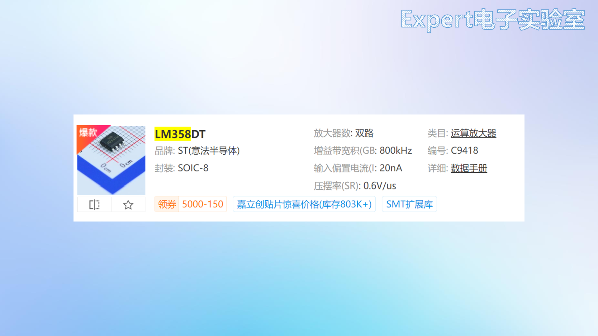

*图 5-1　先确认具体封装，再查对应的工程图或推荐焊盘图。*

#### 5.2 区分外形图与推荐焊盘图

数据手册中的 package outline 描述器件本体和引脚允许尺寸，recommended land pattern 才是厂家建议的 PCB 焊盘。两者不能直接画等号。

若资料只给器件外形图，焊盘还要为引脚公差、焊锡形成的趾部和侧部焊缝、贴装偏差留出空间。正式项目优先采用数据手册推荐焊盘，或依据 IPC 标准和装配厂能力计算，不要只把引脚最大尺寸“随手加大一点”。

课程练习采用约 `1.27 mm` 的引脚节距，并演示长圆形表贴焊盘。具体焊盘宽度、长度和两排间距应以所选 `LM358DT` 版本的数据手册为准。

#### 5.3 放置焊盘

创建新封装并把单位设为毫米，然后按以下顺序操作：

1. 在原点放置 1 号焊盘；
2. 把焊盘层设为顶层，使其成为表贴焊盘，不保留钻孔；
3. 根据推荐焊盘图设置长、宽和形状；
4. 以数据手册规定的节距复制同排焊盘；
5. 通过坐标、智能尺寸或线性阵列保证间距准确；
6. 复制另一排焊盘，并按封装图确定排间距；
7. 按顶视图逆时针规则检查 `1`～`8` 的编号。

阵列比手工拖动可靠，坐标和智能尺寸则适合复核。无论使用哪种方法，最终都要测量，而不是靠目测对齐。

#### 5.4 丝印、方向与原点

切换到顶层丝印后绘制器件外框，并满足：

- 丝印不压在焊盘或阻焊开窗上；
- 1 脚圆点、缺口或斜角清楚；
- 外框能表达器件方向，但不必完全包围每个焊盘；
- 原点便于贴装，通常放在器件几何中心或厂家定义位置；
- 实体外形与相邻器件保持装配空间。

丝印只帮助装配和检修，不能代替焊盘编号。即使丝印被板厂裁掉，封装本身的编号关系仍必须正确。

#### 5.5 绑定并验证

封装保存后，在个人器件库中找到 `LM358DT`，执行绑定封装并选择刚创建的 SO-8 封装。随后建立一个最小测试：

1. 把器件放入测试原理图；
2. 从原理图同步到 PCB；
3. 检查 8 个网络是否落在对应焊盘；
4. 在 2D 中测量节距、排距和外形；
5. 在 3D 中检查方向和本体位置；
6. 若没有 3D 模型，至少确认丝印、焊盘和 1 脚方向。

3D 模型缺失通常不影响电气制造，但会降低机械干涉检查能力。真正决定板子是否接对的仍是符号引脚与封装焊盘的映射。

#### 5.6 元件库完成标准

一个“能搜索到”的器件不等于可用器件。至少应满足：

- 型号和制造商明确；
- 符号引脚定义正确；
- 封装尺寸有可靠资料依据；
- 引脚号和焊盘号逐项一致；
- 极性、方向和 1 脚标识清楚；
- 在测试工程中通过同步和 DRC；
- 采购信息与封装版本一致。

---
## 第三部分：51 单片机核心板实战

### 第 6 章 明确需求并完成元件选型

#### 6.1 先定义这块板要做什么

第一块实战板选择基于 `STC89C52RC` 的 51 单片机核心板。它不是只让单片机“最小化运行”，而是要兼顾供电、下载、按键和外部模块连接。

本项目的功能需求可以整理为：

- STC89C52RC 最小系统；
- USB Type-C 5 V 电源输入和电源开关；
- 3.3 V 辅助电源与电源指示灯；
- 手动复位和两个用户按键；
- 两个可由单片机控制的 LED；
- P0～P4 端口排针、电源排针和串口下载排针；
- 四个安装孔和清晰的接口丝印。

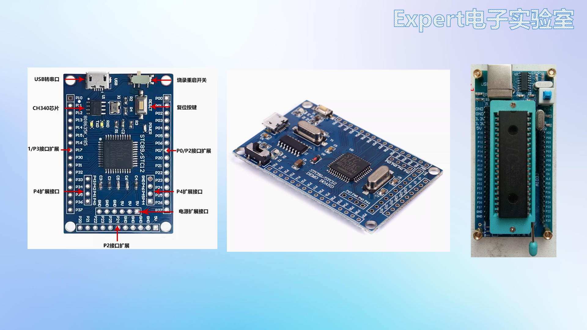

*图 6-1　核心板可以采用直插或贴片主控；本项目选择更紧凑的 LQFP-44 封装。*

明确需求后再选器件，能避免画到一半才发现接口数量、供电能力或封装方向不合适。

#### 6.2 单片机最小系统

传统 8051 最小系统包含主控、时钟、复位和电源。课程采用 `STC89C52RC`、12 MHz 外部晶振和高电平复位电路。

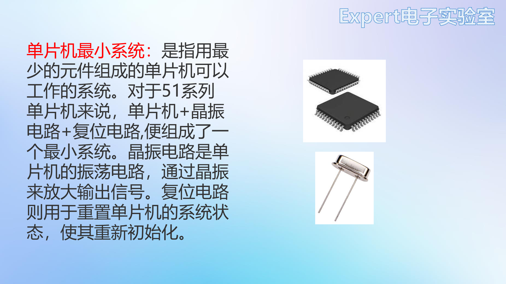

*图 6-2　“最小”表示满足启动运行的必要部分，不代表项目只能保留这些器件。*

选型时不要只记住“12 MHz、47 pF、10 kΩ、10 μF”这一组课堂数值。应在具体芯片数据手册中确认：

- 所选封装的引脚表；
- 允许的供电电压和最高时钟频率；
- 晶振连接方式、负载电容范围和是否需要反馈电阻；
- 复位有效电平和最小复位脉宽；
- P0 口结构及是否需要外部上拉；
- 串口下载所需引脚和电平。

晶振两端的电容并不是固定值。若晶体标称负载电容为 $C_L$，两个外接电容近似相等为 $C$，还要考虑引脚与走线寄生电容 $C_{stray}$，可用下面的关系建立直觉：

$$
C_L\approx\frac{C\cdot C}{C+C}+C_{stray}=\frac{C}{2}+C_{stray}
$$

最终仍以芯片厂商和晶体厂商的推荐值为准。

#### 6.3 电源与接口

Type-C 口只用于 5 V 受电时，可以选用带 `VBUS`、`GND`、`CC1`、`CC2` 和外壳焊脚的简化插座。作为 USB-C 受电端，`CC1`、`CC2` 通常各通过一个约 `5.1 kΩ` 的下拉电阻声明受电角色；不能把 CC 引脚悬空后仍假设所有电源都能正常输出。

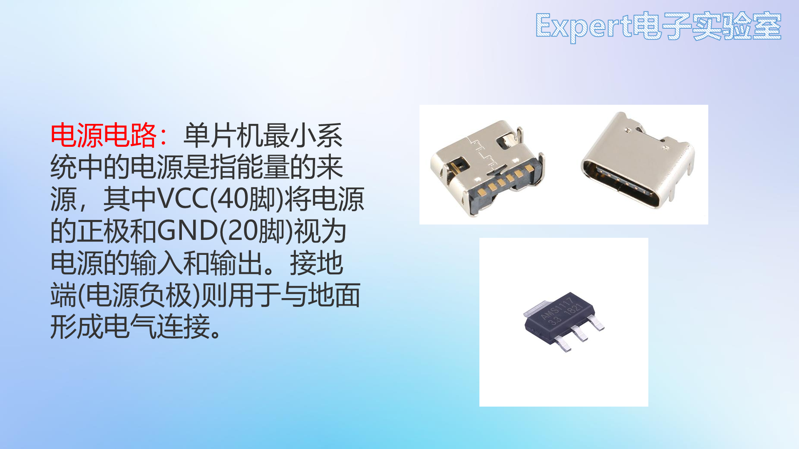

*图 6-3　电源输入、开关、稳压和滤波应当作为一个连续的电流路径考虑。*

课程选用 `AMS1117-3.3` 产生 3.3 V。使用时应核对具体厂商版本的数据手册，因为不同兼容型号对输入、输出电容的容量和 ESR 要求可能不同。还要检查：

- 5 V 输入减去 3.3 V 输出是否满足压差要求；
- 负载电流下的功耗 $(5-3.3)I$ 是否会过热；
- SOT-223 散热焊盘和铜皮是否足够；
- 输入、输出电容是否紧贴稳压器引脚；
- 单片机到底使用 5 V 还是 3.3 V，网络命名必须与实际连接一致。

#### 6.4 外围功能与连接器

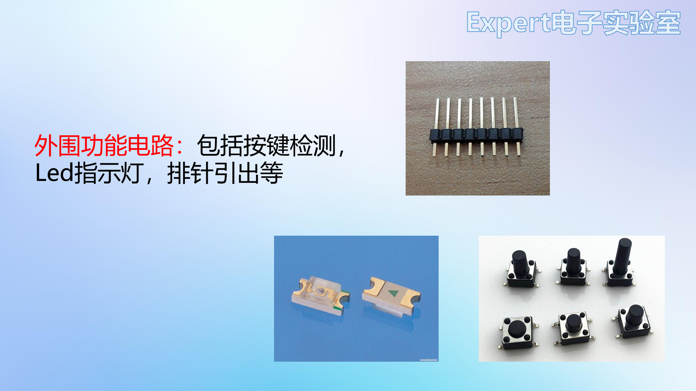

*图 6-4　外围器件的电气功能简单，但位置、方向和丝印会直接影响使用体验。*

用户按键接到 GPIO 后，可以通过硬件 RC 和软件延时共同消抖。直接并联电容之前，要检查按下、释放瞬间的充放电电流和 GPIO 输入阈值。LED 必须串联限流电阻，阻值应根据电源电压、LED 正向压降和目标电流计算：

$$
R\approx\frac{V_{supply}-V_F-V_{OL}}{I_{LED}}
$$

其中 $V_F$ 为 LED 正向压降，$V_{OL}$ 为 GPIO 吸收电流时的低电平输出电压，$I_{LED}$ 为目标电流。

课程采用低电平点亮方式，使 51 单片机引脚吸收电流。具体允许电流仍要查数据手册，不能因为“一般能点亮”就省略端口总电流检查。

### 第 7 章 绘制 51 核心板原理图

#### 7.1 建工程并按模块作图

新建“51 单片机核心板”工程，分别给原理图和 PCB 使用清晰名称。原理图不要按视频中的鼠标顺序散放器件，而应从一开始按模块组织：

1. Type-C 输入、开关和稳压电源；
2. 主控与去耦；
3. 晶振与复位；
4. 用户按键和 LED；
5. P0 上拉；
6. GPIO、电源和串口排针。

模块之间优先使用有意义的网络名连接，例如 `+5V`、`+3V3`、`GND`、`RST`、`XTAL1`、`XTAL2`、`RXD` 和 `TXD`。网络名大小写和符号要统一。

#### 7.2 Type-C 输入和稳压电路

把 Type-C 插座的两个 `VBUS` 焊盘连接到 5 V 输入网络，所有 GND 和外壳焊脚按接口手册处理。`CC1`、`CC2` 分别通过下拉电阻接地。

电源路径建议表达为：

```text
Type-C VBUS -> 电源开关 -> 输入滤波 -> AMS1117-3.3 -> 输出滤波 -> +3V3
```

不要把双刀开关未使用的一组触点随意全部接地。先看内部触点图，确认滑动到任一位置都不会把 5 V 短接到 GND；不使用的独立触点可以保持未连接并显式标注。

在 `+3V3` 端放置 LED 与限流电阻作为电源指示。输入、输出滤波电容的数值按稳压器数据手册确定，原理图上同时标清容量、耐压和封装。

#### 7.3 主控、去耦与时钟

放置 LQFP-44 封装的 `STC89C52RC`，逐项核对 VCC、GND、RST、XTAL 和各组 GPIO。不要因为库中已有器件就跳过引脚核对。

每组电源引脚附近放置去耦电容。典型的小容量去耦值为 `100 nF`，但原理图中应让它明确跨接在对应的 VCC 与 GND 之间。去耦电容的价值来自低阻抗局部回路，PCB 上距离过远会削弱作用。

晶振连接到 `XTAL1`、`XTAL2`，负载电容就近接地。晶振两根网络属于振荡器回路，不应简单定义为普通差分对；布局重点是靠近芯片、回路短、寄生小、远离强干扰信号。

#### 7.4 复位电路

STC89C52RC 使用高电平复位。课程中的 RC 网络在上电时产生一个暂态高电平，随后由电阻把 RST 拉回低电平；并联按键用于手动把 RST 拉高。

画完后要检查三种状态：

- 刚上电时能否达到有效复位电平并保持足够时间；
- 稳态时 RST 是否可靠回到非复位电平；
- 按下按键时是否产生确定的复位电平，释放后能否恢复。

#### 7.5 GPIO、按键、LED 和排针

课程把用户按键接到 `P2.0`、`P2.1`，把 LED 接到 `P1.0`、`P1.1`，并采用低电平点亮。P0 口作为普通 GPIO 使用时，依据器件端口结构配置外部上拉。

排针网络要按实际使用顺序排列。相邻焊盘对应连续 GPIO，能显著减少 PCB 上的飞线交叉。除了 P0～P4，还应引出：

- `+5V`、`+3V3` 和足够数量的 `GND`；
- 串口 `RXD`、`TXD`；
- 必要时的复位或下载控制信号。

串口排针的 `RXD`、`TXD` 是以核心板为视角命名还是以转接器为视角命名，必须在丝印中保持一致。连接时通常是发送接接收，即 TX 对 RX。

#### 7.6 整理与检查

把主控放在图页中心，电源置于左上，时钟和复位置于主控附近，接口和外围电路按功能排列。每个模块可以用细框和标题标识，但不要让装饰框穿过导线或遮挡位号。

运行原理图检查时：

- 逐项处理未连接、电源冲突、重复位号和封装缺失；
- 对有意未使用的引脚放置 No Connect；
- 供应商属性不匹配可能影响 BOM，不能一律关闭规则；
- 检查电源网名是否因空格、大小写或符号不同而被拆成多个网络；
- 确认每个实体器件都有正确封装。

原理图检查通过后，再生成 PCB 变更列表并核对器件数。

### 第 8 章 51 核心板 PCB 布局

#### 8.1 先确定机械边界

原理图同步到 PCB 后，先建立机械约束，再放器件。课程示例采用约 `70 mm × 40 mm` 的圆角矩形板框，但尺寸应由接口、安装位置和成本共同决定。板厂优惠尺寸会变化，不能把“不超过 100 mm 就一定免费”当作设计规则。


*图 8-1　同步到 PCB 后，先定板框和机械约束，再开始模块布局。*

板框应闭合、无重叠线段，并位于正确的板框层。四角安装孔使用专用 Mounting Hole 封装：如果需要绝缘固定，应使用非金属化孔；如果需要连接机壳地，则采用带铜环的专用安装孔并明确网络。不要用普通信号过孔代替机械安装孔。

板框、安装孔和关键接口定位完成后可以锁定，避免布局过程中误拖动。

#### 8.2 布局的四个判断维度


*图 8-2　整齐只是结果之一，电气、机械和装配约束优先级更高。*

布局时依次检查：

1. **机械可用性**：Type-C、开关、按键和排针是否便于插拔和按压；
2. **电气路径**：电源入口、保护、稳压和负载是否沿电流方向排列；
3. **关键回路**：去耦、晶振和复位是否靠近对应引脚；
4. **装配维护**：器件是否相互遮挡，烙铁、探针和螺丝刀是否有空间。


*图 8-3　接口靠边、主控居中、关键外围靠近主控，是本项目的布局主线。*

“全部同向、疏密均匀”适合改善装配和观感，但不能压过电气要求。为了让去耦电容更靠近电源引脚，允许它与其他器件方向不同；为了缩短关键回路，也不必刻意填满所有空白。

#### 8.3 模块化预布局

可以利用交叉选择定位原理图和 PCB 中的同一器件，并用布局传递获得模块初始排列。自动传递只提供起点，仍需手动调整。

本项目推荐顺序：

1. Type-C 和开关固定在板边；
2. AMS1117 紧接开关，输入、输出电容贴近对应引脚；
3. 主控放在中央，为四周 GPIO 留出走线通道；
4. 晶振与负载电容贴近 XTAL 引脚；
5. 复位 RC 靠近 RST；
6. 排针沿板边排列，并按 GPIO 顺序减少交叉；
7. 按键和 LED 放在可操作、可观察的位置；
8. P0 上拉电阻阵列靠近 P0 网络，可根据装配需求放到底层。

小容量去耦电容应比大容量储能电容更靠近芯片引脚。更准确地说，电流应先经过低阻抗局部去耦路径，电容的电源端、地端、过孔和芯片引脚共同构成尽可能小的回路。

#### 8.4 布局完成标准

在开始布线前执行一次布局冻结检查：

- 板框、孔位和接口满足机械尺寸；
- 3D 预览中没有插头、排针或按键干涉；
- 所有去耦电容都能指出它服务的电源引脚；
- 晶振和复位回路没有被排针或安装孔隔开；
- 飞线总体顺畅，没有大面积交叉；
- 丝印仍有放置空间；
- 双面装配方案与实际焊接、贴片能力一致。

### 第 9 章 布线原则与规则准备

#### 9.1 布线不是把飞线变成零

飞线为零只说明网络在几何上连通，不说明回流路径、线宽、阻抗、串扰和电源完整性合格。布线前要先设置网络类、过孔和层策略。

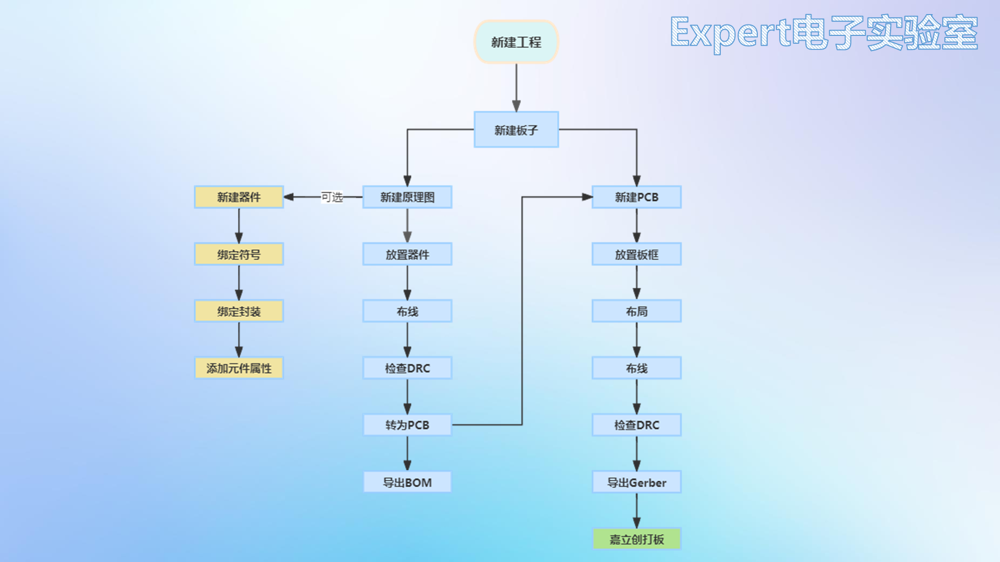

*图 9-1　布局确定器件关系，布线把逻辑网络实现为可制造的铜连接。*

课程强调手工布线，是为了让初学者理解每根线的作用。自动布线可以作为特定工程的辅助工具，但不能代替规则定义、关键网络规划和人工复核。

#### 9.2 线宽由什么决定


*图 9-2　电源线通常比普通信号线宽，但具体尺寸必须经过计算和工艺校验。*

线宽至少受到电流、允许温升、铜厚、外层或内层、走线长度、压降和板厂能力影响。不能把 `10 mil` 信号线或 `40 mil` 电源线当作所有项目的固定答案。

普通 GPIO 只需满足制造和信号要求；5 V 主干则应按最大负载电流计算。若空间不足，可使用更宽铜皮、铺铜、多过孔并联或重新规划供电路径。

#### 9.3 电流路径与去耦回路

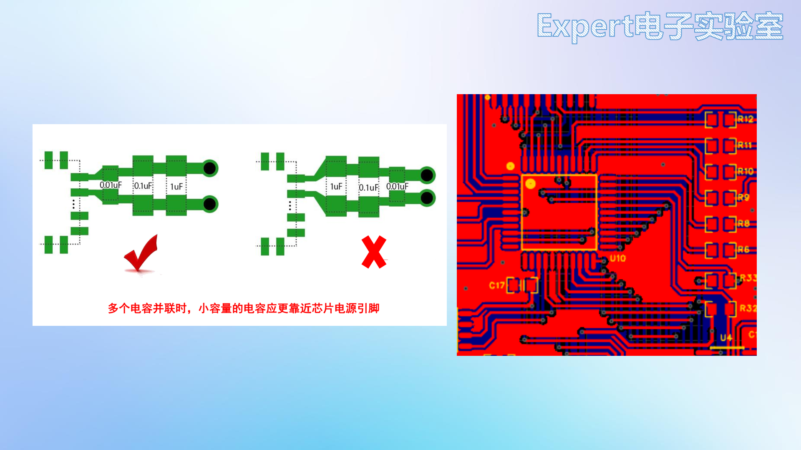

*图 9-3　电容要位于真实电流路径上，不能用一段长支线“挂”在电源网络旁边。*

每个信号都有去程和回程。顶层信号通常希望在连续的底层地平面上方走线，让回流紧邻信号路径。跨越地平面裂缝、板边开槽或被大量走线切碎的区域，会迫使回流绕路。

去耦电容的连接应短而宽：芯片电源引脚到电容，再由电容地端就近进入地平面。不要先用长线给芯片供电，再从芯片附近绕一根细线去找电容。

#### 9.4 高频和关键信号

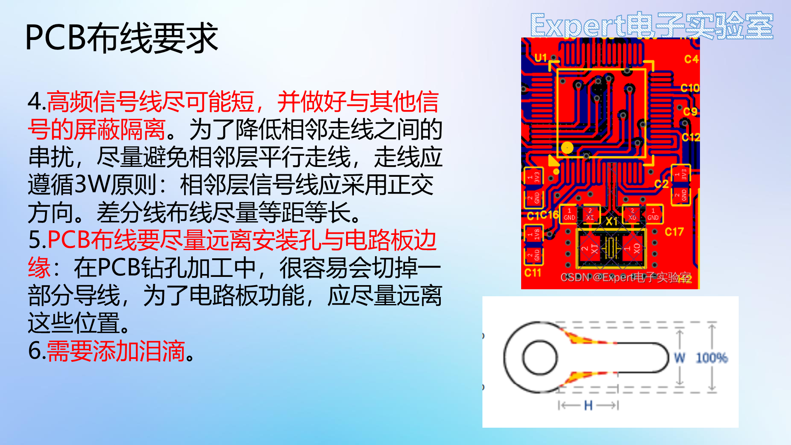

*图 9-4　高频信号关注参考平面连续性、相邻耦合、过孔和回流，而不只是线条是否短。*

课程提到 3W、相邻层正交和减少过孔，这些都是帮助建立直觉的经验规则：

- 增大相邻走线间距通常能降低串扰；
- 相邻信号层采用不同主方向有助于减少长距离平行耦合；
- 过孔会引入寄生参数和参考层切换；
- 关键线越短，通常越容易控制。

它们不是独立于频率、叠层和阻抗的绝对定律。双层 51 核心板的主要目标是连续地平面、短晶振回路和清晰供电；到了 USB 差分对，还要按目标阻抗单独设置规则。

#### 9.5 走线形状和顺序

使用 45° 转角或圆弧，主要是为了几何整洁、加工一致和避免不必要的阻抗突变。现代常规 PCB 并不会因为一个普通低速网络的 90° 转角就必然失效，但养成平滑、短直的布线习惯有助于后续高速设计。


*图 9-5　布线顺序应由约束强弱决定，而不是机械地从板子一角开始。*

本项目可按以下顺序：

1. 晶振和去耦等局部关键回路；
2. Type-C、稳压器和主控之间的电源主干；
3. 串口、按键、LED 和 GPIO；
4. 其他电源分支；
5. 地平面、地过孔和回流检查。

### 第 10 章 完成 51 核心板布线

#### 10.1 关键局部回路先走

从晶振、去耦和复位开始。晶振两线短、少过孔、远离 LED、电源开关和板边；负载电容的地端就近进入地平面。两线可以保持相近的几何环境，但不需要把它们定义成 USB 那样的受控阻抗差分对。

去耦电容优先在同层连接电源引脚，地端旁放地过孔。复位网络避免绕过高噪声电源节点。

#### 10.2 信号和电源

按飞线关系连接排针和 GPIO。走线时随时观察剩余通道，必要时短暂切到底层绕行，但不要用底层信号把地平面切成许多狭窄孤岛。

电源从 Type-C 进入后依次经过开关、滤波和稳压器，再分配给主控和排针。主干按电流加宽，进入单个低功耗负载后可以适当变窄。宽度变化使用平滑过渡，不在焊盘出口制造尖锐颈缩。

#### 10.3 地平面和地过孔

在顶层和底层建立 `GND` 铜区，通常让底层尽量保持连续。每个去耦电容、接口地、稳压器地和主控地附近设置短连接或地过孔。

地过孔不是越多越好，而是要出现在回流需要跨层、铜区需要缝合和地焊盘需要低阻抗连接的位置。放置后检查过孔网络确实为 `GND`，再重建所有铜区。

铜区重建后确认：

- 没有未连接的孤铜；
- 地平面没有被信号线切断关键回流路径；
- 细铜颈能满足电流和制造要求；
- 铜到板边、安装孔和其他网络间距正确；
- 飞线为零，并且网络高亮结果符合原理图。

#### 10.4 用 3D 和网络高亮复核

3D 预览用来检查器件方向、接口位置和机械干涉，不能检查电气连通。网络高亮和 DRC 用于验证连接，但也不会自动判断每个电容是否放对位置。

课程在最终检查时发现去耦电容 `C5` 与复位电容 `C8` 位置放反，这正说明位号正确不等于布局正确。逐个选择关键电容，通过交叉定位确认它服务的网络和引脚。

### 第 11 章 丝印、DRC 与生产文件

#### 11.1 丝印首先服务于使用和调试

给排针逐一标出 `P0.0`～`P4.x`、`+5V`、`3V3`、`GND`、`RXD` 和 `TXD`。同时标记：

- 电源开关的 ON 方向；
- `RESET` 和用户按键功能；
- `POWER` 指示灯；
- 主控型号和板卡版本；
- 1 脚、正负极和接口方向。

位号可以适当移动，但不要为了美观删除所有位号。调试时，原理图、PCB、BOM 和实物需要通过位号对应。

丝印不能压住焊盘、过孔、开窗和板边。文字在 3D 视图中方向正确，还要满足板厂的最小字高、线宽和字符间距。

#### 11.2 正确处理 DRC

先重建铜区，再执行完整 DRC。处理错误时阅读四项信息：错误类型、涉及对象、违反的规则和实际测量值。点击对象定位后，从设计本身修复，不要为了“清零”随意放宽规则。

重点检查：

- 不同网络之间的短路和间距；
- 未布通网络；
- 线宽、过孔、环宽和孔径；
- 铜到板边、槽孔和安装孔；
- 丝印压焊盘；
- 阻焊桥和孤立铜；
- 封装、焊盘与原理图映射。

实时 DRC 适合在绘制时提示问题，最终完整 DRC 仍不可省略。

#### 11.3 导出和审查生产文件

制板所需的核心文件是 Gerber 和钻孔文件。导出后不要立即下单，应重新导入 Gerber 查看器，逐层检查：

- 板框是否只有一个闭合轮廓；
- 顶底铜、阻焊、丝印方向是否正确；
- 钻孔数量、孔径和金属化属性是否正确；
- 安装孔和开槽是否完整；
- 文字有没有镜像或被裁切；
- 铜皮、焊盘和热焊盘是否按预期生成。

若需要 SMT，还要输出并核对 BOM、贴片坐标文件和钢网层。给生产版本建立只读归档，记录日期或版本号，不要继续在同一份文件上无版本地修改。

下单平台的优惠券、板材选项、颜色、交期和价格会变化，应以实际页面为准。第一次下单优先选择常规 FR-4、常规板厚和成熟工艺，避免同时引入过多特殊选项。

---

## 第四部分：USB Hub 实战

### 第 12 章 理解 USB Hub 与差分信号

#### 12.1 项目边界

第二个项目把一个 USB 2.0 上行口扩展为四个下行 Type-A 口。课程选用 `SL2.1A` Hub 控制器、Type-C 上行接口、四个 Type-A 母座和 12 MHz 晶振。

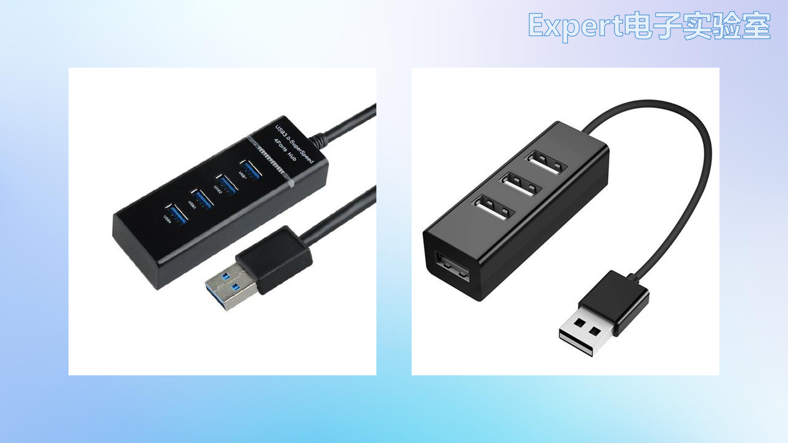

*图 12-1　外观相似的 Hub 可能采用不同供电方式、速率和端口保护方案。*

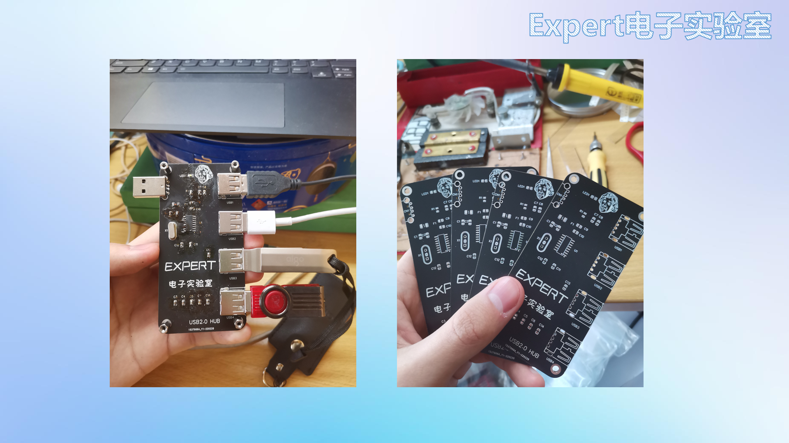

*图 12-2　原型能够枚举和传输数据，只能证明基本功能；稳定性、EMC 和协议一致性还需要进一步测试。*

本章整理的是课程中的总线供电 USB 2.0 Hub。它适合学习原理图、差分对和接口布局，但不应直接视为通过 USB-IF 认证或适合量产的参考设计。

#### 12.2 Host、Hub 与 Device

Hub 位于主机和设备之间：一个上行端口连接电脑等 Host，多个下行端口连接键盘、串口模块、U 盘等 Device。


*图 12-3　Hub 不是简单把五根线并联，而是由控制器管理枚举和数据转发。*

数据线不能把上行 D+/D- 直接并到四组下行端口。Hub 控制器为每个端口提供独立的收发通道，并处理连接检测、复位和数据调度。

#### 12.3 SL2.1A 选型要点

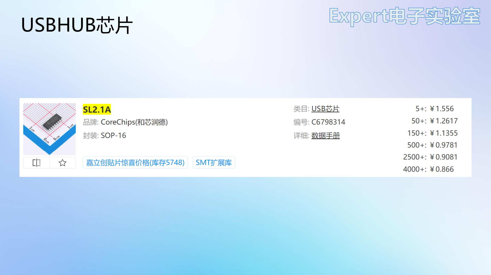

*图 12-4　选用商城器件后，仍需以对应版本的数据手册核对引脚和参考电路。*

从课程资料可得到以下设计入口：

- 一组上行 `DP/DM`；
- 四组下行 `DP1/DM1`～`DP4/DM4`；
- 5 V 供电及内部电源去耦引脚；
- `XIN/XOUT` 外部 12 MHz 晶振引脚；
- 芯片地和必要的配置引脚。

正式画图前还应确认具体批次数据手册中的绝对最大额定值、正常工作范围、去耦电容、晶振参数、端口状态与过流检测能力。商城简介不能替代这些信息。

#### 12.4 USB 接口与速率

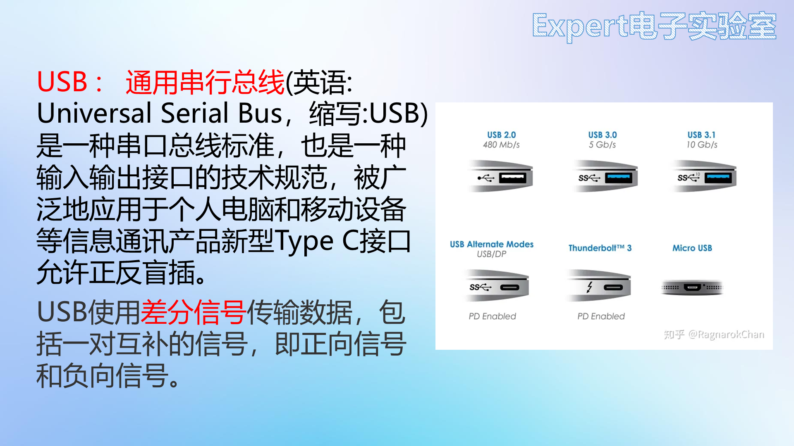

*图 12-5　USB 协议版本与连接器外形是两个维度，Type-C 并不自动等于 USB 3.x。*

本项目只使用 USB 2.0 的 `D+`、`D-`、`VBUS` 和 `GND`。Type-C 作为上行连接器，Type-A 母座作为下行连接器。选择连接器时要确认：

- 贴片、沉板还是直插结构；
- 插头插入方向和板边位置；
- 数据焊盘定义；
- 外壳固定脚是否金属化；
- 额定插拔次数和机械高度。

#### 12.5 单端与差分

单端接收器相对参考地判断一根信号线的电压。

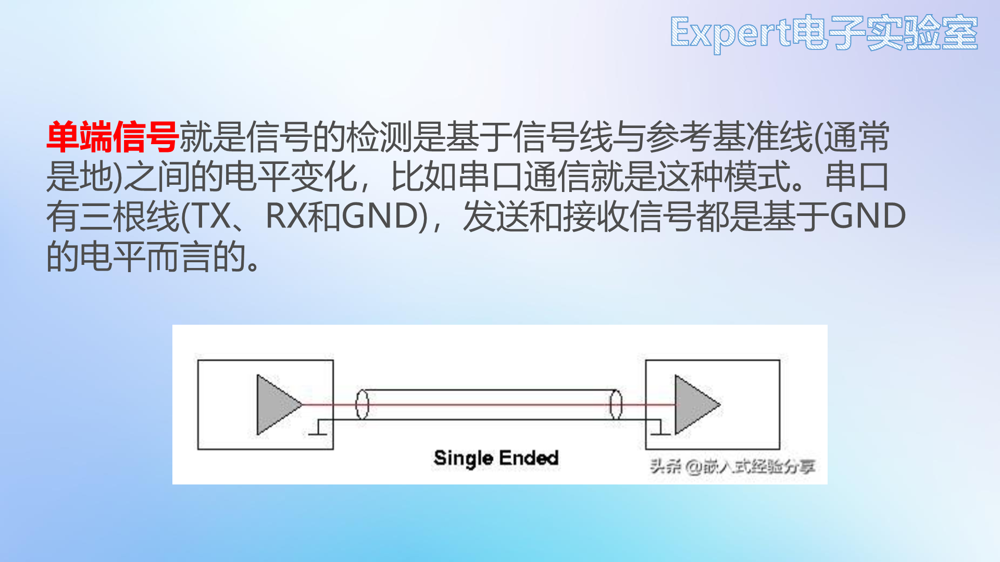

*图 12-6　单端信号的有效电压相对于参考节点定义。*

差分接收器关注两根线之间的电压差：

$$
V_{diff}=V_{D+}-V_{D-}
$$

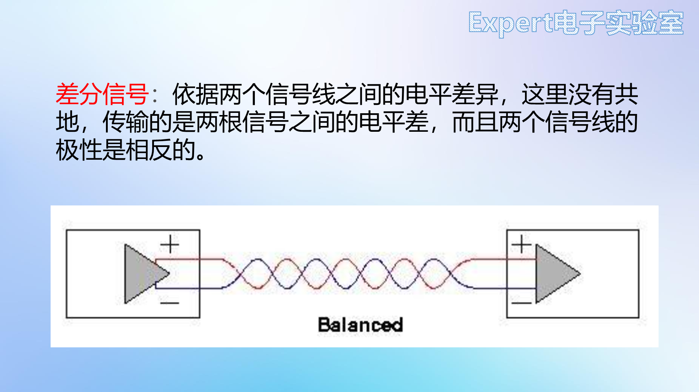

*图 12-7　两根线应处在相近的电磁环境中，使共同耦合的噪声在相减时得到抑制。*

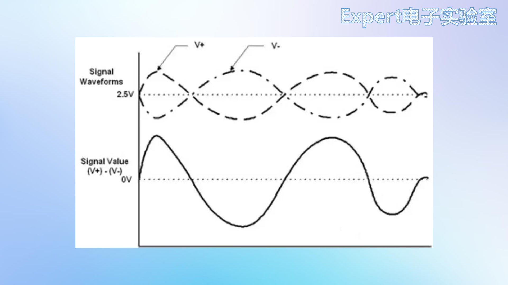

*图 12-8　接收器使用两线之差恢复信号，同时还受允许共模范围约束。*

“差分不需要地”是一种过度简化。接收器仍有共模范围，线缆屏蔽、地和参考平面仍会影响回流与抗扰度。PCB 上的 D+/D- 应在同一层、同一连续参考平面上成对走线。

#### 12.6 USB 2.0 差分对约束

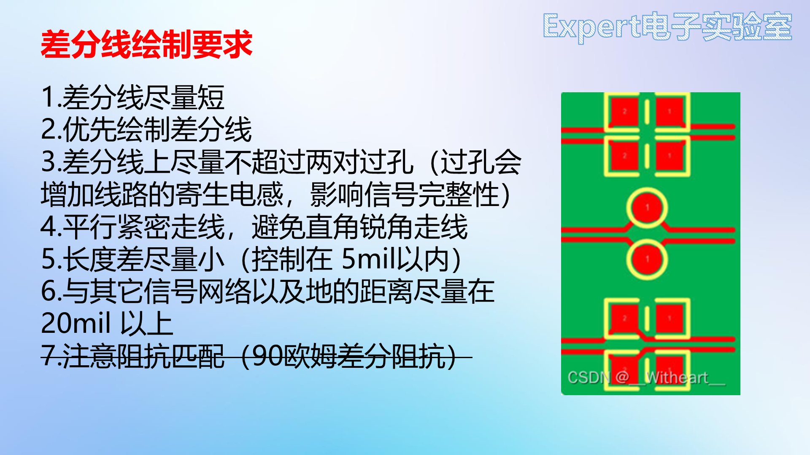

*图 12-9　短、成对、少过孔和控制阻抗是正确方向，具体数值要由协议、叠层和板厂能力确定。*

USB 2.0 High-Speed 的差分阻抗目标通常为 `90 Ω`。线宽和间距不能凭界面默认值决定，而应根据层叠、参考平面距离、介电常数和铜厚计算，再向板厂确认阻抗控制方案。

布线时遵守：

- D+、D- 同层并行，间距稳定；
- 从连接器到控制器尽量短，减少支路和测试点残桩；
- 两线使用相同数量、相邻位置的过孔；
- 换参考层时为回流提供邻近地过孔；
- 避开晶振、开关电源、板边和地平面缺口；
- 连接器焊盘、ESD 器件和芯片焊盘处保持平滑扇出；
- 对内长度差按控制器与协议预算设置，不机械套用 `5 mil`；
- 不为追求极小长度差而加入密集蛇形线，额外耦合可能比原始误差更糟。

课程演示中即使未严格阻抗控制也可能枚举成功，这不代表阻抗可以忽略。边缘速率、线长、板材和器件批次变化后，裕量可能迅速消失。

### 第 13 章 USB 连接器与供电保护

#### 13.1 Type-A 下行口


*图 13-1　连接器类型决定机械结构，USB 版本决定使用哪些信号。*

USB 2.0 Type-A 母座通常包含 `VBUS`、`D-`、`D+`、`GND` 和外壳固定脚。

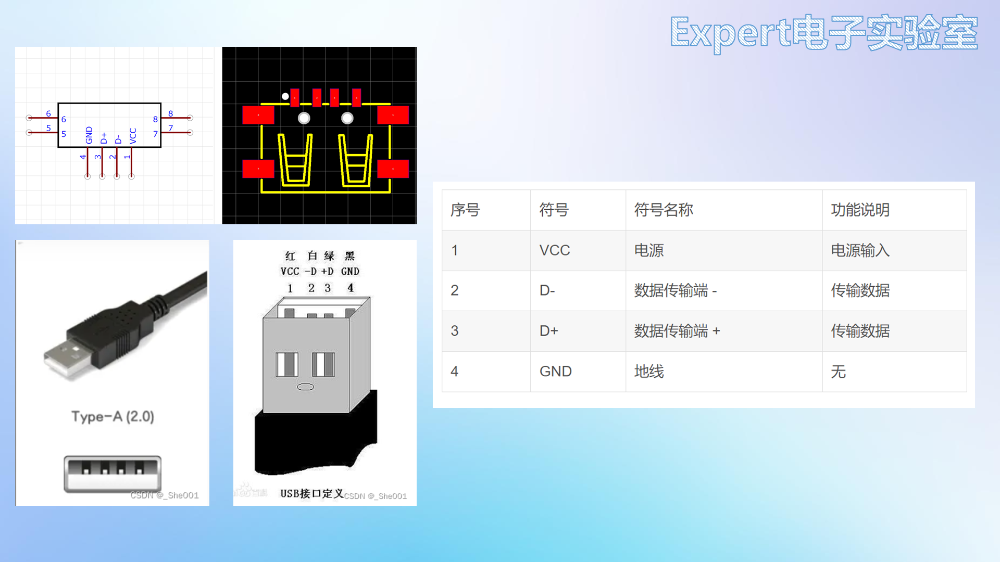

*图 13-2　必须按母座视图和封装顶视图核对，避免把插头视图直接镜像到 PCB。*

四个下行口的 D+/D- 分别连接控制器的四组下行收发器，不能互相短接。每个口的 VBUS 去耦和保护应靠近接口或电源开关。

#### 13.2 Type-C 上行口

Type-C 支持正反插，因此 USB 2.0 的两组 D+ 焊盘需要在连接器附近汇合，两组 D- 同样汇合。

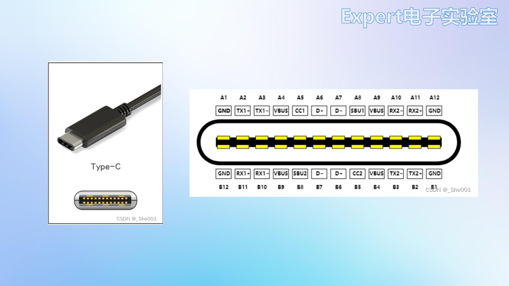

*图 13-3　A6/B6 为 D+，A7/B7 为 D-；多个 VBUS 和 GND 焊盘也要按封装定义连接。*

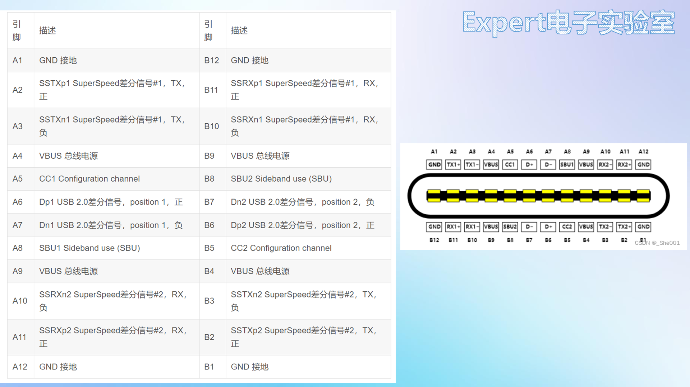

*图 13-4　本项目不使用 SuperSpeed 和 SBU，但未使用引脚必须按规范处理。*

作为连接电脑的 USB 设备端，本项目在 `CC1`、`CC2` 上分别放置 Rd 下拉，常见标称值为 `5.1 kΩ`。两个 CC 引脚不能短接后共用一个电阻。SBU 保持未连接，并在原理图上放置明确的 No Connect。

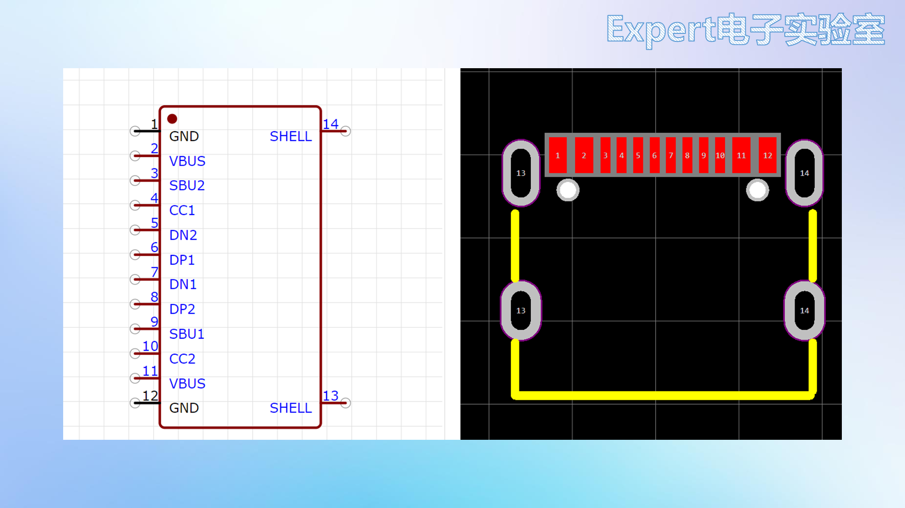

*图 13-5　符号引脚数可能少于物理焊盘数，因为同功能电源焊盘会在符号中合并。*

连接器外壳如何接地要结合 ESD、机壳和系统方案。课堂板可以采用与 PCB 地连接的简单方案，但正式产品应考虑高频泄放路径、机壳地和浪涌测试。

#### 13.3 总线供电不是无限供电

上行 Type-C 从主机获得 5 V，并不意味着四个下行口可以任意同时输出大电流。可用总电流受主机端口、Type-C 电流声明、Hub 枚举状态、线缆、保险丝和 PCB 铜路限制。

课程使用一个约 1.5 A 的自恢复保险丝作为总输入保护，这只能作为简化方案。更完整的 Hub 设计通常要为下行端口配置受控电源开关、限流和过流反馈，并按照控制器参考设计处理。不能用“大保险丝”绕过上游供电限制。

下行口的储能和去耦电容也不是越大越好。过大的总电容会增加插入瞬间的浪涌电流；电容值、分布和端口开关应按 USB 规范及芯片参考电路确定。

#### 13.4 ESD 与可量产性

课程原理图未完整展开 ESD 器件。实际面向频繁插拔的板卡，应评估：

- D+/D- 低电容 ESD 保护；
- VBUS 浪涌、短路和反灌保护；
- 保护器件距连接器的距离；
- ESD 泄放到地或机壳地的短路径；
- 连接器外壳和安装孔的接地策略。

ESD 器件不能随便选普通 TVS 替代。其结电容会直接影响 USB 2.0 High-Speed 信号完整性。

### 第 14 章 绘制 USB Hub 原理图

#### 14.1 按参考电路建立主控

新建 USB Hub 工程，放置 `SL2.1A`、Type-C、四个 Type-A 母座、晶振、去耦和保护器件。先把主控引脚按功能分组：

- 上行 `UP_DP/UP_DM`；
- 下行 `DN1_DP/DN1_DM`～`DN4_DP/DN4_DM`；
- `XIN/XOUT`；
- 5 V、电源输出或内部稳压去耦引脚；
- GND 和配置引脚。

网络名建议包含方向和端口号，不要只使用五组完全相似的 `DP`、`DM`。命名清楚可以防止把上行口和下行口互换。

#### 14.2 上行 Type-C 电路

把 A6/B6 汇合到上行 D+，A7/B7 汇合到上行 D-，汇合支路尽可能短。所有 VBUS 焊盘接输入电源网络，所有 GND 焊盘按封装连接；`CC1`、`CC2` 各接一个 Rd；SBU 标为不连接。

Type-C 到主控之间预留低电容 ESD 保护位置。保护器件应靠近接口，差分线经过保护器件后再到主控，避免形成长支路。

#### 14.3 主控、晶振与电源

严格照数据手册连接主控的 5 V、内部稳压去耦和地。内部电源引脚上的电容不能因为“已经有总电源滤波”而省略。

12 MHz 晶振靠近 `XIN/XOUT`，电容和反馈元件按参考电路选择。它仍是振荡器回路，不加入 USB 差分对规则。

电源链可表达为：

```text
Type-C VBUS -> 输入保护/保险丝 -> Hub 主控与端口电源开关 -> 四个下行 VBUS
```

电源指示 LED 放在受保护的 5 V 网络上，并用限流电阻控制电流。

#### 14.4 四个下行端口

每个 Type-A 口连接独立的 D+/D-，并配置对应的 VBUS、GND、外壳和端口去耦。检查端口号在原理图、PCB 排列和丝印中一致，例如最上方接口始终叫 Port 1。

若控制器支持独立或成组过流检测，按数据手册连接电源开关和反馈。课堂中的单保险丝方案可保留为学习简化版，但应在文档和板卡用途上明确其限制。

#### 14.5 原理图检查

原理图整理为上行接口、保护与供电、Hub 主控、四个下行口四个区域。执行检查前人工核对：

- D+ 没有接到 D-；
- 上行和下行网络没有调换；
- Type-C 两组 USB 2.0 焊盘正确并接；
- CC1、CC2 各有独立 Rd；
- 主控所有电源和去耦引脚均已处理；
- 晶振值、负载电容和封装一致；
- Type-A 视图方向与封装焊盘编号一致；
- 保险丝、端口供电和最大负载假设相互匹配；
- 未用引脚有明确处理，不靠悬空警告蒙混过关。

### 第 15 章 USB Hub 布局与布线

#### 15.1 先解决接口和外壳

课程示例采用约 `30 mm × 100 mm` 的长条板，Type-C 位于一端，四个 Type-A 沿长边排列。尺寸不是固定模板，应根据实际插头宽度、相邻线缆、外壳壁厚和安装孔确定。

Type-C 和 Type-A 的插口通常需要伸到板边或略微探出，具体探出量由连接器数据手册和外壳开口决定。只看 PCB 2D 图很容易忽略插头包胶和相邻 USB 设备互相打架，必须用 3D 模型或机械图验证。

安装孔同样使用专用安装孔封装，不用普通过孔代替。

#### 15.2 围绕差分路径摆放主控

控制器位置由五组差分对共同决定：上行口到控制器要短，四个下行口到控制器也应顺畅。可以让控制器位于 Type-C 与 Type-A 阵列之间，并旋转到多数差分焊盘能直接扇出。

布局优先级如下：

1. 固定 Type-C、Type-A 和安装孔；
2. 放置 ESD 和端口保护器件；
3. 旋转、移动主控，使五组差分飞线少交叉；
4. 将晶振和内部电源去耦贴近主控；
5. 按真实电源路径放保险丝、开关和储能电容；
6. 最后安排 LED、丝印和非关键器件。

接口旁的电容可以放在底层，但要确保电源过孔短、数量和孔径满足电流，且不占用差分对下方的连续参考平面。

#### 15.3 建立差分对规则

在网络管理器中建立五组 USB 差分对：一组上行、四组下行。每组正负网络必须对应正确，不能把晶振网络也加入 USB 差分对类。

根据板厂确认的叠层和阻抗方案设置：

- 单线线宽；
- 对内间距；
- 目标差分阻抗；
- 对内长度误差；
- 与其他网络和板边的间距；
- 允许的过孔结构。

双层板也可以做 USB 2.0 High-Speed，但底层参考地要尽量完整，差分线正下方不能有分割、槽孔或长距离其他走线。

#### 15.4 先布五组 USB 差分对

从控制器焊盘短边扇出，保持两线对称进入耦合段。Type-C 端两组 D+ 和两组 D- 的汇合应靠近连接器，形成很短的支路。

依次完成上行和四个下行差分对，每完成一对就检查：

- 正负网络是否正确；
- 对内间距有没有突然变化；
- 是否跨越参考平面缺口；
- 两线过孔和层转换是否一致；
- 是否存在无意义蛇形、支路或锐角；
- ESD 器件连接有没有制造残桩。

软件的“差分对布线”和“等长调节”只是几何工具。调节后仍要看实际走线，不要只看规则显示绿色。

#### 15.5 电源铜路

5 V 主干可以使用宽走线或铜区。铜区必须指定正确网络，并检查最窄颈部，而不是只看大面积区域。跨层传输电源时，过孔数量和尺寸按电流、铜厚与温升计算；课程中的“三个过孔”只是演示，不是通用结论。

电流应从输入保护进入主电源，再分配到主控和端口。每个端口的局部电容连接在供电分支与地之间，回路短且不切断差分参考平面。

#### 15.6 地平面、晶振和铜区

底层优先保持连续 GND 平面，顶层空闲区域可以铺地并用地过孔缝合。地铜不能以细长孤岛包围差分线，也不能让回流被迫绕过安装孔阵列。

晶振按控制器参考布局处理。课程演示了地过孔围栏和禁止铺铜区，但这不是所有晶振的固定做法：过近的地铜可能增加寄生电容。以芯片厂商推荐布局为准，核心目标是短回路、低噪声和稳定的地参考。

重建铜区后确认飞线为零，再高亮每组 D+/D- 和 5 V 网络逐项复查。

### 第 16 章 USB Hub 收尾与验证

#### 16.1 丝印

标出上行口、Port 1～Port 4、电源指示、5 V 和板卡版本。上下两面的品牌图案不是必要内容，空间不足时优先保留接口编号、极性、方向和位号。

丝印不能侵入连接器外壳、焊盘和板边加工区。Type-A 接口较密时，端口编号应在插入设备后仍可看见。

#### 16.2 DRC 与差分专项检查

除常规短路、间距、孔径和板边检查外，还要检查：

- 五组差分对是否全部加入正确规则；
- 是否达到板厂要求的 90 Ω 差分阻抗几何；
- 对内误差和总长度是否在预算内；
- D+/D- 是否被交换；
- 差分参考平面是否连续；
- ESD、连接器和主控之间是否存在长支路；
- Type-C CC 电阻和端口供电保护是否正确；
- 四个下行口同时工作时的电源能力是否足够。

#### 16.3 生产文件与样板测试

导出 Gerber、钻孔、BOM 和坐标文件，并在独立查看器逐层检查。首批样板回来后按风险从低到高测试：

1. 不接电脑，检查短路、焊接方向和 5 V 对地阻值；
2. 使用限流电源检查静态电流和主控电源；
3. 连接上行口，观察是否稳定枚举为 Hub；
4. 逐个连接低功耗设备，验证四个端口；
5. 同时连接多个设备，观察掉线、电压跌落和温升；
6. 用高速设备持续传输，检查错误、重连和速度；
7. 进行插拔、线缆变化和 ESD 风险测试。

“电脑能识别一次”不是完成标准。至少要覆盖冷启动、热插拔、多端口、长时间传输和异常负载。

---

## 附录 A：完整 PCB 设计流程

| 阶段 | 输入 | 主要动作 | 完成标志 |
| --- | --- | --- | --- |
| 需求 | 功能、接口、机械和成本要求 | 列模块、功耗、尺寸和风险 | 需求能逐项验证 |
| 选型 | 数据手册和供应信息 | 确认型号、封装、供电和外围 | 关键参数有资料依据 |
| 元件库 | 引脚表、外形图、推荐焊盘 | 建符号、封装并绑定 | 引脚与焊盘逐项一致 |
| 原理图 | 模块连接关系 | 作图、命名、注释和 ERC/DRC | 零未解释错误 |
| 布局 | 板框、安装和关键回路 | 机械定位、模块布局、3D 检查 | 飞线顺畅且无干涉 |
| 规则 | 板厂工艺、叠层和电流 | 设置线宽、间距、过孔和网络类 | 所有关键网络有规则 |
| 布线 | 布局和网络约束 | 关键线、电源、普通信号、地 | 飞线为零且回流合理 |
| 收尾 | 完整 PCB | 铺铜、丝印、DRC 和复核 | 无未解释违规 |
| 投产 | 冻结的源工程 | Gerber、钻孔、BOM、坐标 | 独立查看器检查通过 |
| 调试 | 样板和测试计划 | 限流上电、分模块验证 | 需求逐项通过 |

## 附录 B：元件库检查表

- [ ] 完整型号、制造商和数据手册版本一致；
- [ ] 符号引脚数量、名称、编号和电气类型正确；
- [ ] 封装视图方向明确，没有把底视图当顶视图；
- [ ] 焊盘尺寸来自推荐焊盘图或经过计算；
- [ ] 引脚节距、排距、本体和庭院尺寸正确；
- [ ] 1 脚、极性和方向标记明确；
- [ ] 丝印不压焊盘，原点位置合理；
- [ ] 3D 模型方向和高度正确，或明确标记缺失；
- [ ] 符号引脚与封装焊盘逐项映射；
- [ ] 在测试工程中完成原理图到 PCB 同步。

## 附录 C：布局布线检查表

### 机械与布局

- [ ] 板框闭合，尺寸和圆角符合外壳；
- [ ] 安装孔类型、坐标和禁布区正确；
- [ ] 接口、按键和指示灯可操作、可观察；
- [ ] 相邻插头、排针和外壳没有干涉；
- [ ] 去耦、晶振、复位和保护器件靠近服务对象；
- [ ] 电源路径符合输入、保护、转换、负载顺序；
- [ ] 3D 预览已检查正反面和最大高度。

### 规则与布线

- [ ] 规则值来自板厂工艺和实际电气需求；
- [ ] 电源线宽和过孔按电流及温升校核；
- [ ] 高速、差分和电源网络建立独立网络类；
- [ ] 信号参考平面连续，没有跨分割；
- [ ] 去耦回路短，地过孔位置合理；
- [ ] 差分对同层、同参考、间距稳定；
- [ ] 铜区无孤岛、细颈和意外断裂；
- [ ] 飞线为零，并用网络高亮复核关键连接。

## 附录 D：投产前检查表

### 原理图与物料

- [ ] ERC/DRC 中没有未解释的错误或警告；
- [ ] 电源电压、极性、接口方向和未用引脚已复核；
- [ ] 位号唯一，型号、封装和采购料号一致；
- [ ] BOM 数量与原理图、PCB 一致；
- [ ] 关键参数和替代料边界已记录。

### PCB 与生产文件

- [ ] 完整 DRC 已在重建铜区后执行；
- [ ] 丝印、阻焊、钢网和板边没有冲突；
- [ ] Gerber 与钻孔文件已重新导入查看；
- [ ] 金属化孔、非金属化孔和槽孔正确；
- [ ] BOM 与坐标文件的旋转、面别和位号正确；
- [ ] 生产文件与冻结的源工程版本一致；
- [ ] 下单参数与设计规则一致，没有选择超出设计假设的叠层或铜厚。

## 附录 E：常用术语与操作速查

| 名称 | 含义 |
| --- | --- |
| ERC | 电气规则检查，重点检查原理图连接和引脚关系 |
| DRC | 设计规则检查，重点检查 PCB 几何和网络约束 |
| Gerber | 描述各制造图层的制板数据 |
| BOM | 物料清单，包含位号、型号、数量和采购信息 |
| CPL/Pick and Place | 贴片坐标文件，包含器件位置、旋转和面别 |
| NPTH | 非金属化孔，常用于绝缘安装孔 |
| Thermal Relief | 焊盘与大面积铜之间的发散式连接 |
| Differential Pair | 承载一对互补信号并按耦合关系布线的网络 |
| Return Path | 信号电流返回源端的路径，通常依附参考平面 |
| Stitching Via | 连接不同层同一铜区的缝合过孔 |

课程中常见操作包括 `Q` 切换单位、交叉选择定位同一器件、布局传递生成模块初始布局，以及差分对布线和等长调节。快捷键可能因预设和版本不同而变化，应以软件当前快捷键设置为准。

## 结语

完成强化篇后，最重要的收获不是画出了两块外形完整的板，而是掌握了一套可以重复使用的判断顺序：先查资料，再画连接；先定机械和关键回路，再摆器件；先定义规则，再布线；先检查生产数据，再下单。

51 核心板训练的是完整流程，USB Hub 则第一次把差分信号、接口保护和电源预算引入设计。下一步无论继续做 STM32 开发板、传感器板还是竞赛题，都应沿用这条链路，而不是重新回到“照着界面把线连完”的做法。
